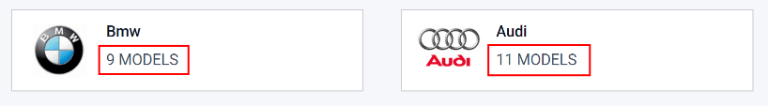

# Đội xe

This document outlines the configurations and settings for the *Fleet* application, for both
[settings](#fleet-settings) and [manufacturers](#fleet-manufacturers).

## Cài đặt

To access the settings menu, go to Fleet app ‣ Configuration ‣ Settings. Only
two settings need configuration: End Date Contract Alert and New Vehicle
Request.

### Cảnh báo ngày kết thúc hợp đồng

The End Date Contract Alert field how many days before the end of a vehicle contract an
alert should be sent. The responsible people receive an email informing them a vehicle contract is
about to expire in the number of days defined in this field.

#### NOTE
To determine who the responsible person is for a contract, open an individual contract. The
person listed as Responsible under the Contract Information section of
the contract is the person who will receive the alert.

To access all contracts, navigate to Fleet app ‣ Fleet ‣ Contracts and all
contracts appear in the list. Click on a Contract to view it.

Hợp đồng cụ thể cũng có thể được tìm thấy bằng cách đi đến Ứng dụng Đội xe ‣ Đội xe ‣ Đội xe và nhấp vào một xe nhất định. Trên biểu mẫu xe, nhấp nút thông minh Hợp đồng ở đầu trang. Danh sách chỉ hiển thị hợp đồng liên quan đến xe này. Nhấp vào một hợp đồng cụ thể để mở. Người Phụ trách được liệt kê trong hợp đồng.

### New Vehicle Request

Trường Yêu cầu xe mới đặt giới hạn số lượng xe mới có thể yêu cầu dựa trên tình trạng sẵn có của đội xe. Nhân viên điền vào biểu mẫu cấu hình lương (sau khi được đề xuất vị trí) sẽ *không* thể yêu cầu một chiếc xe mới nếu số lượng xe hiện có lớn hơn số lượng được chỉ định trong trường Yêu cầu xe mới. Nhập giới hạn số lượng cụ thể cho số xe có sẵn vào trường này.

## Manufacturers

Odoo *Fleet* comes pre-configured with sixty-six commonly used car and bicycle manufacturers in the
database, along with their logos. To view the pre-loaded manufacturers, go to Fleet
app ‣ Configuration ‣ Manufacturers.

The manufacturers appear in an alphabetical list. Each manufacturer's card lists how many specific
models are configured for each particular manufacturer. Odoo comes with forty-six preconfigured
[models](applications/hr/fleet/models.md) from four major auto manufacturers, and one major bicycle manufacturer:
Audi, BMW, Mercedes, Opel (cars), and Eddy Merckx (bicycle).

### Add a manufacturer

To add a new manufacturer to the database, click Create. A manufacturer form will load.
Only two pieces of information are needed, the Name of the manufacturer, and the logo.
Type the name of the manufacturer in the name field, and select an image to upload for the logo.
When the information is entered, click Save.

#### SEE ALSO
- [Vehicle models](applications/hr/fleet/models.md)
- [New vehicles](applications/hr/fleet/new_vehicle.md)
- [Dịch vụ](applications/hr/fleet/service.md)
- [Accidents](applications/hr/fleet/accidents.md)

* [Vehicle models](applications/hr/fleet/models.md)
* [New vehicles](applications/hr/fleet/new_vehicle.md)
* [Dịch vụ](applications/hr/fleet/service.md)
* [Accidents](applications/hr/fleet/accidents.md)
