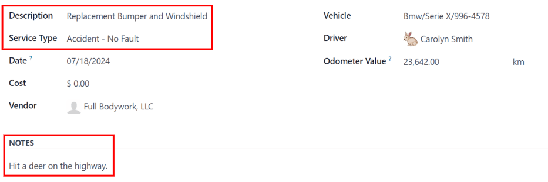

# Accidents

When managing a fleet, accidents are inevitable. Tracking accidents is crucial for understanding
vehicle maintenance costs and identifying safe drivers.

Odoo's *Fleet* app offers multiple ways to track accidents. Below are step-by-step instructions for
only **one** method to monitor accidents and repair costs.

## Cấu trúc lương

For this example, to track accidents, two [service types](service.md#fleet-new-type) are created:
`Accident - Driver's Fault` and `Accident - No Fault`.

This tracks various repairs associated with accidents, organized by who was at fault.

When an accident occurs, a service record is created. The specific repairs needed for the accident
are logged in the *Description* of the service record, and the details about the accident are logged
in the *Notes* section.

With this organizational structure, it is possible to view all accidents organized by fault, car,
driver, or cost.

#### NOTE
To manage accidents, the creation of service records is **required**.

Refer to the [Dịch vụ](service.md) documentation for detailed instructions on creating service records
in Odoo's *Fleet* app.

## Log accidents and repairs

To log an accident, and initiate the repair process, the first step is to [create a service
record](service.md#fleet-service-form) detailing the specific repairs needed.

#### NOTE
Some accidents require multiple repairs with several different vendors. For these scenarios, a
separate service record is needed for each vendor performing repairs. To keep records organized,
it is recommended to keep the *Notes* field identical, as well as attaching the same important
documentation, such as a police report.

Navigate to Fleet app ‣ Fleet ‣ Services to view the main Services
dashboard. Click New in the top-left corner, and a blank service form loads.

Nhập thông tin sau đây trên biểu mẫu:

- Description: enter the description of repairs needed to fully repair the vehicle, such
  as `Bodywork`, `Windshield Replacement`, or `Replacement Bumper, Tires, and Windows`.
- Service Type: for this example, select either `Accident - Driver's Fault` or
  `Accident - No Fault`, depending on the situation.

  Khi nhập một trong hai Loại dịch vụ này lần đầu tiên, hãy nhập loại dịch vụ mới, sau đó nhấp Tạo (loại dịch vụ mới). Cửa sổ bật lên Tạo loại dịch vụ sẽ xuất hiện với loại dịch vụ mới được điền vào trường Tên. Trong trường Danh mục, chọn Dịch vụ từ menu thả xuống, sau đó nhấp nút Lưu & đóng.

  Once an accident service type has been added to the database, it is available to select from the
  drop-down menu in the Service Type field.
- Date: using the calendar popover window, select the date the accident occurred.
  Navigate to the desired month using the <i class="fa fa-chevron-left"></i> <i class="fa fa-chevron-right"></i>
  (arrow) icons, then click the date to select it.
- Cost: leave this field blank, as the repair cost is not yet known.
- Vendor: select the vendor performing the repairs using the drop-down menu. If the
  vendor has not already been entered in the system, type in the vendor name, and click either
  Create to add them, or Create and edit... to [add and configure the
  vendor](service.md#fleet-new-vendor).
- Vehicle: select the vehicle that was in the accident from the drop-down menu. When the
  vehicle is selected, the Driver field is populated, and the unit of measure for the
  Odometer Value field appears.
- Driver: the current driver listed for the selected vehicle populates this field when
  the Vehicle is selected. If a different driver was operating the vehicle when the
  accident occurred, select the correct driver from the drop-down menu.
- Odometer Value: enter the odometer reading when the accident occurred. The units of
  measure are either in kilometers (km) or miles (mi), depending on how the
  selected vehicle was configured.
- NOTES: enter the specific details of the accident at the bottom of the service form,
  such as `Hit a deer` or `Rear-ended at an intersection while stopped`.

Odoo provides the ability to attach any important paperwork, such as repair estimates and police
reports, to the service record. To do so, click the <i class="fa fa-paperclip"></i> (paperclip)
icon, located in the *chatter* of the form, and a file explorer pop-up window appears. Navigate to
the desired record, and click Open to upload the file.

> #### NOTE
> Once a file is added to a service record, a Files section appears in the *chatter*.
> To attach more records, click <i class="fa fa-plus-square"></i> Attach files to add more
> documents.

## Service stages

In Odoo's *Fleet* app, there are four default service stages:

Mới

The default stage when a service record is created. The service has been requested, but
repairs have not begun. The Cost field for this stage remains zero.

Đang chạy

The repair is in-process, but not yet complete. The estimate for repairs is listed in the
Cost field.

Đã hoàn thành

All repairs listed on the service form have been completed. The Cost field is
updated to reflect the final total cost charged for the repairs.

Đã hủy

The service request has been cancelled.

During the repair process, change the service status to reflect the vehicle's current state in one
of two ways: on the individual [service record](#fleet-service-record), or in the [Kanban
service view](#fleet-kanban).

### Service record

Open the main *Services* dashboard, by navigating to Fleet app ‣ Fleet ‣
Services. Next, click on the individual service record to open the detailed service form. Click the
desired stage in the top-right corner, above the service form, to change the status.

### Chế độ xem kanban

Open the main *Services* dashboard, by navigating to Fleet app ‣ Fleet ‣
Services. First, click the <i class="oi oi-view-kanban"></i> Kanban icon in the top-right of the
screen, which organizes all repairs by vehicle.

Next, remove the default Service Type filter in the search bar. Upon doing so, all
services appear in a Kanban view, organized by their respective Status.

Drag-and-drop the service record to the desired stage.

## Accident reporting

One of the main reasons to track accidents using the method outlined in this document is the ability
to view the total accident cost, determine the safest drivers, and calculate the actual total cost
for specific vehicles.

The main [Services dashboard](#fleet-services-dashboard) displays all the various accident
information, while the [Reporting dashboard](#fleet-reporting-dashboard) displays the total
cost for specific vehicles.

### Services dashboard

Navigate to Fleet app ‣ Fleet ‣ Services to view the Services
dashboard. All service records are displayed in a <i class="oi oi-view-list"></i> (List) view,
grouped alphabetically, by Service Type.

The two service types created for accident tracking appear in the list: Accident -
Driver Fault and Accident - No Fault.

Each grouping displays the number of records within each type, and lists the individual records
beneath each grouping title.

#### NOTE
The total Cost calculates **all** costs on the repair form, including estimated
costs, as well as final repair costs. This number may not be accurate, if there are any repairs
in the *Running* stage, and the final bill has not yet been calculated.

### Reporting dashboard

Điều hướng đến Ứng dụng Đội xe ‣ Báo cáo ‣ Chi phí để xem báo cáo Phân tích chi phí. Báo cáo này hiển thị <i class="fa fa-bar-chart"></i> (Biểu đồ cột) về tất cả chi phí Hợp đồng và Dịch vụ trong năm hiện tại, được sắp xếp theo tháng (Ngày: (năm)) theo mặc định. Tổng, được biểu thị bằng đường chấm chấm màu xám, là tổng hợp của cả chi phí Hợp đồng và Dịch vụ.

To view the total cost by vehicle, click the <i class="fa fa-caret-down"></i> (down arrow) icon at
the right of the search bar, revealing a drop-down menu. Click Vehicle in the
<i class="oi oi-group"></i> Group By column, and the data is organized by vehicle.

Thông tin này hiển thị chi phí thực tế cho từng xe, bao gồm cả chi phí hợp đồng (chẳng hạn như chi phí thuê xe hàng tháng) và tất cả chi phí dịch vụ, bao gồm cả các tai nạn. Di chuột qua một cột để hiển thị cửa sổ dữ liệu hiện lên, cho thấy tên phương tiện và tổng chi phí. Từ đó, bạn sẽ có được cái nhìn đầy đủ hơn về chi phí của xe.

To view the individual cost details for both contract costs and repairs, click the
<i class="oi oi-view-pivot"></i> (Pivot) icon in the top-right corner of the Cost
Analysis dashboard. This displays each vehicle on a separate line, and displays the
Contract cost and Service cost, as well as the Total cost.

#### NOTE
The <i class="oi oi-view-pivot"></i> (Pivot) view organizes the data by vehicle, by default,
therefore grouping the data by Vehicle is not required. If this filer is already
activated, it does not affect the presented data.

## Manage accident repairs

For companies with multiple employees, who manage a large fleet of vehicles, displaying only service
records in the New and Running stages can be time-saving, if there are a
large number of records in the *Services* dashboard.

Navigate to Fleet app ‣ Fleet ‣ Services, where all service requests are
organized by Service Type. Next, click the <i class="fa fa-caret-down"></i> (down
arrow) icon at the right of the search bar, revealing a drop-down menu. Click Add Custom
Filter in the <i class="fa fa-filter"></i> Filters column, and a Add Custom Filter
pop-up window appears.

Three drop-down fields need to be configured on the pop-up window.

In the first field, scroll down, and select Stage.

Leave the second field set to =.

Select Running from the drop-down menu in the last field.

Next, click the <i class="fa fa-plus"></i> (plus) icon to the right of the last field, and an
identical rule appears beneath the current rule.

Then, change Running to New in the third field of the second rule, leaving
the other fields as-is.

Click the Add button at the bottom to add the new custom filter.

This slight modification only presents services in the New and Running
stages. This is a helpful report for a company managing a high number of repairs at any given time.

Để báo cáo này hiển thị mặc định khi mở trang chủ Dịch vụ, nhấp biểu tượng <i class="fa fa-caret-down"></i> (mũi tên xuống) ở góc phải thanh tìm kiếm. Sau đó, chọn Lưu tìm kiếm hiện tại trong cột <i class="fa fa-star"></i> Yêu thích, sẽ hiển thị thêm một cột thả xuống. Tích vào ô Bộ lọc mặc định rồi nhấp Lưu. Từ đó, trang chủ Dịch vụ tùy chỉnh này sẽ luôn hiển thị mặc định khi truy cập trang chủ Dịch vụ.
