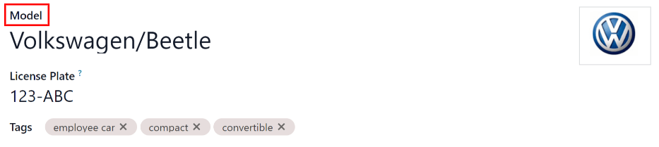
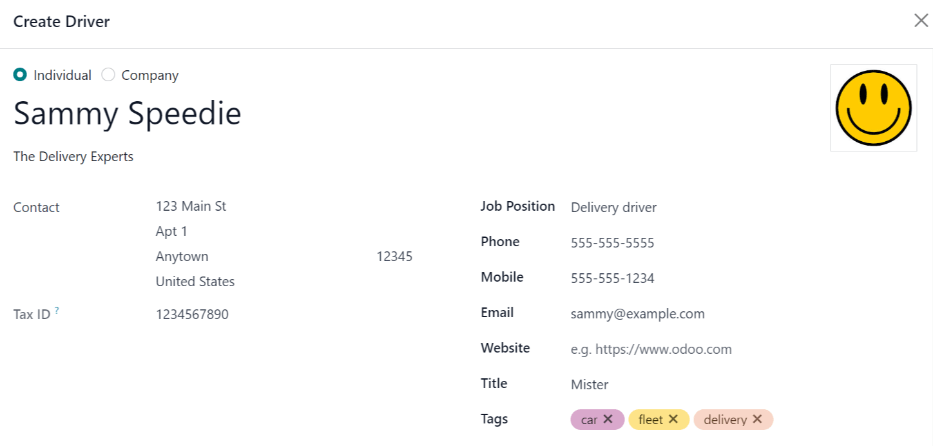
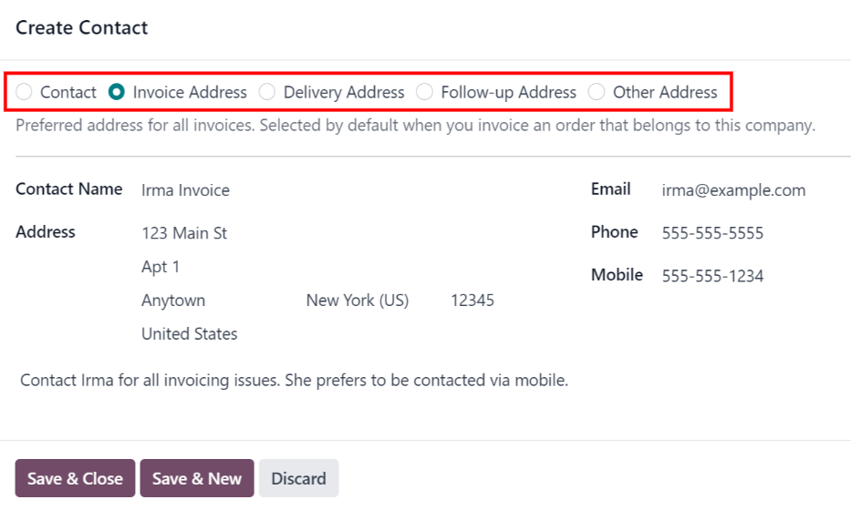
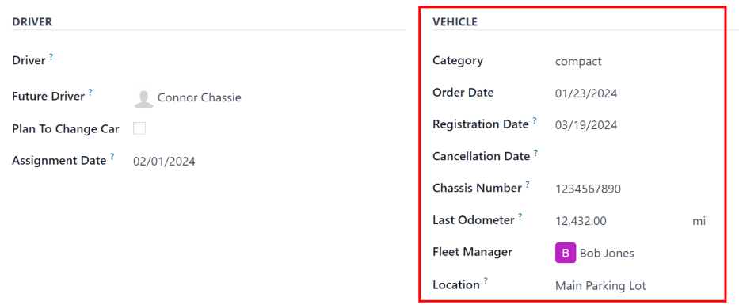
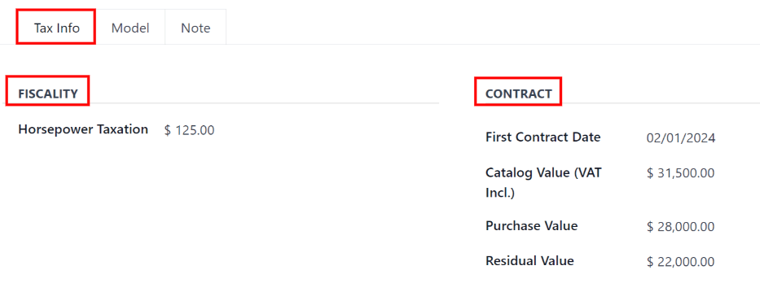

# New vehicles

Odoo's *Fleet* app manages all vehicles, and the accompanying documentation that comes with vehicle
maintenance, and drivers records.

Upon opening the Fleet application, all vehicles are organized within the
Vehicles dashboard, which is the default dashboard for the *Fleet* application. Each
vehicle is displayed in its corresponding Kanban stage, based on its status. The default stages are
New Request, To Order, Registered, and Downgraded.

To add a new vehicle to the fleet from the Vehicles page, click the New
button in the top-left corner, and a blank vehicle form loads. Then, proceed to enter the vehicle
information on the vehicle form.

The form auto-saves as data is entered. However, the form can be saved manually at any time by
clicking the *save manually* option, represented by a (cloud upload) icon, located in
the top-left corner of the page.

## Vehicle form fields

- Model: select the vehicle's model from the drop-down menu. Once a model is selected,
  additional fields may appear on the form.

  If the model is not listed, type in the model name, and click either Create "model",
  or Create and edit... to [create a new model and edit the model details](models.md#fleet-add-model).
- License Plate: enter the vehicle's license plate number in this field.
- Tags: select any tags from the drop-down menu, or type in a new tag. There is no limit
  on the amount of tags that can be selected.

#### NOTE
The Model is the only required field on the new vehicle form. When a model is
selected, other fields appear on the vehicle form, and relevant information auto-populates the
fields that apply to the model. If some of the fields do not appear, this may indicate there is
no model selected.

### Driver section

This section of the vehicle form relates to the person who is currently driving the car, as well as
any plans for a change in the driver in the future, and when.

- Driver: select the driver from the drop-down menu, or type in a new driver and click
  either Create "driver" or Create and edit... to [create a new driver,
  and edit the driver details](#fleet-new-vehicle-add-driver).

  #### IMPORTANT
  A driver does **not** have to be an employee. When creating a new driver, the driver is added
  to the *Fleet* application, **not** the *Employees* application.

  If the *Contacts* application is installed, the driver information is also stored in the
  *Contacts* application.
- Mobility Card: if the selected driver has a mobility card listed on their employee
  card in the *Employees* application, the mobility card number appears in this field. If there is
  no mobility card listed, and one should be added, [edit the employee record](../employees/new_employee.md#employees-hr-settings) in the *Employees* application.
- Future Driver: if the next driver for the vehicle is known, select the next driver
  from the drop-down menu. Or, type in the next driver and click either Create "future
  driver" or Create and edit... to [create a new future driver, and edit the
  driver details](#fleet-new-vehicle-add-driver).
- Kế hoạch đổi xe: nếu tài xế hiện tại của xe này có kế hoạch đổi xe - do đang chờ xe mới được đặt hàng hoặc đây là xe tạm thời và họ đã biết xe tiếp theo mình sẽ lái - hãy tích vào ô này. **Không** tích ô này nếu tài xế hiện tại không có kế hoạch đổi xe.
- Ngày giao: sử dụng lịch thả xuống, chọn thời điểm tài xế khác có thể sử dụng xe. Chọn ngày bằng cách đi đến tháng và năm chính xác bằng cách sử dụng các biểu tượng ⬅️ (mũi tên trái) và ➡️ (mũi tên phải). Sau đó, nhấp vào ngày cụ thể. Nếu trường này được để trống, thì có nghĩa là xe hiện đang khả dụng và có thể được giao lại cho tài xế khác. Nếu trường này đã được điền, tài xế khác sẽ không thể sử dụng xe cho đến ngày đã chọn.
- Company: select the company from the drop-down menu. This field only appears in a
  multi-company database.

#### Create a new driver

If a driver is not already in the system, the new driver should first be configured and added to the
database. A new driver can be added either from the Driver or Future Driver
fields on the [vehicle form](#fleet-new-vehicle-vehicle-form).

First, type in the name of the new driver in either the Driver or Future
Driver field, then click Create and edit.... A Create Driver or
Create Future Driver form appears, depending on which field initiated the form.

Both the Create Driver and Create Future Driver forms are identical.

#### NOTE
Depending on the installed applications, different tabs or fields may be visible on the
Create Driver and Create Future Driver forms.

##### General information

Fill out the following information on the top-half of the form:

- Individual or Company: choose if the driver being added is an individual
  driver or a company. Click the radio button to make a selection.

  When a selection is made, some fields may disappear from the form. If any of the fields below are
  not visible, that is because Company was selected instead of Individual.
- Name: enter the name of the driver or company in this field.
- Company Name...: using the drop-down menu, select the company the driver is associated
  with.

  If the Company radio button is selected at the top of the form, this field does not
  appear.
- Contact: enter the contact information in this section.

  If desired, the Contact field can be changed to a different type of contact. Click on
  Contact to reveal a drop-down menu. The available options to select are
  Contact, Invoice Address, Delivery Address,
  Follow-up Address, or Other Address.

  If desired, select one of these other options for the Contact field, and enter the
  corresponding information.

  If the Company radio button is selected at the top of the form, this field is labeled
  Address and cannot be modified.
- Tax ID: enter the driver or company's tax ID in this field.
- Job Position: enter the driver's job position in this field. If the
  Company radio button is selected at the top of the form, this field does not appear.
- Phone: enter the driver or company's phone number in this field.
- Mobile: enter the driver or company's mobile number in this field.
- Email: enter the driver or company's email address in this field.
- Website: enter the driver or company's website address in this field.
- Title: using the drop-down menu, select the driver's title in this field. The default
  options are Doctor, Madam, Miss, Mister, and
  Professor.

  If the Company radio button is selected at the top of the form, this field does not
  appear.
- Tags: using the drop-down menu, select any tags that apply to the driver or company.

  To add a new tag, type in the tag, then click Create "tag".

  There is no limit to the number of tags that can be selected.

##### Tab Liên hệ & Địa chỉ

After completing the top-half of the Create Driver or Create Future Driver
form, add any other contacts and addresses associated with the driver or company in this tab.

To add a new contact, click the Add button, and a Create Contact pop-up
window appears.

Before entering the necessary information on the form, select the type of contact being added from a
series radio button options located at the top of the form. Those options are:

- Contact: select this option to add general contact details for employees of the
  associated company.
- Invoice Address: select this option to add a preferred address for all invoices. When
  added to the form, this address is selected by default when sending an invoice to the associated
  company.
- Delivery Address: select this option to add a preferred address for all deliveries.
  When added to the form, this address is selected by default when delivering an order to the
  associated company.
- Follow-up Address: select this option to add a preferred address for all follow-up
  correspondence. When added to the form, this address is selected by default when sending reminders
  about overdue invoices.
- Other Address: select this option to add any other necessary addresses for the company
  or driver.

Depending on the Contact Type, some optional fields may not be visible. The available
fields are identical to the fields in the [general information](#fleet-new-vehicle-general-info) section of the new driver form.

Add any notes to the Internal notes... section of the form.

After entering all of the information, click either Save & Close to add the one new
contact, or Save & New to add the current address record and create another address
record.

As contacts are added to this tab, each contact appears in a separate box, with an icon indicating
what type of contact is listed.

##### Tab Bán hàng & Mua hàng

Enter the following sales and purchasing information, in the Sales & Purchase tab of the
Create Driver or Create Future Driver pop-up form for the various sections
below.

Depending on the other installed applications, additional fields and sections may appear. The
following are all default fields for the *Fleet* application **only**.

###### Phần bán hàng

- Salesperson: using the drop-down menu, select the user who is the main point of
  contact for sales with this driver's company.

  This person **must** be an internal user of the company, meaning they can log into the database as
  a user.

###### Thông tin khác

- Company ID: if the company has an ID number, **other than** its *tax ID*, enter it in
  this field.
- Reference: enter any text to give more information regarding the contact person. This
  is an internal note to provide any additional information.

##### Tab ghi chú nội bộ

Add any notes that pertain to the driver, or any other necessary information, in this tab.

### Vehicle section

This section of the vehicle form relates to the physical details of the vehicle.

If a preexisting vehicle in the database was selected for the Model field in the top
portion of the form, some fields may auto-populate, and additional fields may also appear.

Fill in the following fields on the form:

- Category: using the drop-down menu, select the vehicle category from the available
  options. To create a new category, type in the new category name, then click Create
  "category".
- Order Date: using the drop-down calendar, select the date the vehicle was ordered.
- Registration Date: using the drop-down calendar, select the date the vehicle was
  registered.
- Cancellation Date: using the drop-down calendar, select the date the vehicle lease
  expires, or when the vehicle is no longer available.
- Chassis Number: enter the chassis number in the field. This is known in some countries
  as the  number.
- Last Odometer: enter the last known odometer reading in the number field. Using the
  drop-down menu next to the number field, select whether the odometer reading is in kilometers
  (km) or miles (mi).
- Fleet Manager: select the fleet manager from the drop-down menu, or type in a new
  fleet manager, and click either Create or Create and Edit.
- Location: type in the specific location where the vehicle is typically located in this
  field. The entry should clearly explain where the vehicle can be found, such as `Main Garage` or
  `Building 2 Parking Lot`.

### Tab Thông tin thuế

Depending on the localization setting for the database, and what additional applications are
installed, other fields may be present on the form.

The sections below are default and appear for all vehicles, regardless of other installed
applications or localization settings.

#### Tài chính

- Horsepower Taxation: enter the amount that is taxed based on the size of the vehicle's
  engine. This is determined by local taxes and regulations, and varies depending on the location.
  It is recommended to check with the accounting department to ensure this value is correct.

#### Hợp đồng

- First Contract Date: select the start date for the vehicle's first contract using the
  drop-down calendar. Typically this is the day the vehicle is purchased or leased.
- Catalog Value (VAT Incl.): enter the MSRP (Manufacturer's Suggested Retail Price) for
  the vehicle at the time of purchase or lease.
- Purchase Value: enter the purchase price or the value of the lease for the vehicle.
- Residual Value: enter the current value of the vehicle.

#### NOTE
The values listed above affect the accounting department. It is recommended to check with the
accounting department for more information and/or assistance with these values.

### Model tab

If the model for the new vehicle is already configured in the database, the Model tab
will be populated with the corresponding information. If the model is not already in the database
and the Model tab needs to be configured, [configure the new vehicle model](models.md#fleet-add-model).

Check the information in the Model tab to ensure it is accurate. For example, the color
of the vehicle, or if a trailer hitch is installed, are examples of common information that may need
updating.

### Note tab

Enter any notes for the vehicle in this section.
