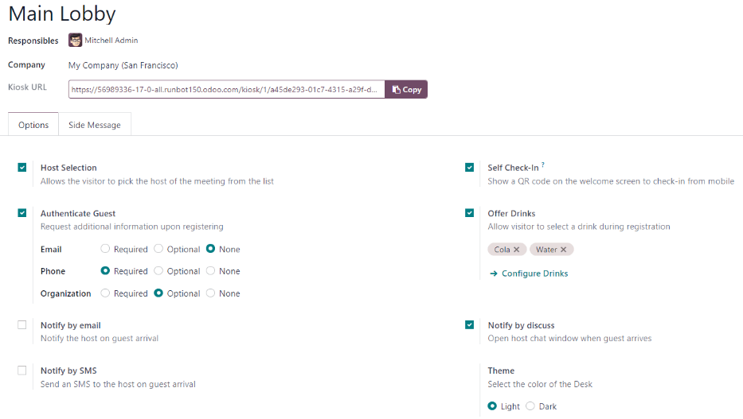
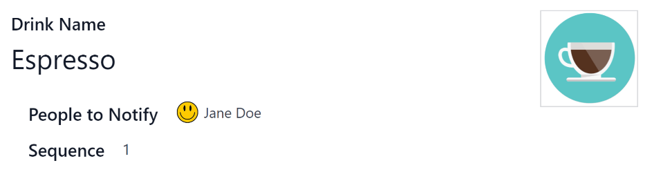

# Quầy lễ tân

The Odoo *Frontdesk* application provides a way for visitors to check in to a building or location,
and alert the person they are meeting about their arrival. Additionally, they can request a
pre-configured beverage to be brought to them, while they wait.

This application is ideal for businesses that do **not** have someone working at a reception desk,
locations **without** a designated waiting area available to guests and visitors.

## Cấu hình

The first item to configure with the *Frontdesk* application is the station, followed by any drink
selections that might optionally be offered.

### Địa điểm

In Odoo's *Frontdesk* application, a *Station* can be thought of as any location where someone can
sign in and wait for an employee. This is typically some form of waiting room, such as a lobby. Each
station has a kiosk where visitors check in.

When setting up the *Frontdesk* application, a minimum of one station **must** be configured, but
there is no limit to how many stations can be created and configured.

To create a station, navigate to Frontdesk app ‣ Configuration ‣ Stations, and
click New. When clicked, a blank frontdesk form appears.

Nhập thông tin sau đây trên biểu mẫu:

- Frontdesk Name: enter a name for the specific frontdesk location. This should be
  short and easily identifiable, such as `Reception Desk` or `Main Lobby`. This field is required in
  order to create a station.
- Responsibles: select the person (or persons) who are alerted when a visitor checks in
  using this specific frontdesk. Multiple selections can be entered. This field is required in order
  to create a station.
- Kiosk URL: this field auto-populates once the frontdesk form is saved, with at least
  the Frontdesk Name and Responsibles fields filled. To save manually, click
  the (cloud with upward arrow) icon, located at the top of the form.

  Once saved, a URL is generated in the Kiosk URL field. This URL is one way the
  frontdesk kiosk is accessed.

  To access the kiosk, click the Copy button at the end of the URL, and navigate to that
  URL in a web browser. This URL opens that specific station's frontdesk sign-in page.

#### Options tab

- Host Selection: if the visitor is attending a meeting, this option allows the visitor
  to select the meeting host from a presented list, and notify that individual. When enabled,
  additional fields appear, as detailed below.
- Authenticate Guest: if additional information is required when a guest checks in,
  enable this option, and select which of the following are required:
  - Email: select whether the guest's email address is Required,
    Optional, or if the information is not requested at all (None).
  - Phone: select whether the guest's phone number is Required,
    Optional, or if the information is not requested at all (None).
  - Organization: select whether the guest's organization is Required,
    Optional, or if the information is not requested at all (None).
- Theme: select the color mode of the kiosk. Choose either Light or
  Dark. The Light selection displays a pale gray background on the kiosk,
  whereas the Dark selection displays a dark gray and black background.
- Self Check-In: enable this option to present a check-in QR code on the kiosk. The QR
  code allows guests to check in using their mobile device, instead of using the kiosk. This option
  is recommended for a busy kiosk with multiple guests checking in at any time.
- Offer Drinks: enable this option to offer guests a drink upon check in. If this option
  is enabled, it is necessary to [configure the drinks being offered](#frontdesk-drinks), via
  the Configure Drinks link that appears when the option is enabled. Once all drink
  options are configured, select each drink to be offered using the drop-down menu.

#### NOTE
The following options are only visible in the Options tab if the [Host Selection](#frontdesk-host) option is enabled.

- Notify by email: enable this option to have an email sent to the person the guest is
  visiting upon check in. When enabled, an Email Template field appears beneath, with
  the default Frontdesk Email Template selected.

  To change the default email template, click the drop-down menu in the Email Template
  field, then select another email template.

  To modify the currently selected template, click the Internal link (arrow) icon at the
  end of the line, and make any edits to the template.
- Notify by SMS: enable this option to have an SMS (text) message sent to the person the
  guest is visiting upon check in. When enabled, an SMS Template field appears beneath,
  with the default Frontdesk SMS Template selected.

  To change the default SMS template, click the drop-down menu in the SMS Template
  field, and select another SMS template.

  To modify the currently selected template, click the Internal link (arrow) icon at the
  end of the line, and make any desired edits to the content of the template. The SMS message may
  have a maximum of 242 characters, which fits in 4 SMS (UNICODE) messages.
- Notify by Discuss: this option is enabled by default when the Host
  Selection option is enabled. This option opens a *Discuss* application message window with the
  person the guest is visiting upon check in.

  When enabled, a default message appears for the person the guest is visiting. The *Discuss*
  application **must** be installed in order for this option to work.

#### NOTE
*Discuss* is installed by default when creating an Odoo database, and does not count towards
billing. As long as the *Discuss* application is not intentionally uninstalled, the
Notify by Discuss option works.

#### Side Message tab

Enter any desired text to appear on the station kiosk after a guest has checked in, such as a
welcome greeting or any necessary instructions. The text appears on the confirmation page, on the
right side of the screen after a guest has completed the check-in process.

### Đồ uống

After a station is created, the next step is to configure the drinks to offer visitors, if desired.
This step is **not** necessary or required for the *Frontdesk* application to work, and only needs
to be configured if drinks are offered to guests.

To add a drink option, navigate to Frontdesk app ‣ Configuration ‣ Drinks, and
click New. Doing so reveals a blank drink form to configure.

Enter the following information on the drink form:

- Drink Name: type the name of the drink option in this field. This field is required.
- People to Notify: use the drop-down menu in this field to select who is notified when
  the drink is selected. Multiple people can be entered in this field. This field is required.
- Sequence: enter a numerical value in this field to indicate where in the list of drink
  options this specific option appears. The lower the number, the higher on the list the drink
  appears. For example, entering the number one would place that drink at the top of the list, and
  appear first in the sequence.

## Station dashboard

## Thiết lập ki-ốt

Set up each kiosk for use after configuring the various stations. It is recommended to use a
dedicated device for each frontdesk kiosk, such as a tablet.

Navigate to the kiosk in one of two ways:

- Navigate to the main *Frontdesk* application dashboard, and click the Open Desk
  button on the desired station card. The kiosk loads in a new browser tab.
- Navigate to Frontdesk app ‣ Configuration ‣ Stations, and click on the
  desired station. Then, click the Copy button at the end of the Kiosk URL
  line, and paste the URL into a new browser tab or window.

#### IMPORTANT
It is recommended to log out of the database, and close the tab, after navigating to the kiosk.
That way, there is no possibility of a visitor accessing the database when checking-in.

## Báo cáo

The *Frontdesk* application has two reports available: Visitors and Drinks.

To access either of these reports, navigate to Frontdesk app ‣ Reporting to
reveal a drop-down menu containing the options: Visitors and Drinks.

The Visitors report displays the number of visitors by month, for the current year. The
Drinks report shows how many total requests were made for each drink.

As with all reports in Odoo, the filters and groups can be modified to show other metrics, as well.

#### SEE ALSO
- [Khách](frontdesk/visitors.md)

* [Khách](frontdesk/visitors.md)
