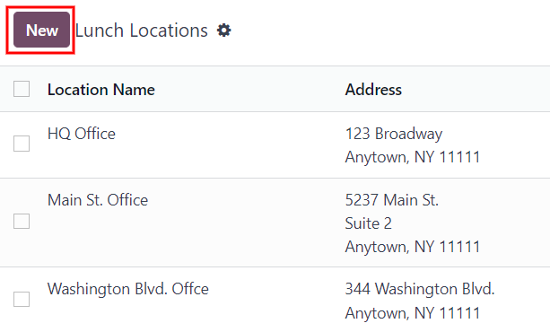

# Bữa ăn

The *Lunch* application in Odoo allows users a convenient way to order food and pay for their meal
directly from the database.

Before employees can use the *Lunch* application, there are a number of configurations to consider:
settings, vendors, locations, products, product categories, and alerts. Once these are created,
employees can view offerings and order food.

## Cài đặt

Only two settings are needed to configure in the *Lunch* app: overdraft settings and notifications.
To access the settings, navigate to Lunch app ‣ Configuration: Settings.

Configure the following:

- Lunch Overdraft: enter the maximum overdraft amount for employees. The currency
  format is determined by the localization setting of the company.
- Reception notification: set the message users receive via the *Discuss* app when their
  food has been delivered. The default message `Your lunch has been delivered. Enjoy your meal!`
  populates this field, but can be modified, if desired.

## Vị trí

By default, Odoo creates an `HQ Office` location when the *Lunch* application is installed. If a
company has more than one location, they must be configured.

To add a location, navigate to Lunch app ‣ Configuration: Locations. The
currently configured locations appear in a list view. Click the New button in the
top-left corner and a blank line appears beneath the last location in the list.

Enter the name of the location in the field. Next, click into the Address field to the
right of the name, and enter the location's address. It is possible to enter multiple lines in the
address field.

Repeat this for all locations that need to be added.

## Cảnh báo

It is possible to set up alerts that can either be displayed in the *Lunch* app, or be sent to
specific employees via the *Discuss* app.

No alerts are pre-configured by default. To set up an alert, navigate to Lunch app
‣ Configuration: Alerts. Click the New button in the top-left corner and a blank
lunch alert form loads. Enter the following information on the form:

- Alert Name: enter a name for the alert. This should be short and descriptive, such as
  `New Lunch Vendor` or `Order by 11`. This field is **required**.
- Display: select whether the alert is visible in the *Lunch* app (Alert in
  app) or sent to employees via the *Discuss* app in a chat window (Chat notification).
  - Recipients: this field only appears if Chat notification is selected for
    the Display option. Select who receives the chat alert. The options are:
    Everyone, Employee who ordered last week, Employee who
    ordered last month, or Employee who ordered last year.
- Location: select the locations the alert should appear for from the drop-down menu.
  Multiple locations can be selected. This field is **required**, therefore, if the alert applies
  to all locations, select all the locations from the drop-down menu.
- Show Until: if the alert should expire on a specific date, select the date from the
  calendar picker.
- Active: this option is on (appears green) by default. To turn off the alert, click the
  toggle so that it no longer appears green.
- Message: Enter the alert message in this field. This field is **required**.
- Notification Time: select the days of the week the alert should be sent. By default,
  all seven days are active. Click on a checkbox to change the setting from active to inactive.

  If Chat notification was selected for the Display option, a
  Time field also appears. Enter the time the chat message should be sent. Next, select
  if the time is either AM or PM using the drop-down menu to the right of
  the Time field.

#### SEE ALSO
- [Nhà cung cấp](lunch/vendors.md)
- [Sản phẩm](lunch/products.md)
- [Đơn hàng](lunch/orders.md)
- [Manage user accounts](lunch/user-accounts.md)
- [Lunch management](lunch/management.md)

* [Nhà cung cấp](lunch/vendors.md)
* [Sản phẩm](lunch/products.md)
* [Đơn hàng](lunch/orders.md)
* [Manage user accounts](lunch/user-accounts.md)
* [Lunch management](lunch/management.md)
