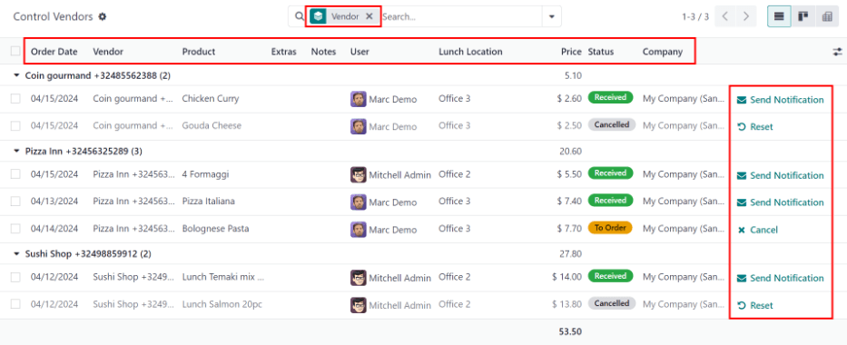

# Lunch management

In Odoo's *Lunch* application, it is required to have someone manage the orders, vendors, and
products. In addition, someone must be responsible for the orders, and notifying employees when
their orders have arrived. This can be the same person.

Orders can be [canceled](#lunch-cancel), [sent to the vendor](#lunch-send-orders),
[confirmed](#lunch-confirm-orders) upon arrival, and [employees can be notified](#lunch-notify), either from the [Today's Orders](#lunch-todays-orders) dashboard, or the
[Control Vendors](#lunch-control-vendors) dashboard.

To manage the *Lunch* app, users need the appropriate Administrator rights. These can be
set by navigating to the Settings app and selecting Manage Users. Then,
click on the desired user to view their access rights.

For more information on access rights, refer to the [Access rights](../../general/users/access_rights.md) documentation.

#### NOTE
Only users with administration rights are able to view the Manager and
Configuration menus in the *Lunch* application.

## Đặt món hôm nay

To view and manage the orders for the day, navigate to Lunch app ‣ Manager ‣
Today's Orders. All orders for the day are presented in a list view on the Today's
Orders dashboard, with a filter for Today, and grouped by Vendor, by
default.

The following information appears in the list:

- Order Date: the date the order was placed.
- Vendor: the vendor the product is being ordered from.
- Product: the specific product ordered.
- Extras: any extras selected for the product.
- Notes: any information needed to be sent to the vendor.
- User: the user who ordered the product.
- Lunch Location: where the product is set to be delivered.
- Price: the total price for the product, including all extras.
- Status: the current status of the product.
- Company: the company under which the order was placed. This only appears in a
  multi-company database.

### Cancel orders

All users can cancel an order, not just managers of the *Lunch* app.

To cancel an order from a vendor, individual products **must** be canceled one at a time.

On the Today's Orders dashboard, a ✖️ Cancel button is shown at the
far-right of each product line that can be canceled. Click the ✖️ Cancel button to
cancel the order for that individual product.

#### NOTE
Only products with a red Status tag of Ordered can be canceled.

### Send orders

The first step in managing the *Lunch* app is to send the orders to the vendors.

When orders are ready to be sent, the manager responsible for sending orders **must** send the
orders to the vendor, outside of the database (call, online order, etc.).

Once orders have been placed with the vendors, click the Send Orders button that appears
next to each vendor's name and phone number.

Once sent, the Send Orders button changes to a Confirm Orders button, and
the Status column is updated from red Ordered tags to blue Sent
tags, indicating the order has been sent to the vendor. Users who have placed orders in the *Lunch*
app rely on the Status tags to track their orders.

### Confirm orders

After orders have been sent to the vendor, the next step is to confirm the orders after they have
been delivered.

On the Today's Orders dashboard, click the Confirm Orders button that
appears next to the vendor's name and phone number.

Once confirmed, the Confirm Orders button disappears, and the Status column
is updated from blue Sent tags to green Received tags, indicating the vendor
has delivered the orders.

In addition, the ✖️ Cancel button at the end of each product line changes to a
✉️ Send Notification button.

If needed, instead of confirming all of the individual products from a vendor, individual products
can be confirmed one at a time. To confirm an individual product, click the ✔️ Confirm
button at the end of the individual product line. When confirming individual products with this
method, the Confirm Orders button remains on the vendor line.

### Notify employees

After products are received, and the orders are confirmed, the employees **must** be informed that
their orders have been delivered, and are ready to be picked up.

Unlike sending and confirming orders, notifications must be sent individually, and cannot be sent in
a batch.

To notify the user their product has arrived, click the ✉️ Send Notification button at
the end of each product line. An email is sent to the user informing them their products have been
delivered.

## Kiểm soát nhà cung cấp

All orders for all vendors, both past and present, can be found in the *Control Vendors* dashboard.
To access these records, navigate to Lunch app ‣ Manager ‣ Control Vendors.

All orders appear in a list view, grouped alphabetically by Vendor. The list loads with
all vendors expanded to show all order lines for every vendor, by default.

The following information appears in the list:

- Order Date: the date the order was placed.
- Vendor: the vendor the product is being ordered from.
- Product: the specific product ordered.
- Extras: any extras selected for the product.
- Notes: any information needed to be sent to the vendor.
- User: the user who ordered the product.
- Lunch Location: where the product is set to be delivered.
- Price: the total price for the product, including all extras.
- Status: the current status of the product.
- Company: the company under which the order was placed. This only appears in a
  multi-company database.

Orders can be [canceled](#lunch-cancel), [sent to the vendor](#lunch-send-orders),
[confirmed](#lunch-confirm-orders) upon arrival, and [employees can be notified](#lunch-notify) using the same method as on the [Today's Orders](#lunch-todays-orders)
dashboard.

#### NOTE
The difference between the [Today's Orders](#lunch-todays-orders) dashboard and the
[Control Vendors](#lunch-control-vendors) dashboard is that the *Today's Orders* dashboard
**only** displays orders for the current day, while the Control Vendors dashboard
displays **all** orders made in the *Lunch* app.

#### SEE ALSO
- [Bữa ăn](../lunch.md)
- [Đơn hàng](orders.md)
- [Manage user accounts](user-accounts.md)
