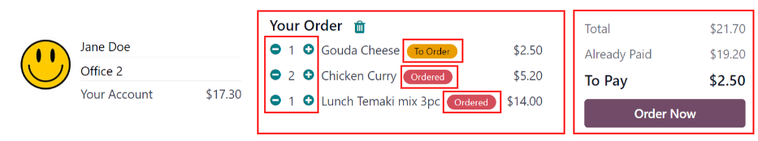

# Đơn hàng

When the *Lunch* application is opened, the Order Your Lunch dashboard loads. This view
is also accessed by navigating to Lunch app ‣ My Lunch ‣ New Order.

The Order Your Lunch dashboard provides a summary of lunch offerings, the user's account
information, and the current day's orders, along with their statuses.

## Đơn đặt bữa ăn của bạn

On the main Order Your Lunch dashboard, all the necessary information needed to place an
order is visible. The default filter for the products is Available Today, which is
present in the Search... bar. This filter shows only products that can be purchased that
day, based on the [vendor's availability](vendors.md#lunch-availability).

The left-side of the dashboard displays the various Categories of products available,
along with the Vendors supplying the products. To the right of each line is a number,
which indicates how many products are associated with that respective category or vendor.

To filter the products by categories or vendors, tick the checkbox next to the desired category or
vendor to only view items related to those selections. Multiple selections can be made in each
section.

#### NOTE
If multiple selections are made, **only** products that fall under **all** the selected options
are shown.

The top portion of the dashboard, which serves as an order summary, displays the user's account
information, and the order details for today, if any orders have been placed.

The main section, beneath the user's information, displays all the products in a default Kanban
view. Each product card displays the name, cost, vendor, photo, and description of the product. If
the product is configured as new, it also displays a New tag.

#### NOTE
Anywhere a vendor's name is listed in the *Lunch* app, such as on Kanban product cards, their
phone number is listed, as well.

The products can also be displayed in a list view, by clicking the ≣ (four parallel
lines) icon in the top-right corner of the dashboard.

## Placing orders

To place a lunch order, navigate to the main Order Your Lunch dashboard, by either
opening the *Lunch* app, or by navigating to Lunch app ‣ My Lunch ‣ New Order.

### Add products to an order

From the Order Your Lunch dashboard, click on a desired product to add to an order, and
the product appears in a Configure Your Order pop-up window.

At the top of the pop-up window is the product image, name, and price. Beneath that, there is a
potential Extras field, showcasing any [extra items or options](vendors.md#lunch-extras).
Tick the checkbox next to any desired extras present in the Extras field to add them to
the order.

Each extra option is organized by a category, complete with its name and price. As extras are
selected, the displayed price at the top of the pop-up window updates to reflect all current
selections.

Beneath the Extras field is the Description of the product, followed by a
Notes field. The Notes field is used to enter any vital information, which
is then sent to the vendor regarding the order, such as any special requests or food allergies.

When all selections for the product have been made, click the Add To Cart button in the
lower-left of the pop-up window. To cancel the order, click the Discard button.

#### Lỗi

Depending on how the various [extras](vendors.md#lunch-configure-extras) are configured for a vendor, it
is possible to receive an error when attempting to add products to the cart.

An error can occur when a configured product **requires** the user to select an option in the
Extras field, but the user neglects to make one.

When this occurs, a Validation Error pop-up window appears. The error is briefly
explained in the pop-up window. Click Close to close the window, and make any necessary
changes to the Configure Your Order pop-up window.

### Your Order summary

When at least one item is added to an order, the items appear at the top of the dashboard in the
Your Order summary. In addition to the products, users can view the account information,
in addition to all the information related to orders placed during the current calendar day.

As products are added to an order, they appear at the top center of the summary box. Each product is
listed beneath the words Your Order, with the product name, quantity, and a status tag.

The available tags that can be displayed for each item are:

- To Order: the product has been added to the cart, but has not been purchased yet by
  the user.
- Ordered: the product has been purchased by the user, and is waiting to be sent to the
  vendor by a *Lunch* app manager.
- Sent: the order for the product has been sent to the vendor by a *Lunch* app manager.
- Received: the product has been delivered by the vendor to the user's location, and has
  been verified as received by a *Lunch* app manager.

Product quantities can be adjusted by clicking the ➕ (plus sign) or ➖ (minus
sign) to the left of the listed product. The product price adjusts in real-time to display the cost
for the currently selected quantity of the product.

Phần bên phải của tóm tắt Đơn hàng của bạn hiển thị thông tin mua hàng. Tổng số tiền cho toàn bộ đơn hàng bữa trưa trong ngày được hiển thị. Trường Đã thanh toán cho biết số tiền đã thanh toán trong ngày so với số tiền Tổng. Trường Cần thanh toán hiển thị số tiền còn lại trong Tổng số tiền cần phải thanh toán để đặt đơn hàng hiện đang được cấu hình.

### Submit an order

To place the order, click the Order Now button on the right-side of the Your
Order summary. The user is charged the amount that is displayed in the To Pay field,
and the cost is deducted from their *Lunch* account balance.

Once the order is placed, the tags for the items just purchased in the Your Order field
change from orange To Order tags to red Ordered tags.

### Track an order

When orders have been sent to the vendors, the tags for the items in the Your Order
summary change from red Ordered tags to blue Sent tags.

Once orders have been received and verified, the tags change from blue Sent tags to
green Received tags.

### Receive an order

When orders are received at the delivery location, they are confirmed by a *Lunch* app manager, and
a notification is sent to the employee who ordered the food.

## Đơn hàng của tôi

Để xem danh sách đầy đủ các đơn đặt hàng trong ứng dụng *Bữa trưa* cho người dùng hiện đang đăng nhập, đi đến Ứng dụng Bữa trưa ‣ Bữa trưa của tôi ‣ Lịch sử đơn hàng của tôi. Thao tác này sẽ dẫn đến bảng điều khiển Đơn hàng của tôi. Dữ liệu được lọc theo Đơn hàng của tôi và nhóm theo Ngày đặt hàng: Ngày theo mặc định, cả hai tùy chọn đều nằm trong thanh Tìm kiếm....

All products appear in a list view, organized by date. The list displays the Order Date,
Vendor, Product, Extras, Notes, User,
Lunch Location, Price, and Status information. If in a
multi-company database, a Company column also appears.

The total cost for each order is displayed on the line containing the order date. At the bottom of
the list, beneath all the lines, the overall total amount paid for all the orders appears, under the
Price column.

At the end of each product line with a status of Ordered or Sent, an
X Cancel button appears. Click X Cancel to cancel that product order. Once a
product order has been canceled, the money paid for that product is refunded, and appears in the
user's account.

At the end of each product line with a status of Received, a Re-order button
appears. Click Re-order to instantly reorder that same product, with the same extras, if
applicable. The new order appears in the list, under the current date, and the product is paid for,
with money deducted from the user's account.

## Tài khoản của Tôi

To view a summary of all transactions in the user's account, navigate to Lunch app
‣ My Lunch ‣ My Account History. Doing so reveals the My Account dashboard.

The default presentation of the My Account dashboard displays all entries, from newest
to oldest. The Date, Description, and Amount are the only fields
displayed in the list.

Entries with a negative figure listed in the Amount column represent products purchased
in the *Lunch* app. These appear in a `$-XX.XX` format.

Entries with a positive balance either represent funds added to the user's lunch account, or
canceled orders that were eventually refunded to the user. These appear in a `$XX.XX` format.

