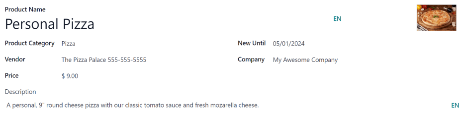
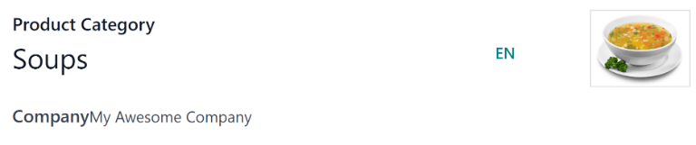

# Sản phẩm

Odoo's *Lunch* app does **not** come with any products preconfigured. The individual products being
offered must first be configured before orders can be placed.

To add and configure products for the *Lunch* app, navigate to Lunch app ‣
Configuration ‣ Products. Next, click the New button in the top-left corner, and a
blank product form loads.

Nhập thông tin sau đây trên biểu mẫu:

- Product Name: enter the name for the product. This field is **required**.
- Product Category: using the drop-down menu, select the [category](#lunch-product-categories) this product falls under. This field is **required**.
- Vendor: using the drop-down menu, select the vendor that supplies this product. This
  field is **required**.
- Price: enter the price for the product. The currency is determined by the company's
  localization.
- Description: enter a description of the product in this field. This description
  appears beneath the product photo when users are viewing the day's options.
- New Until: using the calendar popover, select the date on which the product is no
  longer labeled as new. Until this date, a green `New` tag appears on the product.
- Company: if the product should only be available to a specific company, select it from
  the drop-down menu. If this field is left blank, this product is available for all companies in
  the database.
- **Image**: hover over the image box in the top-right corner of the form, and click the
  <i class="fa fa-pencil"></i> (pencil) icon that appears. A file explorer pop-up window appears.
  Navigate to the image, then click Open.

## Danh mục sản phẩm

Product categories organize the offerings in the *Lunch* app, and allows users to quickly filter
them when reviewing the menu for the day.

To add or modify categories, navigate to Lunch app ‣ Configuration: Product
Categories. The available categories appear in a list view.

In the *Lunch* app, there are four default categories: Sandwich, Pizza,
Burger, and Drinks.

To add a new category, click the New button in the top-left corner, and a blank category
form loads.

Enter a name in the Product Category field. If the category is company-specific and
should only appear for a certain company, select the Company from the drop-down menu.

If desired, add a photo for the category. Hover over the image box in the top-right, and click the
<i class="fa fa-pencil"></i> (pencil) icon that appears. This opens a file explorer pop-up window.
Navigate to the image, then click Open.

