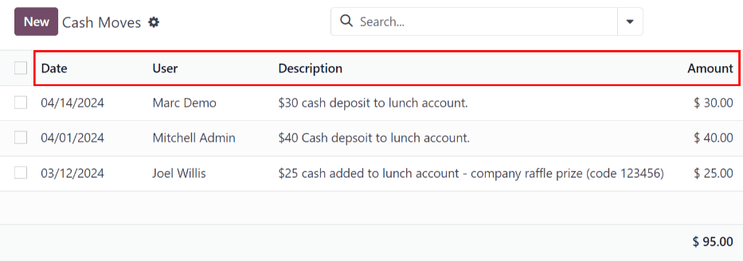
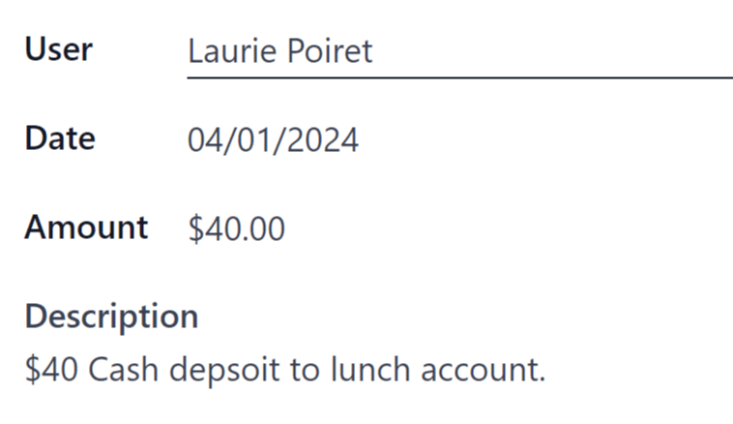
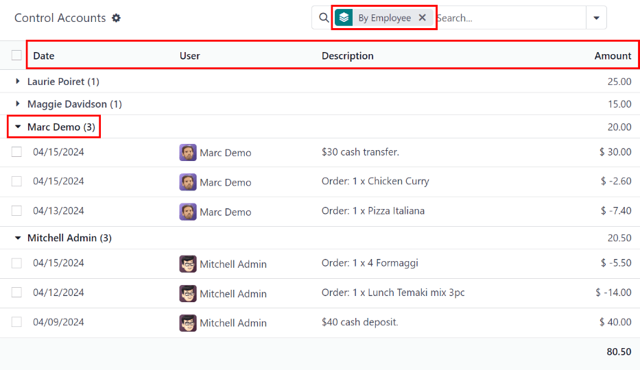

# Manage user accounts

In Odoo's *Lunch* application, users pay for products directly from their *Lunch* app account. For
funds to appear in their account, a *Lunch* app manager **must** transfer funds into each user's
account.

#### IMPORTANT
To add funds and manage user accounts, the user must have Administrator access rights
set for the *Lunch* application. This is verified by navigating to Settings app
‣ → Manage Users. Then, click on a user to view their various settings and access rights.

For more information, refer to the
[Access rights](applications/general/users/access_rights.md) documentation.

The *Lunch* application does **not** directly interface in any way with software or products linked
to any monetary accounts or billing. Money **cannot** be transferred from users' bank accounts, nor
can users' credit cards be charged.

Odoo's *Lunch* application **only** allows for manual entries of cash exchanges that are handled by
the *Lunch* app manager. It is up to each individual company to create the method with which lunch
accounts are replenished.

## Chuyển tiền

To add funds to user accounts, each cash move must be individually logged. To view all cash move
records, or create a new cash move, navigate to Lunch app ‣ Manager ‣ Cash
Moves. Doing so reveals the Cash Moves dashboard.

On the Cash Moves dashboard, all cash moves are presented in a default list view,
displaying each record's Date, User, Description, and
Amount. The total of all the cash moves is displayed at the bottom of the
Amount column.

### Add funds

To add funds to a lunch account, click the New button, located in the top-left corner of
the Cash Moves dashboard.

A blank Cash Moves form loads. Enter the following information on the form:

- User: select the user depositing cash into their account from the drop-down menu. If
  the user is not in the database, they can be created by typing their name in the User
  field, and clicking either Create "user" or Create and edit... to create
  the user and edit the Create User form.
- Date: using the calendar popover, select the date the transaction occurred.
- Amount: enter the amount being added to the lunch account.
- Description: enter a brief description of the transaction.

## Kiểm soát tài khoản

An overview of every transaction in the *Lunch* app, including all cash deposits and purchases, can
be viewed on the main *Control Accounts* dashboard. To access this dashboard, navigate to
Lunch app ‣ Manager ‣ Control Accounts.

All transactions are grouped By Employee, and listed alphabetically by the user's first
name. At the end of the user's name, a number appears. This indicates the number of individual
records logged for that user.

The default view is to have all individual transactions hidden. To view all transactions for a user,
click the ▶ (triangle) icon to the left of the desired name to expand that specific
group.

Each record includes the Date, User, Description, and
Amount.

#### IMPORTANT
This list only displays the various transactions within the *Lunch* app, and does **not** allow
modifications to be made to any records listed.

Cash moves can be modified, but **only** from the [Cash Moves](#lunch-cash-moves)
dashboard, not from the Control Accounts dashboard.

It is **not** possible to modify any product-related records.
