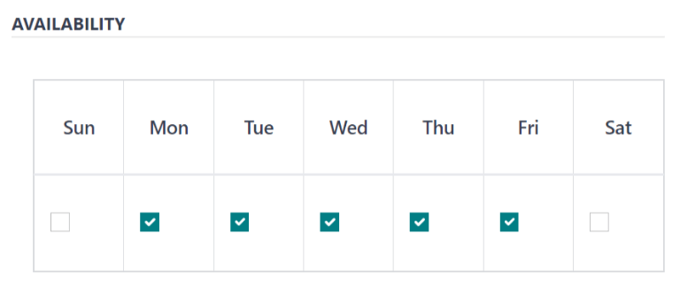

# Nhà cung cấp

Before [products can be added](products.md) to the *Lunch* app, the restaurants that provide the
food **must** be configured.

To add a new vendor, first navigate to Lunch app ‣ Configuration ‣ Vendors.
Here, all currently configured vendors for the *Lunch* app appear in a default Kanban view. To
change to a list view, click the <i class="oi oi-view-list"></i> (list) icon in the top-right
corner.

#### NOTE
No vendors are preconfigured in the *Lunch* app, so all vendors **must** be added to the
database.

To add a new vendor, click the New button in the top-left corner, and a new lunch
supplier form loads.

Fill out the following fields on the vendor form:

- [Thông tin nhà cung cấp](#lunch-vendor-info)
- [Availability](#lunch-availability)
- [Đơn hàng](#lunch-orders)
- [Extras](#lunch-extras)

## Vendor information

- Vendor: enter a name for the vendor.
- Nhà cung cấp (bên dưới dòng tên nhà cung cấp): chọn nhà cung cấp từ menu thả xuống. Nếu nhà cung cấp chưa có trong hệ thống, nhập tên nhà cung cấp và nhấp Tạo "tên nhà cung cấp mới" để thêm. Hoặc nhấp Tạo và chỉnh sửa... để tạo nhà cung cấp và chỉnh sửa biểu mẫu. Biểu mẫu nhà cung cấp cho phép nhập thêm thông tin chi tiết như thông tin liên hệ.

  #### NOTE
  If a selection is made to the drop-down Vendor field, the Vendor text
  field (above, for the vendor's name) updates with the name of the vendor chosen from the
  drop-down menu.

  The list of vendors that is presented in the drop-down menu is pulled from the *Contacts*
  application.
- Address: enter the vendor's address in the various fields.
- Email: enter the vendor's email.
- Phone: enter the vendor's phone number.
- Company: if this vendor is only available to a specific company, select the company
  from the drop-down menu. If this field is left blank, the vendor's items are available to **all**
  companies.

## Khả năng cung cấp

The AVAILABILITY section presents a table with two rows. The days of the week populate
the top row, and the bottom row has checkboxes. Tick the corresponding checkbox for each day of the
week the vendor is available.

By default, Monday through Friday are ticked.

## Đơn hàng

The ORDERS section of the vendor form details which locations the vendor is available
for, in addition to how and when orders are placed and received.

- Delivery: using the drop-down menu, select Delivery if the vendor
  delivers to the office, or select No Delivery if orders must be picked up.
- Location: select which locations are able to order from this vendor. Multiple
  locations can be selected. If this field is left blank, **all** locations can order from the
  vendor.

  #### NOTE
  An `HQ Office` location is created by default when creating a database, and is
  available to select from the list.
- Send Order By: click the radio button to select how orders are sent to the vendor. The
  available options are Phone or Email.
- Order Time: this field **only** appears if Email is selected in the
  Send Order By field. Enter the time that an order must be emailed for it to be
  accepted. Enter the time in the following format: `HH:MM`. Then select either AM or
  PM from the drop-down menu, next to the time field.

## Thông tin bổ sung

When ordering an item in the *Lunch* app, optional extra items, sometimes referred to as *add-ons*,
can be shown. These can be configured in any manner that suits the products being offered.

By default, Odoo allows for three types of extra items, which can be thought of as *categories*. By
default, the first type (or *category*) of add-ons is labeled `Extras`, the second is labeled
`Beverages`, and the third is labeled `Extra Label 3`.

#### IMPORTANT
When configuring the extras, it is important to keep in mind that all the extras configured
appear for **every item** offered by the vendor. That means that only items which apply to
**all** products from the vendor should be added.

### Configure extras

Enter the following information for each of the three available extra sections:

- Extra (#) Label: enter a name for the type of extra, such as `Toppings`. This can be
  thought of as a *category*.
- Extra (#) Quantity: select how the extras are selected. The options are:
  - None or More: select this if the user is not required to make a selection.
  - One or More: select this to **require** the user to make **at least one** selection.
  - Only One: select this to **require** the user to **make only one** selection.

### Add extras

After the labels and quantities have been configured for an extra category, the individual extra
items must be added for each category.

Click Add a line at the bottom of the list that appears on the right-hand side of the
extra category. Enter the Name and Price for each item being added. The
price can remain at `$0.00` if there is no cost. This is common for items like disposable silverware
or condiments.
