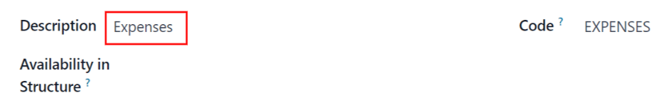

# Bảng lương

Odoo *Payroll* is used to process work entries and create payslips for employees. *Payroll* works in
conjunction with other Odoo apps, such as *Employees*, *Time Off*, *Attendances*, and *Planning*.

The *Payroll* app helps ensure there are no issues or conflicts when validating work entries. It
also handles country-specific localizations to ensure payslips follow local rules and taxes, and
allows for salary assignments.

## Cài đặt

Configure the *Payroll* app by navigating to Payroll app ‣ Configuration ‣
Settings. The various settings for accounting, localizations, time off, alerts, and payslips are
specified here.

### Kế toán

The accounting section of the configuration menu relates to three options:

- Payroll Entries: enable this option to post payroll slips in accounting.
- Payroll SEPA: enable this option to create SEPA payments.
- Batch Account Move Lines: enable this option to have a single account move line
  created from all the accounting entries from the same period. This disables the generation of
  single payments.

### Địa phương

*Localizations* are country-specific settings pre-configured in Odoo at the creation of the
database, which account for all taxes, fees, and allowances for that particular country.

The Localization section of the *Payroll* app Settings page may include
specific settings that need to be set for the specific locality. This selection also provides a
detailed view of all benefits provided to employees.

The settings and options shown in this section varies, depending on the localization enabled for the
database.

#### WARNING
It is **not** recommended to alter the localization settings, unless specifically required.

#### NOTE
Odoo có thể xử lý cấu hình đa công ty. Điều này thường được thực hiện khi có một công ty chính hoặc văn phòng chính như trụ sở, cùng với các văn phòng/chi nhánh khác trên toàn quốc hoặc toàn cầu, thuộc sự quản lý của công ty hoặc trụ sở đó. Trong Odoo, mỗi công ty, bao gồm cả trụ sở, sẽ được thiết lập như một công ty/chi nhánh riêng biệt bằng phương pháp đa công ty.

Each individual company can have a different localization setting configured for that specific
company, since company locations can vary and be located anywhere in the world, where rules and
laws differ.

For more information on companies, refer to the [Companies](../../general/companies/)
documentation, which covers how to set up companies.

### Nghỉ phép

- Deferred Time Off: if time off is taken after payslips are validated, the time off
  needs to be applied to the following pay period. Select the person responsible for validating
  these specific time off situations using the drop-down menu in the Responsible field.

### Bảng lương

- Contract Expiration Notice Period: enter the number of Days before a
  contract expires, and Odoo notifies the responsible person about the upcoming expiration at that
  time.
- Work Permit Expiration Notice Period: enter the number of Days before a
  work permit expires, and Odoo notifies the responsible person about the upcoming expiration at
  that time.
- Payslip PDF Display: enable this option to have payslips display a PDF file on the
  payslip form.

## Hợp đồng

In order for an employee to be paid, they **must** have an active contract for a specific type of
employment. Creating and viewing contract templates, and creating and viewing employment types, is
possible from this section of the configuration header menu.

### Mẫu

Contract templates are used with the *Recruitment* application when sending an offer to a candidate.
The contract template forms the basis of an offer, and can be modified for specific candidates or
employees, when necessary. If a contract template is created or modified in the *Payroll*
application, the changes are also reflected in the *Recruitment* application.

#### IMPORTANT
To access contract templates, the *Salary Configurator* (`hr_contract_salary`) module **must** be
[installed](../../general/apps_modules.md#general-install).

To view all the current contract templates in the database, navigate to Payroll app
‣ Configuration ‣ Contracts: Templates.

On the Contract Templates page, all current contract templates appear in a list view. To
view the details of a contract template, click anywhere on the line to open the contract form. The
contract template can be modified from this form. Proceed to make any desired changes to the
contract.

To create a new contract template, click the New button. Then, enter the following
information on the blank contract template form that appears:

- Contract Reference: enter a brief description for the template. This should be clear
  and easily understood, as this name appears in the *Recruitment* application, as well.
- Working Schedule: select the desired working schedule the contract applies to from the
  drop-down menu. If a new working schedule is needed, create a [new working schedule](#payroll-new-working-schedule).
- Work Entry Source: select how the work entries are generated. Choices are either:
  - Working Schedule: work entries are generated based on the selected working schedule.
  - Attendances: work entries are generated based on the employee's attendance, as they
    are logged in the *Attendances* application. Refer to the [Attendances](../attendances/check_in_check_out.md#attendances-check-in) documentation for information on checking in and out.
  - Planning: work entries are generated based on the employee's planning in the
    *Planning* application.
- Salary Structure Type: select the [salary structure type](#payroll-structure-types) from the drop-down menu.
- Department: select the department the contract template applies to from the drop-down
  menu. If blank, the template applies to all departments.
- Job Position: select the [job position](#payroll-job-positions) the contract
  template applies to from the drop-down menu. If blank, the template applies to all job positions.
- Wage on Payroll: enter the monthly wage in the field.
- Contract Type: select the type of contract from the drop-down menu. This list is the
  same as the [Employment Types](#payroll-employment-types).
- HR Responsible: select the employee responsible for validating contracts, using this
  template, from the drop-down menu.
- New Contract Document Template: select a default document that a new employee has to
  sign to accept an offer.
- Contract Update Document Template: select a default document that a current employee
  has to sign to update their contract.

#### Tab Thông tin lương

- Wage Type: select either Fixed Wage or Hourly Wage from the
  drop-down menu.
- Schedule Pay: using the drop-down menu, select how often the employee is paid. Options
  include Annually, Semi-annually, Quarterly,
  Bi-monthly, Monthly, Semi-monthly, Bi-weekly,
  Weekly, or Daily.
- Wage: enter the gross wage. The time period presented in this field is based on what
  is selected for the Scheduled Pay field. It is recommended to populate the
  Yearly Cost (Real) field *first*, since that entry updates this field automatically.
- Yearly Cost (Real): enter the total yearly cost the employee costs the employer. When
  this value is entered, the Monthly Cost (Real) is automatically updated.
- Monthly Cost (Real): this field is **not** editable. The value is automatically
  populated after the Yearly Cost (Real) is entered.

#### IMPORTANT
The Schedule Pay, Wage, and Yearly Cost (Real) fields are all
linked. If any of these fields are updated, the other two fields automatically update to reflect
the change. It is best practice to check these three fields if any modifications have been made,
to ensure they are accurate.

#### Pre-tax benefits and post-tax deductions

Depending on the localization settings set for the company, the entries presented in this section
either vary, or may not appear at all.

For example, some entries may pertain to retirement accounts, health insurance benefits, and
commuter benefits.

Enter the monetary amounts or percentages to specify how much of the employee's salary goes to the
various benefits and/or deductions.

### Employment types

To view all the pre-configured employment types, navigate to Payroll application ‣
Configuration ‣ Contracts: Employment Types.

The employment types are presented in a list view on the Employment Types page.

The default employment types are Permanent, Temporary, Seasonal,
Interim, Full-Time, Part-Time, and Permanent.

To make a new employment type, click the New button in the upper-left corner, and a
blank line appears at the bottom of the Employment Types page.

On this new blank line, enter the name of the employment type in the Name column. If the
employment type is country-specific, select the country using the drop-down menu in the
Country column. If a country is selected, then the employment type is *only* applicable
for that specific country.

To rearrange the order of the employment types, click the six small gray boxes icon to
the left of the employment type Name, and drag the line to the desired position on the
list.

## Work entries

A *work entry* is an individual record on an employee's timesheet. Work entries can be configured to
account for all types of work and time off, such as Attendance, Sick Time
Off, Training, or Public Holiday.

#### SEE ALSO
[Manage work entries](work_entries.md)

### Loại công

When creating a work entry in the *Payroll* application, or when an employee enters information in
the *Timesheets* application, a Work Entry Type needs to be selected. The list of
Work Entry Types is automatically created based on localization settings set in the
database.

To view the current work entry types available, go to Payroll app ‣ Configuration
‣ Work Entries ‣ Work Entry Types.

Each work entry type has a code to aid in the creation of payslips, and to ensure all taxes and fees
are correctly entered.

#### New work entry type

To create a new Work Entry Type, click the New button, and enter the
information for the following sections on the form.

##### Phần Thông tin chung

- Work Entry Type Name: the name should be short and descriptive, such as `Sick Time` or
  `Public Holiday`.
- Payroll Code: this code appears with the work entry type on timesheets and payslips.
  Since the code is used in conjunction with the *Accounting* application, it is advised to check
  with the accounting department for a code to use.
- DMFA code: this code is used to identify 
  entries on a corresponding  report. The  report is a quarterly report that Belgian-based companies are
  required to submit for social security reporting purposes. This report states the work done by the
  employees during the quarter, as well as the salaries paid to those employees.
- External Code: this code is used for exporting data to a third-party payroll service.
  Check with the third-party being used to determine the External Code to enter for the
  new work entry type.
- SDWorx code: this code is only for companies that use SDWorx, a payroll service
  provider.
- Color: select a color for the particular work entry type.

##### Display in payslip section

- Rounding: the rounding method selected determines how quantities on timesheet entries
  are displayed on the payslip.
  - No Rounding: a timesheet entry is not modified.
  - Half Day: a timesheet entry is rounded to the closest half day amount.
  - Day: a timesheet entry is rounded to the closest full day amount.

##### Unpaid section

- Unpaid in Structures Types: if the work entry is for work that is not paid, specify
  which pay structure the unpaid work entry applies to from the drop-down menu. Some situations
  where work is logged on a timesheet, but no compensation given would be for unpaid internships,
  unpaid training, or volunteer work.

##### Valid for advantages section

- Meal Voucher: if the work entry should count towards a meal voucher, check the box.
- Representation Fees: if the work entry should count towards representation fees, check
  the box.
- Private Car Reimbursement: if the work entry should count towards a private car
  reimbursement, check the box.

##### Time off options section

- Time Off: check this box if the work entry type can be selected for a time off
  request, or entry, in the *Time Off* application.

  If Time Off is checked, a Time Off Type field appears. This field has a
  drop-down menu to select the specific type of time off, such as `Paid Time Off`, `Sick Time Off`,
  or `Extra Hours`, for example.

  A new type of time off can be entered in the field, if the listed types of time off in the
  drop-down menu do **not** display the type of time off needed.
- Giữ nghỉ phép hợp lý: chỉ dành cho các công ty Bỉ **và \*\*không** xuất hiện ở các bản địa hóa khác. Đánh dấu vào ô này nếu công là nghỉ phép ảnh hưởng đến quyền lợi nghỉ phép cho năm sau. Theo chính phủ, người lao động có ngày nghỉ phép hàng năm và trong một số trường hợp, thời gian nghỉ phép trong một khoảng thời gian cụ thể có thể ảnh hưởng đến thời gian nghỉ phép mà nhân viên nhận được hoặc tích lũy trong năm sau.

##### Reporting section

- Unforeseen Absence: if the work entry should be visible on the unforeseen absences
  report, check this box.

### Working schedules

To view the currently configured working schedules, go to Payroll app ‣
Configuration ‣ Work Entries ‣ Working Schedules. The working schedules that are available for
an employee's contracts and work entries are found in this list.

Working schedules are company-specific. Each company **must** identify each type of working schedule
they use. If the database is created for only one company, the company column is not available.

#### New working schedule

To create a new working schedule, click the New button, and enter the information on the
form.

The fields are auto-populated for a regular 40-hour work week but can be modified. First, change the
name of the working time by modifying the text in the Name field. Next, make any
adjustments to the days and times that apply to the new working time.

In the Working Hours tab, modify the Day of Week, Day Period,
and Work Entry Type selections by clicking on the drop-down menus in each column and
making the desired selection. The Work From and Work To columns are modified
by typing in the time.

#### NOTE
The Work From and Work To times must be in a 24-hour format. For example,
`2:00 PM` would be entered as `14:00`.

If the working time should be in a two-week configuration, click the Switch to 2 weeks
calendar button in the top-left. This creates entries for an Even week and an
Odd week.

## Tiền lương

### Structure types

Trong Odoo, phiếu lương của nhân viên được xây dựng dựa trên *cấu trúc* và *loại cấu trúc*, cả hai yếu tố này đều ảnh hưởng đến cách nhân viên nhập bảng chấm công. Mỗi loại cấu trúc là một tập hợp quy tắc riêng biệt để xử lý một mục nhập bảng chấm công, bao gồm các cấu trúc khác nhau được lồng bên trong. Loại cấu trúc xác định tần suất nhân viên được trả lương, số giờ làm việc và liệu tiền lương dựa trên mức cố định hay số giờ làm việc thực tế của nhân viên.

Ví dụ, một loại cấu trúc có thể là `Nhân viên`, và loại cấu trúc đó có thể chứa hai cấu trúc khác nhau: cấu trúc `Lương thông thường` bao gồm tất cả các quy tắc riêng biệt để xử lý lương thông thường, cùng với một cấu trúc cho `Thưởng cuối năm` chỉ bao gồm các quy tắc cho khoản thưởng cuối năm. Cả cấu trúc `Lương thông thường` và cấu trúc `Thưởng cuối năm` đều là các cấu trúc thuộc loại cấu trúc `Nhân viên`.

The different Structure Types can be seen by navigating to Payroll app
‣ Configuration ‣ Salary: Structure Types.

Two default structure types are configured in Odoo: Employee and Worker.

Typically, Employee is used for salaried employees, which is why the wage type is
Monthly Fixed Wage, and Worker is typically used for employees paid by the
hour, so the wage type is Hourly Wage.

#### New structure type

To make a new structure type, click the New button, and a blank structure type form
appears.

Proceed to enter information in the fields. Most fields are pre-populated, but all the fields can be
modified.

- Structure Type: enter the name for the new structure type, such as `Employee` or
  `Worker`.
- Country: select the country that the new structure type applies to from the drop-down
  menu.
- Wage Type: select what type of wage the new structure type uses, either
  Fixed Wage or Hourly Wage.

  If the type is to be used for salaried employees, who receive the same wage every pay period,
  select Fixed Wage.

  If the type is to be used for employees, who receive wages based on how many hours they worked
  during a pay period, select Hourly Wage.
- Default Scheduled Pay: select the typical pay schedule for the new structure type from
  the drop-down menu. Options are Monthly, Quarterly,
  Semi-annually, Annually, Weekly, Bi-weekly,
  Bi-monthly. This indicates how often this specific type of structure is paid out.
- Giờ làm việc mặc định: chọn giờ làm việc mặc định cho loại cấu trúc mới từ menu thả xuống. Tất cả giờ làm việc có sẵn cho công ty hiện được chọn sẽ xuất hiện trong menu thả xuống. Giờ làm việc mặc định được cấu hình sẵn trong Odoo là tùy chọn Tiêu chuẩn 40 giờ/tuần. Nếu giờ làm việc cần thiết không có trong danh sách, bạn có thể [tạo bộ giờ làm việc mặc định mới](#new-default-working-hours).
- Regular Pay Structure: type in the name for the regular pay structure.
- Default Work Entry Type: select the default type of work entry the new structure type
  falls under from the drop-down menu. The default options include Attendance,
  Overtime Hours, Generic Time Off, Compensatory Time Off,
  Home Working, Unpaid, Sick Time Off, Paid Time
  Off, Out Of Contract, Extra Hours, and Long Term Time Off.

  To view all the options for the Default Work Entry Type, click the Search
  More.. button at the bottom of the drop-down list.

  Depending on the localization settings, this list may contain more options in addition to the
  default options.

#### New default working hours

Để tạo giờ làm việc mặc định mới, nhập tên cho giờ làm việc mới vào trường Giờ làm việc mặc định trên biểu mẫu loại cấu trúc mới. Nhấp Tạo và chỉnh sửa. Một biểu mẫu giờ làm việc mặc định sẽ hiện ra. Biểu mẫu giờ làm việc mặc định có hai phần: phần thông tin chung và một tab liệt kê tất cả các khung giờ làm việc cụ thể theo ngày và giờ. Sau khi hoàn thành biểu mẫu, nhấp Lưu & đóng.

- Name: type in the name for the new default working hours. This should be descriptive
  and clear to understand, such as `Standard 20 Hours/Week`.
- Company: select the company that can use these new default working hours from the
  drop-down menu. Keep in mind, working hours are company-specific, and cannot be shared between
  companies. Each company needs to have their own working hours set.
- Average Hour Per Day: the average hours per day field is auto-populated, based on the
  working hours configured in the Working Hours tab. This entry affects resource
  planning, since the average daily hours affect what resources can be used, and in what quantity,
  per work day.
- Timezone: select the time zone to be used for the new default working hours from the
  drop-down menu.
- Company Full Time: enter the number of hours per week an employee would need to work
  to be considered a full-time employee. Typically, this is approximately 40 hours, and this number
  affects what types of benefits an employee can receive, based on their employment status
  (full-time vs part-time).
- Work Time Rate: this percentage is auto-generated based on the entry for the
  Company Full Time and the working hours configured in the Working Hours
  tab. This number should be between `0.00%` and `100%`, so if the percentage is above `100%`, it is
  an indication that the working times and/or Company Full Time hours need adjustment.
- Working Hours Tab: this tab is where each day's specific working hours are listed.
  When a new default working hour form is created, the Working Hours tab is
  pre-populated with a default 40-hour week, with each day divided into three timed sections.

  Every day has morning (8:00-12:00), lunch (12:00-13:00), and evening (13:00-17:00) hours
  configured, using a 24 hour time format.

  To adjust any of these hours, click on the specific field to adjust, and make the adjustment using
  the drop-down menus, or in the specific case of the times, type in the desired time.

  Keep in mind, working hours are company-specific, and cannot be shared between companies. Each
  company needs to have their own working hours set.

  #### NOTE
  If the working hours are not consistent each week, and the hours are on a bi-weekly schedule
  instead, click the Switch to 2 week calendar button at the top of the new default
  working hours form. This changes the Working Hours tab to display two weeks of
  working times that can be adjusted.

### Cấu trúc

*Salary structures* are the different ways an employee gets paid within a specific *structure*, and
are specifically defined by various rules.

The amount of structures a company needs for each structure type depends on how many different ways
employees are paid, and how their pay is calculated. For example, a common structure that could be
useful to add may be a `Bonus`.

To view all the various structures for each structure type, go to Payroll app ‣
Configuration ‣ Salary ‣ Structures.

Each [structure type](#payroll-structure-types) lists the various structures associated with
it. Each structure contains a set of rules that define it.

Click on a structure to view its Salary Rules. These rules are what calculate the
payslip for the employee.

### Quy tắc

Each structure has a set of *salary rules* to follow for accounting purposes. These rules are
configured by the localization, and affect actions in the *Accounting* application, so modifications
to the default rules, or the creation of new rules, should only be done when necessary.

To view all the rules, go to Payroll app ‣ Configuration ‣ Salary ‣ Rules.
Click on a structure (such as Regular Pay) to view all the rules.

To make a new rule, click New. A new rule form appears. Enter the following information
in the fields.

#### Top section

- Rule Name: enter a name for the rule. This field is required.
- Category: select a category the rule applies to from the drop-down menu, or enter a
  new one. This field is required.
- Code: enter a code to be used for this new rule. It is recommended to coordinate with
  the accounting department for a code to use as this affects accounting reports and payroll
  processing. This field is required.
- Sequence: enter a number indicating when this rule is calculated in the sequence of
  all other rules.
- Salary Structure: select a salary structure the rule applies to from the drop-down
  menu, or enter a new one. This field is required.
- Active: enable this toggle, so the rule is available for use. Disable the toggle to
  hide the rule without deleting it in the database.
- Appears on payslip: tick the checkbox to have the rule appear on employee payslips.
- View on Employer Cost Dashboard: tick the checkbox to have the rule appear on the
  Employer Cost report, located on the *Payroll* app dashboard.
- View on Payroll Reporting: tick the checkbox to have the rule appear on payroll
  reports.

#### General tab

##### Điều kiện

- Condition Based on: select from the drop-down menu whether the rule is
  Always True (always applies), a Range (applies to a specific range, which
  is entered beneath the selection), or a Python Expression (the code is entered beneath
  the selection). This field is required.

##### Tính toán

- Amount Type: select from the drop-down menu whether the amount is a Fixed
  Amount, a Percentage (%), or a Python Code. Depending on what is
  selected, the fixed amount, percentage, or Python code needs to be entered next. This field is
  required.

##### Company contribution

- Partner: if another company financially contributes to this rule, select the company
  from the drop-down menu.

#### Tab mô tả

Provide any additional information in this tab to help clarify the rule. This tab only appears in
the rule form.

#### Tab kế toán

- Debit Account: select the debit account from the drop-down menu the rule affects.
- Credit Account: select the credit account from the drop-down menu the rule affects.
- Not computed in net accountability: tick the checkbox to delete the value of this rule
  in the `Net Salary` rule.

### Rule parameters

#### NOTE
Currently, the Rule Parameters feature found inside the Payroll app
‣ Configuration ‣ Salary ‣ Rule Parameters menu is still in development and only serves a
specific use case for Belgian markets. The documentation will be updated when this section has
matured to more markets.

### Other input types

When creating payslips, it is sometimes necessary to add other entries for specific circumstances,
like expenses, reimbursements, or deductions. These other inputs can be configured by navigating to
Payroll app ‣ Configuration ‣ Salary ‣ Other Input Types.

To create a new input type, click the New button. Enter the Description, the
Code, and which structure it applies to in the Availability in Structure
field.

#### IMPORTANT
The Code is used in the salary rules to compute payslips. If the
Availability in Structure field is left blank, it indicates that the new input type
is available for all payslips and is not exclusive to a specific structure.

## Salary package configurator

The various options under the Salary Package Configurator section of the
Payroll app ‣ Configuration ‣ Salary Package Configurator menu all affect an
employee's potential salary. These sections (Benefits, Personal Info,
and Resume) specify what benefits can be offered to an employee in their salary package.

Depending on what information an employee enters (such as deductions, dependents, etc.), their
salary is adjusted accordingly. When an applicant applies for a job on the company website, the
sections under Salary Package Configurator directly affect what the applicant sees, and
what is populated, as the applicant enters information.

### Quyền lợi

When offering potential employees a position, there can be certain benefits set in Odoo, in addition
to the salary, to make an offer more appealing (such as extra time off, the use of a company car,
reimbursement for a phone or internet, etc.).

To view the benefits, go to Payroll app ‣ Configuration ‣ Salary Package
Configurator: Benefits. Benefits are grouped by Structure type, and the benefit listed
for a particular structure type is only available for that specific structure.

To make a new benefit, click the New button, and enter the information in the fields on
the blank benefits form.

The various fields for creating a benefit are as follows:

#### Phần Thông tin chung

- Benefits: enter the name for the benefit. This field is required.
- Benefit Field: select from the drop-down menu the type of benefit this is.
- Cost Field: select from the drop-down menu the type of cost incurred by the company
  for this specific benefit. The default options are Calendar Changed, Yearly
  Cost (Real), Extra Time Off, Hourly Wage, Part Time,
  Wage, Wage with Holidays, and Work time rate. Depending on the
  localization settings, additional options are available.
- Related Type: select from the drop-down menu what type of benefit it is. Select from
  Monthly Benefit in Kind, Monthly Benefit in Net, Monthly
  Benefit in Cash, Yearly Benefits in Cash, or Non Financial Benefits. This
  field is required.
- Benefit Field: select from the drop-down menu the specific field on the contract the
  benefit appears.
- Cost Field: select the specific field on the contract that the cost of the benefit is
  linked to, using the drop-down menu. If this field is left blank, the cost of the benefit is not
  computed in the employee budget.
- Impacts Net Salary: tick the checkbox if the benefit should impact the employee's net
  salary.
- Requested Documents: select any document that is required to be submitted for this
  benefit, from the drop-down menu.
- Mandatory Benefits: using the drop-down menu, select the benefit that is required in
  order for this specific benefit to be offered to the employee.

  For example, a benefit for car insurance would populate `Company Car` in this field. This would
  allow the car insurance benefit to **only** be displayed if the employee has selected/enabled the
  benefit of a company car.
- Salary Structure Type: select from the drop-down menu which salary structure type this
  benefit applies to. This field is required.
- Unit of Measure: select the metric that the benefit is granted, using the drop-down
  menu. The options are Days, Percent, or Currency.

#### Display section

- Show Name: tick the checkbox to have the benefit name appear in the salary package
  configurator.
- Display Type: select from the drop-down menu how this benefit is displayed. The
  options are Always Selected, Dropdown, Dropdown Group,
  Slider, Radio Buttons, Manual Input, or Text. This
  field is required.

  Depending on the selection made, additional configurations need to be made. For example, if
  Radio Buttons is selected, the individual radio buttons must be entered.
- Icon: an icon from the [Font Awesome 4 library](https://fontawesome.com/v4/icons/)
  can be visible for this benefit. Enter the text code for the icon in this field. For example, to
  display a suitcase icon, the code `fa fa-suitcase` is entered on this line.
- Hide Description: tick the checkbox to hide the benefit description if the benefit is
  not selected by the employee.
- Folded: if the benefit should be folded, or hidden, because it is dependant on another
  benefit selection, tick the checkbox. The following fields appear when this is active:
  - Fold Label: enter a name for the folded section of the benefit.
  - Fold Res Field: select the contract field this benefit is tied to using the
    drop-down menu. If this field is selected on the contract, then this benefit becomes visible.

#### Activity section

- Activity Type: from the drop-down menu, select the activity type that is automatically
  created when this benefit is selected by the employee.
- Activity Creation: select when the activity is created, either when the
  Employee signs his contract, or when the Contract is countersigned. Click
  the radio button next to the desired selection.
- Activity Creation Type: select the parameters for when the activity is created, either
  When the benefit is set or When the benefit is modified. Click the radio
  button next to the desired selection.
- Assigned to: select the user the activity is automatically assigned to, using the
  drop-down menu.

#### Sign section

- Template to Sign: if the employee is required to sign a document when selecting this
  benefit, select the document template from the drop-down menu.

  For example, a benefit regarding the use of a company car may require the employee to sign a
  document acknowledging the company's car policies.

#### Tab mô tả

Provide any additional information in this tab to help clarify the benefit.

### Personal info

Every employee in Odoo has an *employee card* which is created when a candidate becomes an
employee. This card includes all of their personal information, resume, work information, and
documents.

The personal information is gathered from the salary package configurator section that a
candidate fills out after being offered a position. This personal information is then transferred to
the employee card when they are hired.

To view an employee's card, go to the main Employees app dashboard, and click on
the employee's card.

#### NOTE
An employee card can be thought of as an employee personnel file.

The Personal Info section lists all of the fields that are available to enter on the
employee's card. To access this section, go to Payroll app ‣ Configuration ‣
Salary Package Configurator: Personal Info.

To edit a personal info entry, select an entry from the list on the Personal Info page,
and modify the personal info on the form that appears.

To create a new personal info entry, click the New button.

The required fields, aside from entering the Information name, are Related
Model, Related Field, and Category.

Select a Related Model from the drop-down menu. Employee populates the field
by default, but the Bank Account option is also available if the information is related
to a bank account, instead.

Select a Related Field from the drop-down menu that best describes what kind of personal
information this entry is, and where it is stored in the backend. Then, select a
Category from the drop-down menu that the personal information should be under, such as
Address or Personal Documents.

The two most important fields on the personal info form are Is Required and
Display Type.

Checking the Is Required box makes the field mandatory on the employee's card. The
Display Type drop-down menu allows for the information to be entered in a variety of
ways, like a Text box, to a customizable Radio button, a
Checkbox, a Document, and more.

### Resumé

The resumé section, housed within the salary package configurator section of the settings menu, is
how salary information rules are configured when offering a position to potential employees.

When an offer is sent to a prospective employee, the values for the offer are computed from these
settings, and appear on the offer page.

To configure this section, navigate to Payroll app ‣ Configuration ‣ Salary
Package Configurator: Resumé.

By default, there are three Salary Structure Types pre-configured in Odoo:
Worker, Employee, and None.

Each Salary Structure Type has several rules configured. These affect how an offer is
calculated using that particular Salary Structure Type.

To create a new rule, click the New button, and a blank Contract Salary
Resumé form loads.

Nhập thông tin sau đây trên biểu mẫu:

- Information: type in a name for this field.
- Category: select the category this value is housed under, using the drop-down menu.
  The default options are Monthly Salary, Monthly Benefits,
  Yearly Benefits, and Total.

  New categories can be made if needed.

  Click the New button, then enter the name for the new category in the Name
  field. Next, select the Periodicity from the drop-down menu, either
  Monthly or Yearly. Last, enter a number for the sequence. This corresponds
  to where this rule appears in the  Salary Structure Type rule list.

  Finally, click Save & Close.
- Impacts Monthly Total: tick the checkbox if this value is added in the monthly total
  calculation.
- Unit of Measure: select what kind of value this rule is, either Currency,
  Days, or Percent.

  Currency is for a set monetary value, Days is for compensation in the form
  of time off, and Percent is for a monetary value awarded that is based upon another
  metric, such as commissions.
- Salary Structure Type: select which Salary Structure Type this rule is
  nested under, from the drop-down menu.
- Value Type: select how the value is computed, using the drop-down menu. The default
  options are Fixed Value, Contract Value, Payslip Value,
  Sum of Benefits Values, and Monthly Total.
- Code: select the code this rule applies to from the drop-down menu.

## Tuyển dụng

Since the *Payroll* application is responsible for paying employees for specific job positions, the
complete list of job positions can be found in both the *Payroll* and *Recruitment* applications.

### Job positions

The job positions listed in the *Payroll* application are identical to the job positions listed in
the *Recruitment* application. If a new job position is added in the *Recruitment* application, it
is also visible in the *Payroll* application, and vice versa.

To view the job positions, navigate to Payroll app ‣ Configuration ‣ Jobs: Job
Positions.

A list of all the job positions appear, along with the corresponding department, on the
Job Position page.

To create a new job description, click the New button and a job form appears.

Enter the information on the form for the new position. The information is identical as to the
information entered when creating a new job position in the *Recruitment* application.

Refer to the [Job positions](../recruitment/new_job.md) documentation for more details on how to fill out this
form.

#### SEE ALSO
- [Hợp đồng](contracts.md)
- [Work entries](work_entries.md)
- [Salary attachments](salary_attachments.md)
- [Phiếu lương](payslips.md)
- [Báo cáo](reporting.md)
- [Work entry analysis](work_entry_analysis.md)
- [Salary attachment report](salary_attachment.md)

* [Hợp đồng](contracts.md)
* [Work entries](work_entries.md)
* [Salary attachments](salary_attachments.md)
* [Phiếu lương](payslips.md)
* [Báo cáo](reporting.md)
* [Work entry analysis](work_entry_analysis.md)
* [Salary attachment report](salary_attachment.md)
