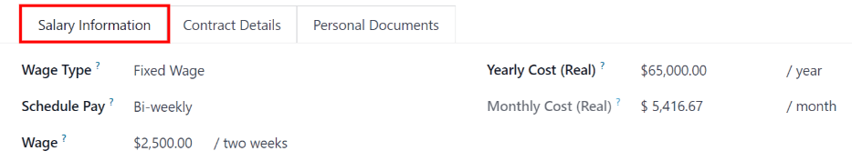
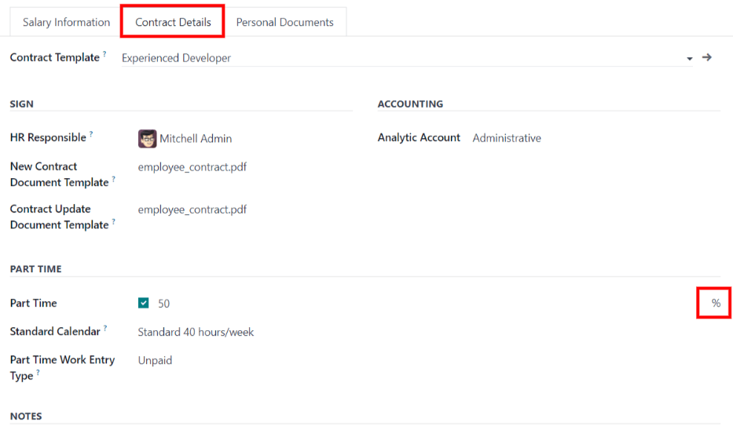
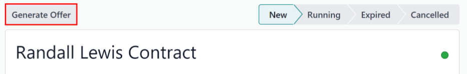
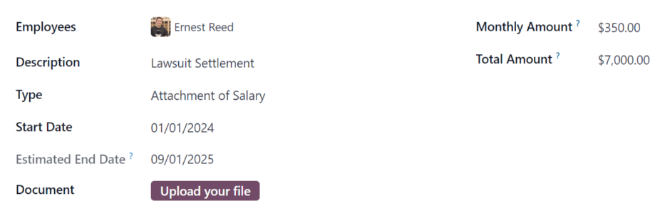

# Hợp đồng

Every employee in Odoo is required to have a contract in order to be paid. A contract outlines the
terms of an employee's position, their compensation, working hours, and any other details about
their position.

#### IMPORTANT
Contract documents (PDFs) are uploaded and organized using the *Documents* application, and are
signed using the *Sign* application. Ensure these applications are installed to send and sign
contracts. Please refer to the [Tài liệu](applications/productivity/documents.md) and
[Ký tên](applications/productivity/sign.md) documentation.

To view the employee contracts, go to the Payroll app ‣ Contracts ‣ Contracts
from the top menu. All employee contracts, and their current contract status, are displayed in a
Kanban view, by default. The Kanban view displays running contracts, contracts that require action,
expired contracts, and cancelled contracts.

#### NOTE
The list of contracts in the *Payroll* application matches the list of contracts in the
*Employees* application.

In order for an employee to be paid, an active contract is required. If a new contract is needed,
click the Create button on the Contracts dashboard. A contract form appears
where the information can be entered. Required fields are underlined in bold.

## New contract form

## Phần Thông tin chung

- Contact Reference: type in the name or title for the contract, such as `John Smith
  Contract`. This field is **required**.
- Employee: using the drop-down menu, select the employee that the contract applies to.
- Contract Start Date: the date the contract starts. To choose a date, click the
  drop-down menu, navigate to the correct month and year with the < > (arrow) icons,
  then click on the desired date. This field is **required**.
- Contract End Date: if the contract has a specific end date, click the drop-down menu,
  navigate to the correct month and year with the < > (arrow) icons, then click on the
  desired date.
- Working Schedule: select one of the working schedules from the drop-down menu. This
  field is **required**.
- Work Entry Source: select how the [work entries](applications/hr/payroll/work_entries.md) are generated.
  This field is **required**. Click the radio button next to the desired selection. The options are:
  - Working Schedule: work entries are generated based on the selected
    Working Schedule.
  - Attendances: work entries are generated based on the employee's check-in records in
    the *Attendances* application. (This requires the *Attendances* application).
  - Planning: work entries are generated based on the planned schedule for the employee
    from the *Planning* application. (This requires the *Planning* application).
- Salary Structure Type: select one of the salary structure types from the drop-down
  menu. The default salary structure types are Employee or Worker. A
  [new salary structure type](applications/hr/payroll.md#payroll-new-structure-type) can be created, if needed.
- Department: select the department the contract applies to from the drop-down menu.
- Job Position: select the specific job position the contract applies to from the
  drop-down menu.

  #### NOTE
  If the selected Job Position has a contract template linked to it with a specific
  Salary Structure Type, the Salary Structure Type changes to the one
  associated with that Job Position.
- Wage on Payroll: enter the employee's monthly wage.
- Contract Type: choose either Permanent, Temporary,
  Seasonal, Full-Time, or Part-Time from the drop-down menu.

- Contact Reference: type in the name or title for the contract, such as `John Smith
  Contract`. This field is **required**.
- Employee: name of the employee the contract applies to.
- Contract Start Date: the date the contract starts. Choose a date by clicking on the
  drop-down menu, navigating to the correct month and year by using the <i class="fa fa-chevron-left"></i>
  <i class="fa fa-chevron-right"></i> (arrow) icons, then clicking on the desired date. This field
  is **required**.
- Contract End Date: the date the contract ends. Choose a date by clicking on the
  drop-down menu, navigating to the correct month and year by using the <i class="fa fa-chevron-left"></i>
  <i class="fa fa-chevron-right"></i> (arrow) icons, then clicking on the desired date. This field
  is **required**.
- Salary Structure Type: select one of the salary structure types from the drop-down
  menu. The default salary structure types are Employee or Worker. A new
  salary structure type can be created by typing the name in the field. This field is **required**.
- Working Schedule: select one of the working schedules from the drop-down menu. This
  field is **required**.
- Department: the department the contract applies to.
- Job Position: the specific job position the contract applies to.
- Wage on Payroll: the amount to be paid to the employee each month.
- Contract Type: choose from CDI, CDD, or PFI from
  the drop-down menu.
  - CDI is an open-ended contract with only a start date, but no end date.
  - CDD is a contract with both a start date and an end date.
  - PFI is a Belgian-specific contract used when hiring employees that need training,
    and covers the training period specifically.
- HR Responsible: if there is a specific person in HR that is responsible for the
  contract, select the person from the drop-down menu. This field is required.

- Yearly Cost (Real): this field automatically updates after the Schedule
  Pay and Wage fields are entered. This amount is the total yearly cost for the
  employer. This field can be modified. However, if this is modified, the Wage field
  updates, accordingly. Ensure both the Wage and Yearly Cost (Real) are
  correct if this field is modified.
- Monthly Cost (Real): this field automatically updates after the Schedule
  Pay and Wage fields are entered. This amount is the total monthly cost for the
  employer. This field **cannot** be modified, and is calculated based on the Yearly
  Cost (Real).
  

## Contract Details tab

The Contract Details tab allows for the addition and editing of a contract, along with
specifying which template to use when a new contract is created. These fields **must** be populated
in order to create a new contract.

#### IMPORTANT
To access the various contract template fields in the Contract Details tab, the
*Salary Configurator* (`hr_contract_salary`) module **must** be [installed](applications/general/apps_modules.md#general-install).

When the *Salary Configurator* module is installed, the *Salary Configurator - Holidays* and
*Salary Configurator - Payroll* modules install, as well.

Once the modules are installed, the database reverts to the main dashboard.

- Contract Template: select a pre-existing contract template from the drop-down menu.
  Contract templates are typically created through the configuration menu, and stored in the
  *Documents* application.

### Sign section

- HR Responsible: select the person who is responsible for validating the contract from
  the drop-down menu. This field is required.
- New Contract Document Template: select a contract from the drop-down menu to be
  modified for this new employee contract. These documents are stored in the *Sign* application.
- Contract Update Document Template: select a contract from the drop-down menu, if the
  employee has an existing contract that requires updating. These documents are stored in the *Sign*
  application.

#### IMPORTANT
The HR Responsible, New Contract Document Template, and
Contract Update Document Template fields are only visible if the *Sign* application
is installed, along with the `hr_contract_salary` and `hr_contract_salary_payroll` [modules](applications/general/apps_modules.md). The *Sign* application is where the contract templates are stored.
This application is required for an employee to sign any contract.

### Accounting section

- Analytic Account: select the account the contract affects from the drop-down menu. It
  is recommended to check with the accounting department to ensure the correct account is selected.

### Part Time section

- Part Time: tick this box if the employee is working part-time. When active, additional
  fields appear:
  - % (Percentage): enter the percent of time the employee works as compared to a
    full-time employee.
  - Standard Calendar: select the working hours that a typical full-time worker uses
    from the drop-down menu.
  - Part Time Work Entry Type: select the work entry type that generates the balance of
    a full-time working schedule.

### Notes section

- Notes: a text field where any notes for the employee contract are entered for future
  reference.

- Analytic Account: this field allows a link between the contract and a specific
  analytic account for accounting purposes.
- Contract Template: select a pre-existing contract template from the drop-down menu.
  Contract templates are typically created through the *Recruitment* application.
- New Contract Document Template: select a contract from the drop-down menu to be
  modified for this new employee contract.
- Contract Update Document Template: select a contract from the drop-down menu, if the
  employee has an existing contract that requires updating.
- Notes: the notes field is a text field where any notes for the employee contract can
  be entered for future reference.

### Modify a contract template

Click the <i class="fa fa-external-link"></i> (external Link) icon at the end of either the
New Contract Document Template or Contract Update Document Template to open
the corresponding contract template, and proceed to make any desired changes.

Click the Upload your file button next to the corresponding document, navigate to the
file, then click Open to select the document and add it to the tab.

#### Modifying contract templates

Contracts templates can be modified at any point when changes are needed.

- Tags: select any tags associated with the contract.
- Signed Document Workspace: this is where the signatures are stored. Choose a
  pre-configured workspace, or create a new one. To create a new Signed Document
  Workspace, type in the name of the workspace, then click either Create to add the new
  workspace, or Create and Edit to add the workspace and modify the workspace details.
- Signed Document Tags: select or create any tags that are only associated with the
  signed contract, as opposed to the original unsigned contract.
- Redirect Link: enter a redirect link for the employee to access the contract. A
  redirect link takes the user from one URL to another. In this case, it takes them to the
  newly-updated contract specifically written for them.
- Who can Sign: select either All Users or On Invitation.
  - All Users: any user in the organization can sign the contract.
  - On Invitation: only users selected in this field can sign the contract.
- Invited Users: select the person (or people) that can sign the document.
- Document: the attached document can be replaced by clicking the <i class="fa fa-pencil"></i>
  (pencil) icon. A pop-up window appears, so another document can be selected for
  upload. The file **must** be a PDF. To remove the document, click the <i class="fa fa-trash-o"></i>
  (trash can) icon.

Once the edits are complete, click the Save button. All the information for the selected
contract template populates the fields in the Salary Information tab. Any additional
tabs, such as Personal Documents, appears if applicable.

## Salary information

This section is where the specific salary details are defined. This section is country-specific, so
these fields vary, depending on where the company is located.

Enter the amount in the various fields, or tick a checkbox to apply a benefit. Some options that can
be entered here include Group Insurance Sacrifice Rate and Canteen Cost, for
example.

Some fields may be automatically filled in as other fields are entered. For example, the
Yearly Cost (Real) and Monthly Cost (Real) updates once the Wage
is populated.

## Personal documents

This tab **only** appears after an Employee is selected, and houses any documents that
are linked to the employee on their employee record. Documents cannot be added to this tab, this tab
**only** shows documents that are already uploaded and associated with the employee.

The available documents in this tab can be downloaded. Click the <i class="fa fa-download"></i>
(download) icon next to the document to download it.

## Save and send the contract

Once a contract has been created and/or modified, save the contract by clicking the Save
button. Next, the contract must be sent to the employee to be signed.

Click on one of the following buttons to send the contract to the employee:

- Generate Simulation Link: this option is **only** for Belgian companies. Clicking this
  opens a pop-up window that contains the basic information from the contract, as well as a link for
  the contract when using the salary configurator. Click Send to send an email to the
  employee, so they can sign the contract.

At the bottom of the pop-up form is a Link Expiration Date. This is the timeframe that
the contract offer is valid for. By default, this field is pre-populated with `30 days`, but it can
be modified.

> #### NOTE
> In order to send a contract using the Generate Simulation Link, there **must** be a
> signature field in the contract PDF being sent to the employee, so they can sign it.
- Signature Request: clicking this reveals a pop-up window, where an email can be typed
  to the employee. Select the document (such as a contract, NDA, or Homeworking Policy) from the
  drop-down menu, and fill out the email section. Click Send when the email is ready to
  be sent.

#### NOTE
To send a contract using the Generate Simulation Link, there **must** be a signature
field in the contract PDF being sent to the employee, so they can sign it.

## Salary attachments

Any automatic deductions or allocations for an employee, such as child support payments and wage
garnishments, are referred to as a *salary attachment*. This section is where all of these
deductions or allocations are set.

To add a new deduction, first navigate to Payroll app ‣ Contracts ‣ Salary
Attachments. Next, click Create, and a new salary attachment form loads.

Fill out the following fields on the form:

- Employee: using the drop-down menu, select the employee the salary attachment applies
  to.
- Description: enter a short description for the salary attachment, such as `Child
  Support` or `529 Contribution`.
- Type: using the drop-down menu, select the type of salary attachment being created.
  Choose from:
  - Attachment of Salary: any payments taken out towards something that is *not* child
    support. Typically any garnishments, such as lawsuit payments, payments toward taxes owed, etc.
  - Assignment of Salary: any deduction that is not required, but voluntary, such as a
    pre-tax allocation to a college savings account.
  - Child Support: any payments taken out specifically for child support.
- Start Date: the date the salary attachment starts. Choose a date by clicking on the
  drop-down menu, navigating to the correct month and year by using the <i class="fa fa-chevron-left"></i>
  <i class="fa fa-chevron-right"></i> (arrow) icons, then clicking on the desired date. This field
  is **required**.
- Estimated End Date: this field automatically populates after both the
  Monthly Amount and Total Amount fields are populated. This field is
  **not** modifiable.
- Tài liệu: đính kèm các tài liệu liên quan đến khấu trừ lương. Nhấp nút Tải lên tệp của bạn, đi đến tài liệu mong muốn trong trình khám phá tệp, sau đó nhấp Mở để chọn tài liệu và đính kèm vào biểu mẫu. Để thay đổi tài liệu đã đính kèm, nhấp biểu tượng <i class="fa fa-pencil"></i> (bút chì) và chọn tài liệu khác. Để xóa tài liệu, nhấp biểu tượng <i class="fa fa-trash-o"></i> (thùng rác).
- Monthly Amount: enter the amount to be taken out of the employee's paycheck every
  month for this specific salary attachment.
- Total Amount: enter the total amount that the employee pays for the salary attachment
  to be completed.
