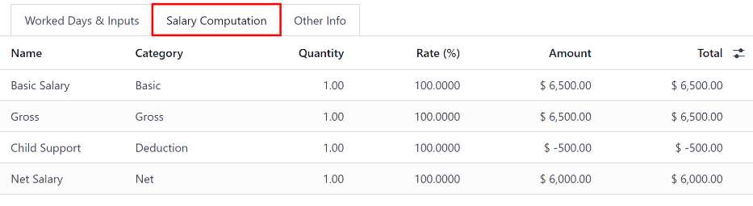
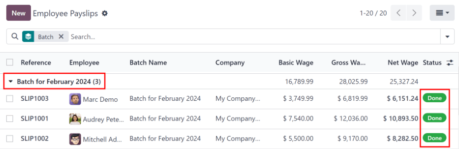

# Phiếu lương

_Payslips_ are created either by the employees themselves or their managers, and are approved by\
authorized employees (typically managers). Then, once payslips are approved, employees are issued\
payslips and are paid either by check or direct deposit, depending on how their employee profile is\
configured.

The Payslips drop-down header of the Payroll application consists of\
three sections: To Pay, All Payslips, and Batches.

These three sections provide all the tools needed to create payslips for employees, including\
individual payslips, a batch of payslips, or commission payslips.

## Cần thanh toán

Click on Payroll app ‣ Payslips ‣ To Pay to see the payslips that need to be\
paid. On this page, Odoo displays the payslips that have not been generated yet, and can be created\
from this dashboard.

Each payslip lists the Reference number for the individual payslip, the\
Employee name, the Batch Name, the Company, the Basic\
Wage, Gross Wage, Net Wage, and the Status of the payslip.

Click on an individual payslip entry to view the details for that individual payslip.

### Create a new payslip

A new payslip can be created from either the [Payslips To Pay](payslips.md#payroll-to-pay) page or the[Employee Payslips](payslips.md#payroll-all-payslips) page.

Create a new payslip by clicking the New button in the top-left corner.

A blank payslip form is loaded, where the necessary payslip information can be entered.

#### Payslip form

On the blank payslip form, several fields are required. Most of the required fields auto-populate\
after an employee is selected.

Fill out the following information on the payslip form:

*   Employee: type in the name of an employee, or select the desired employee from the\
    drop-down list in this field. This field is **required**.

  #### NOTE
  **Chỉ** nên tạo phiếu lương cho nhân viên đã có trong hệ thống. Nếu chưa có hồ sơ nhân viên (và do đó không có hợp đồng lao động), cần tạo nhân viên mới trong ứng dụng *Nhân viên* trước khi có thể tạo phiếu lương cho nhân viên đó. Tham khảo tài liệu về [nhân viên mới](../employees/new_employee.md) để biết hướng dẫn chi tiết về thêm một nhân viên.
- Period: the first day to the last day of the *current* month auto-populates the
  Period fields by default. The dates can be changed, if desired.

    **Chỉ** nên tạo phiếu lương cho nhân viên đã có trong hệ thống. Nếu chưa có hồ sơ nhân viên (và do đó không có hợp đồng lao động), cần tạo nhân viên mới trong ứng dụng _Nhân viên_ trước khi có thể tạo phiếu lương cho nhân viên đó. Tham khảo tài liệu về [nhân viên mới](applications/hr/employees/new_employee.md) để biết hướng dẫn chi tiết về thêm một nhân viên.
*   Period: the first day to the last day of the _current_ month auto-populates the\
    Period fields by default. The dates can be changed, if desired.

    To change the start date, click on the first date in the Period field to reveal a\
    pop-up calendar. On this calendar, use the < (less-than) and >\
    (greater-than) icons to select the desired month. Then, click on the desired day to select that\
    specific date.

    Repeat this process to modify the end date for the payslip. These fields are **required**.
* Contract: using the drop-down menu, select the desired contract for the employee. Only\
  the available corresponding contracts for the selected employee appear as options. This field is**required**.
* Batch: using the drop-down menu in this field, select the batch of payslips this new\
  payslip should be added to.
*   Structure: using the drop-down menu, select the salary structure type. Only the\
    corresponding structures associated with the selected contract for the employee appear as options.

    If no employee and/or no contract is selected yet, all available Structures appear in\
    the list. Once an employee and/or contract is selected, any unavailable Structures set\
    for that employee and/or contract do not appear. This field is **required**.

#### NOTE

Typically, after making a selection in the Employee field, Odoo auto-populates all\
other required fields (besides the Period field), but **only** if that information is\
already on that employee's form in the _Employees_ app.

#### IMPORTANT

If modifications to auto-populated fields are made, it is recommended to check with the\
accounting department to ensure every entry that affects the _Accounting_ application is correct.

**Worked days & inputs tab**

* Worked Days: the entries under Worked Days (including the\
  Type, Description, Number of Days, Number of\
  Hours, and Amount) are automatically filled in, based on what was entered for the\
  Period, Contract, and Structure fields of the payslip form.
*   Other Inputs: additional inputs affecting the payslip can be entered in this section,\
    such as deductions, reimbursements, and expenses.

    Click Add a line to create an entry in the Other Inputs section.

    Using the drop-down menu in the Type column, select a Type for the input.\
    Next, enter a Description, if desired. Lastly, enter the amount in the\
    Count field.

**Salary computation tab**

* Salary Computation: the Salary Computation tab is automatically filled in\
  after the Compute Sheet button is clicked. Doing so displays the wages, deductions,\
  taxes, etc. for the entry.
* Has Negative Net To Report: click the checkbox if the employee has a negative net\
  amount for this payslip. This **only** appears if the employee's payslip has a negative balance.

**Other info tab**

* Payslip Name: type in a name for the payslip in this field. The name should be short\
  and descriptive, such as `(Employee Name) April 2023`. This field is **required**.
* Company: select the company the payslip applies to using the drop-down menu in this\
  field. This field is **required**.
*   Close Date: enter the date that the payment is made to the employee in this field.

    Click in the field to reveal a calendar pop-up window. Using the < >\
    (less-than/greater-than) icons, navigate to the desired month and year.

    Then, click on the desired date to select it.
* Date Account: enter the date on which the payslip should be posted in this field.
* Salary Journal: this field auto-populates after selecting an existing\
  Employee. This field **cannot** be edited, as it is linked to the _Accounting_\
  application. This field is **required**.
* Accounting Entry: if applicable, this field is automatically populated once the\
  payslip is confirmed. This field **cannot** be modified.
* Add an Internal Note...: any note or reference message for the new entry can be typed\
  in this field.

#### Process the new payslip

When all the necessary information on the payslip is entered, click the Compute Sheet\
button. Upon doing so, all the information on the payslip is saved, and the Salary\
Computation tab auto-populates, based on the information on the employee's contract or attendance\
records.

If any modifications need to be made, first click the Cancel button, then click the\
Set to Draft button. Make any desired changes, then click the Compute Sheet\
button once again, and the changes are reflected in the Worked Days and\
Salary Computation tabs.

Once everything on the payslip form is correct, click the Create Draft Entry button to\
create the payslip.

Then, a confirmation pop-up window appears, asking Are you sure you want to proceed?.\
Click OK to confirm.

The chatter is automatically updated to show the email sent to the employee, along with a PDF copy\
of the payslip.

#### NOTE

The database may need to be refreshed for the payslip and email to appear.

To print the payslip, click the Print button. To cancel the payslip, click the\
Cancel button.

Tiếp theo, khoản thanh toán phải được gửi đến nhân viên. Để thực hiện, nhấp vào nút Ghi nhận thanh toán. Thao tác này sẽ hiển thị biểu mẫu bật lên, trong đó cần chọn Sổ nhật ký ngân hàng mong muốn để thực hiện thanh toán từ menu thả xuống. Sau đó, nhấp vào nút Xác nhận để xác nhận sổ nhật ký và quay lại phiếu lương.

#### IMPORTANT
Để một phiếu lương có thể được thanh toán, nhân viên *bắt buộc* phải có thông tin tài khoản ngân hàng trong phần thông tin liên hệ. Nếu không có thông tin ngân hàng, phiếu lương không thể thanh toán được và hệ thống sẽ hiển thị lỗi khi nhấp vào nút Thanh toán. Thông tin ngân hàng có thể được tìm thấy trong tab [Thông tin cá nhân](../employees/new_employee.md#employees-private-info) trên thẻ nhân viên trong ứng dụng *Nhân viên*. Chỉnh sửa thẻ nhân viên và thêm thông tin ngân hàng nếu thiếu.

Odoo automatically checks bank account information. If there is an error with the employee's listed
bank account, an error appears in a pop-up window, stating, *The employee bank account is
untrusted.* If this error appears, update the employee's bank account information on their
[Employee Form](../employees/new_employee.md#employees-private-info).

If a payment needs to be canceled or refunded, click the corresponding Cancel or\
Refund button, located at the top-left of the screen.

## All payslips

To view all payslips, regardless of status, go to Payroll app ‣ Payslips ‣ All\
Payslips. The Employee Payslips page loads, displaying all payslips, organized by\
batch, in a default nested list view.

Click on the ▶ (right arrow) next to an individual batch name to view all the payslips\
in that particular batch, along with all the payslip details.

The number of payslips in the batch is written in parenthesis after the batch name. The\
Status for each individual payslip appears on the far-right side, indicating one of the\
following status options:

* Draft: the payslip is created, and there is still time to make edits, since the\
  amounts are not calculated.
* Waiting: the payslip has been calculated, and the salary details can be found in th&#x65;_&#x53;alary Computation_ tab.
* Done: the payslip is calculated and ready to be paid.
* Paid: the employee has been paid.

Click on an individual payslip to view the details for that payslip on a separate page. Using the\
breadcrumb menu, click Employee Payslips to go back to the list view of all payslips.

A new payslip can be created from the Employee Payslips page, by clicking the\
New button in the upper-left corner. Doing so reveals a separate blank payslip form\
page. On that blank payslip form page, enter all the necessary information, as described in the[Create new payslips](payslips.md#payroll-new-payslip) section.

Để in bản PDF phiếu lương từ trang _Phiếu lương cần thanh toán_ hoặc Phiếu lương của nhân viên, trước tiên hãy chọn các phiếu lương mong muốn bằng cách nhấp vào hộp kiểm bên trái của từng phiếu lương cần in. Hoặc nhấp vào hộp kiểm bên trái tiêu đề cột Tham chiếu để chọn tất cả phiếu lương hiển thị trên trang. Sau đó, nhấp nút In để in các phiếu lương.

Payslips can also be exported to an Excel spreadsheet. To export **all** payslips, click on the\
⚙️ (gear) icon at the end of the words Employee Payslips in the top-left\
corner. This reveals a drop-down menu. Click Export All to export all payslips to a\
spreadsheet.

Để chỉ xuất những phiếu lương đã chọn, trước tiên hãy chọn các phiếu lương cần xuất từ danh sách. Sau đó, nhấp vào hộp kiểm ở bên trái mỗi phiếu lương để chọn phiếu lương đó. Khi chọn xong, một nút thông minh sẽ xuất hiện ở giữa phía trên của trang, cho biết số lượng phiếu lương đã chọn. Sau đó, nhấp vào biểu tượng ⚙️ (bánh răng) Tác vụ ở giữa phía trên của trang và chọn Xuất.

#### NOTE

Both _To Pay_ and _All Payslips_ display all the detailed information for each payslip.

## Lô

To view payslips in batches, navigate to Payroll app ‣ Payslips ‣ Batches to\
display all the payslip batches that have been created. These payslip batches are displayed in a\
list view, by default.

Each batch displays the Name, Date From and Date To dates, its\
Status, the number of payslips in the batch (Payslips Count), and the\
Company.

### Create a new batch

To create a new batch of payslips from the Payslips Batches page\
(Payroll app ‣ Payslips ‣ Batches), click the New button in the\
top-left corner. Doing so reveals a blank payslip batch form on a separate page.

On the new payslip batch form, enter the Batch Name.

Next, select the date range to which the batch applies. Click into one of the Period\
fields, and a calendar pop-up window appears. From this calendar pop-up window, navigate to the\
correct month, and click on the corresponding day for both the start and end dates of the batch.

The current company populates the Company field. If operating in a multi-company\
environment, it is **not** possible to modify the Company from the form. The batch**must** be created while in the database for the desired company.

### Process a batch

Click on an individual batch to view the details for that batch on a separate page. On this batch\
detail page, different options (buttons) appear at the top, depending on the status of the batch:

*   New status: batches without any payslips added to them have a status of\
    New. The following button options appear for these batches:

    > 
    >
    > * Add Payslips: click the Add Payslips button to add payslips to the\
    >   batch, and an Add Payslips pop-up window appears. Only payslips that can be added\
    >   to the batch (payslips not currently part of a batch) appear on the list.

    > Select the desired payslips by clicking the checkbox to the left of each payslip name, then\
    > click the Select button to add them to the batch. Once payslips are selected and\
    > added to the batch, the status changes to Confirmed.
    >
    > * Generate Payslips: after payslips have been added to the batch, click the\
    >   Generate Payslips button to process the payslips and create individual payslips in\
    >   the database.

    > A Generate Payslips pop-up window appears. If only a specific Salary\
    > Structure and/or specific Department is desired to make payslips for, select them\
    > from the corresponding drop-down menus. If no selections are made, then all payslips listed in\
    > the pop-up window are processed as usual.

    > Click the Generate button to create the payslips. The Generate Payslips\
    > button changes to a Create Draft Entry button, and the status changes to\
    > Confirmed.
* Confirmed status: batches that have been created and have payslips in them, but the\
  payslips have _not_ been processed, have a status of Confirmed. The following two\
  button options appear for these batches:
  * Create Draft Entry: click the Create Draft Entry button to confirm the\
    individual payslips (and the batch), and create a draft of the payslips. The batch now has a\
    status of Done.
  * Set to Draft: if at any point the batch needs to be reverted back to a status of\
    New, click the Set to Draft button. This action does **not** remove any\
    payslips that have already been added to the batch.
* Done status: batches with confirmed payslips in them have a status of\
  Done. The following button options appear for these batches:
  *   Create Payment Report: click the Create Payment Report button, and a\
      Select a bank journal pop-up window appears. Select the correct bank journal from\
      the drop-down menu.

      The batch name appears in the File name field, but this can be modified, if desired.\
      Finally, click Confirm to process the payslips, and pay the employees.
  *   Mark as paid: after the payments have been created via the Create Payment\
      Report button, the payslips need to be marked as paid in the database.

      Click the Mark as paid button, and the status of the batch changes to\
      Paid.
  * Set to Draft: if at any point the batch needs to be reverted back to a status of\
    New, click the Set to Draft button. This action does **not** remove any\
    payslips that have already been added to the batch.
* Paid status: batches that have been completed have a status of Paid. No\
  other button options appear for this status.

On the batch detail page, the individual payslips in the batch are accessible, via the\
Payslips smart button, located above the batch information, in the center. Click the\
Payslips smart button to view a list of all the individual payslips.

Use the breadcrumb menu to navigate back to the individual batch detail page, or back to the list of\
all batches.

### Generate warrant payslips

Commissions are paid to employees in Odoo using _warrant payslips_.

Warrant payslips can be generated directly from the Payslips Batches page\
(Payroll app ‣ Payslips ‣ Batches).

First, select the desired batches by clicking the box to the left of each batch for which commission\
payslips should be created. Next, click the Generate Warrant Payslips button at the top\
of the page.

Doing so reveals a Generate Warrant Payslips pop-up window, in which the necessary\
information **must** be filled out.

Trong cửa sổ bật lên này, hãy nhấp vào các menu thả xuống nằm bên cạnh trường Giai đoạn để hiển thị các cửa sổ bật lên lịch. Trên các cửa sổ bật lên lịch này, chọn giai đoạn mong muốn để tạo phiếu lương. Sử dụng các biểu tượng mũi tên < (trái) và > (phải) để điều hướng đến đúng tháng, sau đó nhấp vào ngày để chọn.

In the Department field, select the desired department from the drop-down menu.

When a department is selected, the employees listed for that department appear in the\
Employee section.

Under the Employee section, enter the Commission Amount for each employee in\
the far-right column. To remove an employee, click the 🗑️ (trash) icon to remove the\
line.

Add a new entry by clicking Add a Line, and entering the Employee and the\
appropriate Commission Amount.

Click the Upload your file button to add a file, if necessary. Any file type is\
accepted.

Once all the commissions are properly entered, click the Generate Payslips button to\
create the warrant payslips in a batch.

[Process the batch](payslips.md#payroll-batch-process) in the same way as a typical batch to complete the\
payment process.
