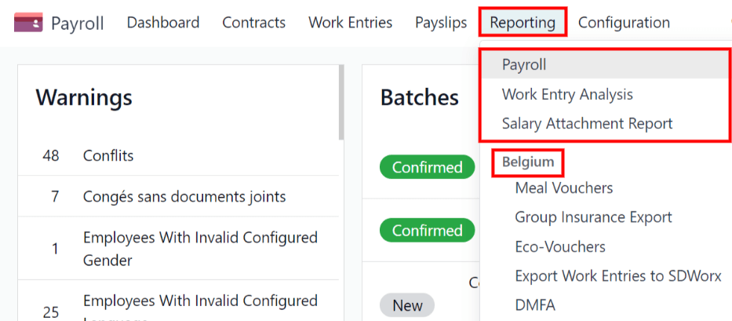
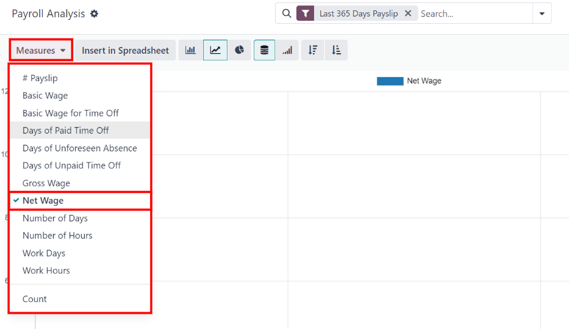
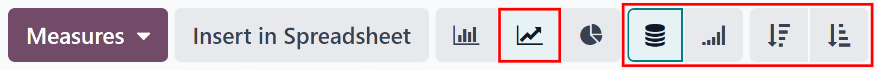
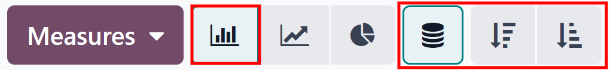
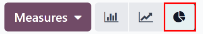
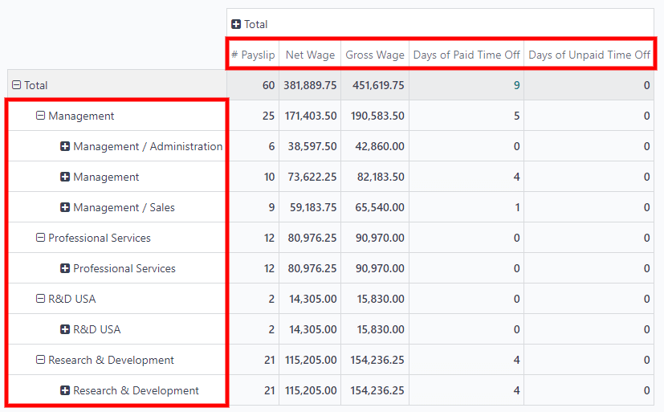
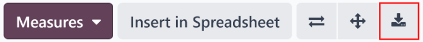
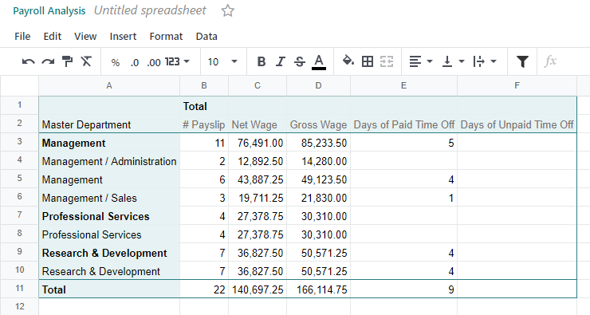

# Báo cáo

The *Reporting* section of the *Payroll* app offers a variety of reports to choose from, organized
by location.

The *Payroll* report, *Work Entry Analysis* report, and *Salary Attachment Report* are default
reports in the *Payroll* app, and are available for all companies, regardless of location.

Beneath the three default reports are all localization-based reports, organized by country, in
alphabetical order. These reports contain all the various information for the offered benefits and
local tax laws.

To view all the available reports for the database, including all the localization-specific ones,
navigate to Payroll app ‣ Reporting to view the available reports in a drop-down
menu. Click on a specific report to view it.

If a report is unavailable to a user, an Invalid Operation pop-up window appears,
stating: You must be logged in to a (country) company to use this feature, where
"(country)" is the specific country the company is configured for.

## Default reports

### Bảng lương

Click on Payroll app ‣ Reporting ‣ Payroll to display the Payroll
Analysis report. This report shows all the payslips generated in the last 365 days, due to the
default [filter](#payroll-filters): `Last 365 Days Payslip`.

The report can display metrics for a variety of parameters. Click the Measures box to
view a drop-down menu with the various metric options to display. The default options available
include:

- # Payslip
- Basic Wage
- Basic Wage for Time Off
- Days of Paid Time Off
- Days of Unforeseen Absence
- Days of Unpaid Time Off
- Gross Wage
- Net Wage
- Số ngày
- Phân tích công
- Work Days
- Work Hours
- Số

Net Wage is the default metric for the Payroll report.

#### Biểu đồ đường

A line chart is the default view for the *Payroll* report. If a different view is selected, click
the Line Chart button (represented by a 📈 (chart increasing) icon) in the
menu bar to change the view back to a line chart.

Several options are available for the line chart. Click the corresponding button to activate the
selection, and change the way the data is presented. These icons appear at the end of the chart
options. The various options are:

- Stacked: data is presented with each metric in its own line, "stacked" on top of each
  other. This helps visualize the distribution and variances between different categories.

- Cumulative: data is presented with each metric on an individual line, with the total
  amount calculated by combining all the lines. This provides a comprehensive view of the cumulative
  data.

- Descending: data is shown with the largest values on the left side of the chart,
  gradually decreasing towards the smallest values on the right side, along the x-axis. This
  arrangement helps emphasize trends or outliers at the extremes.

- Ascending: data is presented with the smallest values on the left side of the chart,
  increasing towards the largest values on the right side, along the x-axis. This arrangement can be
  useful for highlighting progressive growth or trends.

#### NOTE
These options can be combined to create a variety of views.

#### Biểu đồ cột

To display the data in a bar chart, click on the Bar Chart button (represented by a
📊 (bar chart) icon) in the menu bar.

Click the [Stacked](#payroll-stacked) icon to view the bar chart in a stacked format (where
multiple values appear in each column). [Cumulative](#payroll-cumulative) bar charts are useful
for visualizing the progression over time or other categories.

An option to display the columns in [Descending](#payroll-descending) or [Ascending](#payroll-ascending) order appears at the end of the options.

#### Biểu đồ tròn

To display the data in a pie chart, click on the Pie Chart button (represented by a
(pie chart) icon) in the menu bar. There are no additional options available in this
view.

#### Bảng pivot

To display the data in a pivot table, click on the Pivot button (represented by a
(pivot) icon) located in the far-right side of the top menu bar.

The default information displayed includes the number of payslips (# Payslip), the
Net Wage, the Gross Wage, the number of Days of Paid Time Off,
and the number of Days of Unpaid Time Off. The information is organized by department.

To display more information on the report, click the Measures button to reveal a
drop-down menu. Then, click on any other metric to display it on the pivot table.

To sort the entries by a specific column, such as Net Wage, click on the column name
twice. The first click selects the column, and the second click sorts the information in descending
order.

To export the data in an XLSX format, click the Download xlsx button, represented by a
⬇️ (down arrow above a horizontal bar) icon, located at the far-right of the available
icons. The information is then downloaded into a spreadsheet.

Bất kỳ báo cáo nào cũng có thể được chèn vào bảng tính bằng cách nhấp vào nút Chèn vào bảng tính. Một cửa sổ bật lên có tiêu đề Chọn một bảng tính để chèn (loại báo cáo) của bạn sẽ xuất hiện, yêu cầu chọn bảng tính để hiển thị thông tin. Chọn một bảng tính hoặc trang chủ hiện có, hoặc chọn một Bảng tính trống mới. Nhấp vào nút Xác nhận để chuyển sang chế độ xem bảng tính với báo cáo đã được thêm vào.

#### NOTE
If the **Documents** app is **not** installed, the Insert in Spreadsheet option
places the newly-created spreadsheet in the **Dashboards** app.

If the **Documents** application *is* installed, the spreadsheet has the option to be stored in
either the **Dashboards** app or **Documents** app.

## Bộ lọc

At the top of each report, the default filters are shown inside the Search... box.

Click the ⬇️ (down arrow) icon in the search bar to display the available
Filters. Filters show information that match the specific filter parameters.

All reports can include custom filters, or group information, by different metrics (employee,
department, company, etc.).

Some reports have the option to compare the current report to the previous time period or year (a
Comparison option).

Click on a parameter to select it and activate it. The report is immediately updated with the new
parameters.

The updated report can be set as a *favorite* report, meaning the parameters are stored for quick
access in the future. To do that, click Save the current search, under the
Favorites section, located in the search bar drop-down mega menu of filter options.
Doing so reveals two options and a Save button.

To set the current report as the default configuration when the report is accessed, check the box
next to Default filter. If the current report should be accessible to everyone in the
database, check the box next to Share.

Finally, click Save, which saves the currently configured report. Then, it appears
beneath the Favorites in the search bar drop-down mega menu of filter options.
