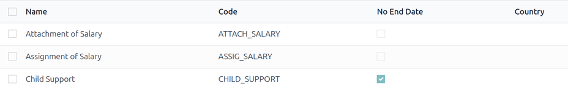
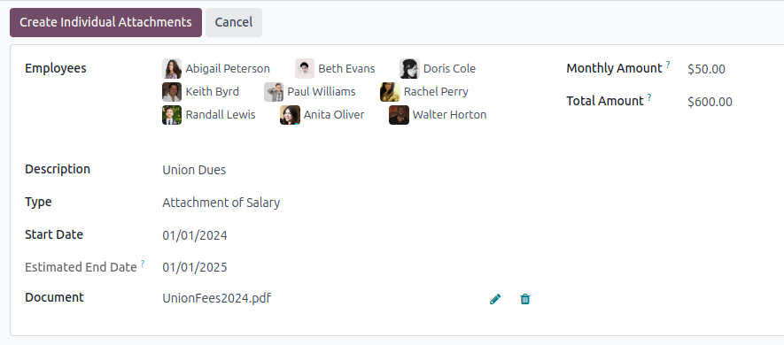

# Salary attachments

Salary attachments are portions of earnings taken directly out of a payslip for a specific purpose,
whether voluntary or required.

When the deduction is voluntary, they are typically considered *deductions*. When the deduction is
court-ordered, or involuntary, it is sometimes referred to as a *wage garnishment*. In Odoo, these
are all universally called, *salary attachments*.

## Salary attachment types

To view the currently configured salary attachment types, navigate to Payroll app
‣ Configuration ‣ Salary Attachment Types. The default salary attachment types are:
Attachment of Salary, Assignment of Salary, and Child Support.

Each salary attachment type displays the Name of the attachment type, the
Code used when calculating payslips, a checkbox to indicate if there is No
End Date, and whether it is Country specific (or universal).

### Create new salary attachment types

Để tạo loại khấu trừ lương mới, nhấp nút Mới, một biểu mẫu Loại khấu trừ lương trống sẽ được tải. Nhập Tên cho loại khấu trừ lương mới vào trường tương ứng. Tiếp theo, nhập Mã dùng trong quy tắc lương để tính toán phiếu lương. Cuối cùng, tích vào ô Không có ngày kết thúc nếu khấu trừ lương này không bao giờ hết hạn.

If in a multi-company database, with locations in multiple countries, a Country field
also appears on the Salary Attachment Types form. Select the country the attachment
applies to, or leave blank if it is universal.

## Create a salary attachment

All salary attachments must be configured separately for each employee, for each type of salary
attachment. To view the currently configured salary attachments, navigate to Payroll
app ‣ Contracts ‣ Salary Attachments.

All salary attachments appear in a default list view, and displays the name of the
Employees, Description, the salary attachment Type, the
Monthly Amount, Start Date, and current Status.

To create a new salary attachment, click the New button in the top-left corner, and a
blank Salary Attachment form loads. Enter the following information on the form:

- Employees: Using the drop-down menu, select the desired employees. Multiple employees
  can be listed in this field.
- Description: Enter a short description of the salary attachment.
- Type: Using the drop-down menu, select the specific [salary attachment type](#payroll-salary-attachment-types).
- Start Date: Using the calendar selector, select the date the salary attachment goes
  into effect.
- Estimated End Date: This field is **not** modifiable, and **only** appears after the
  Monthly Amount field is populated. This field is the estimated date when the salary
  attachment will be completed. Today's date populates the field by default. Then, when the
  Total Amount field is populated, this date is updated.
- Document: If any documentation is needed, such as a court order, click the
  Upload your file button, and a file explorer window loads. Select the desired document
  to attach it to the record. Only **one** document can be attached to a salary attachment.
- Monthly Amount: Enter the amount taken out of each paycheck every month in this field.
- Total Amount: This field **only** appears if the [salary attachment type](#payroll-salary-attachment-types) has no end date (the No End Date option is
  **not** ticked.)

Since the salary attachment form auto saves as the fields are populated, after making a salary
attachment for an individual employee, there is no further action required.

If creating salary attachments for multiple employees on a single salary attachment form, after the
form is filled out, click the Create Individual Attachments button. This creates
separate salary attachments for each of the employees listed in the Employees field.

Sau khi tạo các khoản khấu trừ lương riêng lẻ, màn hình sẽ quay lại trang chủ Khấu trừ lương, nhưng với bộ lọc Mô tả đã được điền thông tin từ biểu mẫu khấu trừ lương. Tất cả các khoản khấu trừ lương sẽ có trạng thái Đang hoạt động vì chúng hiện đang có hiệu lực. Xóa bộ lọc trong ô tìm kiếm để xem toàn bộ trang chủ Khấu trừ lương mặc định.

## Manage salary attachments

Salary attachments can have one of three statuses: *Running*, *Completed*, or *Canceled*. To view
the current status of all salary attachments, navigate to Payroll app ‣ Contracts
‣ Salary Attachments.

All salary attachments appear in the order they were configured. To view the salary attachments by
a particular metric, such as the Status, or Type, click on the column title
to sort by that specific column.

### Completed salary attachments

When a salary attachment is created, it has a status of Running. Once the salary
attachment is finished (the *Total Amount* entered on the [salary attachment form](#payroll-salary-attachment-create) has been paid in full), the status automatically changes to
*Completed*, and the employee no longer has the money taken out of future paychecks.

If a salary attachment has been fulfilled, but has not automatically changed to *Completed*, the
record can be manually updated. To change the status, open the *Salary Attachment* dashboard by
navigating to Payroll app ‣ Contracts ‣ Salary Attachments.

Click on the record to update, and the detailed Salary Attachment form loads. On the
individual Salary Attachment record, click the Mark as Completed button in
the upper-left corner, and the status changes to Completed.

### Cancel salary attachments

Any salary attachment can be cancelled at any time. To cancel a salary attachment, click on the
individual attachment record from the main Salary Attachment dashboard to open the
record. From the Salary Attachment record, click the Cancel button to cancel
the salary attachment, and stop having the designated money taken out of future paychecks.

#### SEE ALSO
[Salary attachment report](applications/hr/payroll/salary_attachment.md)
