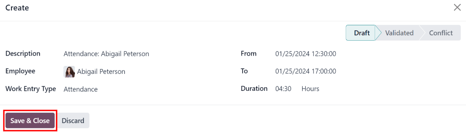
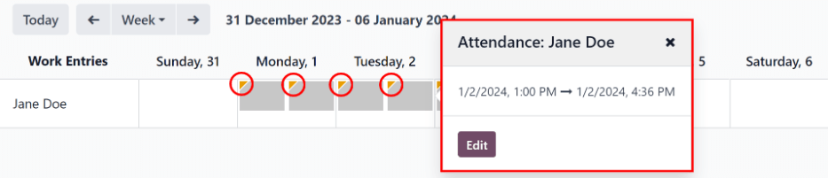
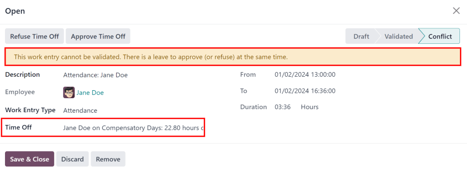
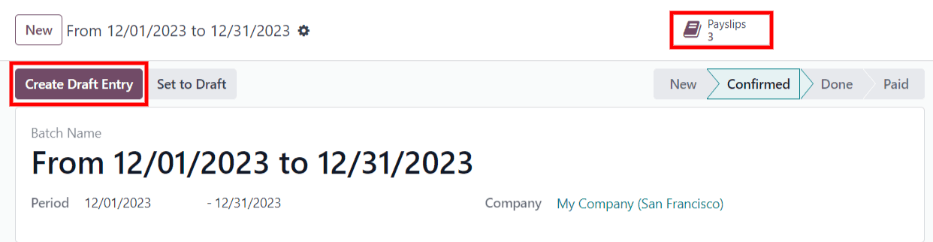
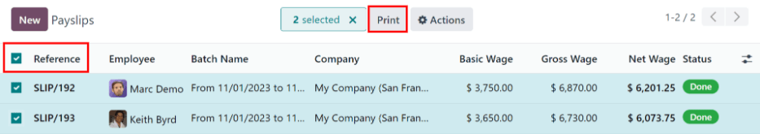

# Work entries

Work entries are created automatically in the *Payroll* app, based on the employee's [salary
structure type](../payroll.md#payroll-structure-types), and from the *Planning*, *Attendances*, and *Time Off*
applications.

The *Work Entries* dashboard of the *Payroll* application provides a visual overview of the
individual work entries for every employee.

To open the dashboard, navigate to Payroll app ‣ Work Entries ‣ Work Entries.

On the Work Entry dashboard, work entries appear in alphabetical order, based on the
first name of the employees. The entire month is displayed, with the current day highlighted in pale
yellow.

If any entries have [conflicts](#payroll-conflicts) that need to be resolved, the dashboard
defaults to filter only the Conflicting entries.

To remove the filter from the Search... bar to view all work entries, click the
✖️ (remove) icon on the Conflicting filter in the Search... bar,
and all work entries appear in the list.

To change the view, so only the entries for a single day, week, or month are shown, click on
Month. A drop-down menu appears with the options of Day, Week,
or Month. Click on one of the options to only display data for that specific selection.

Use the ⬅️ (left arrow) and ➡️ (right arrow) icons on the left and right
side of the Month button to adjust the displayed dates. The arrows adjust the date based
on the type of time selected.

For example, if Month is selected, the arrows move one month with each click of the
arrow. If Week or Day is selected, the time moves by either a week or a day
for each click of the arrow, respectively.

At any point, to return to a view containing the current day, click the Today button.

## Add a new work entry

If a work entry is missing and needs to be added, such as sick time, or if an employee forgot to
clock in and out for a shift, click New on the Work Entry dashboard, to
create a new work entry.

A Create work entry pop-up form appears.

Nhập thông tin sau đây trên biểu mẫu:

- Description: enter a short description for the work entry, such as `Sick Time`. If
  this field is left blank, it automatically populates once an employee is selected. The default
  entry is `Attendance: (Employee)`.
- Employee: select the employee the work entry is for, using the drop-down menu.
- Work Entry Type: select the [work entry type](../payroll.md#payroll-work-entries) using the
  drop-down menu.
- From and To: enter the start (From) and end (To)
  dates and times for the work entry.

  First, click on either the From or To line to reveal a calendar pop-up
  window. Select the date by navigating to the correct month and year, using the < (left
  arrow) and > (right arrow) icons, then click on the specific day.

  Next, select the time, by clicking on either the hour or minute fields at the bottom of the
  calendar, and select the desired time for both the hour and minutes.

  When the date and time are correct for the entry, click the Apply button.
- Duration: displays the hours based on the To and From entries.
  Modifying this field modifies the To field (the From field does not
  change).

Once the desired information is entered, click Save & Close to save the entry, and close
the pop-up form.

## Điểm không nhất quán

A conflict appears for any request that has not been approved, such as sick time or vacation, or if
there are any errors on the work entry, such as required fields being left blank. Conflicts are
required to be resolved before payslips can be generated.

Any work entry that has a conflict to be resolved is indicated on the main Work Entry
dashboard, which can be accessed by navigating to Payroll app ‣ Work Entries ‣
Work Entries. Only conflicts needing resolution are shown by default.

Conflicts are indicated with an orange triangle in the top-left corner of each individual work
entry. Click on an individual work entry to see the date and time for the specific work entry, then
click Edit to view the conflict details in a pop-up window.

The conflict is briefly explained in an orange text box in the Open pop-up window that
appears.

The Description, Employee, and Work Entry Type are listed on
the left side of the pop-up window. The From and To date and time range, as
well as the total time (in hours) in the Duration field, appears on the right side.

If the conflict is due to a time off request that has not been approved yet, a Time Off
field appears on the left side, with the type of time off requested in the description.

### Time off conflicts

The most common work entry conflicts are for time off requests that have been submitted, but not yet
approved, which results in duplicate work entries for that employee (one for time off and another
for regular work).

If there is a conflict because a time off request is in the system for the same time that a regular
work entry already exists, the time off request is entered in the Time Off field.

The time off conflict can be resolved either on the work entry pop-up window, or on a detailed time
off request pop-up window.

#### Resolve on work entry

To resolve the time off conflict on this work entry pop-up window, click the Approve Time
Off button to approve the time off request, and resolve the work entry conflict.

The Approve Time Off and Refuse Time Off buttons disappear. Click the
Save & Close button to close the pop-up window. The conflict disappears from the
Work Entry dashboard, since the conflict is resolved.

#### Resolve on time off request

To resolve the time off conflict on the detailed time off request pop-up window, click the
Internal Link button at the end of the Time Off entry line, and the time off
request details appear in a new pop-up window. The request can be modified, if needed.

Click the Approve button to approve the request, then click the Save & Close
button to save the changes, and go back to the work entry conflict pop-up window.

Now, the Approve Time Off button is hidden, only the Refuse Time Off button
is visible.

If the approval was a mistake, the request can be refused here, by clicking the Refuse
Time Off button.

Since the time off was approved in the time off window, click the X in the top-right
corner to close the window. The conflict disappears from the Work Entry dashboard, since
it has been resolved.

## Regenerate work entries

When regenerating work entries, any manual changes, such as resolved conflicts, are overwritten,
and work entries are regenerated (or recreated) from the applications that created them.

Phương pháp này để sửa một số lượng lớn xung đột được khuyến nghị nhằm đảm bảo tất cả bản ghi đều chính xác. Mặc dù [xung đột](#payroll-conflicts) *có thể* được xử lý riêng lẻ, nhưng nếu chúng được gây ra từ một ứng dụng khác, thì phương pháp tốt nhất là đảm bảo các bản ghi trong những ứng dụng đó cũng chính xác. Đó là lý do nên xử lý các xung đột này trong chính ứng dụng đã gây ra xung đột.

Another reason this method is recommended is because, when work entries are regenerated, the
conflicts reappear, if the issue in the related application is **not** resolved.

First, ensure the issues are resolved in the specific applications that caused the work entry
conflicts.

Next, click the Regenerate Work Entries button at the top of the Work
Entries dashboard, and a Work Entry Regeneration pop-up window appears.

Select the Employees to regenerate work entries for from the drop-down menu, and adjust
the From and To fields, so the correct date range is displayed.

Click the Regenerate Work Entries button, and the work entries are recreated. Once
finished, the pop-up window closes.

## Generating payslips

To generate payslips, [navigate to the time period](#payroll-adjust-view) the payslips should
be generated for. Ensure the Conflicting filter is removed. When the desired pay period
is displayed, click the Generate Payslips button.

When the Generate Payslips button is clicked, a batch entry appears on a separate page
for the time period selected.

The batch name populates the Batch Name field in a default `From (date) to (date)`
format.

The date range to which the payslips apply appears in the Period field, and the company
appears in the Company field. It is **not** possible to make changes to this form.

Click the Create Draft Entry button to create the payslips for the batch.

Click the Payslips smart button at the top of the page to view all the payslips for the
batch.

### Printing payslips

To print payslips, first view the individual payslips by clicking the Payslips smart
button on the batch form.

Next, select the payslips to print from the Payslips list. Click the box next to each
payslip to print, or click the box to the left of the Reference column title, to select
all the payslips in the list at once.

Click the Print button, and a PDF file is created with all the specified payslips.

#### NOTE
The Print button does **not** appear until at least one payslip is selected in the
list.

## Time off to report

If a time off request is submitted for a time period that was already processed on a payslip, the
time off request appears in the *Time Off* page in the *Payroll* app, which is accessible by
navigating to Payroll app ‣ Work Entries ‣ Time Off to Report.

On the Time Off page, the request appears with a status of To defer to next
payslip. This is because the employee was already paid for that day, and it was logged as time
spent at work, as a typical work day.

In order to keep the employee's time off balances correct, the time off request **must** be applied
to the following pay period. This not only ensures time off request balances are current, it also
eliminates the need to redo work entries, cancel paychecks, and reissue paychecks.

The most common scenario when this situation occurs, is when payslips are processed a day or two
before the pay period ends, and an employee is unexpectedly sick on one of the last days of the pay
period. The employee puts in a time off request for a day that was already processed on a payslip as
a regular work day. Instead of canceling the payslip, modifying the work entries, and reissuing the
paycheck, Odoo allows for those time off requests to be applied to the following pay period,
instead.

To view all the time off requests that need to be deferred to the next payslip, navigate to
Payroll app ‣ Work Entries ‣ Time Off to Report. The default filter for this
report is To Defer.

All time off requests that need to be applied to the following pay period appear with a
Payslip State of To defer to next payslip.

### Defer multiple time off entries

To select the work entries to defer, click the box to the left of the work entry line. To select all
work entries in the list, click the box to the left of the Employees column title, at
the top of the list.

Once any work entry is selected, two buttons appear at the top of the report: a (#)
Selected button, and an Actions button. The (#) Selected button indicates
how many entries are currently selected.

When all the desired work entries are selected, click the Actions button, and a menu
appears with several choices. Click Defer to Next Month in the list, and all selected
entries are deferred to the following month.

### Defer individual time off entries

Time off requests appearing on the Time Off to Report list can be deferred individually.

Click on an individual time off request, and the details for that request load.

The specific details for the time off request appear on the left-hand side, and all of the
employee's submitted time off requests appear on the right-hand side (including the request in the
details on the left-hand side).

To defer the time off request to the next payslip, click the Report to Next Month button
at the top. Once processed, the Report to Next Month button disappears, and the
Payslip State changes from To defer to next payslip to Computed
in Current Payslip.

To go back to the Time Off to Report list, click on Time Off in the
breadcrumb menu.

#### SEE ALSO
[Configure work entries](../payroll.md#payroll-work-entries-config)
