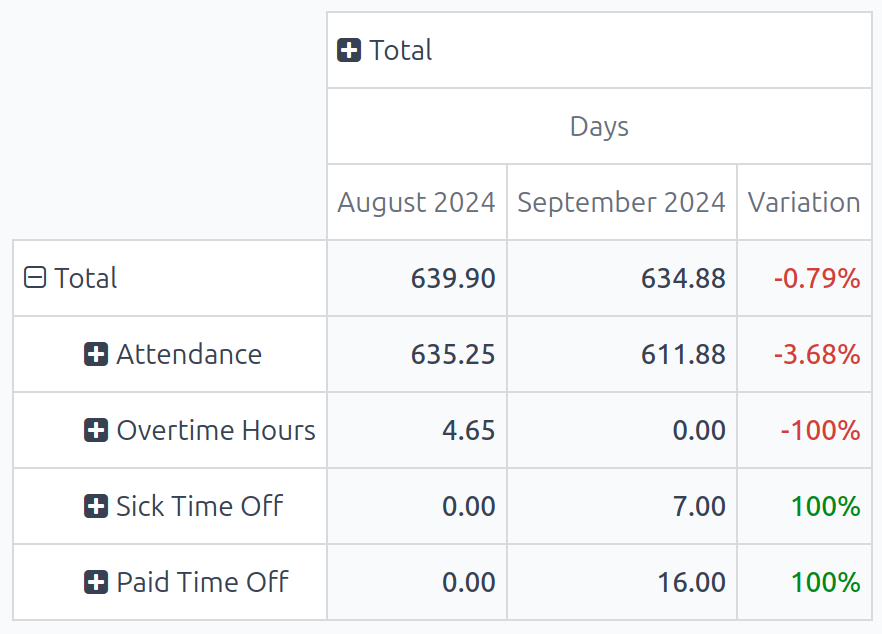
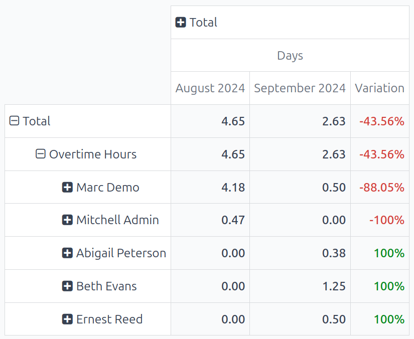

# Work entry analysis

The default *Work Entries Analysis* report provides an overview of the validated work entries for
the current month. To view this report, navigate to Payroll app ‣ Reporting ‣
Work Entry Analysis.

The work entries appear in a pivot table, with the default filters of Current month:
(Month)(Year) and Validated. The various types of [Work entries](work_entries.md) populate the
rows, while the Total values populate the only visible column.

To change the displayed information, click <i class="fa fa-plus-square"></i> Total above the main
column, revealing a drop-down menu of available metrics. Click on one of the available groupings,
and the data is further organized by that selected metric. The default options are Work
Entry Type, Employee, and Department. If in a multi-company database, a
Company option also appears.

## Work entry analysis comparison

It is possible to compare the work entries from one time period to a previous time period. To view
this comparison, first navigate to Payroll app ‣ Reporting ‣ Work Entry
Analysis.

Next, click the <i class="fa fa-caret-down"></i> (down arrow) icon in the search bar, revealing a
drop-down menu. Under the <i class="fa fa-adjust"></i> Comparison section, click on either
Current Month: Previous Period or Current Month: Previous Year.

The report updates and displays the data for the current time period, data for the selected previous
time period, as well as the Variation between the two, in a percentage.

#### NOTE
If no work entries for a specific [work entry type](../payroll.md#payroll-work-entries) are logged for
the time period, it does **not** appear on the report. That does **not** mean the work entry type
does not exist, or is not configured.

Additionally, if the default Current month: (Month)(Year) filter is removed from the
search bar, the Comparison column does **not** appear; there must be a time-frame
selected to view the Comparison column.

## Use case: overtime report comparison

It is possible to alter the *Work Entries Analysis* report to show a comparison of only overtime
work entries, grouped by employee, for a specific time period. To view this data, first navigate to
the default *Work entry analysis* report by going to Payroll app ‣ Reporting ‣
Work Entry Analysis.

Next, click the <i class="fa fa-caret-down"></i> (down arrow) icon in the search bar, revealing a
drop-down menu. Under the <i class="fa fa-filter"></i> Filters column, click Add Custom
Filter, and a Add Custom Filter pop-up window appears.

Using the drop-down menu, select Work Entry Type for the first field, leave the middle
field as-is (with is in populating the field), and select Overtime Hours for
the last field. Click Add, and all other work entry types disappear, and
Overtime Hours appear in the sole row.

To compare overtime from the current month to the previous month, to see which month had more
overtime logged, click the <i class="fa fa-caret-down"></i> (down arrow) icon again in the search
bar. Under the <i class="fa fa-adjust"></i> Comparison section, click Current Month:
Previous Period. Click away from the drop-down menu to close it.

Now, the report displays the Overtime Hours for the current month and the previous
month, along with the Variation, in a percentage.

To view which employees received the most overtime, click <i class="fa fa-plus-square"></i> Overtime
Hours, revealing a drop-down menu of options. Click Employee, and all employees with
overtime work entries for either the current or previous month appears.

In this example, it can be determined that Marc Demo worked the most overtime in
August 2024, whereas Beth Evans worked the most overtime hours in
September 2024. Additionally, Mitchell Admin had the largest variation
change, with a -100% change from August 2024 to September 2024.

