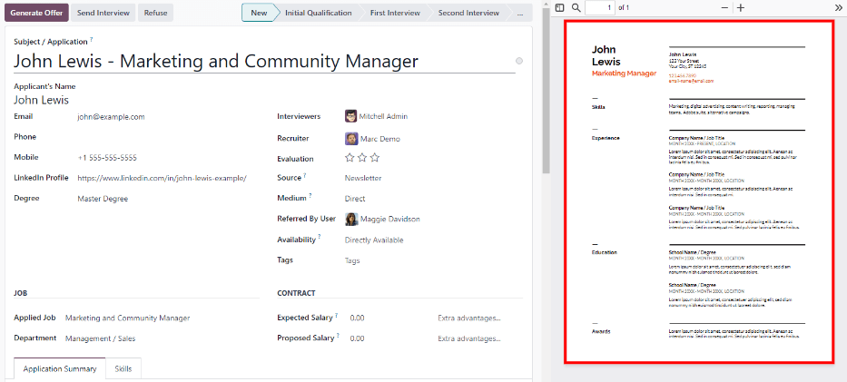
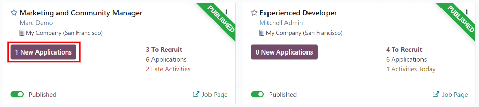
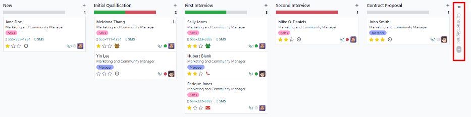
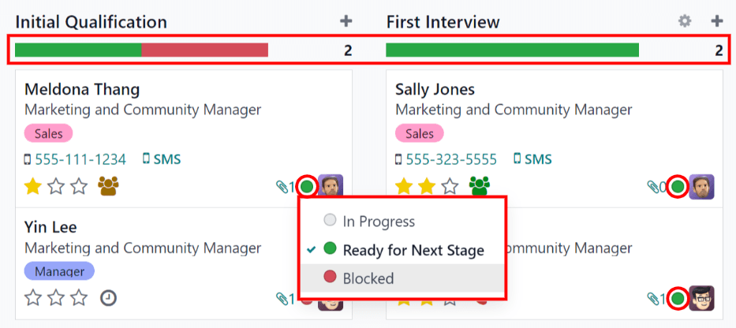
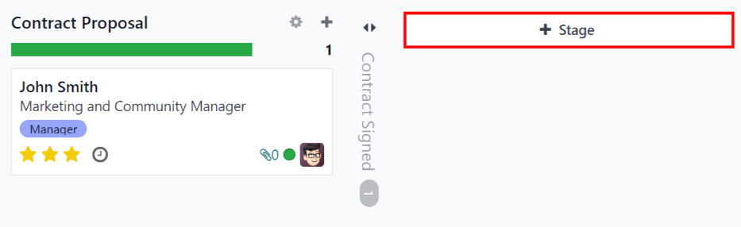
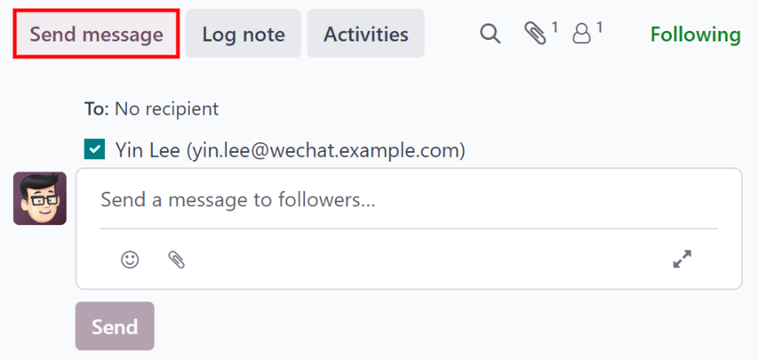

# Tuyển dụng

Odoo keeps all job applicants organized with a pre-configured series of steps and stages that each
applicant goes through. Each stage has a specific step(s) that should be performed. These range from
scheduling a phone call, conducting an interview, or sending a job offer, for example. This process
is referred to as the 'applicant flow.'

When an applicant applies for a job position, an *applicant card* is automatically created in Odoo's
*Recruitment* app for that specific job position. As the applicant progresses through the
recruitment pipeline, the recruitment team moves their card from one stage to the next.

[Stages can be configured](#recruitment-modify-stages) so that an email is automatically sent
out using a set, pre-configured template as soon as an applicant's card enters a stage. These
automated emails are defined on each stage in the applicant flow.

The applicant flow explained in this document is the default flow in Odoo, and goes through the
applicant flow when using the *Recruitment* application's default configuration. The applicant flow
is able to be modified to suit the specific recruitment flow for any business.

#### NOTE
Luồng ứng viên cùng với tất cả các giai đoạn của luồng này mang tính phổ quát và được áp dụng cho mọi vị trí tuyển dụng, trừ khi có quy định khác. Tuy nhiên, [một giai đoạn cụ thể có thể được cấu hình](#recruitment-customize-stages) để chỉ áp dụng cho một công việc cụ thể, nghĩa là giai đoạn đó chỉ hiển thị với vị trí công việc đó. Nếu không, bất kỳ giai đoạn mới nào được tạo ra, hoặc giai đoạn hiện có được chỉnh sửa, thì những thay đổi đó sẽ xuất hiện trên tất cả các vị trí tuyển dụng.

## Cài đặt

Before creating a job position in Odoo, configure the necessary settings for the *Recruitment* app.
To view and edit the settings, navigate to Recruitment app ‣ Configuration ‣
Settings. After any changes are made, click the Save button in the top-left corner to
save all the changes.

### Job posting

The Job Posting section of the *Recruitment* app settings has only one selection to
make. If job positions are to be posted to the company's website, enable the Online
Posting option.

#### NOTE
The Online Posting is only available if the *Website* application is also installed.

### Recruitment process

The Recruitment process section of the settings page specifies what the database can and
cannot do during the recruitment process.

#### Send interview survey

Odoo is capable of having a survey sent to an applicant to gather more information about them.
Surveys can be thought of as exams, or questionnaires, and can be customized in various ways to
provide the recruitment team with valuable insights into the applicant

Enable the Send Interview Survey option to send surveys to applicants. Once enabled, an
<i class="fa fa-arrow-right"></i> Interview Survey internal link appears. Click the
<i class="fa fa-arrow-right"></i> Interview Survey link to navigate to a list of all created
surveys.

This list includes all surveys that were created in the database, not just surveys used in the
*Recruitment* app. If no surveys have been created, the surveys list displays a No Survey
Found message, and presents options to create a survey from several pre-configured survey
templates.

#### SEE ALSO
For more detailed information about surveys, refer to the [survey essentials](../marketing/surveys/create.md) documentation.

#### NOTE
Enabling the Send Interview Survey option will install the *Surveys* application once
the settings are saved, if it is not installed already.

#### Gửi SMS

It is possible to send text messages to applicants directly through the *Recruitment* app. To do so,
enable the Send SMS option. This option requires credits to use, which can be obtained
by clicking the <i class="fa fa-arrow-right"></i> Buy credits internal link that emerges when the
feature is enabled.

#### SEE ALSO
For more information, refer to the [SMS pricing and FAQs](../marketing/sms_marketing/pricing_and_faq.md) documentation.

#### CV display

When applicants submit an application, one of the default required fields is a resumé, or . All resumés are stored in the *Documents* application, and are accessible on
the applicant's card.

CV có tùy chọn hiển thị trên mẫu đơn của ứng viên, có thể được xem bằng cách nhấp vào thẻ của ứng viên. Hồ sơ sẽ xuất hiện ở phía bên phải màn hình. Nếu không kích hoạt tùy chọn này, CV có thể được truy cập qua một liên kết trong cửa sổ trò chuyện, nơi cần nhấp vào để mở rộng và xem hoặc tải xuống.

Enable the CV Display option to show the resumé on the applicant's card by default, and
in addition to the document link. When enabled, the resumé appears on the right side of the
applicant's card.

#### NOTE
For the resumé to appear on the right-side, the browser window must be in full-screen mode (where
the browser spans the entire screen).

If the browser window is set to a size smaller than the entire width of the screen (not
full-screen), then the resumé does not appear on the right-side. Instead, the resumé appears in
the Files section of the chatter, below the applicant's card.

#### Số hóa CV (OCR)

Khi một đơn ứng tuyển được gửi bằng bất kỳ phương thức nào, chẳng hạn như nộp đơn online, gửi email sơ yếu lý lịch đến địa chỉ email của nhà tuyển dụng, hoặc tạo hồ sơ ứng viên trực tiếp từ cơ sở dữ liệu, Odoo có thể tự động trích xuất tên, số điện thoại và địa chỉ email của ứng viên từ sơ yếu lý lịch và điền vào biểu mẫu ứng viên. Để thực hiện điều này, hãy bật tùy chọn Số hóa CV (OCR).

When enabled, additional options appear. Click on the corresponding radio button to select one of
the following options:

- Do not digitize: this option turns off resumé digitization.
- Digitize on demand only: this option only digitizes resumes when requested. A
  Digitize document buttons appears on applicant cards. When clicked, the resumé is
  scanned and the applicant's card is updated.
- Digitize automatically: this option automatically digitizes all resumés when they are
  submitted.

Beneath these options are two additional links. Click the <i class="fa fa-arrow-right"></i> Buy
credits button to purchase credits for CV digitization. Click the <i class="fa fa-arrow-right"></i>
View My Services to view a list of all current services, and their remaining credit
balances.

For more information on document digitization and , refer to the
[In-app purchase (IAP)](../essentials/in_app_purchase.md) documentation.

#### NOTE
The Do not digitize option for CV digitization (OCR) at first may seem
like a redundancy. It seems to be the same as disabling the CV digitization (OCR)
option.

When the CV digitization (OCR) option is enabled, a module is installed so that
resumés can be scanned. Disabling this option would uninstall the module.

If at some point, there is a desire to temporarily stop digitizing resumés, the Do not
digitize option is selected. The reason this option is available is so that the module is not
uninstalled, allowing for digitization to be enabled in the future by selecting one of the other
two options.

#### Salary package configurator

When sending an offer to an applicant, an expiration date can be set on the offer. Enter the number
of days an offer is valid for in the days field. After the set amount of days has
passed, if the applicant has not accepted the offer, the offer is no longer available.

## Chế độ xem kanban

Để truy cập chế độ xem Kanban cho một vị trí tuyển dụng, hãy đi đến trang chủ của Ứng dụng Tuyển dụng - đây là chế độ xem mặc định khi mở ứng dụng. Tất cả các vị trí tuyển dụng sẽ hiển thị trên đây. Nhấp vào nút thông minh (#) Đơn ứng tuyển mới trên thẻ vị trí tuyển dụng để chuyển đến chế độ xem Kanban hiển thị tất cả ứng viên cho vị trí cụ thể đó.

Inside the job application, the Kanban stages appear, with all the applicants populated in their
respective columns, indicating what stage they are currently in. There are six default stages in
Odoo:

- [Mới](recruitment/recruitment-flow.md#recruitment-new)
- [Đánh giá sơ bộ](recruitment/recruitment-flow.md#recruitment-initial-qualification)
- [Phỏng vấn lần đầu](recruitment/recruitment-flow.md#recruitment-first-interview)
- [Phỏng vấn lần hai](recruitment/recruitment-flow.md#recruitment-second-interview)
- [Đề xuất hợp đồng](recruitment/offer_job_positions.md)
- [Hợp đồng được ký](recruitment/offer_job_positions.md#recruitment-offer-job-positions-contract-signed)

The last column, Contract Signed, is folded by default. Folded columns appear gray, and
the applicants in it are hidden from view. To expand the folded stage and view the applicant cards
for that column, click anywhere on the thin gray column that says the stage name and the column
expands, revealing the applicants.

Each stage has a color-coded bar beneath the stage name, providing status information for the
applicant's in that specific stage. The status colors are:

- Green: the applicant is ready to move to the next stage.
- Red: the applicant is blocked from moving to the next stage.
- Gray: the applicant is still in progress in the current stage and is neither ready nor
  blocked from the next stage.

The status for each card is set manually. To set the status, click on the small circle in the
lower-left of the applicant card. A status pop-up window appears. Click on the desired status for
the applicant. The status dot on the applicant card as well as the status bar updates.

## Customize stages

Stages can be modified, added, or deleted to best meet the needs of the particular hiring steps of
a business.

### New stage

Để tạo giai đoạn mới, nhấp vào <i class="fa fa-plus"></i> Giai đoạn và một cột mới sẽ xuất hiện. Nhập tiêu đề cho giai đoạn mới vào trường Tiêu đề giai đoạn, sau đó nhấp Thêm. Cột mới sẽ xuất hiện và bạn có thể tạo thêm giai đoạn mới khác. Nếu không cần tạo thêm giai đoạn nào nữa, nhấp vào bất kỳ đâu trên màn hình để thoát khỏi chế độ tạo giai đoạn mới.

### Modify stage

Để chỉnh sửa cài đặt của một giai đoạn, hãy di chuột lên tên của giai đoạn đó, biểu tượng <i class="fa fa-cog"></i> (bánh răng) sẽ xuất hiện ở góc trên bên phải. Nhấp vào biểu tượng <i class="fa fa-cog"></i> (bánh răng) này để mở menu, sau đó chọn Chỉnh sửa. Một biểu mẫu Chỉnh sửa: (Giai đoạn) sẽ hiện ra. Thực hiện các chỉnh sửa mong muốn trên biểu mẫu, rồi nhấp Lưu & đóng khi hoàn tất.

#### Edit stage form

The Edit: (Stage) form is where the stage's settings are configured. The only required
field is the Stage Name.

The fields to be populated or modified are:

- Stage Name: type in a name for the stage.
- Email Template: select an email template to be used from the drop-down menu. If a
  template is selected, when the applicant card enters the stage, an email is automatically sent to
  the applicant using the selected template.
- Folded in Kanban: check the box to have the stage appear folded (hidden) at all times
  in the default view.
- Hired Stage: check the box if this stage indicates that the applicant is hired. When
  an applicant's card enters this stage, the card displays a Hired banner in the upper
  right corner. If this box is checked, this stage is used to determine the hire date of an
  applicant.
- Job Specific: if the stage only applies to specific job positions, select the job
  positions from the drop-down menu. Multiple job positions can be selected.
- Hiển thị trong Giới thiệu: tích vào ô này nếu giai đoạn này cần hiển thị trong ứng dụng *Giới thiệu* và cho phép người giới thiệu tích lũy điểm khi ứng viên của họ đạt đến giai đoạn này. Nếu được kích hoạt, trường Điểm sẽ xuất hiện. Nhập số điểm giới thiệu nhân viên nhận được khi ứng viên vào giai đoạn này. Ứng dụng *Giới thiệu* phải được cài đặt để sử dụng tùy chọn này.
- Tooltips section: there are three pre-configured status labels (colored circles) for
  each applicant's card, indicating its status. These colors are displayed at the top of each stage
  to reflect the statuses of the applicants in the stage. The *names* for the label can be modified,
  but the label itself (the color) cannot. The default names and labels are: In Progress
  (gray), Blocked (red), and Ready for Next Stage (green).
- Requirements: enter any internal notes for this stage explaining any requirements of
  the stage.

### Delete stage

Nếu một giai đoạn không còn cần thiết, bạn có thể xóa giai đoạn đó. Để xóa một giai đoạn, di chuột qua tên giai đoạn và một biểu tượng <i class="fa fa-cog"></i> (bánh răng) sẽ xuất hiện. Đầu tiên, nhấp vào biểu tượng <i class="fa fa-cog"></i> (bánh răng) để hiển thị một menu thả xuống, sau đó nhấp vào Xóa. Một cảnh báo bật lên Xác nhận sẽ xuất hiện để hỏi Bạn có chắc chắn muốn xóa cột này không? Nhấp vào Xóa để xóa cột.

#### IMPORTANT
If there are applicants currently in the stage being deleted, an error pops up when attempting to
delete the stage. The records currently in the stage to need to be either deleted, archived, or
moved to a different stage before the stage can be deleted.

## Mẫu Email

To communicate with the applicant, Odoo has several pre-configured email templates that can be used.
The pre-configured email templates and when to use them are as follows:

- Recruitment: Applicant Acknowledgement: this template is used to let the applicant
  know that their application was received. This email is automatically sent out once the applicant
  is in the New stage.
- Recruitment: Interest: this template is used to let the applicant know that their
  application caught the recruiter's attention, and they have been shortlisted for either a phone
  call or an interview.
- Recruitment: Schedule Interview: this template is used to let the applicant know that
  they have passed the Initial Qualification stage and they will be contacted to set up
  an interview with the recruiter. This email is automatically sent out once the applicant is in the
  Initial Qualification stage.
- Recruitment: Not interested anymore: this template is used when an applicant
  communicates that they are no longer interested in the position, and thanks them for their time
  and consideration.
- Recruitment: Refuse: this template is used when an applicant is no longer being
  considered for the position.

#### NOTE
Email templates can be created, modified, and deleted to suit the needs of a business. For more
information on email templates, refer to the [Mẫu Email](../general/companies/email_template.md) document.

To manually send an email, click Send message in the chatter. A text box appears, as
well as the applicant's email address.

Click the <i class="fa fa-expand"></i> (expand) full composer icon in the bottom right corner of
the Send Message tab in the chatter. A Compose Email pop-up window loads,
with the Recipients and Subject pre-populated. The applicant's email address
is entered in the Recipients line, and the Subject is `(Job Position)`. The
email body is empty by default.

To use a pre-configured email template, click the field next to Load template in the
bottom section of the window. Select the email template to use from the drop-down menu.

Pre-configured email templates may contain dynamic placeholders so unique information can be
populated in the email for a more personalized message to the applicant. There are several
pre-configured email templates to choose from. Depending on the template selected, the email subject
and/or body may change.

#### NOTE
Only the email templates that are configured for the model load. There are other email templates
pre-configured in Odoo, but if they are not configured for the recruitment application, they do
not appear in the list of available templates.

If any attachments are to be added, click the Attachments button in the lower left
corner. Navigate to the file to be attached, then click Open to attach it. To delete an
attachment, click the <i class="fa fa-close"></i> (delete) icon to the right of the attachment.

Nếu cần thay đổi nội dung email, hãy chỉnh sửa phần thân email. Nếu muốn lưu các thay đổi để sử dụng sau này, có thể lưu email dưới dạng mẫu mới. Nhấp nút Lưu mẫu ở phía dưới. Để gửi email, nhấp Gửi và email sẽ được gửi đến ứng viên. Sau đó, email sẽ xuất hiện trong cửa sổ trò chuyện.

#### SEE ALSO
- [Job positions](recruitment/new_job.md)
- [Add new applicants](recruitment/add-new-applicants.md)
- [Schedule interviews](recruitment/schedule_interviews.md)
- [Offer job positions](recruitment/offer_job_positions.md)
- [Refuse applicants](recruitment/refuse_applicant.md)
- [Source analysis reporting](recruitment/source_analysis.md)
- [Recruitment analysis](recruitment/recruitment_analysis.md)
- [Time in stage analysis](recruitment/time_in_stage.md)
- [Team performance reporting](recruitment/team_performance.md)

* [Job positions](recruitment/new_job.md)
* [Recruitment flow](recruitment/recruitment-flow.md)
* [Add new applicants](recruitment/add-new-applicants.md)
* [Schedule interviews](recruitment/schedule_interviews.md)
* [Offer job positions](recruitment/offer_job_positions.md)
* [Refuse applicants](recruitment/refuse_applicant.md)
* [Source analysis reporting](recruitment/source_analysis.md)
* [Recruitment analysis](recruitment/recruitment_analysis.md)
* [Time in stage analysis](recruitment/time_in_stage.md)
* [Team performance reporting](recruitment/team_performance.md)
