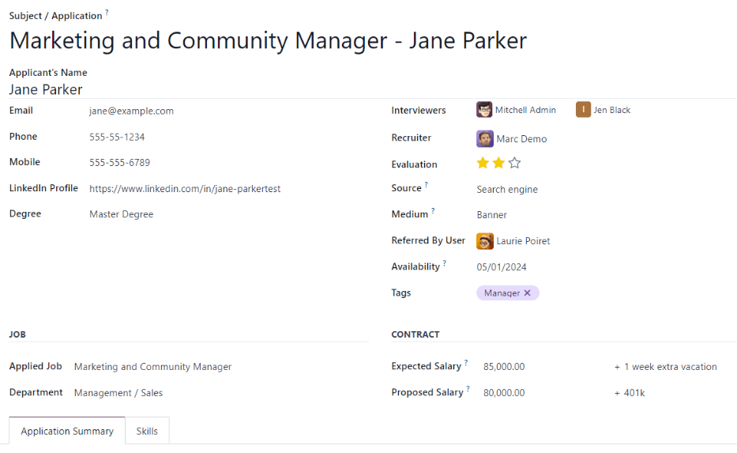

# Add new applicants

Once an applicant submits an application, either using the online application, or emailing a job
position alias, an applicant card is automatically created in the *Recruitment* application.

However, in some instances, applicants may need to be created manually in the database. This could
be necessary if, for example, a company accepts paper applications in the mail, or is meeting
prospective applicants at an in-person job fair.

To view current applicants, navigate to the Recruitment app, then click the desired
job position card. Doing so reveals the Applications page, which displays all
applicants for that specific role, in a default Kanban view, organized by stage.

Add new applicants from a job position's Applications page by using either: the
[New](#recruitment-create-new-applicant) button or the [quick add](#recruitment-quick-add-applicant) button.

## Thêm nhanh

On the Applications page, click the on the quick add button, represented by a small
<i class="fa fa-plus"></i> (plus) icon in the top-right corner of each stage to quickly add a new
applicant to that stage.

Enter the following information on the card:

- Subject/Application: enter the title for the card. Typically, this is the applicant's
  name, and job position being applied to. For example: `Laura Smith - HR Manager`. The text entered
  in this field is **not** visible in the Kanban view of the Applications page, unless
  the Applicant's Name field is left blank.
- Applicant's Name: enter the applicant's name. Displays as the card title in the
  Kanban view of the Applications page.
- Email: enter the applicant's email address.
- Applied Job: the current job position populates this field. If needed, the job
  position can be changed by selecting a different position from the drop-down menu. If a different
  job position is selected, after the card is created, the card appears on the
  Applications page for that newly-selected job position.

After the information is entered, click Add. The applicant appears in the list, and a
new blank applicant card appears.

If preferred, after entering the Applicant's Name in the Kanban card that appears, click
Edit, and a detailed applicant form loads. Refer to the [New applicant form](#recruitment-applicant-details) section for details about filling out the form.

When doing a quick add, clicking away from an empty card, or clicking the <i class="fa fa-trash-o"></i>
(trash) icon, discards the applicant.

## New applicant form

On the new applicant form, the Subject / Application field is populated with the
pre-selected job position, by default. Certain fields on the applicant card may also be
pre-populated, depending on how the job position is configured. Typically, the Job
section, as well as the Recruiter field, are pre-populated.

Complete the fields in the following sections on the new applicant form.

#### NOTE
Depending on installed applications and configurations, some fields may **not** be displayed.

### Applicant section

- Tiêu đề/Tên đơn ứng tuyển: đây là trường bắt buộc **duy nhất**. Nhập tiêu đề cho thẻ vào trường này. Thông thường, đây là tên ứng viên và vị trí công việc ứng tuyển. Ví dụ: `Nguyễn Văn A - Lập trình viên Kinh nghiệm`. Trường này **không** hiển thị trong chế độ xem Kanban của trang Đơn ứng tuyển, trừ khi trường Tên ứng viên được để trống.
- Applicant's Name: enter the applicant's name. This field is displayed as the card
  title in the Kanban view of the Applications page.
- Email: enter the applicant's email address.
- Phone: enter the applicant's phone number.
- Mobile: enter the applicant's mobile number.
- LinkedIn Profile: enter the web address for the applicant's personal profile on
  LinkedIn.
- Degree: select the applicant's highest level of education from the drop-down menu.
  Options are: Graduate, Bachelor Degree, Master Degree, or
  Doctoral Degree. The Graduate option indicates the applicant graduated at
  the highest level of school before a Bachelor's degree, such as a high school or secondary school
  diploma, depending on the country.
- Interviewers: using the drop-down menu, select the people to conduct the interviews.
  The selected people **must** have either *recruiter* or *officer* rights configured for the
  *Recruitment* application to appear in the drop-down list. Refer to the [Access rights](applications/general/users/access_rights.md) documentation for more information.
- Recruiter: select the user responsible for the entire recruitment process for the job
  position.
- Evaluation: represents a rating for the applicant: one star (<i class="fa fa-star"></i>
  <i class="fa fa-star-o"></i> <i class="fa fa-star-o"></i>) is Good, two stars (<i class="fa fa-star"></i>
  <i class="fa fa-star"></i> <i class="fa fa-star-o"></i>) is Very Good, and three stars (<i class="fa fa-star"></i>
  <i class="fa fa-star"></i> <i class="fa fa-star"></i>)is Excellent.
- Source: using the drop-down menu, select where the applicant learned about the job
  position. The following options come pre-configured in Odoo: Search engine,
  Lead Recall, Newsletter, Facebook, Twitter,
  LinkedIn, Monster, Glassdoor, and Craigslist. To
  add a new Source, type in the source, then click Create "(new source)".
- Medium: using the drop-down menu, specify how the job listing was found. The
  pre-configured options are: Banner, Direct, Email,
  Facebook, Google Adwords, LinkedIn, Phone,
  Television, Twitter (now known as "X"), or Website. To add a
  new Medium, type in the medium, then click Create "(new medium)".
- Referred By User: if referral points are to be earned for this job position in the
  *Referrals* application, select the user who referred the applicant from the drop-down menu. The
  *Referrals* application **must** be installed for this field to appear.
- Thời gian bắt đầu làm việc: chọn ngày bắt đầu có thể làm việc của ứng viên. Để chọn ngày, nhấp vào trường để hiển thị lịch bật lên. Sử dụng các mũi tên <i class="fa fa-angle-left"></i> (trái) và <i class="fa fa-angle-right"></i> (phải) ở hai bên tháng để điều hướng đến tháng mong muốn, sau đó nhấp vào ngày cần chọn. Nếu để trống trường này có nghĩa là ứng viên có thể bắt đầu làm việc ngay lập tức.
- Tags: select as many tags as desired from the drop-down menu. To add a tag that does
  not exist, type in the tag name, then click Create "new tag" from the resulting
  drop-down menu.

### Job section

The following fields are pre-populated when creating a new applicant, as long as these field are
specified on the job position form. Editing the fields is possible, if desired.

- Applied Job: select the job position the applicant is applying to from the drop-down
  menu.
- Department: select the department the job position falls under from the drop-down
  menu.
- Company: select the company the job position is for using the drop-down menu. This
  field **only** appears when in a multi-company database.

### Contract section

- Expected Salary: enter the amount the applicant is requesting in this field. The
  number should be in a `XX,XXX.XX` format. The currency is determined by the localization setting
  for the company.
  - Extra advantages...: if any extra advantages are requested by the applicant, enter
    it in the Extra advantages... field to the right of the Expected Salary
    field. This should be short and descriptive, such as `1 week extra vacation` or `dental plan`.
- Proposed Salary: enter the amount to be offered to the applicant for the role in this
  field. The number should be in a `XX,XXX.XX` format.
  - Extra advantages...: if any extra advantages are offered to the applicant, enter it
    in the Extra advantages... field to the right of the Proposed Salary
    field. This should be short and descriptive, such as `unlimited sick time` or `retirement plan`.

### Application Summary tab

Any additional details or notes that should be added to the applicant's card can be typed into this
field.

### Tab kỹ năng

Skills can be added to the applicant's card. For details on adding skills, refer to the
[Create new employees](applications/hr/employees/new_employee.md#employees-skills) document.
