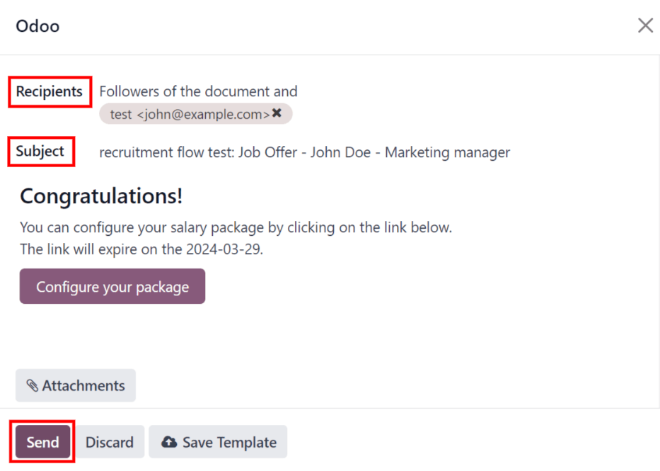

# Offer job positions

Once an applicant has successfully passed the various interview stages, the recruitment team is
ready to send an offer for employment. The next step is to send the applicant a contract.

#### SEE ALSO
Refer to the [recruitment](applications/hr/recruitment.md) documentation for details on the various stages
of the recruitment process.

## Contract proposal

When an offer is ready to be sent, first open the applicant's card by navigating to the
Recruitment app, and clicking on the desired job position card.

From the resulting Job Positions Kanban view, the corresponding applicant card can be
dragged-and-dropped to the Contract Proposal stage. Or, click into the desired
applicant's card, and click the Contract Proposal stage, located in the status bar in
the top-right of the applicant's form.

The next step is to send an offer to the applicant. Start by selecting the desired applicant's card
to open their applicant form.

On the applicant's form, click the Generate Offer button. A Generate a
Simulation Link pop-up window appears.

Most fields are pre-populated with information from the job position. If any necessary fields are
blank, or if any information needs to be updated, enter, or update, the relevant information in the
corresponding fields.

#### NOTE
Depending on the localization setting for the company, and which applications are installed, some
fields may not appear in the Generate a Simulation Link pop-up window.

For example, if the *Fleet* application is **not** installed, any fields related to vehicles do
**not** appear.

### Universal fields

The following fields appear in the Generate a Simulation Link pop-up window, regardless
of the localization.

- Contract Template: the template currently being used to populate the
  Generate a Simulation Link pop-up window. Use the drop-down menu to select a different
  Contract Template, if desired.

  #### NOTE
  To modify the template, hover over the current template name, and click the <i class="oi oi-launch"></i>
  Internal link icon that appears to the right of the field. Make any desired
  changes, then click Save & Close.
- Job Position: the name of the Job Position being offered to the applicant.
  The selections available in the drop-down menu correspond to the job position configured on the
  main *Recruitment* dashboard.
- Job Title: the selected Job Position populates this field, by default.
  The title can be modified to suit the specific applicant's position and provide more details.
- Department: the department the job position falls under.
- Contract Start Date: the date the contract takes effect. The default date is the
  current date. To modify the date, click on the displayed date to reveal a calendar popover window.
  Navigate to the desired month, then click the day to select the date.
- Yearly Cost: the annual salary being offered.
- Link Expiration Date: the number of days the job offer is valid. The default
  expiration date is `30` days. Modify the expiration date, if desired.

### Send offer

Once the Generate a Simulation Link pop-up window is complete, click Send By
Email to reveal an email pop-up window.

#### IMPORTANT
Nếu ứng viên không có địa chỉ email trên thẻ ứng viên của họ, một cảnh báo sẽ xuất hiện trong hộp màu đỏ ở cuối cửa sổ bật lên Tạo liên kết mô phỏng, nêu rõ: Ứng viên không có email hợp lệ. Liên kết đề xuất sẽ không thể hoàn tất. Nhấp vào Hủy, sau đó nhập email vào thẻ của ứng viên. Sau khi nhập email, nhấp vào nút Tạo đề xuất và cửa sổ bật lên email sẽ tải lại.

The default Recruitment: Your Salary Package email template is used (set in the
Load template field), and the Recipients, Subject, and email
body are pre-populated based on the email template.

If any attachments need to be added, click the <i class="fa fa-paperclip"></i> Attachments button,
and a file explorer window appears. Navigate to the desired file, then click Open to
attach it to the email. The attachment loads, and is listed above the <i class="fa fa-paperclip"></i>
Attachments button.

Once the email is ready to send, click Send. The email pop-up window closes, and an
Offers smart button appears at the top of the applicant's card.

#### NOTE
To send an offer, ensure the *Sign* application is installed. This is necessary, so the offer can
be sent to the applicant by the recruiter, and they can actually sign the offer. The applicant
does **not** need any software installed to sign the offer.

### Configure your package

If applicable, the applicant can modify their salary package. This option is not available for all
localizations. Depending on where the company is located, this option may not be available.

The email template includes a Configure your package button. This link takes the
applicant to a webpage, where they can modify the proposed salary package, and enter their personal
information.

Once the applicant is hired, the personal information entered on the webpage is imported to their
employee record, when created.

Once all the information is completed, the applicant can then accept the offer by clicking the
Review Contract & Sign button to accept the contract, and sign it using the *Sign*
application.

## Contract signed

Once the applicant has accepted the offer and signed the contract, the next step is to move the
applicant to the Contract Signed stage. This stage is folded in the Kanban view, by
default.

To move the applicant to that stage, drag-and-drop the applicant's card to the Contract
Signed stage. If the stage is not visible, click the <i class="fa fa-ellipsis-h"></i> (ellipsis)
button to the right of Contract Proposal on the applicant's form, and click
Contract Signed from the resulting drop-down menu.

Once the applicant is moved to the Contract Signed stage, a green HIRED
banner appears in the top-right of the applicant's card and form.

## Create employee

Once the applicant has been hired, the next step is to create their employee record. Click the
Create Employee button in the top-left corner of the hired applicant's form.

An employee form appears, with information from the applicant's card, and the employee contract.

Fill out the rest of the employee form. For detailed information on the fields, refer to the
[Nhân viên mới](applications/hr/employees/new_employee.md) documentation.

Once completed, the employee record is saved in the *Employees* app.
