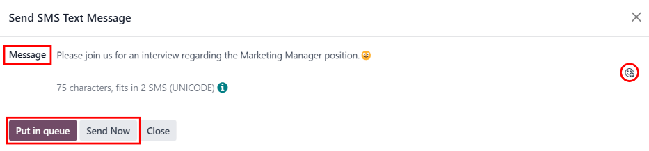
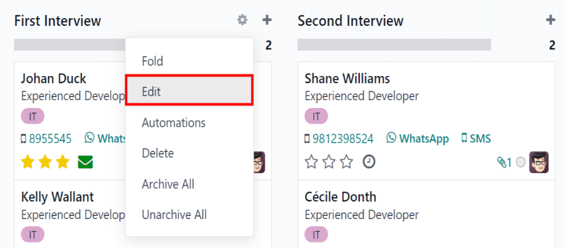
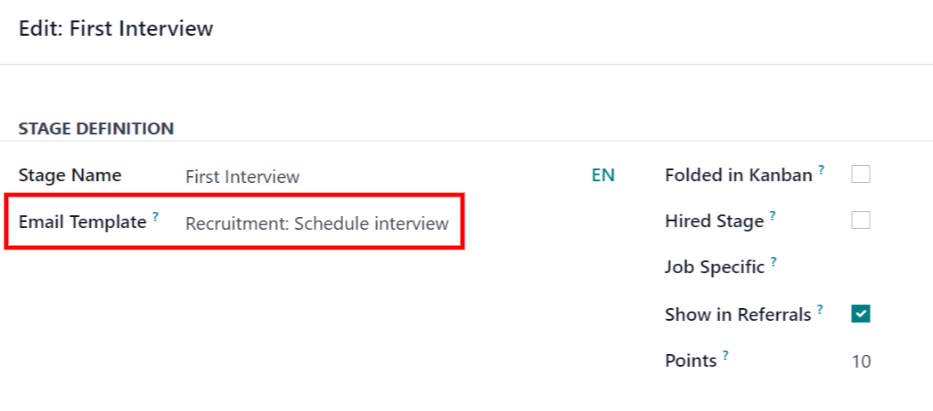
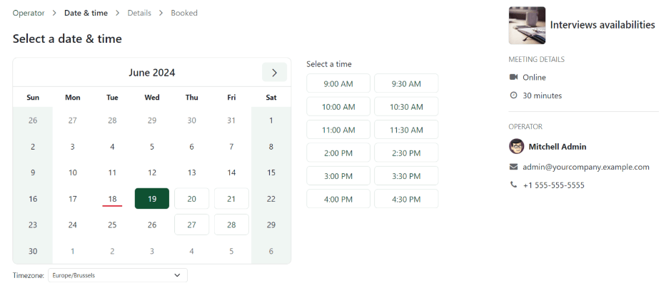
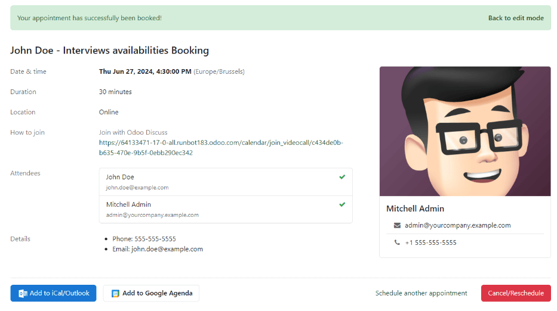

# Schedule interviews

Schedule in-person, virtual, and phone interviews with Odoo through the *Recruitment* app.

An interview can be scheduled in one of two ways: either by the [recruitment team](#recruitment-schedule-interviews-recruitment-scheduled), or by the [applicant](#recruitment-schedule-interviews-applicant-scheduled).

## Recruitment team scheduled interviews

When an applicant reaches the interview stage, the recruitment team should schedule the interview,
by first coordinating a suitable date and time with the applicant and interviewers.

To schedule the interview, navigate to the applicant's card, by first going to the
Recruitment app, and clicking the relevant job card. This opens the
Applications page for that job position. Then, click the desired applicant's card to
view their detailed applicant form.

To schedule an phone, virtual, or in-person interview, click the No Meeting smart button
at the top of the applicant's record.

#### NOTE
The *Meetings* smart button displays No Meeting if no meetings are currently
scheduled. For applicants who are new to the First Interview stage, this is the
default.

If there is one meeting already scheduled, the smart button displays *1 Meeting*, with the date
of the upcoming meeting beneath it. If more than one meeting is scheduled, the button displays
*Next Meeting*, with the date of the first upcoming meeting beneath it.

Clicking the *Meetings* smart button loads a calendar, showing the scheduled meetings and events
for the currently signed-in user, as well as the employees who are listed under the
Attendees section, located to the right of the calendar.

To change the currently loaded meetings and events being displayed, uncheck an attendee whose
calendar events are to be hidden. Only the checked attendees are visible on the calendar.

To add a meeting to the calendar when in the *Day* or *Week* view, click on the start time of the
meeting and drag down to the end time. Doing so selects the date, time, and the length of the
meeting.

A meeting can also be added in this view by clicking on the desired day *and* time slot.

Both methods cause a [New Event](#recruitment-schedule-interviews-event-card) pop-up window to
appear.

### New event pop-up window

Clicking a grid, corresponding with the time and date, opens the New Event pop-up window
to schedule a meeting.

Enter the information on the form. The only required fields to enter are a title for the meeting,
along with the Start (and end date/time) fields.

Once the card details are entered, click Save & Close to save the changes and create the
interview.

After entering in a required name for the meeting, the fields available to modify on the
New Event card are as follows:

- Meeting Title: enter the subject for the meeting. This should clearly indicate the
  purpose of the meeting. The default subject is the Subject/Application Name on the
  applicant's card.
- Start: start and end date and times for the meeting. Clicking either of these fields
  opens a calendar pop-up window. Click Apply to close the window.
- All Day: tick the box to schedule an all-day interview. If this box is ticked, the
  Start field changes to Start Date.
- Attendees: select the people who should attend the meeting. The default employee
  listed is the person who created the meeting. Add as many other people as desired.
- Videocall URL: if the meeting is virtual, or if there is a virtual option available,
  click <i class="fa fa-plus"></i> Odoo meeting, and a URL is automatically created for the
  meeting, which populates the field.
- Description: enter a brief description in this field. There is an option to enter
  formatted text, such as numbered lists, headings, tables, links, photos, and more. Use the
  powerbox feature, by typing a `/` to reveal a list of options.

  Scroll through the options and click on the desired item. The item appears in the field, and can
  be modified. Each command presents a different pop-up window. Follow the instructions for each
  command to complete the entry.

#### Thêm lựa chọn

To add additional information to the meeting, click the More Options button in the
lower-right corner of the [New Event](#recruitment-schedule-interviews-event-card) pop-up
window. Enter any of the following additional fields:

- Duration: this field auto populates based on the Start (and end) date and
  time. If the meeting time is adjusted, this field automatically adjusts to the correct duration
  length. The default length of a meeting is one hour.
- Recurrent: if the meeting should repeat at a selected interval (not typical for a
  first interview), tick the checkbox next to Recurrent. Several additional fields
  appear when this is enabled:
  - Timezone: using the drop-down menu, select the Timezone for the
    recurrent meetings.
  - Repeat: choose Daily, Weekly, Monthly,
    Yearly, or Custom recurring meetings. If Custom is selected,
    a Repeat Every field appears beneath it, along with another time frequency parameter
    (Days, Weeks, Months, or Years). Enter a number
    in the blank field, then select the time period using the drop-down menu.
  - Repeat on: enabled when the Weekly option is selected in the
    Repeat field. Choose the day the weekly meeting falls on.
  - Ngày trong tháng: cấu hình hai tùy chọn menu thả xuống để chọn một ngày cụ thể trong tháng, bất kể ngày thực tế (VD: thứ Ba đầu tiên của mỗi tháng). Để đặt một ngày cụ thể theo lịch, chọn Ngày trong tháng và nhập ngày vào trường (VD: `15` để đặt cuộc họp diễn ra vào ngày 15 hàng tháng).
  - Cho đến khi: sử dụng menu thả xuống để chọn thời điểm dừng lặp lại cuộc họp. Các tùy chọn bao gồm Số lần lặp lại, Ngày kết thúc và Mãi mãi. Nếu chọn Số lần lặp lại, nhập tổng số cuộc họp sẽ diễn ra vào trường trống bên phải. Nếu chọn Ngày kết thúc, chỉ định ngày bằng cửa sổ bật lên lịch hoặc nhập ngày theo định dạng XX/XX/XXXX. Mãi mãi sẽ lên lịch họp vô thời hạn.
- Location: enter the location for the meeting.
- Tags: select any tags for the meeting using the drop-down menu, or add a new tag by
  typing in the tag and clicking Create "tag". There is no limit to the number of tags
  that can be used.
- Appointment: if an appointment is associated with this meeting, select it from the
  drop-down menu, or create a new appointment by typing in the appointment name, then clicking
  Create & Edit... from the resulting drop-down men. A Create Appointment
  form loads. Enter the information on the form, then click Save & Close.
- Quyền riêng tư: chọn nếu người tổ chức xuất hiện ở trạng thái Rảnh hoặc Bận trong suốt thời gian diễn ra cuộc họp. Tiếp theo, chọn chế độ hiển thị của cuộc họp này bằng cách sử dụng menu thả xuống ở bên phải lựa chọn đầu tiên. Các tùy chọn là Công khai, Riêng tư và Chỉ người dùng nội bộ. Công khai cho phép mọi người xem cuộc họp, Riêng tư chỉ cho phép những người tham dự được liệt kê trong cuộc họp xem cuộc họp và Chỉ người dùng nội bộ cho phép bất kỳ ai đã đăng nhập vào cơ sở dữ liệu của công ty xem cuộc họp.
- Organizer: the employee who created the meeting is populated in this field. Use the
  drop-down menu to change the selected employee.
- Reminders: select a reminder from the drop-down menu. Default options include
  Notification, Email, and SMS Text Message, each with a
  specific time period before the event (hours, days, etc). The chosen reminder chosen alerts the
  meeting participants of the meeting, via the selected option at the specified time. Multiple
  reminders can be selected in this field.

### Send meeting to attendees

Once changes have been entered on the [New Event](#recruitment-schedule-interviews-event-card)
pop-up window, and the meeting details are correct, the meeting can be sent to the attendees, via
email or text message, from the expanded event form (what is seen when the More Options
button is clicked on in the New Event pop-up window).

To send the meeting via email, click the <i class="fa fa-envelope"></i> Email button next to the
Attendees field on the expanded meeting form.

A Contact Attendees email configurator pop-up window appears. A pre-formatted email,
using the default Calendar: Event Update email template, populates the email body field.

Những người theo dõi đơn ứng tuyển, cũng như người dùng đã tạo cuộc họp, được thêm vào dưới dạng Người nhận theo mặc định. Nếu cần, hãy thêm địa chỉ email của ứng viên vào danh sách để gửi email cho họ. Thực hiện bất kỳ thay đổi mong muốn nào khác cho email. Nếu cần tệp đính kèm, hãy nhấp vào nút Tệp đính kèm, đi đến tệp, sau đó nhấp vào Mở. Khi email đã sẵn sàng để gửi, hãy nhấp vào Gửi.

To send the meeting via text message, click the <i class="fa fa-mobile"></i> SMS button next to
the Attendees field on the expanded meeting form. A Send SMS Text Message
pop-up window appears.

At the top, a blue banner appears if any attendees do not have valid mobile numbers, and lists how
many records are invalid. If a contact does not have a valid mobile number listed, click
Close, and edit the attendee's record, then redo these steps.

When no warning message appears, type in the message to be sent to the attendees in the
Message field. To add any emojis to the message, click the <i class="oi oi-smile-add"></i>
(smile add) icon on the right-side of the pop-up window.

The number of characters, and amount of text messages required to send the message (according to
GSM7 criteria) appears beneath the Message field. Click Put In Queue to have
the text sent later, after any other messages are scheduled, or click Send Now to send
the message immediately.

#### NOTE
Sending text messages is **not** a default capability with Odoo. To send text messages, credits
are required, which need to be purchased. For more information on IAP credits and plans, refer to
the [Mua hàng trong ứng dụng (IAP)](../../essentials/in_app_purchase.md) documentation.

## Applicant scheduled interviews

By default, the recruitment interview stages are **not** set up for applicants to schedule their own
interviews.

However, if the First Interview or Second Interview stages are modified to
send the Recruitment: Schedule Interview email template when an applicant reaches that
stage, the applicant receives a link to the recruitment team's calendar, and can schedule the
interview on their own. The recruitment team's availability is reflected in the calendar.

In order for applicants to be able to schedule their own interviews, a [stage must first be
modified](#recruitment-schedule-interviews-modify-stage) in the *Recruitment* app.

### Modify stage

To modify either the First Interview or Second Interview stage, first
navigate to the main Recruitment app dashboard. Next, click on the desired job card
to navigate to the Applications page for that job position.

Hover over the name of the stage, and a <i class="fa fa-cog"></i> (gear) icon appears in the
upper-right hand side of the stage name. Click the <i class="fa fa-cog"></i> (gear) icon, and a
drop-down menu appears. Then, click on the Edit option, and an Edit: (Stage)
form appears.

The Email Template field is blank, by default. Using the drop-down menu, select
Recruitment: Schedule interview for the Email Template field, then click
Save & Close when done.

### Gửi email

After either the First Interview or Second Interview stages are
[modified to send the](#recruitment-schedule-interviews-modify-stage) Recruitment:
Schedule interview email to the applicant upon moving their applicant card to one of those stages,
the following email is received by the applicant:

`Subject: Can we plan an interview together for your (Job Position) application?`

`Congratulations!
Your application is really interesting and we'd like to plan an interview with you.
Can you please use the button below to schedule it with one of our recruiters?`

`Plan my interview`

### Schedule interview

When the applicant received the email, they click the Plan my interview button at the
bottom of the email. This navigates the applicant to a private online scheduling page, which is
**only** accessible through the emailed link.

This page displays the MEETING DETAILS on the right side of the screen. This includes
the format and length of the meeting. In this example. the interview is virtual
(<i class="fa fa-video-camera"></i> Online) and the duration is a half hour (<i class="fa fa-clock-o"></i>
30 minutes).

Đầu tiên, nếu có thể lựa chọn người để gặp, người dùng chọn người mà họ muốn đặt lịch hẹn bằng cách nhấp vào biểu tượng và tên của người đó. Nếu chỉ có sẵn một người để phỏng vấn ứng viên, bước này sẽ không khả dụng. Nếu ứng viên không muốn chọn người phỏng vấn, họ có thể nhấp trực tiếp vào Xem tất cả khung giờ trống <i class="fa fa-arrow-right"></i>.

#### NOTE
If the applicant selects an interviewer, the applicant is shown a Select a date &
time page, and **only** sees the dates and times that specific person is available. In addition,
that interviewer's information (name, email, and phone number) appears on the right-side of the
screen, under the heading OPERATOR, located beneath the MEETING DETAILS.

If the applicant clicks See all availabilities <i class="fa fa-arrow-right"></i> instead, or if
there are no interviewer options available, the user is navigated to the same Select a
date & time page, but there is no OPERATOR section visible.

Then the applicant clicks on an available day on the calendar, signified by a square around the
date. Once a day is selected, they click on one of the available times to select that date and time.

Once the date and time are selected, the applicant is navigated to an Add more details
about you page. This page asks the applicant to enter their Full name,
Email, and Phone number. The contact information entered on this form is how
the applicant is contacted to remind them about the scheduled interview.

When everything is entered on the Add more details about you page, the applicant clicks
the Confirm Appointment button, and the interview is scheduled.

After confirming the interview, the applicant is taken to a confirmation page, where all the details
of the interview are displayed. The option to add the meeting to the applicant's personal calendars
is available, through the Add to iCal/Outlook and Add to Google Agenda
buttons, beneath the interview details.

The applicant is also able to cancel or reschedule the interview, if necessary, with the
Cancel/Reschedule button.
