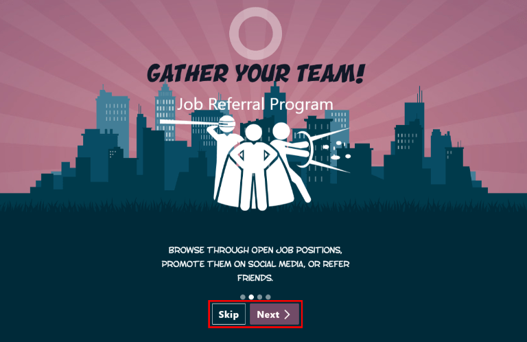
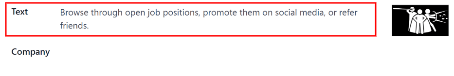
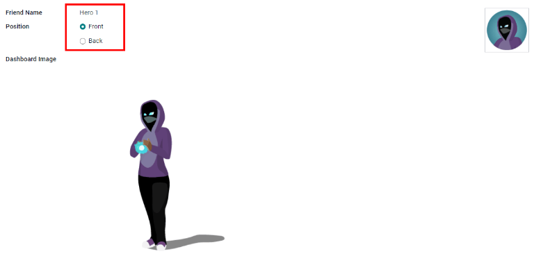

# Giới thiệu

Ứng dụng *Giới thiệu* của Odoo là nơi tập trung lưu trữ mọi thông tin liên quan đến giới thiệu - từ điểm kiếm được, đồng nghiệp được tuyển dụng và phần thưởng đã chọn. Người dùng có thể giới thiệu những người họ biết cho các vị trí công việc, sau đó kiếm điểm giới thiệu khi những người đó tiến triển trong chu trình tuyển dụng. Khi kiếm đủ điểm giới thiệu, chúng có thể được đổi lấy giải thưởng. Ứng dụng *Giới thiệu* tích hợp với các ứng dụng *Nhân viên*, *Tuyển dụng* và *Trang web*, tất cả đều phải được cài đặt để ứng dụng *Giới thiệu* hoạt động.

The only configurations needed for the *Referrals* application *after* it has been installed, are
related to the [rewards](referrals/rewards.md); everything else is pre-configured when Odoo
*Referrals* is installed.

Users with either Referral User, Officer, or Administrator
access rights for the *Recruitment* application have access to the *Referrals* application. Only
users with Administrator access rights for the *Recruitment* application have access to
the [reporting](referrals/reporting.md) and configurations menus. For more information on users
and access rights, refer to these documents: [Người dùng](../general/users.md) and
[Quyền truy cập](../general/users/access_rights.md).

## Hướng dẫn

Khi mở ứng dụng *Giới thiệu* lần đầu tiên, một kịch bản onboarding cấu hình sẵn sẽ xuất hiện. Đây là một chuỗi bốn slide, mỗi trang giải thích các phần khác nhau của ứng dụng *Giới thiệu* nhân viên. Ở đầu trang chủ, thông báo sau được hiển thị xuyên suốt tất cả slide onboarding: TẬP HỢP NHÓM CỦA BẠN! Chương trình giới thiệu việc làm. Phía sau thông điệp chính này là một hình ảnh, và bên dưới có thêm một số văn bản giải thích.

Each of the onboarding slides has a corresponding image and message that is displayed. After reading
each message, click the Next button to advance to the next slide.

The text that appears on each slide is as follows:

1. Oh no! Villains are lurking the city! Help us recruit a team of superheroes to save
   the day!
2. Browse through open job positions, promote them on social media, or refer friends.
3. Collect points and exchange them for awesome gifts in the shop.
4. Compete against your colleagues to build the best justice league!

#### NOTE
Các slide onboarding sẽ xuất hiện mỗi khi ứng dụng *Giới thiệu* được mở, cho đến khi tất cả slide đã được xem và nút Bắt ​​đầu ngay đã được nhấp. Nếu thoát khỏi quá trình onboarding tại bất kỳ thời điểm nào hoặc nếu nút Bắt ​​đầu ngay *chưa* được nhấp, các slide onboarding sẽ bắt đầu lại khi ứng dụng *Giới thiệu* được mở. Sau khi nút Bắt ​​đầu ngay đã được nhấp, thì từ thời điểm đó trở đi, các slide onboarding sẽ không xuất hiện nữa và trang chủ sẽ hiển thị khi mở ứng dụng *Giới thiệu*.

At any point during onboarding, the Skip button may be clicked. This exits the
onboarding, and the main *Referrals* dashboard loads. If Skip is clicked, onboarding
slides will not load anymore when opening the *Referrals* application.

#### NOTE
If there are any candidates hired that the user had referred prior to opening the Referrals app
(meaning the onboarding slides have not appeared before), when Start Now is clicked
at the end of onboarding, instead of going to the main dashboard, a [hired](#referrals-hired) screen appears instead.

### Modifying onboarding slides

Các slide onboarding có thể được chỉnh sửa nếu cần. Chỉ người dùng có quyền Quản trị viên cho ứng dụng *Tuyển dụng* mới có thể chỉnh sửa slide hướng dẫn. Để chỉnh sửa slide, hãy đi đến Ứng dụng Giới thiệu ‣ Cấu hình ‣ Onboarding. Mỗi dòng hiển thị nội dung cho từng slide onboarding riêng lẻ. Để chỉnh sửa slide onboarding, nhấp vào một dòng slide cụ thể để mở biểu mẫu onboarding của slide đó.

Make any changes to the message in the Text field. A Company may be
selected, as well. However, if this field is populated, that slide is *only* displayed for that
particular company.

#### NOTE
The Company field only appears when in a multi-company database.

Hình ảnh cũng có thể được chỉnh sửa. Di chuột qua hình thu nhỏ của hình ảnh ở góc trên bên phải của biểu mẫu. Biểu tượng :guilabel: `✏️ (bút chì)` và biểu tượng :guilabel: `🗑️ (thùng rác)` sẽ xuất hiện. Nhấp vào biểu tượng :guilabel: `✏️ (bút chì)` để thay đổi hình ảnh. Cửa sổ trình duyệt tệp sẽ tải. Điều hướng đến hình ảnh mong muốn, chọn hình ảnh đó, sau đó nhấp vào :guilabel: `Mở`. Hình ảnh mới sẽ xuất hiện trong hình thu nhỏ. Để xóa hình ảnh, hãy nhấp vào biểu tượng :guilabel: `🗑️ (thùng rác)`, sau đó chọn hình ảnh mới bằng biểu tượng :guilabel: `✏️ (bút chì)`.

The sequence in which the slides appear can be changed from the *Onboarding* dashboard. Click the
(six small gray boxes) icon to the left of the the slide text, and drag the slide to the
desired position.

## Hired referrals

When a candidate that has been referred by a user is hired, the user "grows their superhero team"
and adds superhero avatars to their Referrals dashboard.

After a referral has been hired, when the user next opens the Referrals app, instead of the main
dashboard, a hired page loads. The text (Referral Name) has been hired! Choose an avatar
for your new friend! appears.

Below this message are five avatar thumbnails to choose from. If an avatar has already been assigned
to a referral, the thumbnail is grayed out, and the name that the avatar has been chosen for appears
beneath the avatar. Click on an available avatar to select it.

Nếu có nhiều hơn một người được giới thiệu đã được tuyển dụng kể từ khi mở ứng dụng *Giới thiệu*, sau khi chọn hình đại diện đầu tiên, người dùng sẽ được nhắc chọn hình đại diện khác cho những người được giới thiệu tiếp theo. Sau khi đã chọn xong tất cả hình đại diện, trang chủ sẽ tải và hiển thị tất cả các hình đại diện. Di chuột qua từng hình đại diện để hiển thị tên của họ ở phía trên.

### Modify friends

Có thể chỉnh sửa ảnh đại diện của bạn bè theo cùng cách mà [cấp độ](#referrals-levels) được chỉnh sửa. Chỉ những người dùng có quyền Quản trị viên trên ứng dụng *Tuyển dụng* mới có thể chỉnh sửa bạn bè. Có thể xem và chỉnh sửa bạn bè được cấu hình sẵn bằng cách điều hướng đến Ứng dụng Giới thiệu ‣ Cấu hình ‣ Bạn bè. Mỗi ảnh đại diện của bạn bè sẽ xuất hiện trong cột Hình ảnh trang chủ và tên tương ứng sẽ xuất hiện trong cột Tên bạn bè. Các ảnh mặc định là một nhóm nhân vật anh hùng đa dạng, từ rô-bốt đến chó.

Để chỉnh sửa hình ảnh trang chủ, hình thu nhỏ, tên hoặc vị trí của bạn bè, nhấp vào một người bạn cụ thể để mở biểu mẫu bạn giới thiệu. Nhấp Chỉnh sửa để thực hiện thay đổi. Nhập tên vào trường Tên bạn bè. Tên này chỉ để phân biệt bạn bè trong menu cấu hình; tên của bạn bè không hiển thị ở bất kỳ đâu khác trong ứng dụng *Giới thiệu*.

The Position can be set to either Front or Back. This determines
the position of the friend in relation to the user's super hero avatar. Click the radio button next
to the desired selection, and the friend will appear either in front of or behind the user's avatar
when activated.

If desired, both the thumbnail Image and the Dashboard Image can be
modified. Hover over the image being replaced to reveal a ✏️ (pencil) icon and
🗑️ (garbage can) icon. Click the ✏️ (pencil) icon, and a file explorer
window appears. Navigate to the desired image file, then click Open to select it.

The referral friend form automatically saves, but can be saved manually at any time by clicking the
*Save manually* option, represented by a (cloud upload) icon, located in the top-left
corner. To cancel any changes made, click the ✖️ (Discard all changes) icon to delete
any changes, and revert to the original content.

#### WARNING
It is not advised to edit the images. An image file must have a transparent background in order
for it to render properly. Only users with knowledge about transparent images should attempt
adjusting any images in the *Referrals* application.

Once an image is changed and the friend is saved, it is **not possible** to revert to the
original image. To revert to the original image, the *Referrals* application must be *uninstalled
then reinstalled.*

## Mốc

The *Referrals* application has pre-configured levels that are reflected in the user's avatar on the
Referrals dashboard. As a user refers potential employees and earns points, they can *level up*,
much like in a video game.

Levels have no functional impact on the performance of the application. They are solely used for the
purpose of adding achievement tiers for participants to aim for, gamifying referrals for the user.

Cấp độ hiện tại của người dùng được hiển thị ở đầu trang chủ ứng dụng *Giới thiệu*, ngay bên dưới ảnh của họ, theo định dạng Cấp độ: X. Ngoài ra, một vòng màu sẽ xuất hiện xung quanh ảnh của người dùng, cho biết người dùng hiện có bao nhiêu điểm và họ cần thêm bao nhiêu điểm để lên cấp. Phần màu lục lam của vòng biểu thị số điểm đã kiếm được, trong khi phần màu trắng biểu thị số điểm cần có trước khi họ có thể lên cấp.

### Modify levels

Chỉ người dùng có quyền Quản trị viên cho ứng dụng *Tuyển dụng* mới có thể chỉnh sửa các cấp độ. Bạn có thể xem và sửa đổi các cấp độ cấu hình sẵn bằng cách đi đến Ứng dụng Giới thiệu ‣ Cấu hình ‣ Cấp độ. Mỗi hình đại diện xuất hiện trong cột Hình ảnh và số cấp độ tương ứng xuất hiện trong cột Tên cấp độ. Hình ảnh mặc định là các siêu anh hùng Odoo, mỗi cấp độ sẽ bổ sung thêm phụ kiện cho ảnh đại diện như áo choàng và khiên.

To modify a level's image, name, or points required to reach the level, click on an individual level
in the list to open the level form, then make modifications.

Nhập tên (hoặc số) của cấp độ vào trường Tên cấp độ. Nội dung nhập vào sẽ hiển thị bên dưới ảnh của người dùng trên trang chủ khi họ đạt đến cấp độ đó. Nhập số điểm giới thiệu cần thiết để đạt đến cấp độ đó vào trường Yêu cầu. Điểm cần thiết để lên cấp là tổng số điểm tích lũy được trong suốt thời gian làm việc của nhân viên, không phải là điểm bổ sung từ cấp độ trước đó phải đạt được.

If desired, the Image can also be modified. Hover over the image to reveal a
✏️ (pencil) icon and 🗑️ (garbage can) icon. Click the ✏️
(pencil) icon, and a file explorer window appears. Navigate to the desired image file, then click
Open to select it.

The level form saves automatically, but can be saved manually at any time by clicking the *save
manually* option, represented by a (cloud upload) icon, located in the top-left corner.
To cancel any changes made, click the ✖️ (Discard all changes) icon to delete any
changes, and revert to the original content.

#### WARNING
It is not advised to edit the images. An image file must have a transparent background in order
for it to render properly. Only users with knowledge about transparent images should attempt
adjusting any images in the *Referrals* application.

Once an image is changed and the level is saved, it is **not possible** to revert to the original
image. To revert to the original image, the *Referrals* application must be *uninstalled then
reinstalled.*

### Level up

Once enough points have been accumulated to level up, the circle around the user's photo is
completely filled in with a cyan color, a large image stating Level up! appears above
the photo, and the phrase Click to level up! appears beneath the user's photo and
current level.

Click on either the LEVEL UP! graphic, the user's photo, or the text Click to
level up! beneath the user's photo to level up the user. The user's avatar changes to the current
level, and the ring around the photo is updated to indicate the current amount of points.

Leveling up does not cost the user any points, the user simply needs to earn the specified amount of
points required.

#### NOTE
Once a user has reached the highest configured level, they will continue to accrue points that
can be redeemed for rewards, but they are no longer able to level up. The ring around their photo
remains solid cyan.

#### SEE ALSO
- [Share job positions](referrals/share_jobs.md)
- [Referral points](referrals/points.md)
- [Phần thưởng](referrals/rewards.md)
- [Cảnh báo](referrals/alerts.md)
- [Báo cáo](referrals/reporting.md)

* [Share job positions](referrals/share_jobs.md)
  * [Xem công việc](referrals/share_jobs.md#view-jobs)
  * [Refer friends](referrals/share_jobs.md#refer-friends)
  * [Share a job](referrals/share_jobs.md#share-a-job)
    * [Liên kết](referrals/share_jobs.md#link)
    * [Facebook](referrals/share_jobs.md#facebook)
    * [X (trước đây là Twitter)](referrals/share_jobs.md#x-formerly-twitter)
    * [LinkedIn](referrals/share_jobs.md#linkedin)
    * [Gửi email cho một người bạn](referrals/share_jobs.md#email-a-friend)
* [Referral points](referrals/points.md)
  * [My referrals](referrals/points.md#my-referrals)
    * [Điểm](referrals/points.md#points)
* [Phần thưởng](referrals/rewards.md)
  * [Create rewards](referrals/rewards.md#create-rewards)
  * [Redeem rewards](referrals/rewards.md#redeem-rewards)
* [Cảnh báo](referrals/alerts.md)
  * [Create an alert](referrals/alerts.md#create-an-alert)
  * [Dismiss an alert](referrals/alerts.md#dismiss-an-alert)
* [Báo cáo](referrals/reporting.md)
  * [Employees referral analysis report](referrals/reporting.md#employees-referral-analysis-report)
    * [Use case: hired referrals](referrals/reporting.md#use-case-hired-referrals)
