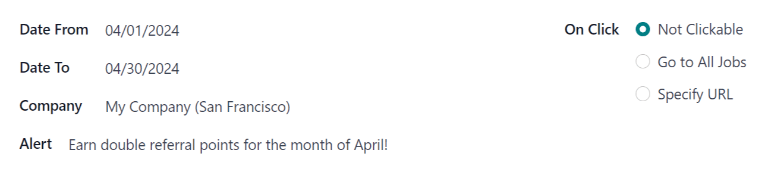

# Cảnh báo

In the *Referrals* application, it is possible to post a message, also referred to as an *alert*, at
the top of the dashboard to share important information with users.

Alerts remain on the main *Referrals* dashboard for the specified amount of time configured on the
individual alert.

## Create an alert

Only users with *Administrator* access rights for the *Recruitment* application can create alerts.
To add a new alert, navigate to the Referrals app ‣ Configuration ‣ Alerts.

Click New to open a blank alert form. Enter the following information on the form:

- Date From: the date the alert starts. On this date, the alert is visible on the
  dashboard.
- Date To: the date the alert ends. After this date, the alert is hidden from view.
- Company: the current company populates this field, by default. To modify the company
  the alert should be displayed for, select the desired company from the drop-down menu in this
  field.

  If this field remains blank, the alert is visible to everyone with access to the *Referrals*
  application.

  If a company is specified, only users within that company (who also have access to the *Referrals*
  application) see the alert. This field **only** appears when in a multi-company database.
- Alert: enter the text for the alert. This message appears inside the alert banner on
  the main *Referrals* dashboard.
- On Click: there are three options for the alert. Click the radio button next to the
  desired selection. The options are:
  - Not Clickable: the alert only displays text, there is no link to click.
  - Go to All Jobs: the alert contains a link that, when clicked, navigates to the
    website with all the job positions that are currently posted.
  - Specify URL: the alert contains a link to a specific URL that, when clicked,
    navigates to that URL. When selected, a URL field appears below the On
    Click section. Enter the desired URL in that field.

## Dismiss an alert

It is possible to dismiss an alert, if a user does not wish to see a specific alert again.

To dismiss an alert, click the <i class="fa fa-times"></i> (remove) icon on the far-right side of
the alert to remove the alert from the dashboard.

This prevents the alert from appearing again, even when opening the *Referrals* application for the
first time in a new session.
