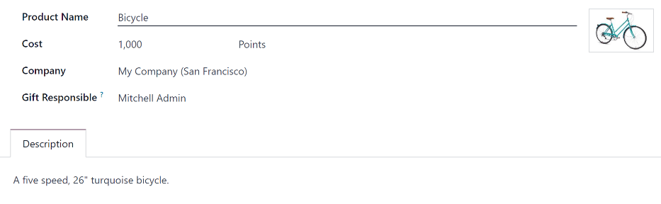

# Phần thưởng

After employees have successfully earned referral points, they can exchange their points by
purchasing rewards in Odoo's *Referrals* application. Rewards **must** be [created and
configured](#referrals-create) before employees can [redeem points for rewards](#referrals-redeem).

## Create rewards

Rewards are the only configurations needed when setting up the *Referrals* application.

Only users with Administrator rights for the *Recruitment* application can create or
modify rewards.

To add rewards, navigate to Referrals app ‣ Configuration ‣ Rewards. Click
New, and a reward form loads. Enter the following information on the form:

- Product Name: enter the name as it should appear for the reward. This field is
  required.
- Cost: enter the amount of points required to redeem the reward.
- Company: using the drop-down menu, select the company the reward is configured for. If
  a reward is available for multiple companies, each company **must** configure a reward for their
  specific company. This field **only** appears if in a multi-company environment; if this field
  appears, it is required.
- Gift Responsible: using the drop-down menu, select the person responsible for
  procuring and delivering the reward to the recipient. This person is alerted when the reward is
  bought in the *Referrals* application, so they know when to deliver the reward to the recipient.
- Ảnh: thêm ảnh phần thưởng, ảnh này sẽ xuất hiện trên trang phần thưởng. Di chuột qua hộp ảnh ở góc trên bên phải (hình vuông có camera và dấu cộng bên trong) và biểu tượng <i class="fa fa-pencil"></i> (bút chì) sẽ xuất hiện. Nhấp vào biểu tượng <i class="fa fa-pencil"></i> (bút chì) để chọn và thêm ảnh vào biểu mẫu phần thưởng. Sau khi thêm ảnh, khi di chuột qua ảnh sẽ hiển thị hai biểu tượng thay vì một: biểu tượng <i class="fa fa-pencil"></i> (bút chì) và biểu tượng <i class="fa fa-trash-o"></i> (thùng rác). Nhấp vào biểu tượng <i class="fa fa-trash-o"></i> (thùng rác) để xóa ảnh đang được chọn.
- Description tab: type in the description for the reward. This is visible on the reward
  card, beneath the title. This field is required.

#### IMPORTANT
It is advised to enter a Cost and add a Photo. If a cost is not entered,
the default cost is listed as zero, which would list the reward as free in the reward shop. If a
photo is not selected, a placeholder icon is displayed on the rewards page.

## Redeem rewards

In order to redeem a reward, points must be earned. These points can then be used to purchase a
reward.

To purchase a reward, click the Rewards button on the main Referrals
dashboard. All the configured rewards are listed in individual reward cards.

The required point amount needed to purchase a reward is listed in the top-right corner of the card.

If the user has enough points to purchase a reward, a <i class="fa fa-shopping-basket"></i> Buy
button appears at the bottom of the reward card. If they do not have enough points for a reward, the
reward card displays You need another (x) points to buy this, instead of a
<i class="fa fa-shopping-basket"></i> Buy button.

Click the <i class="fa fa-shopping-basket"></i> Buy button on a reward to purchase it. A
Confirmation pop-up window appears, asking if the user is sure they want to purchase the
reward. Click OK to purchase the item, or Cancel to close the window, and
cancel the purchase.

After OK is clicked, the pop-up window closes, and the points used to purchase the
reward are subtracted from the user's available points. The rewards presented are now updated to
reflect the user's current available points.

