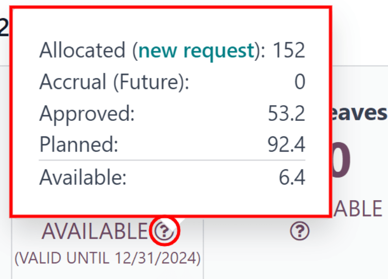
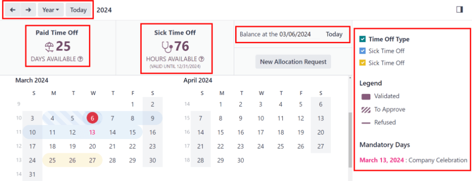

# My time

The *My Time* menu of the *Time Off* application houses all the various time off information for
the signed-in user.

This includes the main *Time Off* dashboard, which displays an overview of the various time off
balances, as well as time-off requests and allocations.

## Trang tổng quan

All users have access to the *Time Off* Dashboard, which is the first page that appears
when the *Time Off* application is opened. The Dashboard can also be accessed at any
point in the application, by navigating to Time Off app ‣ My Time ‣ Dashboard.

The current year is displayed, and the current day is highlighted in a red circle.

To change the view, click on the Year button to reveal a drop-down menu. Then, select
either Day, Week, or Month to present the calendar in that
corresponding view.

#### NOTE
To change the displayed dates, click the <i class="fa fa-arrow-left"></i> (left arrow) or
<i class="fa fa-arrow-right"></i> (right arrow) icons to the left of the Year
button. The calendar view adjusts in increments of the selected view.

For example, if Year is selected, the arrows adjust the view by one year.

To reset the view, so it includes the current date, click the Today button.

Above the calendar view is a summary of the user's time off balances. Every time off type that has
been allocated appears in its own summary box. Each summary lists the type of time off, the
corresponding icon, the current available balance (in hours or days), and an expiration date (if
applicable).

Để xem thông tin chi tiết về số dư ngày nghỉ, hãy nhấp vào biểu tượng <i class="fa fa-question-circle-o"></i> (dấu hỏi) ở cuối mục (NGÀY/GIỜ) KHẢ DỤNG trên bảng tổng quan về ngày nghỉ. Các thông tin chi tiết sẽ được hiển thị trong cửa sổ hiện lên, bao gồm: thời gian Đã phân bổ, thời gian Tích lũy (Tương lai), ngày nghỉ Đã phê duyệt đã lên lịch, ngày nghỉ Đã lên kế hoạch và ngày nghỉ Hiện có.

A user can also select a future date to see an estimate of how much time they should accrue by that
point. On the right side of the time off summary blocks, there is a Balance at the
(date) field. Click on the date, and a calendar selector popover appears.

#### NOTE
The Balance at the (date) field **only** appears if the user is accruing time off
through an [accrual plan](applications/hr/time_off.md#time-off-accrual-plans).

The current date is the default date selected. Navigate to the desired date, and Odoo displays the
time off balances the user should have on that date. This takes into account all time off currently
planned and approved. To return to the current date, click the Today button to the right
of the date field.

On the right side of the calendar, the various time off types are displayed, each with their own
corresponding color. The Legend explains how the various statuses for time off requests
are presented.

Time off that has been validated appears in a solid color. Time off requests that still are still in
the To Approve stage, appear with white stripes in the color. Refused time
off requests have a line through the dates.

The color for each request corresponds to the specified color set with the various time off types,
listed in the section above the Legend.

New time off requests can be made from the Dashboard. Click the New button
in the upper-left corner, and a [New Time Off](applications/hr/time_off/request_time_off.md) pop-up window appears.

New allocation requests can also be made from the Dashboard. Click the New
Allocation Request button to request more time off, and a [New Allocation](applications/hr/time_off/allocations.md#time-off-request-allocation) pop-up window appears.

## My time off

To view a list of all the time off requests, navigate to Time Off app ‣ My Time
‣ My Time Off. Here, all time off requests, both past and present, appear in a list view.

The list includes the following information for each request: the Time Off Type,
Description, Start Date, End Date, Duration, and
Status.

A new time off request can be made from this view. Click the New button to
[Request time off](applications/hr/time_off/request_time_off.md).

## My allocations

To view a list of all allocations, navigate to Time Off app ‣ My Time ‣ My
Allocations. All allocations and requested allocations appear in a list view.

The information presented on the My Allocations page includes: Time Off
Type, Description, Amount, Allocation Type, and
Status.

A new allocation request can be made from this view, as well. Click the New button to
[request an allocation](applications/hr/time_off/allocations.md#time-off-request-allocation).
