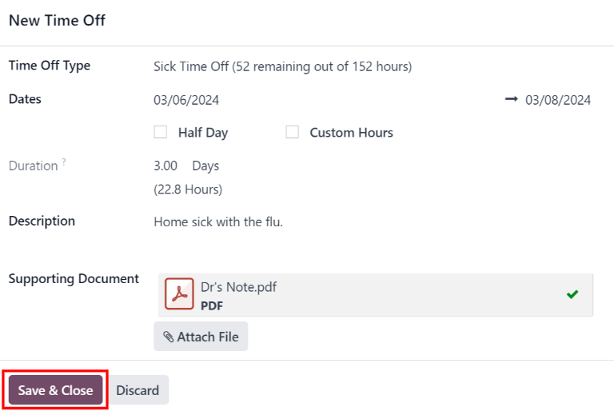

# Request time off

Once time off has been allocated to an employee, a request to use it can be submitted.

Time off can be requested in one of two ways: either from the main *Time Off* application
Dashboard (Time Off app ‣ My Time ‣ Dashboard), or from the
My Time Off dashboard view (Time Off app ‣ My Time ‣ My Time Off).

To create a new request for time off, click the New button on either the main *Time Off*
Dashboard or the My Time Off dashboard, in the default list view.

#### NOTE
Both New buttons allow the user to request time off, but when requested from the
Dashboard, a New Time Off request form appears in a pop-up window. When
requested from the My Time Off list view, the screen navigates to a new time off
request page, instead.

Enter the following information on the New Time Off request form:

- Time Off Type: select the type of time off being requested from the drop-down menu.
- Dates: enter the dates that the time off falls under. There are two fields to
  populate: the start and end dates. Click on either date field and a popover calendar appears.

  Click on the start date, then click on the end date. The selected start and end dates are circled,
  and the dates between them are highlighted (if applicable).

  If only requesting time off for a single day, click on the start date, then click the same date
  again for the end date.

  When the correct dates are selected, click the Apply button.

  The selected dates now populate the two portions of the Dates field.

  If the selected Time Off Type is configured to have the time off taken in hours, the
  following two fields also appear:
  - Half Day: if the time off request is for a half day, tick this checkbox. When this
    is selected, the second date field disappears, and is replaced with a drop-down menu. From that
    drop-down menu, select either Morning or Afternoon to indicate which
    half of the day is being requested.
  - Custom Hours: if the time off requested is not a whole or half day, tick this
    checkbox. If selected, a From and To field appears beneath this option.
    Using the drop-down menu, select the start and end time for the time off request.
- Duration: this field updates automatically once the Date section is
  completed. If the Date section is modified, this section automatically updates to
  reflect the total time off requested. This field is in either hours or days, depending on how the
  selected Time Off Type is configured.
- Description: enter a description for the time off request. This should include any
  details that managers and approvers may need to approve the request.
- Supporting Document: this field only appears if the Time Off Type selected
  allows for the attachment of documents. Click the Attach File button, and a file
  explorer window appears.

  Navigate to the desired files that should be attached, select them, then click The
  Open button. The files then appear on the time off request form. Multiple documents
  can be attached, if necessary.

If the request was created from the Dashboard, click the Save & Close button
to save the information, and submit the request.

If the form was completed from the My Time Off list view, the information is
automatically saved as it is entered. However, the form can be saved manually at any time by
clicking the <i class="fa fa-cloud-upload"></i> (cloud upload) icon.

