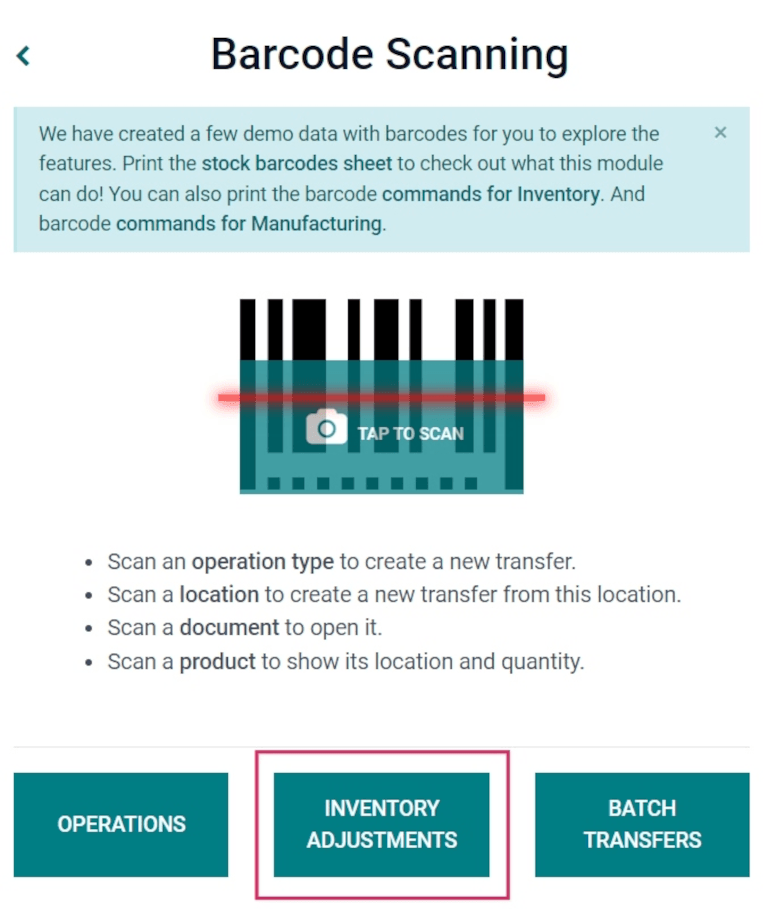

# Apply inventory adjustments with barcodes

Trong kho hàng, số lượng tồn kho được ghi nhận trong cơ sở dữ liệu có thể không phải lúc nào cũng khớp với số lượng thực tế. Trong trường hợp đó, có thể thực hiện điều chỉnh tồn kho để đối chiếu sự chênh lệch và đảm bảo rằng số liệu ghi nhận trong cơ sở dữ liệu khớp với số lượng thực tế trong kho. Trong Odoo, ứng dụng *Mã vạch* có thể được sử dụng để thực hiện các điều chỉnh này.

These adjustments can be done in real time using an Odoo-compatible barcode scanner or the Odoo
mobile app.

#### NOTE
For a list of Odoo-compatible barcode mobile scanners, and other hardware for the *Inventory* and
*Barcode* apps, refer to the [Odoo Inventory • Hardware page](https://www.odoo.com/app/inventory-hardware).

#### SEE ALSO
[Điều chỉnh tồn kho](../../inventory/warehouses_storage/inventory_management/count_products.md)

## Enable Barcode app

To use the *Barcode* app to create and apply inventory adjustments, it **must** be installed by
enabling the feature from the settings of the *Inventory* app.

To do so, go to the Inventory app ‣ Configuration ‣ Settings. Then, scroll down
to the Barcode section, and click the checkbox next to the Barcode Scanner
option.

Once the checkbox is ticked, click Save at the top of the page to save changes.

After saving, a new drop-down menu appears under the Barcode Scanner option, labeled
Barcode Nomenclature, where either Default Nomenclature or
Default GS1 Nomenclature can be selected. Each nomenclature option determines how
scanners interpret barcodes in Odoo.

There is also a Configure Product Barcodes internal link arrow, along with a set of
Print buttons for printing barcode commands and a barcode demo sheet.

#### SEE ALSO
For more information on setting up and configuring the Barcode app, refer to the
[Set up your barcode scanner](../setup/hardware.md) and [Activate the Barcodes in Odoo](../setup/software.md) docs.

## Perform an inventory adjustment

Begin by navigating to the Barcode app ‣ Barcode Scanning dashboard, where
different options will be displayed, including Operations, Inventory
Adjustments, and Batch Transfers.

To create and apply inventory adjustments, click on the Inventory Adjustments button at
the bottom of the screen.

Doing so navigates to the *Barcode Inventory Client Action* page, labeled as Inventory
Adjustment in the top header section.

To begin the adjustment, first scan the *source location*, which is the current location in the
warehouse of the product whose count should be adjusted. Then, scan the product barcode(s).

The barcode of a specific product can be scanned multiple times to increase the quantity of that
product in the adjustment.

Alternatively, the quantity can be changed by clicking the ✏️ (pencil) icon on the far
right of the product line.

Doing so opens a separate window with a keypad. Edit the number in the Quantity line to
change the quantity. Additionally, the +1 and -1 buttons can be clicked to
add or subtract quantity of the product, and the number keys can be used to add quantity, as well.

To complete the inventory adjustment, click the green ✅ Apply button with the check mark
at the bottom of the page.

Once applied, Odoo navigates back to the Barcode Scanning screen. A small green banner
appears in the top right corner, confirming validation of the adjustment.

## Manually add products to inventory adjustment

When the barcodes for the location or product are not available, Odoo *Barcode* can still be used to
perform inventory adjustments.

To do this, navigate to the Barcode app ‣ Barcode Scanning ‣ Inventory
Adjustments.

Doing so navigates to the *Barcode Inventory Client Action* page, labeled as Inventory
Adjustment in the top header section.

To manually add products to this adjustment, click the white ➕ Add Product button at the
bottom of the screen.

This navigates to a new, blank page where the desired product, quantity, and source location must be
chosen.

> 

Đầu tiên, nhấp vào dòng Sản phẩm và chọn sản phẩm cần điều chỉnh tồn kho. Sau đó, nhập thủ công số lượng của sản phẩm đó bằng cách thay đổi số `1` trong dòng Số lượng, hoặc nhấp vào các nút +1 và -1 để tăng/giảm số lượng sản phẩm. Bạn cũng có thể sử dụng bàn phím số để nhập số lượng.

Below the number pad is the location line, which should read `WH/Stock` by default.
Click this line to reveal a drop-down menu of locations to choose from, and choose the
source location for this inventory adjustment.

Once ready, click Confirm to confirm the changes.

To apply the inventory adjustment, click the green ✅ Apply button with the check mark,
at the bottom of the page.

Once applied, Odoo navigates back to the Barcode Scanning screen. A small green banner
appears in the top right corner, confirming validation of the adjustment.
