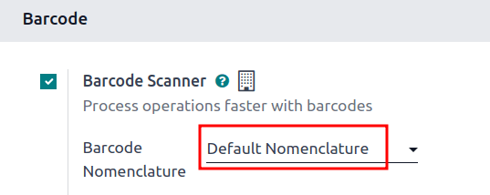
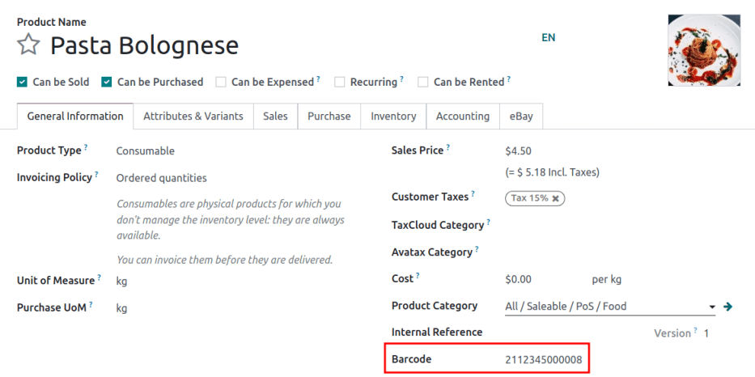
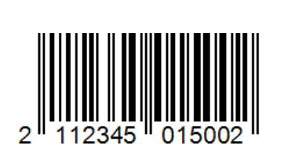
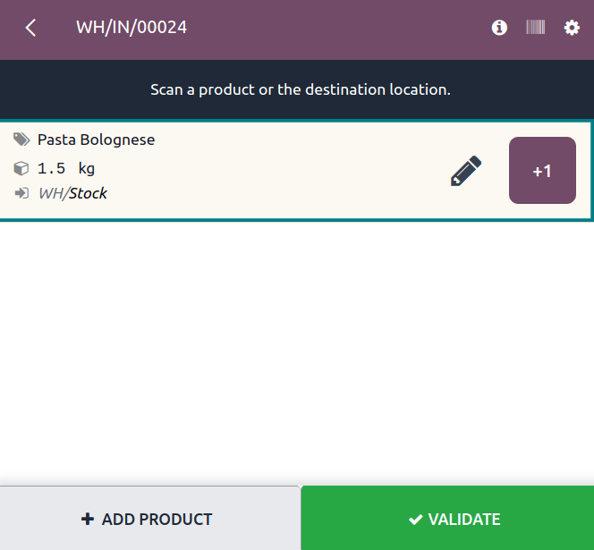
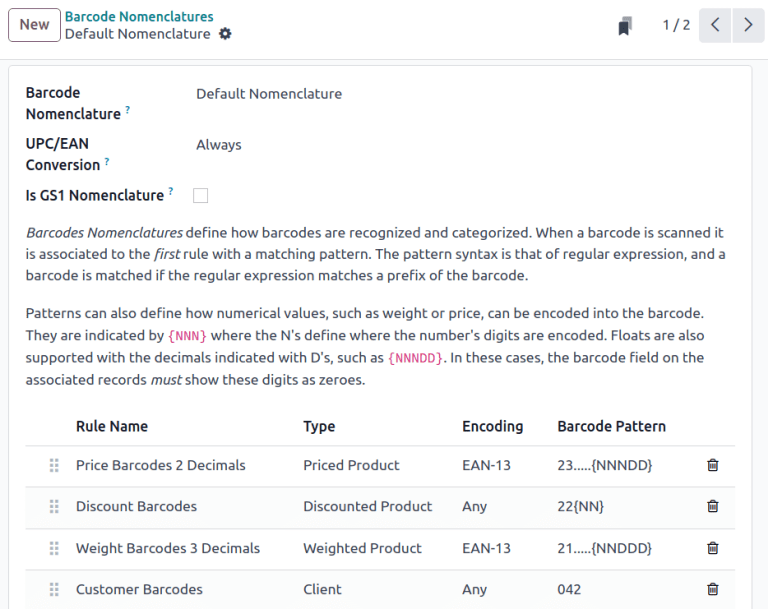

# Default barcode nomenclature

*Danh pháp mã vạch* xác định cách mã vạch được nhận diện và phân loại. Khi một mã vạch được quét, nó sẽ được liên kết với quy tắc đầu tiên có mẫu phù hợp. Cú pháp mẫu được mô tả trong danh sách danh pháp của Odoo bằng biểu thức chính quy, và một mã vạch được Odoo đọc thành công nếu tiền tố và/hoặc độ dài của nó khớp với quy định trong quy tắc mã vạch.

Ví dụ, tại một trạm [Điểm bán hàng](applications/sales/point_of_sale.md), mã vạch khối lượng sản phẩm theo định dạng European Article Number (EAN), bắt đầu bằng `21` và có năm chữ số chỉ khối lượng, được sử dụng để cân sản phẩm và tạo mã vạch hiện thị khối lượng và giá cả. `21` và năm chữ số khối lượng là mẫu mã vạch được sử dụng để xác định mã vạch và có thể tùy chỉnh để đảm bảo Odoo diễn giải chính xác tất cả mã vạch cho doanh nghiệp.

#### NOTE
Barcodes are also commonly used with Odoo's **Inventory** and **Barcode** apps.

Odoo **Barcode** supports , Universal Product Code (UPC), and [GS1](applications/inventory_and_mrp/barcode/operations/gs1_nomenclature.md)
formats. This document exclusively focuses on [default rules and patterns in Odoo](#barcode-operations-default-nomenclature-list), which use  and  encoding.

#### IMPORTANT
To use  and  barcodes for uniquely identifying products across the entire supply chain,
they **must** be [purchased from GS1](https://www.gs1.org/standards/get-barcodes).

In Odoo, custom barcode patterns can be defined to recognize barcodes specific to the company.
Barcodes do not need to be purchased if used only within the company, such as in the
[example](#barcode-operations-product-weight) where the barcode is written in the 
format.

## Cấu hình

To use default nomenclature, navigate to Inventory app ‣ Configuration ‣
Settings. Under the Barcode section, tick the Barcode Scanner checkbox.
Doing so installs the **Barcode** app in the database.

Next, in the Barcode Nomenclature field, ensure Default Nomenclature is
selected. Then, click Save.

With the **Barcode** module installed, and the Default Nomenclature selected, the
barcode actions using  and , detailed in the [default nomenclature list](#barcode-operations-default-nomenclature-list), are available for use. And, by default, Odoo
automatically handles / conversion.

## Example: product weight barcode

To better understand how barcode nomenclature is used to identify products in Odoo, this example
where product weight barcodes in  format are used to allow a [Point of Sale](applications/sales/point_of_sale.md) business to automatically print barcodes, and calculate the price
using the weight of the item.

To set up barcodes for weighted products, the following rule is used:

| Tên quy tắc                  | Mẫu mã vạch     | Field in Odoo                 |
|------------------------------|-----------------|-------------------------------|
| Weighted Barcodes 3 Decimals | (21)....{NNDDD} | Barcode field on product form |

To configure the product barcode for `Pasta Bolognese`, the  barcode for weighted products,
`2112345000008`, is entered in the Barcode field on the product form (accessible by
going to Inventory app ‣ Products ‣ Products, and selecting the desired
product). In addition, the Unit of Measure is set to kg.

Next, a customer's bowl of pasta is weighed to be `1.5` kilograms. This generates a new barcode for
the pasta, according to the weight: `211234501500`, which has a check digit of `2`. The new barcode
is `2112345015002`.

Ensure the products scan properly, by navigating to the Barcode app ‣ Operations.
Next, click any operation type, such as Receipts. Then, click the New button
to create a draft stock move. Scan the product weight barcode, such as `2112345015002`, and if the
intended product appears, the barcode setup is correct.

## Tạo quy tắc

#### IMPORTANT
Adding new rules is necessary for  and  formats that are **not** in Odoo's default
list, since barcodes cannot be read successfully if there are unknown fields.

> While new rules can be created, Odoo fields do **not** auto-populate with information from these
> rules. [Custom development](https://www.odoo.com/appointment/132) is required for this
> functionality.

To create a rule, first enable [developer mode](applications/general/developer_mode.md#developer-mode). Then, navigate to
Inventory app ‣ Configuration ‣ Barcode Nomenclatures, and select
Default Nomenclature.

On this page, configure the following optional fields:

- UPC/EAN Conversion: determines if a / barcode should be automatically
  converted when matching a rule with another encoding. Options include Always (the
  default option), Never, EAN-13 to UPC-A, and UPC-A to EAN-13.
- Is GS1 Nomenclature: ensure this checkbox is **not** ticked, as the
  Default Nomenclature uses  and  encoding, *not* GS1 encoding.

On the Default Nomenclature page, click Add a line at the bottom of the
table, which opens a Create Rules pop-up window to create a new rule.

The Rule Name field is used internally to identify what the barcode represents.

The Sequence field represents the priority of the rule; meaning the smaller the value,
the higher the rule appears on the table.

The barcode Type field represents different classifications of information that can be
understood by the system (e.g., Package, Lot, Location,
Coupon, etc.).

The Encoding field specifies which encoding the barcode uses. This rule **only** applies
if the barcode uses this specific encoding. The available Encoding options are:
EAN-13, EAN-8, UPC-A, and GS1-28.

The Barcode Pattern field represents how the sequence of letters or numbers is
recognized by the system to contain information about the product. Sometimes, when a certain amount
of digits are required, the number of `.` is shown. `N` represents whole number digits, and `D`
represent decimal digits.

After filling in the information, click the Save & New button to save the rule, and
instantly start creating another rule. Or, click Save & Close to save the rule, and
return to the table of rules.

## Default nomenclature list

The table below contains Odoo's list of Default Nomenclature rules. Barcode patterns are
written in regular expressions.

| Tên quy tắc                 | Loại                     | Mã hoá   | Mẫu mã vạch    |
|-----------------------------|--------------------------|----------|----------------|
| Price Barcodes 2 Decimals   | Sản phẩm có giá          | EAN-13   | 23.....{NNNDD} |
| Discount Barcodes           | Sản phẩm được chiết khấu | Bất kỳ   | 22{NN}         |
| Weight Barcodes 3 Decimals  | Sản phẩm đã cân          | EAN-13   | 21.....{NNDDD} |
| Customer Barcodes           | Khách hàng               | Bất kỳ   | 042            |
| Coupon & Gift Card Barcodes | Phiếu giảm giá           | Bất kỳ   | 043|044        |
| Cashier Barcodes            | Thu ngân                 | Bất kỳ   | 041            |
| Location barcodes           | Vị trí                   | Bất kỳ   | 414            |
| Package barcodes            | Kiện hàng                | Bất kỳ   | PACK           |
| Lot barcodes                | Lô                       | Bất kỳ   | 10             |
| Magnetic Credit Card        | Thẻ                      | Bất kỳ   | %.\*           |
| Mã vạch sản phẩm            | Đơn vị sản phẩm          | Bất kỳ   | .\*            |

#### NOTE
When the Barcode Pattern contains `.*`, it means it can contain any number or type of
characters.

#### SEE ALSO
[GS1 barcode nomenclature](applications/inventory_and_mrp/barcode/operations/gs1_nomenclature.md)
