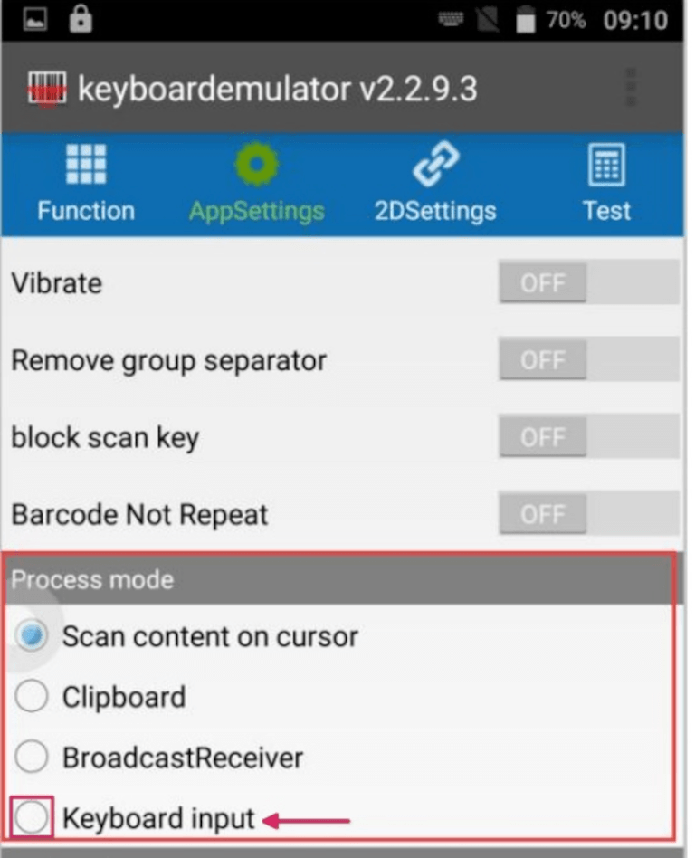
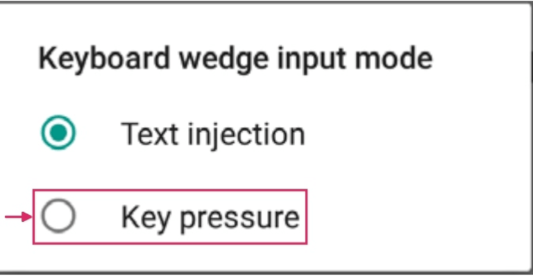

# Barcode device troubleshooting

Odoo _Barcode_ supports three main types of barcode scanners: USB scanners, bluetooth scanners, and\
mobile computer scanners. While configuring each type of scanner, common issues may arise, in which\
the scanners do not work as intended, and Odoo returns errors to the device.

Read the sections below to identify general and unique device issues, related to specific, popular\
types of scanners.

## General issues

Refer to the following sections below for common issues involving popular barcode scanner devices.

For issues related to specific devices, refer to the [Android scanners](device_troubleshooting.md#barcode-setup-android-scanners) section for mobile computer scanners, or to the [Screenless\
scanners](device_troubleshooting.md#barcode-setup-screenless-scanners) section for USB and bluetooth scanners.

### Barcode cannot be read

One common issue encountered when using barcode scanners is an error resulting from barcodes that\
cannot be read.

This can occur due to any of the following reasons:

* The barcode is damaged.
* The device cannot read the required barcode type (some scanners can only read 2D barcodes).
* The barcode being scanned is on a screen. Some scanners don't support this, and the barcodes**must** be printed out to be scanned. This is most common with 1D barcodes.
* The device has no battery, or is broken. To rule this out, follow the troubleshooting instructions\
  in the following sections.

### Odoo returns barcode error

All types of barcode scanners have their own device "language", which affects how they output\
barcode data to Odoo's _Barcode_ app. Sometimes, this can cause Odoo _Barcode_ to return a barcode\
error after scanning. This could be due to any of the following reasons:

*   The computer is configured with a different keyboard layout than the barcode scanner. To rule this\
    out, ensure that the device is configured with the same keyboard layout.

    For example, if the computer is configured to use an FR-BE keyboard, configure the scanner to send\
    FR-BE keystrokes. The same logic applies if using a tablet instead of a computer.

    For more information on configuring keystrokes, refer to the [Barcode scanner setup](applications/inventory_and_mrp/barcode/setup/hardware.md) documentation.
* For mobile computer scanners (such as Zebra devices, for example), the scanner might interpret the\
  barcode differently than intended. To rule this out, scan a test barcode to see how the scanner\
  interprets the barcode.

## Android scanners

The most recent barcode scanner models using Android and Google Chrome should work with Odoo.\
However, due to the variety of models and configurations, it is recommended to first test a\
scanner's compatibility with Odoo.

The Zebra product line is recommended; specifically, the **Zebra TC21 (WiFi-only)**, and **Zebra**\
**TC26 (WiFi/cellular)**.

#### SEE ALSO

[Odoo Inventory & Barcode compatible hardware](https://www.odoo.com/app/inventory-hardware)

### Barcode app does not give feedback

By default, Android barcode scanners pre-process the barcode, then send a full text. Since Odo&#x6F;_&#x42;arcode_ does not read this type of output, settings for each type of scanner **must** be\
configured correctly.

Odoo _Barcode_ expects that the scanner works like an analogue keyboard, and so, only detects _key_\
_events_. Refer to the following sections for configuration settings for the most popular devices.

### Zebra TC21/TC26

When using Zebra scanners, ensure the following keystroke configurations are set to prevent errors.

Begin on the Zebra scanner's home screen, and select the DataWedge app (the app is\
represented by a (light blue barcode) icon).

On the DataWedge Profiles page, select the profile option to access the Zebra scanner's\
settings.

Once the profile is selected, scroll down to the Keyboard Output option, and ensure the\
Enable/disable keystroke output option is Enabled.

Once that option is enabled, go back to the Profile options page, and go to the\
Keystroke output section. Then, open the Key event options submenu. Under\
Characters, ensure the Send Characters as Events option is checked.

#### IMPORTANT

The Send Characters as Events option **must** be checked on the Zebra scanner, or\
Odoo **cannot** recognize the barcodes that are scanned.

Once the above steps have been taken, perform a test scan to ensure the Zebra scanner is working as\
intended.

### Thiết bị Android MUNBYN

When using MUNBYN Android scanners, ensure the following configurations are set to prevent errors.

From the device's home screen, click AppSettings. On the resulting page, locate the\
Process mode section, and select Keyboard input.

Once the above steps have been taken, perform a test scan to ensure the MUNBYN Android scanner is\
working as intended.

### Thiết bị Android Datalogic

When using Datalogic Android scanners, ensure the following configurations are set to prevent\
errors.

To view and configure all settings for the scanner, use the _Settings_ app on the Datalogic Android\
device. From the applications menu, select Settings ‣ System ‣ Scanner\
Settings.

From the resulting list of settings, select Wedge. From this menu, under the\
Keyboard wedge section, ensure that the Enable keyboard wedge feature is\
activated.

Then, also under the Keyboard wedge section, locate the Keyboard wedge input\
mode option. By default, the input mode is set to Text injection.

Click Keyboard wedge input mode, and change the setting to Key pressure.\
This ensures that scanned barcodes are translated into keyboard strokes, instead of being injected\
into the text area.

Once all those steps have been taken, perform a test scan to ensure the Datalogic Android scanner is\
working as intended.

## Screenless scanners

Screenless scanners are barcode scanning devices that have no screens. These include USB scanners\
and bluetooth scanners.

#### IMPORTANT

Odoo supports most USB and Bluetooth barcode scanners, as they all emulate a keyboard. However,\
to verify that a scanner is compatible with a specific keyboard layout (or can be configured to\
do so), refer to Odoo's [Inventory & Barcode compatible hardware](https://www.odoo.com/app/inventory-hardware) documentation.

### Thiết bị NETUM

By default, the NETUM barcode scanner's user manual only shows the French keyboard configuration. To\
use the Belgian keyboard, scan the code below:

Once that code has been scanned, ensure the NETUM scanner has the correct keyboard configuration,\
and is working as intended.

#### SEE ALSO

* [Thiết lập máy quét mã vạch](applications/inventory_and_mrp/barcode/setup/hardware.md)
* [Activate the Barcodes in Odoo](applications/inventory_and_mrp/barcode/setup/software.md)
