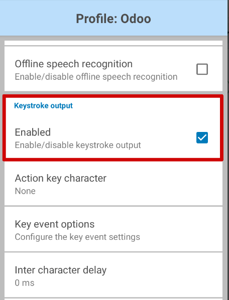

# Thiết lập máy quét mã vạch

Follow this guide to choose and set up a barcode scanner compatible with Odoo's *Inventory* and
*Barcode* apps.

## Scanner types

Before setting up a barcode scanner, it is important to determine which type of scanner best meets
the needs of the business. There are three main types of scanners that can be used with Odoo, each
with their own benefits and use cases:

- **USB scanners** are connected to a computer, and are suitable for businesses that scan products
  at a fixed location, like at the checkout line in a grocery store.
- **Bluetooth scanners** pair with a smartphone or tablet, making them both a cost-effective and
  portable barcode scanner option. In this scenario, Odoo is installed on the smartphone, allowing
  warehouse operators to handle operations, and check stock, directly through their mobile devices.
- **Mobile computer scanners** are mobile devices with a built-in barcode scanner.

  #### IMPORTANT
  If using a USB scanner, ensure the scanner is compatible with the keyboard layout of the
  computer.

  If using a mobile computer scanner, ensure the device can run the Odoo mobile app properly.
  Recent models that use Android OS with the Google Chrome browser, or Windows OS with Microsoft
  Edge, should work. However, testing is crucial due to the variety of available models and
  configurations.

#### SEE ALSO
[Odoo Inventory & Barcode • Compatible Hardware](https://www.odoo.com/app/inventory-hardware)

## Cấu hình

When setting up the barcode scanner, make sure the following configurations are correct so the
scanner can properly interpret barcodes with Odoo.

### Bố cục bàn phím

When using a USB barcode scanner, match its keyboard layout with the operating system's layout for
proper interpretation of characters. Generally, the scanning mode should be set to accept a USB
keyboard (HID), with the language set based on the keyboard that is in use.

To configure the keyboard layout for a **Zebra** scanner, scan the keyboard wedge barcode for the
desired language in the scanner's user manual.

### Automatic carriage return

Odoo có độ trễ mặc định là 100 mili giây giữa các lần quét để tránh quét trùng lặp do sơ ý. Để đồng bộ với máy quét mã vạch, cần cấu hình máy quét thêm ký tự *xuống dòng* () sau mỗi lần quét. Odoo sẽ hiểu ký tự xuống dòng là kết thúc nhập liệu mã vạch, từ đó xác nhận lần quét hiện tại và sẵn sàng cho lần quét tiếp theo.

Typically, on the scanner, a carriage return is included by default. Ensure it is set by scanning a
specific barcode in the user manual, like `CR suffix ON` or `Apply Enter for suffix`.

## Máy quét Zebra

When using Zebra scanners, ensure the following keystroke configurations are set to prevent errors.

Begin on the Zebra scanner's home screen, and select the DataWedge app (the app is
represented by a (light blue barcode) icon).

On the DataWedge Profiles page, select the profile option to access the Zebra scanner's
settings.

#### WARNING
It is **not** suggested to use the "DWDemo" profile, as it does not work properly in every
circumstance.

Instead, it is recommended to create a new, personal profile. Once a new profile is created, add
the *Odoo Mobile* app and *Google Chrome* app in the Associated Apps on the scanner's
home screen.

Once the profile is selected, scroll down to the Keyboard Output option, and ensure the
Enable/disable keystroke output option is Enabled.

Once that option is enabled, go back to the Profile options page, and go to the
Keystroke output section. Then, open the Key event options submenu. Under
Characters, ensure the Send Characters as Events option is checked.

#### IMPORTANT
The Send Characters as Events option **must** be checked on the Zebra scanner, or
Odoo **cannot** recognize the barcodes that are scanned.

Once all those steps have been taken, perform a test scan to ensure the Zebra scanner is working
properly, as intended.

## Honeywell mobile computer scanner

When using Honeywell scanners, follow the instructions below to ensure barcodes can be scanned in
Odoo.

Begin on the Honeywell scanner's home screen, and select Settings, represented by a
⚙️ (gear) icon. Then, click Honeywell Settings, followed by
Scanning.

From here, click Internal Scanner, followed by Default Profile. From the
resulting list of options, select Data Processing Settings.

The Data Processing Settings specify how barcode data is processed by the computer.
Locate the Wedge Method setting. By default, this is set to Standard.

Change the Wedge Method setting to Keyboard.

After completing the steps, conduct a test scan to verify the Honeywell scanner is working as
intended.

## Cipherlab mobile computer scanner

When using Cipherlab scanners, follow the instructions below to ensure barcodes can be scanned in
Odoo.

Begin on the Cipherlab scanner's home screen, and navigate to the App Drawer (All
Applications). Then, click the ReaderConfig app, represented by an orange
⚙️ (gear) icon over a blue (barcode) icon.

Next, select the Default Profile, or create a new profile, if needed.

Under the General Settings, click Data Output, followed by
Keyboard Emulation.

By default, the Input Method, under Keyboard Emulation, is set to
Default Mode. Change this setting to KeyEvent.

After completing the steps, conduct a test scan to verify the Cipherlab scanner is working as
intended.

#### SEE ALSO
[Activate the Barcodes in Odoo](software.md)
