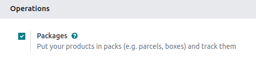
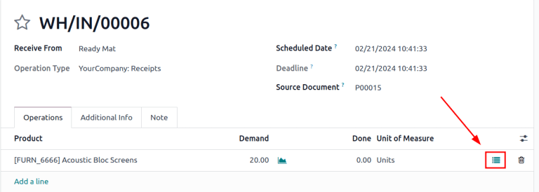
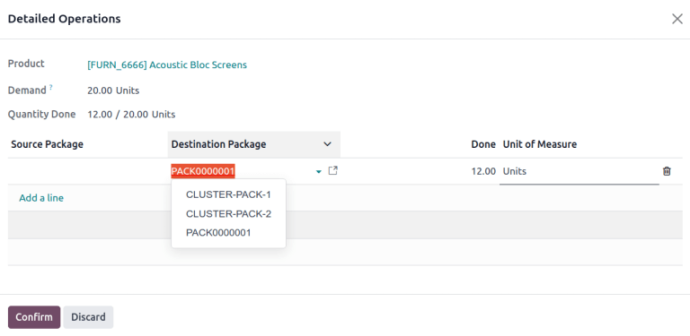

# Kiện hàng

*Kiện hàng* là một bao bì vật lý chứa một hoặc nhiều sản phẩm. Kiện hàng cũng có thể được sử dụng để lưu trữ hàng hoá với số lượng lớn.

Kiện hàng thường được sử dụng cho các mục đích sau:

1. [Nhóm sản phẩm để di chuyển chúng theo số lượng lớn](#inventory-warehouses-storage-pack).
2. [Giao hàng cho khách hàng](#inventory-warehouses-storage-package-type): cấu hình các loại kiện hàng cho phù hợp với yêu cầu về kích thước và trọng lượng của đơn vị vận chuyển, hợp lý hóa quy trình đóng gói và đảm bảo tuân thủ các thông số kỹ thuật vận chuyển của đơn vị vận chuyển.
3. Lưu trữ hàng hoá với số lượng lớn.

*Sử dụng kiện hàng* là một trường trên biểu mẫu kiện hàng trong Odoo chỉ hiển thị khi bật tính năng *Lệnh chuyển hàng theo lô* và *Kiện hàng* (Ứng dụng Tồn kho ‣ Cấu hình ‣ Cài đặt).

Theo mặc định, trường *Sử dụng kiện hàng* trên biểu mẫu kiện hàng được đặt thành *Hộp dùng một lần*. Thay đổi trường này thành *Hộp tái sử dụng* **chỉ** khi cấu hình kiện hàng cho [lấy hàng theo cụm](#inventory-warehouses-storage-cluster-pack).

*Loại kiện hàng* là tính năng tùy chọn được sử dụng để [tính toán phí vận chuyển](applications/inventory_and_mrp/inventory/shipping_receiving/setup_configuration.md), dựa trên khối lượng vận chuyển thực tế. Tạo loại kiện hàng để tính cả khối lượng của chính kiện hàng đó (ví dụ: hộp, pallet, các loại bao bì vận chuyển khác) trong tính toán phí vận chuyển.

#### NOTE
Mặc dù kiện hàng thường được sử dụng trong [tuyến giao hàng ba bước](applications/inventory_and_mrp/inventory/shipping_receiving/daily_operations/delivery_three_steps.md), nhưng chúng có thể được sử dụng trong mọi quy trình liên quan đến các sản phẩm lưu kho.

## Cấu hình

Để sử dụng kiện hàng, trước tiên hãy đi đến Ứng dụng Tồn kho ‣ Cấu hình ‣ Cài đặt. Trong tiêu đề Hoạt động, kích hoạt tính năng Kiện hàng. Sau đó, nhấp vào Lưu.

When moving packages internally, the *Move Entire Packages* feature can be enabled on an operation
type to update a package's contained item's location upon updating the package's location.

To do that, go to Inventory app ‣ Configuration ‣ Operations Types and select
the desired operation this feature will apply to (may have to set it for multiple).

On the operation type page, in the Packages section, tick the Move Entire
Packages checkbox.

## Đóng gói hàng hoá

Có thể thêm sản phẩm vào kiện hàng trong bất kỳ điều chuyển nào bằng cách:

1. Nhấp vào mỗi biểu tượng [Hoạt động chi tiết](#inventory-warehouses-storage-detailed-operations) trên dòng sản phẩm.
2. Sử dụng nút [Đóng hàng thành kiện](#inventory-warehouses-storage-put-in-pack) để đặt mọi mặt hàng trong điều chuyển vào một kiện hàng.

### Hoạt động chi tiết

Trong bất kỳ điều chuyển tồn kho nào (VD: phiếu nhập kho, lệnh giao hàng), thêm sản phẩm vào kiện hàng bằng cách nhấp vào biểu tượng ⦙≣ (danh sách có dấu đầu dòng) trong tab Hoạt động.

Thao tác này sẽ mở cửa sổ pop-up Hoạt động chi tiết cho Sản phẩm.

Để đặt Sản phẩm vào một kiện hàng, nhấp vào Thêm một dòng và gán sản phẩm vào Kiện hàng đích. Chọn một kiện hàng hiện có hoặc tạo mới bằng cách nhập tên của kiện hàng mới, sau đó chọn Tạo....

Sau đó, chỉ định số lượng mặt hàng sẽ đưa vào kiện hàng trong cột Hoàn tất. Lặp lại các bước trên để đặt Sản phẩm vào các kiện hàng khác nhau. Khi hoàn tất, nhấp vào Xác nhận để đóng cửa sổ.

#### SEE ALSO
[Giao một đơn hàng bằng nhiều kiện hàng](applications/inventory_and_mrp/inventory/shipping_receiving/setup_configuration/multipack.md)

### Đóng hàng thành kiện

Ngoài ra, bạn có thể nhấp vào nút Đóng hàng thành kiện trong **bất kỳ** điều chuyển tồn kho nào để tạo một kiện hàng mới và đặt tất cả mặt hàng trong điều chuyển đó vào kiện hàng mới tạo.

#### IMPORTANT
Nút Đóng hàng thành kiện xuất hiện trên phiếu nhập kho, lệnh giao hàng và các biểu mẫu điều chuyển khác khi tính năng *Kiện hàng* được bật trong Ứng dụng Tồn kho ‣ Cấu hình ‣ Cài đặt.

## Loại kiện hàng

Tạo loại kiện hàng bằng cách đi đến Ứng dụng Tồn kho ‣ Cấu hình ‣ Loại kiện hàng, để thiết lập kích thước tùy chỉnh và giới hạn khối lượng. Tính năng này chủ yếu được sử dụng để tính khối lượng kiện hàng khi xác định phí vận chuyển.

#### SEE ALSO
- [Đơn vị vận chuyển](applications/inventory_and_mrp/inventory/shipping_receiving/setup_configuration/third_party_shipper.md)
- [Delivery methods](applications/inventory_and_mrp/inventory/shipping_receiving/setup_configuration.md)

Trên danh sách Loại kiện hàng, khi nhấp vào Mới sẽ mở một biểu mẫu loại kiện hàng trống. Các trường của biểu mẫu như sau:

- Loại kiện hàng (bắt buộc): xác định tên loại kiện hàng.
- Kích thước: xác định kích thước của kiện hàng theo milimet (mm). Các trường, từ trái sang phải, xác định Chiều dài, Chiều rộng và Chiều cao.
- Khối lượng: khối lượng của một kiện hàng rỗng (VD: hộp rỗng, pallet).

#### NOTE
Odoo tính toán khối lượng kiện hàng bằng cách cộng khối lượng của kiện hàng rỗng với khối lượng của hàng hoá, có thể tìm thấy trong trường Khối lượng, trong tab Tồn kho, của mỗi biểu mẫu sản phẩm.

- Khối lượng tối đa: khối lượng vận chuyển tối đa được phép trong kiện hàng.
- Mã vạch: chỉ định mã vạch để nhận diện loại kiện hàng từ việc quét mã.
- Công ty: chỉ định một công ty để loại kiện hàng **chỉ** khả dụng tại công ty đã chọn. Để trống trường này nếu kiện hàng khả dụng tại tất cả công ty.
- Đơn vị vận chuyển: chỉ định đơn vị vận chuyển dự kiến ​​cho loại kiện hàng này.
- Mã đơn vị vận chuyển: chỉ định mã được liên kết với loại kiện hàng.

## Kiện hàng theo cụm

Để sử dụng *kiện hàng theo cụm*, trước tiên hãy đi đến Ứng dụng Tồn kho ‣ Cấu hình ‣ Cài đặt và kích hoạt tính năng Lệnh chuyển hàng theo lô, nằm trong phần Hoạt động. Sau đó, trường *Sử dụng kiện hàng* sẽ hiển thị trên biểu mẫu kiện hàng.

Thêm các kiện hàng mới bằng cách đi đến Ứng dụng Tồn kho ‣ Sản phẩm ‣ Kiện hàng. Sau đó, nhấp vào Mới hoặc chọn một kiện hàng hiện có. Thao tác này sẽ mở biểu mẫu kiện hàng chứa các trường sau:

- Tham chiếu kiện hàng (bắt buộc): tên của kiện hàng.
- Loại kiện hàng: được sử dụng khi [cấu hình hộp vận chuyển để vận chuyển đến khách hàng](#inventory-warehouses-storage-package-type).

  #### NOTE
  Loại kiện hàng không cần thiết cho cấu hình kiện hàng khi lấy hàng theo cụm.
- Khối lượng vận chuyển: dùng để nhập khối lượng của kiện hàng sau khi cân bằng cân.
- Công ty: chỉ định một công ty để kiện hàng **chỉ** khả dụng tại công ty đã chọn. Để trống trường này nếu kiện hàng khả dụng tại tất cả công ty.
- Vị trí: vị trí hiện tại của kiện hàng.
- Ngày đóng hàng: ngày kiện hàng được tạo.
- Sử dụng kiện hàng: chọn Tái sử dụng cho các kiện hàng dùng để chuyển sản phẩm trong kho; Dùng một lần cho các kiện hàng dùng để vận chuyển sản phẩm đến tay khách hàng.

#### SEE ALSO
[Sử dụng kiện hàng theo cụm](applications/inventory_and_mrp/inventory/shipping_receiving/picking_methods/cluster.md)
