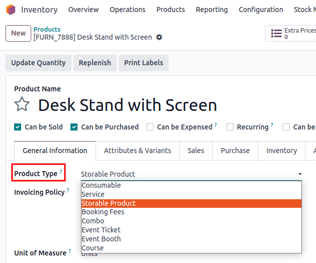
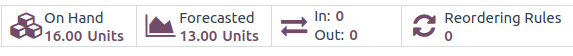
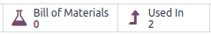
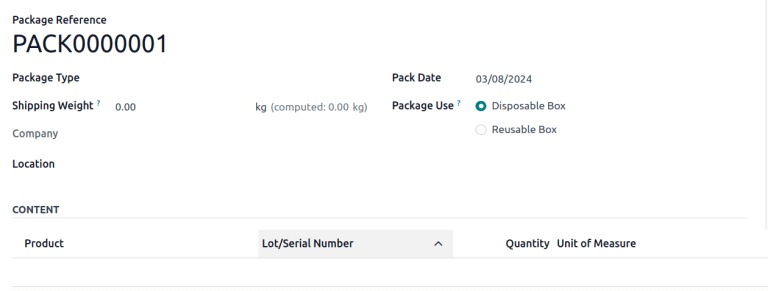
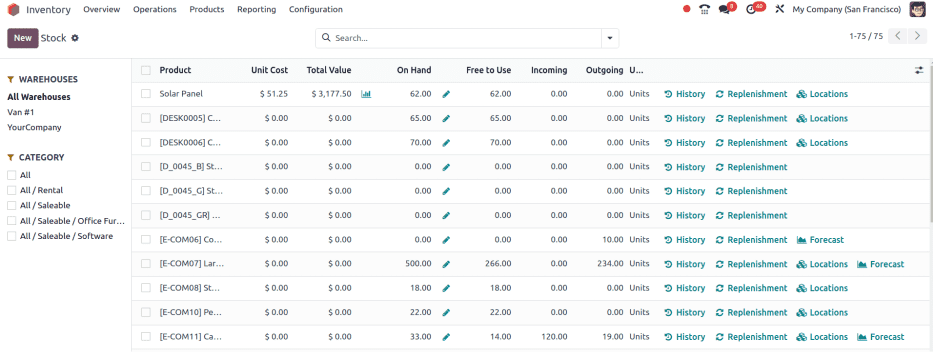
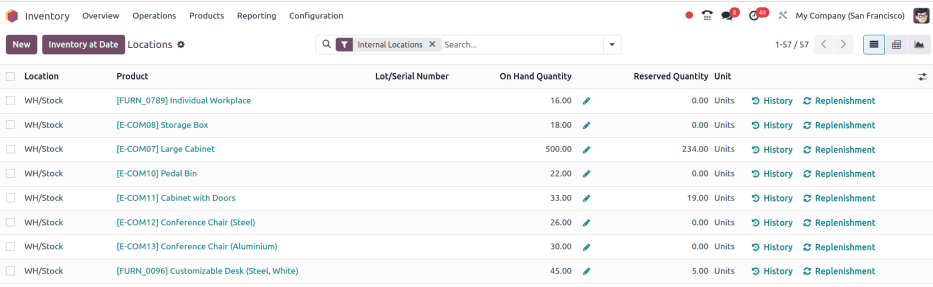

# Loại sản phẩm

Xác định *loại sản phẩm* trong Odoo để theo dõi sản phẩm với nhiều chi tiết khác nhau.

Phân loại sản phẩm thành *lưu kho* để theo dõi số lượng hàng tồn kho, cho phép người dùng kích hoạt [quy tắc tái đặt hàng](../../warehouses_storage/replenishment/reordering_rules.md) để tạo đơn mua hàng. Sản phẩm *sử dụng* được cho là luôn có sẵn, và sản phẩm *dịch vụ* được thực hiện và phục vụ bởi doanh nghiệp.

#### SEE ALSO
[Odoo Hướng dẫn: Loại sản phẩm](https://www.youtube.com/watch?v=l6j0ZkP5mLM)

## Thiết lập loại sản phẩm

Để thiết lập loại sản phẩm, đi đến Ứng dụng Tồn kho ‣ Sản phẩm ‣ Sản phẩm và chọn sản phẩm mong muốn từ danh sách.

Trên biểu mẫu sản phẩm, trong trường Loại sản phẩm, chọn:

- Sản phẩm lưu kho cho các sản phẩm được theo dõi bằng số lượng hàng tồn kho. Chỉ các sản phẩm lưu kho mới có thể kích hoạt các quy tắc tái đặt hàng để tạo đơn mua hàng;
- Tiêu thụ chỉ các sản phẩm luôn được cho là có sẵn, số lượng không cần theo dõi hoặc dự báo (VD: đinh, giấy vệ sinh, cà phê,....). Sản phẩm sử dụng có thể thay thế được và là sản phẩm thiết yếu, nhưng không cần số lượng chính xác; hoặc
- Dịch vụ dành cho các sản phẩm dịch vụ có thể bán được đã được thực hiện và không được theo dõi bằng số lượng hàng tồn kho (VD: dịch vụ bảo trì, lắp đặt hoặc sửa chữa).
  

#### NOTE
Các loại sản phẩm được liệt kê ở trên là một phần của ứng dụng *Tồn kho* chuẩn. Để truy cập vào các trường dưới đây, hãy [cài đặt](../../../../general/apps_modules.md#general-install) các ứng dụng tương ứng **ngoài** *Tồn kho*.

- Phí đặt lịch: tính phí đặt lịch hẹn qua ứng dụng *Lịch hẹn*. Yêu cầu cài đặt ứng dụng *Lịch* và phân hệ *Thanh toán để đặt lịch* (`appointment_account_payment`)
- Combo: tạo các sản phẩm giảm giá được bán cùng nhau. Yêu cầu cài đặt ứng dụng *PoS*.
- Vé sự kiện: được bán cho những người tham dự muốn đến sự kiện. Yêu cầu cài đặt ứng dụng *Sự kiện*
- Gian hàng sự kiện: được bán cho các đối tác hoặc nhà tài trợ để dựng gian hàng tại một sự kiện. Yêu cầu cài đặt ứng dụng *Sự kiện*
- Khóa học: bán quyền truy cập vào khóa học giáo dục. Yêu cầu cài đặt ứng dụng *Học trực tuyến*

## So sánh các loại sản phẩm

Dưới đây là tóm tắt về cách mỗi loại sản phẩm ảnh hưởng đến các hoạt động *Tồn kho* phổ biến, ví dụ như lệnh chuyển hàng, quy tắc tái đặt hàng và báo cáo dự báo. Nhấp vào mục có dấu hoa thị (\*) để truy cập các phần cụ thể.

| Loại sản phẩm                                                              | Lưu kho                                              | Tiêu thụ                                           | Dịch vụ                                                |
|----------------------------------------------------------------------------|------------------------------------------------------|----------------------------------------------------|--------------------------------------------------------|
| Sản phẩm vật lý                                                            | Có                                                   | Có                                                 | Không                                                  |
| Số lượng hiện có                                                           | [Có\*](#inventory-product-management-on-hand-store)  | [Có\*](#inventory-product-management-on-hand-con)  | Không                                                  |
| [Inventory valuation](../inventory_valuation/using_inventory_valuation.md) | Có                                                   | Không                                              | Không                                                  |
| Tạo lệnh chuyển hàng                                                       | [Có\*](#inventory-product-management-transfer-store) | [Có\*](#inventory-product-management-transfer-con) | [Không\*](#inventory-product-management-transfer-serv) |
| [Theo dõi số lô/sê-ri](../product_tracking.md)                             | Có                                                   | Không                                              | Không                                                  |
| Tạo đơn mua hàng                                                           | Có                                                   | [Có\*](#inventory-product-management-po)           | Không                                                  |
| Có thể sản xuất hoặc gia công                                              | [Có\*](#inventory-product-management-manufacture)    | [Có\*](#inventory-product-management-manufacture)  | Không                                                  |
| Có thể nằm trong kit                                                       | Có                                                   | Có                                                 | Không                                                  |
| Được đặt trong kiện hàng                                                   | Có                                                   | [Có\*](#inventory-product-management-package)      | Không                                                  |
| Xuất hiện trên báo cáo Tồn kho                                             | [Có](#inventory-product-management-report)           | Không                                              | Không                                                  |

### Số lượng hiện có

Số lượng sản phẩm lưu kho hiện có và dự báo, dựa trên các đơn đặt hàng sắp nhập và sắp xuất, được phản ánh trên biểu mẫu sản phẩm, truy cập bằng cách vào Ứng dụng Tồn kho ‣ Sản phẩm ‣ Sản phẩm và chọn sản phẩm mong muốn.

Mặt khác, các sản phẩm sử dụng được coi là luôn có sẵn và **không thể** quản lý chúng bằng các quy tắc tái đặt hàng hoặc số lô/sê-ri.

### Tạo lệnh chuyển hàng

*Lệnh chuyển hàng* là bất kỳ hoạt động kho nào, chẳng hạn như nhận hàng, lệnh chuyển hàng nội bộ hoặc theo lô hay giao hàng.

Khi tạo một lệnh chuyển hàng cho các sản phẩm lưu kho trong ứng dụng *Tồn kho*, lệnh chuyển hàng này sẽ sửa đổi số lượng hàng hiện có tại mỗi địa điểm.

Ví dụ, việc chuyển năm đơn vị sản phẩm từ địa điểm nội bộ `WH/Stock` sang `WH/Packing Zone` sẽ làm giảm số lượng đã ghi nhận tại `WH/Stock` và tăng số lượng tại `WH/Packing Zone`.

Đối với các sản phẩm sử dụng, có thể tạo lệnh chuyển hàng, nhưng không theo dõi được số lượng chính xác tại mỗi địa điểm lưu trữ.

Không thể áp dụng lệnh chuyển hàng đối với các sản phẩm dịch vụ, nhưng chúng có thể được [liên kết với các dự án và nhiệm vụ để theo dõi thời hạn](https://www.youtube.com/watch?v=fix2LGkv13c).

### Tạo đơn mua hàng

Cả sản phẩm lưu kho và sản phẩm sử dụng đều có thể được áp dụng yêu cầu báo giá trong ứng dụng *Mua hàng*.

Tuy nhiên, khi nhận sản phẩm sử dụng, số lượng hiện có không thay đổi khi xác nhận phiếu nhập kho (VD: `WH/IN`).

### Sản xuất hoặc gia công

Các sản phẩm lưu kho và sử dụng có thể được sản xuất, gia công hoặc đưa vào Định mức thành phần (ĐMNL).

### Kiện hàng

Cả sản phẩm lưu kho và sử dụng đều có thể được đặt trong [kiện hàng](package.md).

Tuy nhiên, đối với các sản phẩm sử dụng, số lượng hàng sẽ không được theo dõi và sản phẩm không được liệt kê trong Nội dung của kiện hàng, truy cập bằng cách vào Ứng dụng Tồn kho ‣ Sản phẩm ‣ Kiện hàng và chọn kiện hàng mong muốn.

Nếu bật tính năng *Dịch chuyển toàn bộ kiện hàng*, việc dịch chuyển kiện hàng sẽ cập nhật địa điểm của các sản phẩm lưu kho được chứa trong đó. Tuy nhiên, địa điểm của các sản phẩm sử dụng sẽ không được cập nhật.

### Báo cáo tồn kho

**Chỉ** các sản phẩm lưu kho mới xuất hiện trong các báo cáo sau.

*Báo cáo hàng tồn kho* là danh sách toàn diện về tất cả sản phẩm lưu kho hiện có, chưa được dự trữ, sắp vào và sắp xuất. Báo cáo này chỉ khả dụng cho người dùng có [quyền quản trị viên](../../../../general/users/access_rights.md) và được truy cập bằng cách đi đến Ứng dụng Tồn kho ‣ Báo cáo ‣ Hàng tồn kho.

*Báo cáo địa điểm* là bản phân tích chi tiết từng địa điểm (nội bộ, bên ngoài hoặc ảo) cũng như số lượng hàng hiện có và số lượng dự trữ của từng sản phẩm lưu kho. Báo cáo này chỉ khả dụng khi tính năng *Vị trí lưu trữ* được kích hoạt (Ứng dụng Tồn kho ‣ Cấu hình ‣ Cài đặt) và đối với người dùng có [quyền quản trị viên](../../../../general/users/access_rights.md).

Điều hướng đến báo cáo địa điểm bằng cách vào Ứng dụng Tồn kho ‣ Báo cáo ‣ Địa điểm.

