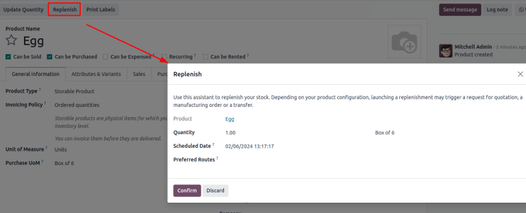

# Đơn vị tính

Trong một số trường hợp, doanh nghiệp sẽ cần xử lý sản phẩm theo các đơn vị tính khác nhau. Ví dụ, một doanh nghiệp có thể mua sản phẩm từ một quốc gia sử dụng hệ mét, sau đó bán những sản phẩm đó ở một quốc gia sử dụng hệ thống đo lường Anh. Trong trường hợp đó, doanh nghiệp này cần phải chuyển đổi đơn vị tính.

Một trường hợp khác về chuyển đổi đơn vị là khi một doanh nghiệp mua sản phẩm theo kiện hàng lớn từ nhà cung cấp, sau đó bán những sản phẩm đó theo từng đơn vị nhỏ lẻ.

Odoo có thể được thiết lập để sử dụng nhiều  *đơn vị tính (ĐVT)* khác nhau cho một sản phẩm.

## Cấu hình

Để sử dụng các đơn vị tính khác nhau trong Odoo, trước tiên hãy đi đến Ứng dụng Tồn kho ‣ Cấu hình ‣ Cài đặt, và trong phần Sản phẩm, kích hoạt cài đặt Đơn vị tính. Sau đó, nhấp vào Lưu.


## Danh mục đơn vị tính

Sau khi bật cài đặt  *Đơn vị tính*, xem các danh mục đơn vị tính mặc định trong Ứng dụng Tồn kho ‣ Cấu hình ‣ Danh mục ĐVT. Danh mục này rất quan trọng đối với việc chuyển đổi đơn vị; Odoo chỉ có thể chuyển đổi đơn vị của sản phẩm từ đơn vị này sang đơn vị khác **nếu** cả hai đơn vị đều thuộc cùng một danh mục.


Mỗi danh mục đơn vị tính đều có một đơn vị tham chiếu. Đơn vị tham chiếu được tô màu xanh lam trong cột ĐVT của trang Danh mục đơn vị tính. Odoo sử dụng đơn vị tham chiếu làm cơ sở cho bất kỳ đơn vị mới nào.

Để tạo một đơn vị mới, trước tiên hãy chọn đúng danh mục từ trang Danh mục đơn vị tính. Ví dụ, để bán một sản phẩm trong hộp có 6 đơn vị, hãy nhấp vào dòng danh mục Đơn vị. Sau đó, trên trang danh mục, hãy nhấp vào Thêm một dòng trong tab Đơn vị tính. Sau đó, trong trường Đơn vị tính, đặt tên cho đơn vị mới, chẳng hạn như `Hộp 6 đơn vị`, sau đó trong trường Loại, chọn tham chiếu kích thước phù hợp, chẳng hạn như Lớn hơn Đơn vị tính tham chiếu.

Nếu có, hãy nhập Danh mục UNSPSC, đây là [mã được công nhận trên toàn cầu do GS1](https://www.unspsc.org/) quản lý, **phải** mua mã này để sử dụng.

Trong trường Tỷ lệ, hãy nhập số lượng đơn vị đơn lẻ trong 

```
|ĐVT|
```

 mới, chẳng hạn như `6.00000` khi sử dụng ví dụ về `Hộp 6 đơn vị` (vì hộp 6 đơn vị *lớn hơn* 6 lần so với đơn vị tham chiếu, `1.00000`).


## Chỉ định đơn vị tính của sản phẩm

Để thiết lập đơn vị tính cho một sản phẩm, trước tiên hãy vào Ứng dụng Tồn kho ‣ Sản phẩm ‣ Sản phẩm và chọn một sản phẩm để mở trang biểu mẫu sản phẩm của sản phẩm đó.

Trong tab Thông tin chung, chỉnh sửa trường Đơn vị tính để chỉ định đơn vị tính mà sản phẩm được bán. Đơn vị được chỉ định cũng là đơn vị được sử dụng để theo dõi hàng tồn kho và hoạt động chuyển hàng nội bộ của sản phẩm đó.

Chỉnh sửa trường ĐVT mua hàng để chỉ định đơn vị tính khi mua sản phẩm.

<a id="inventory-product-replenishment-unit-conversion"></a>

## Chuyển đổi đơn vị

Odoo tự động chuyển đổi đơn vị tính khi sản phẩm có  khác với  mua hàng.

Việc này xảy ra trong nhiều trường hợp, bao gồm:

1. [Đơn đặt hàng nhà cung cấp](#inventory-product-replenishment-buy-in-uom): 

   ```
   |ĐVT|
   ```

    mua hàng trên đơn mua hàng (PO) được chuyển thành 

   ```
   |ĐVT|
   ```

    trên các chứng từ kho nội bộ
2. [Bổ sung hàng tự động](#inventory-product-replenishment-replenish): tạo  khi lượng hàng tồn kho của một sản phẩm (được theo dõi trong 

   ```
   |ĐVT|
   ```

   ) giảm xuống dưới một mức nhất định. Nhưng,  được tạo theo 

   ```
   |ĐVT|
   ```

    mua hàng
3. [Bán sản phẩm](#inventory-product-replenishment-sell-in-uom): nếu sử dụng 

   ```
   |ĐVT|
   ```

    khác trên đơn bán hàng (SO), số lượng trên lệnh giao hàng sẽ được chuyển đổi theo 

   ```
   |ĐVT|
   ```

    ưu tiên của kho hàng

<a id="inventory-product-replenishment-buy-in-uom"></a>

### Mua sản phẩm bằng ĐVT mua hàng

Khi tạo yêu cầu báo giá (RFQ) mới trong ứng dụng *Mua hàng*, Odoo sẽ tự động sử dụng đơn vị tính mua hàng được chỉ định của sản phẩm. Nếu cần, bạn có thể chỉnh sửa thủ công giá trị ĐVT trên .

Sau khi  được xác nhận thành , hãy nhấp vào nút thông minh Phiếu nhập kho ở đầu .

Odoo sẽ tự động chuyển đổi đơn vị tính mua hàng thành đơn vị tính bán hàng/tồn kho của sản phẩm đó, do đó cột Nhu cầu của phiếu nhập kho sẽ hiển thị số lượng đã chuyển đổi.

<a id="inventory-product-replenishment-replenish"></a>

### Bổ sung hàng

Yêu cầu báo giá cho một sản phẩm cũng có thể được tạo ngay từ biểu mẫu sản phẩm bằng cách sử dụng nút Bổ sung hàng.

Sau khi nhấp vào Bổ sung hàng, tab bổ sung hàng sẽ bật lên. Nếu cần, bạn có thể chỉnh sửa thủ công đơn vị tính mua hàng trong trường Số lượng. Sau đó, nhấp vào Xác nhận để tạo .

#### IMPORTANT
 **chỉ** có thể được tạo tự động nếu có ít nhất **một** nhà cung cấp được liệt kê trong tab Mua hàng của biểu mẫu sản phẩm.



Đi đến  đã tạo bằng cách nhấp vào nút thông minh Được dự báo trên biểu mẫu sản phẩm. Cuộn xuống phần Tồn kho được dự báo và trong dòng Yêu cầu báo giá, nhấp vào số tham chiếu  để mở bản nháp . Nếu cần, có thể chỉnh sửa 

```
|ĐVT|
```

 mua hàng ngay trên .

<a id="inventory-product-replenishment-sell-in-uom"></a>

### Bán theo ĐVT khác

Khi tạo báo giá mới trong ứng dụng *Bán hàng*, Odoo tự động sử dụng đơn vị tính được chỉ định của sản phẩm. Nếu cần, có thể chỉnh sửa thủ công ĐVT trên báo giá.

Sau khi báo giá được gửi đến khách hàng và được xác nhận thành đơn bán hàng (SO), hãy nhấp vào nút thông minh Xuất kho ở đầu . Odoo sẽ tự động chuyển đổi đơn vị tính thành đơn vị tính tồn kho của sản phẩm. Do đó cột Nhu cầu của lệnh giao hàng sẽ hiển thị số lượng đã chuyển đổi.

Ví dụ, nếu 

```
|ĐVT|
```

 của sản phẩm trên  là `Hộp 6 đơn vị`, nhưng đơn vị tính tồn kho là `Đơn vị`,  sẽ hiển thị số lượng theo hộp 6 đơn vị và lệnh giao hàng sẽ hiển thị số lượng theo đơn vị.
