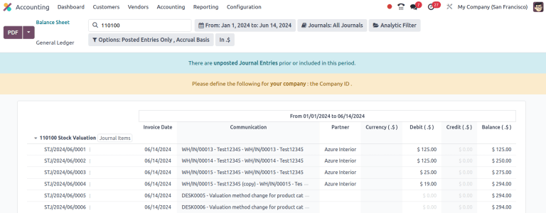

# Định giá tồn kho tự động

All of a company's stock on-hand contributes to the valuation of its inventory. That value should\
be reflected in the company's accounting records to accurately show the value of the company and\
all of its assets.

Theo mặc định, Odoo sử dụng phương pháp định giá tồn kho định kỳ (còn gọi là định giá tồn kho thủ công). Phương pháp này yêu cầu bộ phận kế toán ghi sổ bút toán theo cách thủ công dựa trên tồn kho thực tế của công ty, và nhân viên kho dành thời gian để kiểm đếm hàng tồn kho. Trong Odoo, mỗi danh mục sản phẩm phản ánh điều này với Phương pháp tính chi phí được đặt thành Giá tiêu chuẩn và Định giá tồn kho (không hiển thị theo mặc định) được đặt thành Thủ công.

Alternatively, perpetual (automatic) inventory valuation creates real-time _journal entries_ in th&#x65;_&#x41;ccounting_ app whenever stock enters or leaves the company's warehouse.

This document is focused on the proper setup of automatic inventory valuation, which is an\
integrated valuation method that ensures journal entries in the _Accounting_ app match stock\
valuation updates in the _Inventory_ app. For an introduction of inventory valuation in Odoo, refer\
to the [Using inventory valuation](applications/inventory_and_mrp/inventory/product_management/inventory_valuation/using_inventory_valuation.md) documentation.

#### WARNING

Switching from manual to automatic inventory valuation may cause discrepancies between stock\
valuation and accounting journals.

One [successful strategy](https://www.odoo.com/r/Kvfg) for switching to automated valuation:

1. Clear existing stock (possibly with an [inventory adjustment](applications/inventory_and_mrp/inventory/warehouses_storage/inventory_management/count_products.md))
2. Change the inventory valuation method to _Automatic_
3. Return the existing stock, with the original monetary value (using an inventory adjustment)

Once the existing stock is recovered, the Odoo _Accounting_ app automatically generates the\
journal entries to corresponding stock valuation records.

## Cấu hình

To properly set up automatic inventory valuation, follow these steps in Odoo:

1. [Install Accounting app and enable specific settings](inventory_valuation_config.md#inventory-warehouses-storage-accounting-setup)
2. [Set Automatic inventory valuation on product categories](inventory_valuation_config.md#inventory-warehouses-storage-valuation-on-product-category)
3. [Set costing method](inventory_valuation_config.md#inventory-warehouses-storage-costing-methods)

### Accounting setup

To use automatic inventory valuation, install the _Accounting_ app. Next, go to\
Accounting app ‣ Configuration ‣ Settings, and in the Stock\
Valuation section, tick the Automatic Accounting checkbox. Then, click\
Save.

#### NOTE

Enabling Automatic Accounting shows the previously invisible _Inventory Valuation_\
field on a product category.

Refer to the [Expense](inventory_valuation_config.md#inventory-warehouses-storage-expense-account) and [Stock\
input/output](inventory_valuation_config.md#inventory-warehouses-storage-stock-account) sections of documentation for details on\
configuring the accounting journals shown.

### Thiết lập danh mục sản phẩm

After [enabling inventory valuation](inventory_valuation_config.md#inventory-warehouses-storage-accounting-setup), the next\
step is to set the product category to use automatic inventory valuation.

Go to Inventory app ‣ Configuration ‣ Product Categories, and select the\
desired product category. In the Inventory Valuation section, set the\
Inventory Valuation field to Automated. Repeat this step for every product\
category intending to use automatic inventory valuation.

#### NOTE

After enabling automatic accounting, each new stock move layer (SVL), that is created during\
inventory valuation updates, generates a journal entry.

## Phương pháp tính chi phí

After [enabling inventory valuation](inventory_valuation_config.md#inventory-warehouses-storage-accounting-setup), th&#x65;_&#x63;osting method_ for calculating and recording inventory costs is defined on the product category in\
Odoo.

Go to Inventory app ‣ Configuration ‣ Product Categories and select the desired\
product category. In the Inventory Valuation section, select the appropriate\
Costing Method:

Giá tiêu chuẩn

The default costing method in Odoo. The cost of the product is manually defined on the product\
form, and this cost is used to compute the valuation. Even if the purchase price on a purchase\
order differs, the valuation is the cost defined on the product form.

| Hoạt động                       | Chi phí đơn vị | SL hiện có | Incoming Value | Giá trị tồn kho |
| ------------------------------- | -------------- | ---------- | -------------- | --------------- |
|                                 | $10            | 0          |                | $0              |
| Receive 8 products for $10/unit | $10            | 8          | 8 \* $10       | 80$             |
| Receive 4 products for $16/unit | $10            | 12         | 4 \* $10       | $120            |
| Giao 10 sản phẩm                | $10            | 2          | -10 \* $10     | $20             |
| Receive 2 products for $9/unit  | $10            | 4          | 2 \* $10       | $40             |

Giá vốn trung bình (AVCO)

Calculates the valuation of a product based on the average cost of that product, divided by\
the total number of available stock on-hand. With this costing method, inventory valuation i&#x73;_&#x64;ynamic_, and constantly adjusts based on the purchase price of products.

| Hoạt động                       | Chi phí đơn vị | SL hiện có | Incoming Value | Giá trị tồn kho |
| ------------------------------- | -------------- | ---------- | -------------- | --------------- |
|                                 | $0             | 0          |                | $0              |
| Receive 8 products for $10/unit | $10            | 8          | 8 \* $10       | 80$             |
| Receive 4 products for $16/unit | $12            | 12         | 4 \* $16       | $144            |
| Giao 10 sản phẩm                | $12            | 2          | -10 \* $12     | $24             |
| Receive 2 products for $6/unit  | $9             | 4          | 2 \* $6        | $36             |

How are unit cost and inventory value calculated at each step?

* When receiving four products for $16 each:
  * Inventory value is calculated by adding the previous inventory value with the incoming\
    value: \$$80 + (4 \* $16) = $144$.
  * Unit cost is calculated by dividing the inventory value by the quantity on-hand:\
    \$$144 / 12 = $12$.
* When delivering ten products, the average unit cost is used to calculate the inventory\
  value, regardless of the purchase price of the product. Therefore, inventory value is\
  \$$144 + (-10 \* $12) = $24$.
* Receive two products for $6 each:
  * Inventory value: \$$24 + (2 \* $6) = $36$
  * Unit cost: \$$36 / 4 = $9$

#### NOTE

Khi chọn Chi phí trung bình (AVCO) làm Phương pháp tính chi phí, việc thay đổi giá trị số trong trường _Chi phí_ cho sản phẩm thuộc danh mục tương ứng sẽ tạo bản ghi mới trong báo cáo _Định giá tồn kho_ để điều chỉnh giá trị sản phẩm. Số tiền _chi phí_ sau đó sẽ tự động cập nhật dựa trên giá mua trung bình của tồn kho hiện có và chi phí tích lũy từ các đơn mua hàng đã xác nhận.

Nhập trước xuất trước (FIFO)

Theo dõi chi phí của hàng hóa nhập và xuất kho theo thời gian thực, sử dụng giá thực tế của sản phẩm để điều chỉnh định giá. Giá mua cũ nhất sẽ được sử dụng làm chi phí cho lô hàng bán ra tiếp theo cho đến khi toàn bộ lô hàng đó được bán hết. Khi lô hàng tồn kho tiếp theo được đưa vào xử lý, chi phí sản phẩm sẽ được cập nhật dựa trên giá trị định giá của lô hàng cụ thể đó.

This method is arguably the most accurate inventory valuation method for a variety of reasons,\
but it is highly sensitive to input data and human error.

| Hoạt động                       | Chi phí đơn vị | SL hiện có | Incoming Value                              | Giá trị tồn kho |
| ------------------------------- | -------------- | ---------- | ------------------------------------------- | --------------- |
|                                 | $0             | 0          |                                             | $0              |
| Receive 8 products for $10/unit | $10            | 8          | 8 \* $10                                    | 80$             |
| Receive 4 products for $16/unit | $12            | 12         | 4 \* $16                                    | $144            |
| Giao 10 sản phẩm                | $16            | 2          | 
-8 * $10   -2 * $16  
 | $32             |
| Receive 2 products for $6/unit  | $11            | 4          | 2 \* $6                                     | $44             |

How are unit cost and inventory value calculated at each step?

*   When receiving four products for $16 each:

    * Inventory value is calculated by adding the previous inventory value to the incoming\
      value: \$$80 + (4 \* $16) = $144$.
    * Unit cost is calculated by dividing the inventory value by the quantity on-hand:\
      \$$144 / 12 = $12$.

    > - When delivering ten products, eight units were purchased for $10, and two units were\
    >   purchased for $16.

    * First, the incoming value is calculated by multiplying the on-hand quantity by the\
      purchased price: $(-8 \* $10) + (-2 \* $16) = -112$.
    * The inventory value is calculated by subtracting the incoming value from the previous\
      inventory value: \$$144 - $112 = $32$.
    * Unit cost is calculated by dividing the inventory value by the remaining quantity:\
      \$$32 / 2 = $16$.
* When receiving two products for $6, inventory value is $$32 + $12 = $44$. Unit cost is$$44 / 4 = $11$.

#### WARNING

Changing the costing method greatly impacts inventory valuation. It is highly recommended to\
consult an accountant first before making any adjustments here.

#### SEE ALSO

[Using inventory valuation](applications/inventory_and_mrp/inventory/product_management/inventory_valuation/using_inventory_valuation.md)

Khi thay đổi Phương pháp tính chi phí, các sản phẩm đã có trong kho sử dụng phương pháp Tiêu chuẩn **sẽ không** thay đổi giá trị; thay vào đó, các đơn vị hiện có giữ nguyên giá trị và mọi điều chuyển sản phẩm từ thời điểm đó sẽ ảnh hưởng đến chi phí trung bình, khiến giá thành sản phẩm thay đổi. Nếu giá trị trong trường Chi phí trên biểu mẫu sản phẩm được thay đổi thủ công, Odoo sẽ tạo bản ghi tương ứng trong báo cáo _Định giá tồn kho_.

#### NOTE

It is possible to use different valuation settings for different product categories.

## Types of accounting

With automated inventory valuation set up, the generated journal entries depend on the chosen\
accounting mode: _Continental_ or _Anglo-Saxon_.

In _Anglo-Saxon_ accounting, the costs of goods sold (COGS) are reported when products are sold or\
delivered. This means the cost of a good is only recorded as an expense when a customer is invoiced\
for a product.

So, for **manual** valuation method, set the _Expense Account_ to _Stock Valuation_ for the current\
asset type; for **automatic** valuation method, set the _Expense Account_ to an _Expenses_ or &#x61;_&#x43;ost of Revenue_ type (e.g. _Cost of Production_, _Cost of Goods Sold_, etc.).

In _Continental_ accounting, the cost of a good is reported as soon as a product is received into\
stock. Because of this, the _Expense Account_ can be set to **either** _Expenses_ or a _Cost of_\
_Revenue_ type, however, it is more commonly set to an _Expenses_ account.

Refer to the [Expense](inventory_valuation_config.md#inventory-warehouses-storage-expense-account) and [Stock\
input/output](inventory_valuation_config.md#inventory-warehouses-storage-stock-account) sections for details on configuring each\
account type.

### Tài khoản chi phí

To configure the _expense account_, which is used in both manual and automatic inventory valuation,\
go to the Account Properties section of the intended product category\
(Inventory app ‣ Configuration ‣ Product Categories). Then, choose an existing\
account from the Expense Account drop-down menu.

To ensure the chosen account is the correct Type, click the (right arrow) icon to the\
right of the account. Then, set the account type based on the information below.

Anglo-Saxon

Tự động

In Anglo-Saxon accounting for automated inventory valuation, set the Expense\
Account to the `Expenses` account. Then, click the (right arrow) icon to the right of\
the account.

In the pop-up window, choose Expenses or Cost of Revenue from\
the Type drop-down menu.

Thủ công

To configure the Expense Account, choose Stock Valuation from\
the field's drop-down menu. Verify the account's type by clicking the (right arrow)\
icon, and then ensure the Type is Current Assets.

Continental

Tự động

Set the Expense Account to the Expenses or Cost of\
Revenue account type.

Thủ công

Set the Expense Account to the Expenses or Cost of\
Revenue account type.

#### Stock input/output (automated only)

To configure the Stock Input Account and Stock Output Account, go to\
Inventory app ‣ Configuration ‣ Product Categories and select the desired\
product category.

In the Inventory Valuation field, select Automated. Doing so makes the\
Account Stock Properties section appear. These accounts are defined as follows:

* Stock Valuation Account: when automated inventory valuation is enabled on a product,\
  this account will hold the current value of the products.
* Stock Journal: accounting journal where entries are automatically posted when a\
  product's inventory valuation changes.
* Stock Input Account: counterpart journal items for all incoming stock moves will be\
  posted in this account, unless there is a specific valuation account set on the source location.\
  This is the default value for all products in a given category, and can also be set directly on\
  each product.
* Stock Output Account: counterpart journal items for all outgoing stock moves will be\
  posted in this account, unless there is a specific valuation account set on the destination\
  location. This is the default value for all products in a given category, and can also be set\
  directly on each product.

Anglo-Saxon

In Anglo-Saxon accounting, the Stock Input Account and Stock Output\
Account are set to _different_ Current Assets accounts. This way, delivering\
products and invoicing the customer balance the _Stock Output_ account, while receiving\
products and billing vendors balance the _Stock Input_ account.

To modify the account type, go to the click the (right arrow) icon to the right of the stock\
input/output account. In the pop-up window, choose Current Assets from the\
Type drop-down menu.

Continental

In Continental accounting, the Stock Input Account and Stock Output\
Account are set to **the same** Current Assets account. That way, one account can\
be balanced when items are bought and sold.

## Inventory valuation reporting

To start, go to Accounting app ‣ Reporting ‣ Balance Sheet. Click the\
Current Assets line item to unfold the drop-down menu, and look for the nested\
Stock Valuation, Stock Interim (Received), and Stock Interim\
(Delivered) lines.

#### SEE ALSO

* [Stock accounts and what they do](inventory_valuation_config.md#inventory-warehouses-storage-stock-account)
* [Accounting cheat sheet](applications/finance/accounting/get_started/cheat_sheet.md)

Access more specific information by clicking the (ellipsis) icon\
to the right of the desired journal. Select General Ledger to see a list of all of the\
journal entries, where each line item's (ellipsis) icon can be\
clicked to reveal the View Journal Entry option to open the individualized journal\
entry.

Additionally, annotations to the Balance Sheet can be added by choosing\
Annotate, filling in the text box, and clicking Save.

