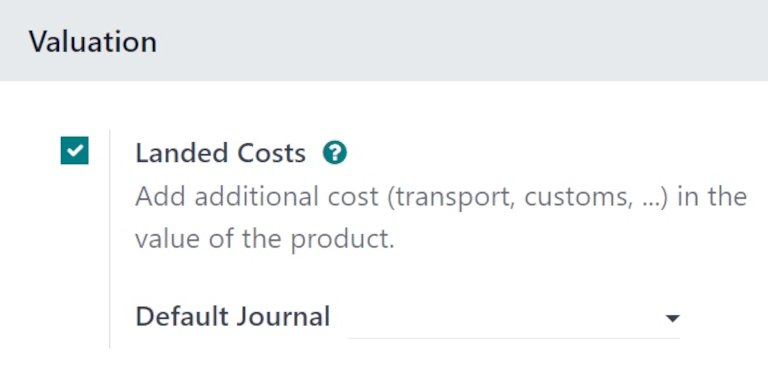
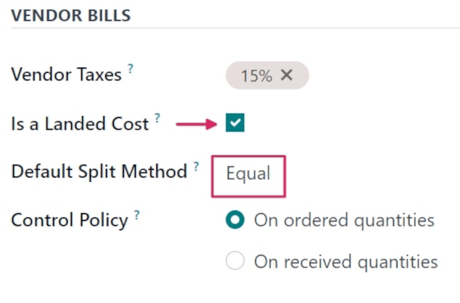
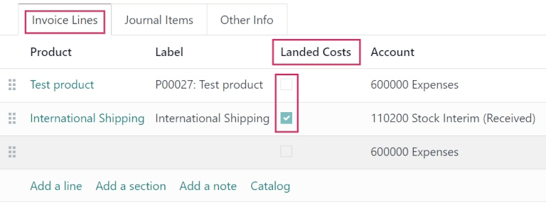
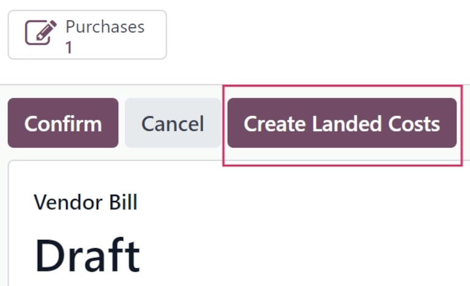
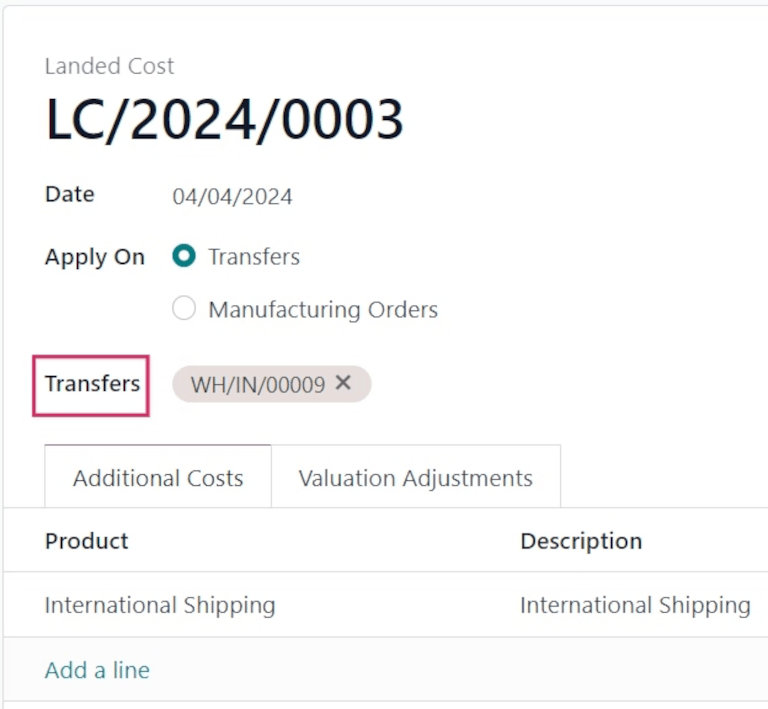
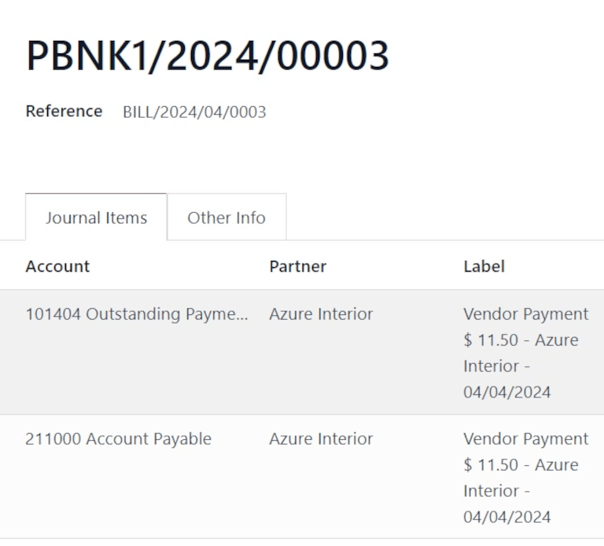

# Landed costs

When shipping products to customers, the landed cost is the total price of a product or shipment,
including all expenses associated with shipping the product.

In Odoo, the *Landed Costs* feature is used to take additional costs into account when calculating
the valuation of a product. This includes the cost of shipment, insurance, customs duties, taxes,
and other fees.

## Cấu hình

To add landed costs to products, the *Landed Costs* feature must first be enabled. To enable this
feature, navigate to Inventory app ‣ Configuration ‣ Settings, and scroll to
the Valuation section.

Tick the checkbox next to the Landed Costs option, and click Save to save
changes.

Once the page refreshes, a new Default Journal field appears below the Landed
Costs feature in the Valuation section.

Click the Default Journal drop-down menu to reveal a list of accounting journals. Select
a journal for which all accounting entries related to landed costs should be recorded.

## Create landed cost product

For charges that are consistently added as landed costs, a landed cost product can be created in
Odoo. This way, a landed cost product can be quickly added to a vendor bill as an invoice line,
instead of having to be manually entered every time a new vendor bill is created.

To do this, create a new product by going to Inventory app ‣ Products ‣
Products, and clicking New.

Assign a name to the landed cost product in the Product Name field (i.e. `International
Shipping`). In the Product Type field, click the drop-down menu, and select
Service as the Product Type.

#### IMPORTANT
Landed cost products **must** have their Product Type set to Service.

Click the Purchase tab, and tick the checkbox next to Is a Landed Cost in
the Vendor Bills section. Once ticked, a new Default Split Method field
appears below it, prompting a selection. Clicking that drop-down menu reveals the following options:

- Equal: splits the cost equally across each product included in the receipt, regardless
  of the quantity of each.
- By Quantity: splits the cost across each unit of all products in the receipt.
- By Current Cost: splits the cost according to the cost of each product unit, so a
  product with a higher cost receives a greater share of the landed cost.
- By Weight: splits the cost, according to the weight of the products in the receipt.
- By Volume: splits the cost, according to the volume of the products in the receipt.

When creating new vendor bills, this product can be added as an invoice line as a landed cost.

#### IMPORTANT
To apply a landed cost on a vendor bill, products in the original  **must** belong to a
*Product Category* with a *Costing Method* of either  or , and the valuation method
can be [manual](applications/inventory_and_mrp/inventory/product_management/inventory_valuation/using_inventory_valuation.md) or [automatic](applications/inventory_and_mrp/inventory/product_management/inventory_valuation/inventory_valuation_config.md).

## Tạo đơn mua hàng

Navigate to Purchase app ‣ New to create a new request for quotation (RfQ). In
the Vendor field, add a vendor to order products from. Then, click Add a
product, under the Products tab, to add products to the .

Once ready, click Confirm Order to confirm the order. Then, click Receive
Products once the products have been received, followed by Validate.

### Tạo hóa đơn mua hàng

Once the vendor fulfills the  and sends a bill, a vendor bill can be created from the  in
Odoo.

Navigate to the Purchase app, and click into the  for which a vendor bill
should be created. Then, click Create Bill. This opens a new Vendor Bill in
the Draft stage.

In the Bill Date field, click the line to open a calendar popover menu, and select the
date on which this draft bill should be billed.

Then, under the Invoice Lines tab, click Add a line, and click the drop-down
menu in the Product column to select the previously-created landed cost product. Click
the <i class="fa fa-cloud-upload"></i> (cloud with arrow) icon to manually save and update the
draft bill.

In the Landed Costs column, the product ordered from the vendor does **not** have its
checkbox ticked, while the landed cost product's checkbox **is** ticked. This differentiates landed
costs from all other costs displayed on the bill.

Additionally, at the top of the form, a Create Landed Costs button appears.

## Thêm chi phí nhập kho

Once a landed cost is added to the vendor bill, click Create Landed Costs at the top of
the vendor bill.

Doing so automatically creates a landed cost record, with a set landed cost pre-filled in the
product line in the Additional Costs tab.

From the Landed Cost form, click the Transfers drop-down menu, and select
which transfer the landed cost belongs to.

After setting the picking from the Transfers drop-down menu, click Compute
(at the bottom of the form, under the Total: cost).

Click the Valuation Adjustments tab to see the impact of the landed costs. The
Original Value column lists the original price of the , the Additional
Landed Cost column displays the landed cost, and the New Value displays the sum of the
two, for the total cost of the .

Once ready, click Validate to post the landed cost entry to the accounting journal.

This causes a Valuation smart button to appear at the top of the form. Click the
Valuation smart button to open a Stock Valuation page, with the product's
updated valuation listed.

#### NOTE
For a Valuation smart button to appear upon validation, the product's
Product Type **must** be set to Storable.

To view the valuation of *every* product, including landed costs, navigate to
Inventory app ‣ Reporting ‣ Valuation.

#### NOTE
Each journal entry created for a landed cost on a vendor bill can be viewed in the *Accounting*
app.

To locate these journal entries, navigate to Accounting app ‣ Accounting ‣
Journal Entries, and locate the correct entry, by number (i.e. `PBNK1/2024/XXXXX`).

Click into the journal entry to view the Journal Items, and other information about
the entry.

