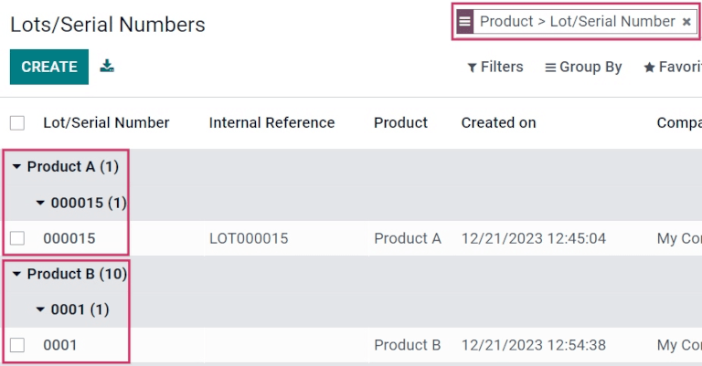

# Theo dõi sản phẩm

*Lots* and *serial numbers* are the two ways to identify and track products in Odoo. While there are
similarities between the two traceability methods, there are also notable differences that affect
receipts, deliveries, and inventory reports.

A *lot* usually indicates a specific batch of an item that was received, is currently stored, or was
shipped from a warehouse. However, it can also pertain to a batch of products manufactured in-house,
as well.

A *serial number* is a unique identifier assigned incrementally (or sequentially) to an item or
product, used to distinguish it from other items or products.

#### SEE ALSO
- [Số lô](lots.md)
- [Sử dụng số sê-ri để theo dõi sản phẩm](serial_numbers.md)

## Bật số lô & sê-ri

To track products using lots and serial numbers, the *Lots & Serial Numbers* feature must be
enabled.

To do that, go to the Inventory app ‣ Configuration ‣ Settings, scroll down to
the Traceability section, and click the box next to Lots & Serial Numbers.
Then, click the Save button to save changes.

## When to use lots

Lots are useful for products that are manufactured or received in large quantities, such as clothes
or food. Lots and can be used to trace a product back to a group, which is especially useful when
managing product recalls or expiration dates.

Manufacturers assign lot numbers to groups of products that have common properties; this can lead to
multiple goods sharing the same lot number. This helps identify a number of products in a single
group, and allows for end-to-end traceability of these products through each step in their life
cycles.

## When to use serial numbers

The goal of assigning serial numbers to individual products is to make sure every item's history is
identifiable when it travels through the supply chain. This can be especially useful for
manufacturers that provide after-sales services related to products they sell and deliver.

Serial numbers can contain many different types of characters: numbers, letters, typographical
symbols, or a mixture of all three types.

## Truy xuất nguồn gốc

Manufacturers and companies can refer to traceability reports to see the entire life cycle of a
product. These reports include vital information, like where it came from (and when), where it was
stored, and to whom it was sent.

To see the full traceability of a product, or group products by lots and/or serial numbers, go to
Inventory app ‣ Products ‣ Lots/Serial Numbers. Doing so reveals the
Lots/Serial Numbers dashboard.

From here, products with lots or serial numbers assigned to them are listed by default. They can
also be expanded to show what lots or serial numbers have been specifically assigned to them.

To group by lots or serial numbers, first remove any default filters from the search bar in the
upper-right corner. Then, click Group By, and select Add Custom Group, which
reveals a mini drop-down menu. From this mini drop-down menu, select Lot/Serial Number,
and click Apply.

Doing so reveals all existing lots and serial numbers, and each can be expanded to show all product
quantities with that assigned number. For unique serial numbers that are *not* reused, there should
*only* be one product per serial number.

* [Sử dụng số sê-ri để theo dõi sản phẩm](serial_numbers.md)
* [Chỉ định số sê-ri](create_sn.md)
* [Số lô](lots.md)
* [Reassign lot/serial numbers](reassign.md)
* [Ngày hết hạn](expiration_dates.md)
