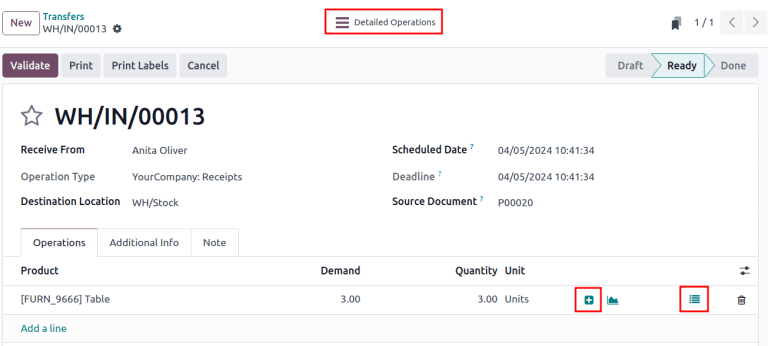
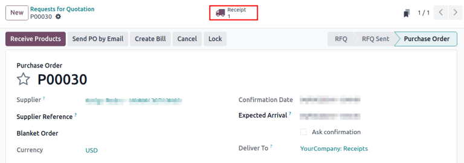
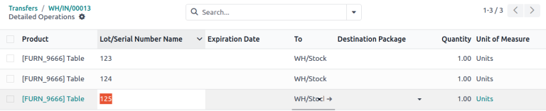
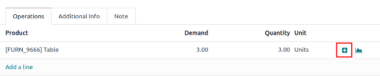
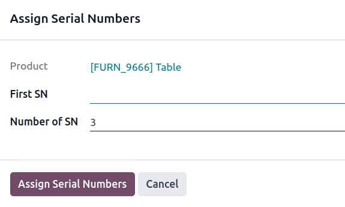
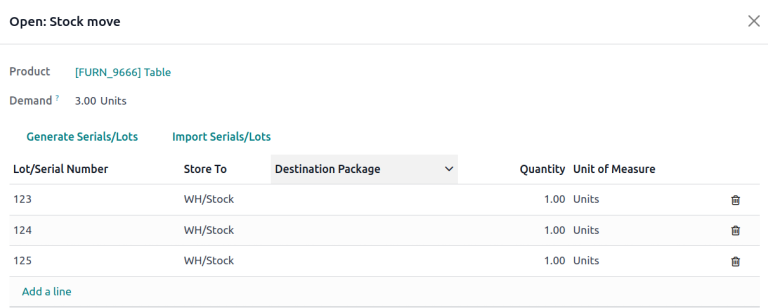
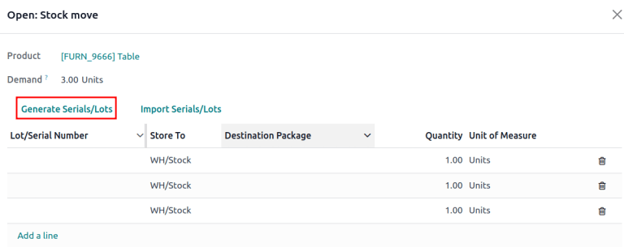

# Chỉ định số sê-ri

Assigning serial numbers to individual products allows the for tracking of properties,
[expiration dates](expiration_dates.md), and location throughout the supply chain, which
particularly benefits manufacturers providing after-sales services.

#### SEE ALSO
- [Odoo Tutorials: Serial Numbers](https://www.youtube.com/watch?v=ZP-gMz2X5AY)
- [Sử dụng số sê-ri để theo dõi sản phẩm](serial_numbers.md)

In Odoo, serial numbers are assigned to products:

- in the [Detailed Operations page](#inventory-product-management-detailed-operations) on a
  receipt
- by clicking the [Assign Serial Numbers](#inventory-product-management-assign-sn) button on a
  receipt
- in the [Open: Stock move window](#inventory-product-management-stock-move-section) on a
  receipt
- [during a manufacturing order](../../../manufacturing/basic_setup/configure_manufacturing_product.md) for a product tracked by
  lot/serial numbers
- when making an inventory adjustment

## Cấu hình

To assign serial numbers to products, activate the Lots and Serial Numbers feature in
Inventory app ‣ Configuration ‣ Settings.

Then, in the Inventory tab of an item's product form, set the Tracking field
to By Unique Serial Number.

#### SEE ALSO
- [Enable serial numbers](serial_numbers.md#inventory-product-management-enable-lots)
- [Track products by serial numbers](serial_numbers.md#inventory-product-management-configure-lots)

Next, enable creating new serial numbers by going to Inventory app ‣ Configuration
‣ Operations Types.

From the Operations Types page, select the desired operation type (e.g.
Receipts, Delivery Orders, or Manufacturing), and select the
Create New option in the Lots/Serial Numbers section of the operation type's
configuration page.

## Hoạt động chi tiết

Serial numbers can be assigned to products when entering stock for the first time, from the
Detailed Operations page on the receipt. Receipts can be accessed by navigating to
Inventory app ‣ Operations ‣ Receipts.

#### IMPORTANT
Serial numbers can **not** be assigned to products on a request for quotation (RfQ) or purchase
order (PO) — **only** on a receipt.

To record an item's serial number before receiving the item, follow the steps in the next
sections to assign serial numbers, but do **not** click the receipt's Validate
button, until the products are received from the vendor.

Assign a single serial number to a product by clicking the Detailed Operations smart
button on a receipt.

In the Lot/Serial Number Name column, manually type in the serial number for a single
product.

When finished, click the receipt's breadcrumbs, and the assigned serial numbers are automatically
saved.

## Chỉ định số sê-ri

To generate new serial numbers in a sequence, click the + (plus) icon in the
[product line](#inventory-product-management-detailed-operations-popup).

#### IMPORTANT
If the icon is not visible, ensure the Create New option is selected in the
[receipt's configuration page](#inventory-product-management-configure-new-serials).

Doing so opens the Assign Serial Numbers pop-up window. The Number of SN
field is auto-filled based on the product quantity requiring serial numbers. Manually input the
first serial number in the First SN field, and click Assign Serial Numbers
to generate a sequence of serial numbers based on the first serial number entered.

## Stock move pop-up window

For various methods of assigning serial numbers in bulk, click the ⦙≣ (bulleted list)
icon in the [product line](#inventory-product-management-detailed-operations-popup) of a
receipt.

### Thêm một dòng

In the Open: Stock move pop-up window that appears, manually input the serial numbers in
the Lot/Serial Number column.

### Tạo số sê-ri

Assign multiple serial numbers at once by clicking the Generate Serials/Lots button in
the Open: Stock move pop-up window.

Doing so opens the Generate Serial numbers pop-up window, where the first serial number
is entered in the First SN field to generate a sequence of serial numbers, based on the
first serial number entered.

For more details on how to fill in this pop-up window, [refer to this section](#inventory-product-management-assign-sn).

### Nhập sê-ri

Assign multiple serial numbers at once by clicking the Import Serials/Lots button in the
Open: Stock move pop-up window.

#### IMPORTANT
If the button is not visible, ensure the Create New option is selected in the
[receipt's configuration page](#inventory-product-management-configure-new-serials).

Doing so opens the Import Lots pop-up window. Enter each serial number on a separate
line in the Lots/Serial numbers text field.

Tick the Keep current lines checkbox to add serial numbers to the list of products, and
serial numbers in the Lot/Serial Number table, in the Open: Stock move
pop-up window. To replace the serial numbers in the list, leave the Keep current lines
option unchecked.

Cuối cùng, nhấp vào Tạo.
