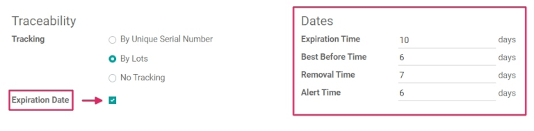
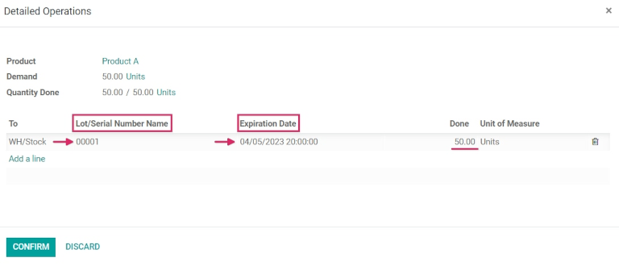
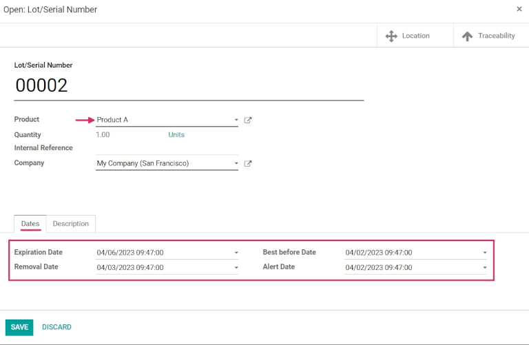

# Ngày hết hạn

In Odoo, *expiration dates* can be used to manage and track the lifecycles of perishable products,
from purchase to sale. Using expiration dates reduces product loss due to unexpected expiry, and
helps to avoid sending expired products to customers.

In Odoo, only products that are tracked using *lots* and *serial numbers* can be assigned expiration
information. Once a lot or serial number has been assigned, an expiration date can be set. This is
especially helpful for companies (such as food manufacturers) that consistently, or exclusively, buy
and sell perishable products.

#### SEE ALSO
- [Số lô](lots.md)
- [Sử dụng số sê-ri để theo dõi sản phẩm](serial_numbers.md)

## Bật ngày hết hạn

To enable the use of *expiration dates*, go to Inventory app ‣ Configuration ‣
Settings, and scroll down to the Traceability section. Then, click the checkbox to
enable the Lots & Serial Numbers feature.

Once that feature is activated, a new option will appear to enable Expiration Dates.
Click that checkbox to enable the feature, and be sure to Save changes.

## Configure expiration dates on products

Once the Lots & Serial Numbers and Expiration Dates features have been
enabled in the settings of the *Inventory* app, expiration information can be configured on
individual products.

To do so, go to Inventory app ‣ Products ‣ Products, and select a product to
edit. Selecting a product reveals the product form for that particular item. Once on the product
form, click Edit in the upper-left corner to make changes.

#### IMPORTANT
To be tracked using lots or serial numbers, or to configure expiration information, products
*must* have their Product Type set as Storable Product under the
General Information tab.

Then, click the Inventory tab, and scroll down to the Traceability section.
From here, make sure that either By Unique Serial Number or By Lots is
checked.

Once it is, a new Expiration Date checkbox appears that must also be clicked. When both
are enabled, a new Dates field appears to the right.

#### NOTE
If a product has stock on-hand prior to activating tracking by lots or serial numbers, an
inventory adjustment might need to be performed in order to assign lot numbers to the existing
stock.

Under the Dates field, there are four categories of expiration information to configure
for the product:

- Expiration Time: the number of days after receiving products (either from a vendor or
  in stock after production) in which goods may become dangerous and should not be used or consumed.
- Best Before Time: the number of days before the expiration date in which the goods
  start deteriorating, **without** necessarily being dangerous yet.
- Removal Time: the number of days before the expiration date in which the goods should
  be removed from stock.
- Alert Time: the number of days before the expiration date in which an alert should be
  raised on goods in a particular lot or containing a particular serial number.

#### NOTE
The values entered into these fields automatically compute the expiration date for goods entered
into stock, whether purchased from a vendor or manufactured in-house.

Once all the expiration information has been configured, click Save to save all changes.

## Set expiration dates on receipts with lots & serial numbers

Generating expiration dates for **incoming** goods can be done directly from the purchase order. To
create a purchase order, go to the Purchase app and click Create to
create a new request for quotation (RFQ).

Then, fill out the information by adding a Vendor, and add products to the
Product lines by clicking Add a product.

Choose the desired quantity to order by changing the number in the Quantity column, and
click Confirm Order. This converts the  into a
purchase order.

Click the Receipt smart button at the top of the purchase order to be taken to the
warehouse receipt form.

#### NOTE
Clicking Validate before assigning a serial number to the ordered product quantities
causes a User Error popup to appear. The popup requires entry of a lot or serial
number for the ordered products. The  cannot be validated
without an assigned lot or serial number.

From here, click the Additional Options menu (hamburger) icon located on the far-right
of the product line. When clicked, a Detailed Operations pop-up will appear.

In this pop-up, click Add a line, and assign a lot or serial number under the
Lot/Serial Number Name field.

An expiration date automatically populates, based on the configuration on the product form (if
previously configured).

After the expiration date has been established, mark the Done quantities, and click
Confirm to close the pop-up. Finally, click Validate.

A Traceability smart button will appear upon validating the receipt. Click the
Traceability smart button to see the updated Traceability Report, which
includes: a Reference document; the Product being traced; the
Lot/Serial #; and more.

## Set expiration dates on manufactured products

Expiration dates can also be generated for products manufactured in-house. To assign expiration
dates to manufactured products, a manufacturing order (MO) needs to be completed.

To create a , go to Manufacturing app ‣ Operations
‣ Manufacturing Orders, and click Create. Choose a product to manufacture from the
Product field drop-down menu, then select the Quantity to produce.

#### NOTE
To manufacture a product, there must be materials to consume in the lines in the
Product column. This can be achieved either by creating a Bill of
Material for the Product, or manually adding materials to consume by clicking
Add a line.

Once ready, click Confirm.

Next to Lot/Serial Number, either select an existing lot number from the drop-down menu,
or click the green + sign to automatically assign a new lot number.

Then, select a number of units for the Quantity field, and click Mark as
Done.

Click on the External Link icon in the assigned Lot/Serial Number field. A
pop-up appears, revealing a detail form for that specific number.

On that pop-up, under the Dates tab, all expiration information that was previously
configured for the product is displayed. That same information is also available on the detail form
for that specific product, or by going to Inventory app ‣ Products ‣ Lots/Serial
Numbers.

## Sell products with expiration dates

Selling perishable products with expiration dates is done the same as any other type of product. The
first step in selling perishable products is to create a sales order.

To do that, go to Sales app ‣ Create to create a new quotation, and fill out the
information on the sales order form.

Add a Customer, click Add a product to add the desired products to the
Product lines, and set a Quantity for the products.

Then, click the Other Info tab. Under the Delivery section, change the
Delivery Date to a date after the expected date, and click the green
checkmark icon to confirm the date. Finally, click Confirm to confirm the sales order.

Next, click the Delivery smart button at the top of the sales order to see the warehouse
receipt form.

On the warehouse receipt form, click Validate, and then Apply in the
accompanying pop-up window, to automatically process all Done quantities, and deliver
the products to the customer.

If the products are delivered before the Alert Date set on the product form, then no
alerts will be created.

#### IMPORTANT
Để bán các sản phẩm dễ hỏng có ngày hết hạn, Chiến lược xuất kho cho Vị trí nơi sản phẩm được lưu trữ phải được đặt thành . Nếu không có đủ hàng tồn kho của sản phẩm dễ hỏng trong một lô, Odoo sẽ tự động lấy lượng còn thiếu từ một lô thứ hai có ngày hết hạn gần nhất. Bạn cũng có thể thiết lập các chiến lược xuất kho trên Danh mục sản phẩm.

#### SEE ALSO
[Removal strategies](../../shipping_receiving/removal_strategies.md)

## View expiration dates for lots & serial numbers

To view (and/or group) all products with expiration dates by lot number, go to
Inventory app ‣ Products ‣ Lots/Serial Numbers.

Once there, remove any default search filters from the Search... bar. Then, click
Group By, choose Add Custom Group, and select the Expiration
Date parameter from the drop-down menu. Finally, click Apply to apply the filter.

Doing so breaks down all perishable products, their expiration dates, and the assigned lot number.

### Cảnh báo hết hạn

To see expiration alerts, go to Inventory app ‣ Products ‣ Lots/Serial Numbers.

Then, click into a Lot/Serial Number with perishable products. Doing so reveals the
serial number detail form. On the serial number detail form, click the Dates tab to see
all expiration information related to the products.

To edit the form, click Edit in the upper-left corner of the form, then change the
Expiration Date to today's date (or earlier), and click Save to save
changes.

After saving, the lot number form displays a red Expiration Alert at the top of the form
to indicate that the products in this lot are either expired or expiring soon. From here, click back
to the Lots/Serial Numbers page (via the breadcrumbs).

To see the new expiration alert, or any expiration alerts for products that are expired (or will
expire soon), remove all of the search filters from the Search... bar on the
Lots/Serial Numbers dashboard.

Then, click Filters, and choose Expiration Alerts.

