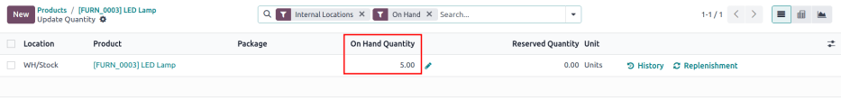
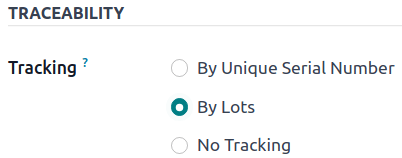

# Reassign lot/serial numbers

Changing a product's tracking settings to use lots or serial numbers, *after* storing products in
Odoo without them, can lead to inconsistent records. Follow this documentation to learn how to use
an inventory adjustment to assign lot or serial numbers to products that were not originally
assigned lots.

#### NOTE
This document outlines the process of using two inventory adjustments: one to remove incorrect
records *without* lot numbers, and another to save the quantities *with* the lot numbers.

#### SEE ALSO
- [Set up and use lot numbers](lots.md)
- [Set up serial numbers](create_sn.md)
- [Use serial numbers](serial_numbers.md)

## Change on-hand quantity to zero

To change the product's settings to track by lots or serial numbers, begin by navigating to
Inventory app ‣ Products ‣ Products, and select the intended product.

Next, click the product's On Hand smart button to open the Update Quantity
page. In the On Hand Quantity column, change the value to zero.

#### NOTE
If the product is stored in multiple locations, make sure the **total** on hand quantity at
**all** locations is zero.

## Change traceability setting

Return to the product form (Inventory app ‣ Products ‣ Products), and switch to
the Inventory tab. In the Traceability section, change the
Tracking option from No Tracking to By Lots or By
Unique Serial Number.

#### SEE ALSO
[Ngày hết hạn](expiration_dates.md)

## Restore on-hand quantity

After manually changing the on-hand quantity to zero and changing the Tracking setting
to lots or serial numbers, restore the quantities by clicking the On Hand smart button
from the desired product form.

Trên trang Cập nhật số lượng, do trước đó, số lượng hiện có đã được thay đổi về không, một cảnh báo Không có sẵn hàng sẽ xuất hiện. Tại đây, nhấp vào nút Mới ở góc trên bên trái. Khi đó, một dòng mới có thể chỉnh sửa sẽ xuất hiện trên trang Cập nhật số lượng. Sau đó, nhập số lô mong muốn vào trường Số lô/sê-ri và điều chỉnh Số lượng hiện có về giá trị ban đầu.

#### SEE ALSO
[Điều chỉnh tồn kho](../../warehouses_storage/inventory_management/count_products.md)

