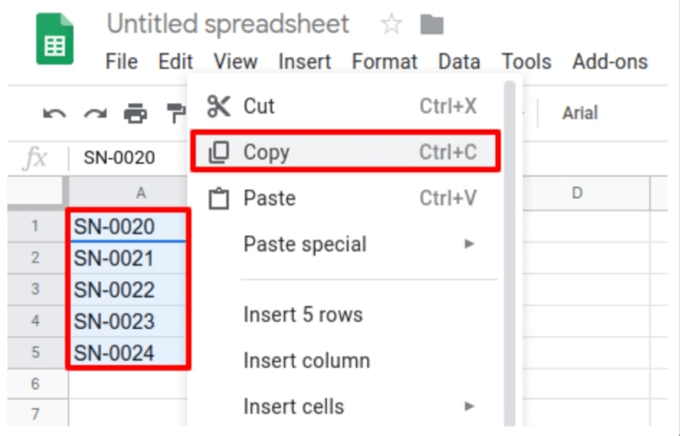

# Sử dụng số sê-ri để theo dõi sản phẩm

*Số sê-ri* là một trong hai cách để xác định và theo dõi sản phẩm trong Odoo. Số sê-ri là mã định danh duy nhất được gán tăng dần (hoặc theo thứ tự) cho một mặt hàng hoặc sản phẩm, dùng để phân biệt với các mặt hàng và sản phẩm khác.

Số sê-ri có thể bao gồm nhiều loại ký tự khác nhau: chúng có thể chỉ là số, chúng có thể chứa chữ cái và các ký hiệu đánh máy khác hoặc chúng có thể là sự kết hợp của tất cả các loại trên.

Mục tiêu của việc gán số sê-ri cho sản phẩm là để đảm bảo có thể nhận dạng được lịch sử của từng mặt hàng trong chuỗi cung ứng. Điều này có thể đặc biệt hữu ích đối với các nhà sản xuất cung cấp dịch vụ sau hậu mãi cho các sản phẩm mà họ bán và giao.

#### SEE ALSO
[Số lô](lots.md)

## Bật số lô & sê-ri

Để theo dõi sản phẩm bằng số sê-ri, thì tính năng Số lô & sê-ri phải được bật. Để bật tính năng này, hãy đi đến Ứng dụng Tồn kho ‣ Cấu hình ‣ Cài đặt, cuộn xuống phần Truy xuất nguồn gốc và nhấp vào ô bên cạnh Số lô & sê-ri. Nhớ nhấp nút Lưu để lưu thay đổi.

## Cấu hình theo dõi sản phẩm bằng số sê-ri

Sau khi cài đặt Số lô & sê-ri được kích hoạt, thì bạn có thể theo dõi từng sản phẩm bằng số sê-ri. Để cấu hình cài đặt này, hãy đi đến Ứng dụng Tồn kho ‣ Sản phẩm ‣ Sản phẩm và chọn sản phẩm mong muốn để theo dõi.

Khi vào biểu mẫu sản phẩm, hãy nhấp vào Chỉnh sửa và nhấp vào tab Tồn kho.

Khi vào biểu mẫu sản phẩm, hãy nhấp vào Chỉnh sửa, điều hướng đến tab Tồn kho và cuộn đến phần Truy xuất nguồn gốc. Sau đó, chọn tùy chọn Theo số sê-ri duy nhất và nhấp vào Lưu để lưu các thay đổi. Giờ đây, bạn có thể chọn và chỉ định số sê-ri mới hoặc có sẵn cho các lô sản phẩm này mới nhập về hoặc được sản xuất.

#### WARNING
Nếu sản phẩm không được gán số sê-ri, thì cửa sổ pop-up thông báo lỗi người dùng sẽ xuất hiện. Thông báo lỗi nêu rằng (các) sản phẩm hiện có không có lô/số sê-ri. Tuy nhiên, có thể gán số lô/sê-ri cho sản phẩm bằng cách điều chỉnh tồn kho.

### Tạo số sê-ri mới cho các sản phẩm có sẵn

Có thể tạo số sê-ri mới cho các sản phẩm đã có sẵn nhưng chưa được gán số sê-ri. Để thực hiện việc này, hãy đi đến Tồn kho ‣ Sản phẩm ‣ Số lô/sê-ri, và nhấp vào Tạo. Sau đó, một biểu mẫu số lô/số sê-ri trống sẽ hiển thị. Trên biểu mẫu này, một Số lô/sê-ri mới sẽ tự động được tạo.

Sau khi tạo Số lô/sê-ri, hãy nhấp vào trường trống bên cạnh Sản phẩm để hiển thị một menu thả xuống. Từ menu này, chọn sản phẩm mà số mới này sẽ được gán vào.

Biểu mẫu này cũng cung cấp tùy chọn để điều chỉnh Số lượng, để chỉ định số Tham chiếu nội bộ duy nhất (dùng cho mục đích truy xuất nguồn gốc) và chỉ định cấu hình số lô/sê-ri này cho một trang web cụ thể trong trường Trang web (nếu làm việc trong môi trường có nhiều trang web).

Mô tả chi tiết về số lô/sê-ri này cũng có thể được thêm vào tab Mô tả bên dưới.

Khi mọi cấu hình mong muốn đã hoàn tất, nhấp vào nút Lưu để lưu tất cả thay đổi.

Sau khi tạo số sê-ri mới, gán cho sản phẩm mong muốn và lưu lại, hãy quay lại biểu mẫu sản phẩm bằng cách đi đến Sản phẩm ‣ Sản phẩm và chọn sản phẩm mà số sê-ri mới tạo này vừa được gán.

Trên biểu mẫu chi tiết của sản phẩm đó, hãy nhấp vào nút thông minh Số lô/sê-ri để xem số sê-ri mới.

## Quản lý số sê-ri trong giao nhận hàng hoá

Số sê-ri có thể được gán cho cả hàng **sắp nhập** và **sắp xuất**. Đối với hàng sắp nhập, số sê-ri được gán trực tiếp trên biểu mẫu đơn mua hàng. Đối với hàng sắp xuất, số sê-ri được gán trực tiếp trên biểu mẫu đơn bán hàng.

### Gán số sê-ri cho các sản phẩm mới nhận

Có thể gán số sê-ri cho hàng **sắp nhập** trên phiếu nhập kho bằng cách nhấp vào nút thông minh [Hoạt động chi tiết](create_sn.md#inventory-product-management-detailed-operations) hoặc bằng cách nhấp vào biểu tượng ⦙≣ (danh sách có dấu đầu dòng) trên dòng sản phẩm.

#### SEE ALSO
[Chỉ định số sê-ri](create_sn.md)

#### WARNING
Nếu bạn nhấp vào Xác thực trước khi gán số sê-ri cho số lượng đã nhận, thì cửa sổ pop-up thông báo Lỗi người dùng sẽ xuất hiện. Cửa sổ pop-up yêu cầu nhập số lô hoặc số sê-ri cho các sản phẩm đã đặt.  **không thể** được xác thực nếu không gán số sê-ri.

Có nhiều cách để thực hiện việc này: gán số sê-ri theo cách thủ công, gán số sê-ri tự động và sao chép/dán số sê-ri từ bảng tính.

#### Gán số sê-ri tự động

Nếu có số lượng lớn sản phẩm cần được gán số sê-ri riêng, Odoo có thể tự động tạo và gán số sê-ri cho từng sản phẩm một.

Để thực hiện việc này, hãy bắt đầu với trường Số sê-ri đầu tiên trong cửa sổ pop-up Hoạt động chi tiết và nhập số sê-ri đầu tiên theo thứ tự mong muốn được gán.

Sau đó, trong trường Số sê-ri, nhập tổng số mặt hàng cần được gán số sê-ri duy nhất mới tạo.

Cuối cùng, nhấp vào Gán số sê-ri, một danh sách sẽ hiện ra với các số sê-ri mới khớp với số lượng sản phẩm đã đặt.

#### Sao chép/dán số sê-ri từ bảng tính

Để sao chép và dán số sê-ri từ một bảng tính hiện có, trước tiên hãy điền tất cả số sê-ri nhận được từ nhà cung cấp (hoặc chọn thủ công khi nhập kho) vào bảng tính. Sau đó, sao chép và dán chúng vào cột Tên số lô/sê-ri. Odoo sẽ tự động tạo số dòng cần thiết dựa trên số lượng số được dán vào cột.

Từ đây, có thể nhập thủ công các địa điểm Đến và số lượng Hoàn tất vào từng dòng số sê-ri.

Sau khi tất cả số lượng sản phẩm đã được gán một số sê-ri, hãy nhấp vào nút Xác nhận để đóng cửa sổ pop-up. Sau đó, nhấp vào Xác thực.

Nút thông minh Truy xuất nguồn gốc xuất hiện khi xác thực biên lai. Nhấp vào nút thông minh Truy xuất nguồn gốc để xem Báo cáo truy xuất nguồn gốc đã cập nhật, bao gồm chứng từ Tham chiếu, Sản phẩm đang được truy xuất, Số lô/sê-ri và nhiều thông tin khác.

Sau khi tất cả số lượng sản phẩm đã được gán một số sê-ri, nhấp vào Xác nhận để đóng cửa sổ pop-up và nhấp vào Xác thực. Nút thông minh Truy xuất nguồn gốc sẽ xuất hiện khi xác thực phiếu nhập kho. Nhấp vào nút thông minh Truy xuất nguồn gốc để xem Báo cáo truy xuất nguồn gốc đã cập nhật, bao gồm chứng từ Tham chiếu, Sản phẩm đang được truy xuất, Số lô/sê-ri và nhiều thông tin khác.

### Quản lý số sê-ri trên lệnh giao hàng

Việc chỉ định số sê-ri cho hàng hóa **sắp xuất** có thể được thực hiện ngay từ đơn bán hàng (SO).

Để tạo , hãy đi đến ứng dụng Bán hàng và nhấp vào nút Tạo. Sau đó, một biểu mẫu báo giá trống mới sẽ hiển thị. Trên biểu mẫu báo giá trống này, điền thông tin cần thiết bằng cách thêm Khách hàng và thêm sản phẩm vào dòng Sản phẩm (trong tab Chi tiết đơn hàng), bằng cách nhấp vào Thêm sản phẩm.

Sau đó, chọn số lượng muốn bán bằng cách thay đổi số trong cột Số lượng.

Sau khi báo giá đã được điền, nhấp vào nút Xác nhận để xác nhận báo giá. Khi báo giá được xác nhận, báo giá sẽ trở thành  và nút thông minh Xuất kho sẽ xuất hiện.

Nhấp vào nút thông minh Xuất kho để xem biểu mẫu phiếu kho cho  đó.

Từ đây, nhấp vào menu Tùy chọn bổ sung, được biểu thị bằng biểu tượng `hamburger` (bốn dòng ngang, nằm bên phải cột Đơn vị tính trong tab Hoạt động). Sau đó, cửa sổ pop-up Hoạt động chi tiết sẽ hiển thị.

Trong cửa sổ pop-up này, Số lô/sê-ri sẽ được chọn theo mặc định, trong đó mỗi sản phẩm trong tổng số lượng Đã dự trữ được liệt kê cùng với số sê-ri duy nhất của chúng (thường được liệt kê theo thứ tự).

Để thay đổi thủ công số sê-ri của sản phẩm, nhấp vào menu thả xuống bên dưới Số lô/sê-ri và chọn (hoặc nhập) số sê-ri mong muốn. Sau đó, đánh dấu số lượng Hoàn tất và nhấp vào Xác nhận để đóng cửa sổ pop-up.

Cuối cùng, nhấp vào nút Xác thực để xuất sản phẩm.

Khi xác thực lệnh giao hàng, nút thông minh Truy xuất nguồn gốc sẽ xuất hiện. Nhấp vào nút thông minh Truy xuất nguồn gốc để xem Báo cáo truy xuất nguồn gốc đã cập nhật, bao gồm chứng từ Tham chiếu, Sản phẩm đang được truy xuất, Ngày và Số lô/sê-ri được gán.

Báo cáo truy xuất nguồn gốc cũng có thể bao gồm phiếu nhập kho Tham chiếu từ đơn mua hàng (PO) trước đó, nếu bất kỳ số lượng sản phẩm nào có chung số sê-ri được gán trong quá trình nhập  đó.

## Quản lý số sê-ri cho các loại hoạt động khác nhau

Theo mặc định trong Odoo, việc tạo số sê-ri mới chỉ được phép khi **nhận** sản phẩm từ đơn mua hàng mà không thể sử dụng số sê-ri **hiện có**. Ngược lại, đối với đơn bán hàng thì không thể tạo số sê-ri mới trên lệnh giao hàng mà chỉ có thể sử dụng số sê-ri hiện có.

Để thay đổi khả năng sử dụng số sê-ri mới (hoặc hiện có) trên bất kỳ loại hoạt động nào, hãy đi đến Ứng dụng Tồn kho ‣ Cấu hình ‣ Loại hoạt động và chọn Loại hoạt động mong muốn.

Đối với loại hoạt động Phiếu nhập kho, có trên trang Loại hoạt động, bạn có thể bật tùy chọn Sử dụng số lô/sê-ri hiện có bằng cách chọn Phiếu nhập kho từ trang Loại hoạt động, nhấp vào Chỉnh sửa, rồi nhấp vào ô cạnh tùy chọn Sử dụng số lô/sê-ri hiện có (trong phần Truy xuất nguồn gốc). Cuối cùng, nhấp vào nút Lưu để lưu các thay đổi.

Đối với loại hoạt động Lệnh giao hàng, nằm trên trang Loại hoạt động, bạn có thể bật tùy chọn Tạo số lô/sê-ri mới bằng cách chọn Lệnh giao hàng từ trang Loại hoạt động, nhấp vào Chỉnh sửa và nhấp vào ô cạnh tùy chọn Tạo số lô/sê-ri mới (trong phần Truy xuất nguồn gốc). Hãy nhớ nhấp vào Lưu để lưu các thay đổi.

## Truy xuất nguồn gốc bằng số sê-ri

Các nhà sản xuất và doanh nghiệp có thể tham khảo báo cáo truy xuất nguồn gốc để xem toàn bộ vòng đời của sản phẩm: sản phẩm đến từ đâu (và khi nào), sản phẩm được lưu trữ ở đâu và sản phẩm được bán cho ai.

Để xem truy xuất nguồn gốc đầy đủ của một sản phẩm hoặc nhóm sản phẩm theo số sê-ri, hãy đi đến Ứng dụng Tồn kho ‣ Sản phẩm ‣ Số lô/sê-ri. Sau đó, trang chủ Số lô/sê-ri sẽ hiển thị.

Từ đây, các sản phẩm được gán số sê-ri sẽ được liệt kê theo mặc định và có thể mở rộng để hiển thị số sê-ri nào đã được gán cho sản phẩm.

Để nhóm sản phẩm theo số sê-ri (hoặc lô), trước tiên hãy xóa mọi bộ lọc mặc định khỏi thanh tìm kiếm ở góc trên bên phải. Sau đó, nhấp vào :guilabel: `Nhóm theo` và chọn :guilabel: `Thêm nhóm tùy chỉnh`, menu thả xuống nhỏ sẽ hiển thị. Từ menu thả xuống này, chọn :guilabel: `Số lô/sê-ri` và nhấp vào :guilabel: `Áp dụng`.

Thao tác này sẽ hiển thị tất cả số sê-ri và lô hiện có và có thể mở rộng để hiển thị tất cả số lượng sản phẩm được gán số đó. Đối với các số sê-ri duy nhất không được sử dụng lại, chỉ được có một sản phẩm cho mỗi số sê-ri.

#### SEE ALSO
[Theo dõi sản phẩm](../product_tracking.md)
