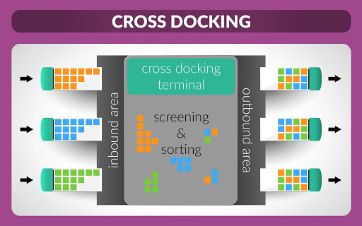
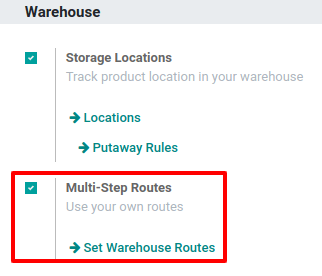
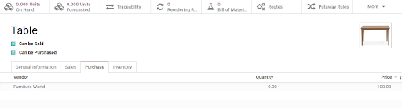
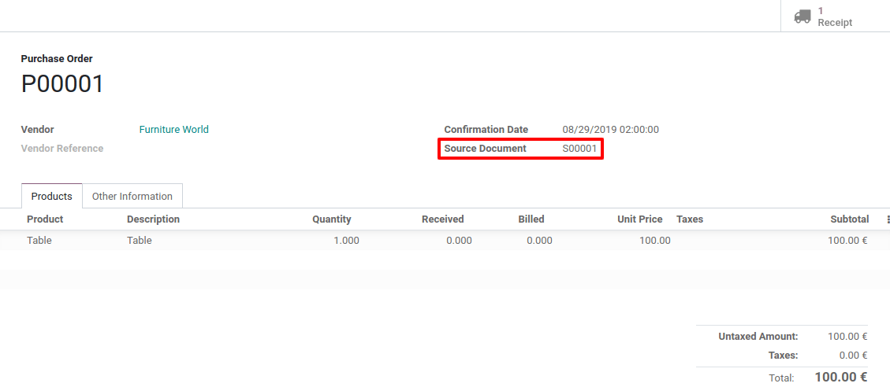
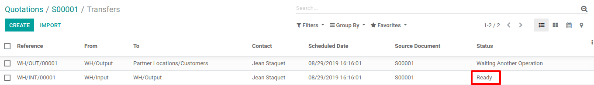

# Organize a cross-dock in a warehouse

Cross-docking is the process of sending products that are received directly to the customers,
without making them enter the stock. The trucks are simply unloaded in a *Cross-Dock* area in order
to reorganize products and load another truck.

#### NOTE
For more information on how to organize your warehouse, read our blog: [What is cross-docking and
is it for me?](https://www.odoo.com/blog/business-hacks-1/post/what-is-cross-docking-and-is-it-for-me-270)

## Cấu hình

In the *Inventory* app, open Configuration ‣ Settings and activate the
*Multi-Step Routes*.

#### NOTE
Doing so will also enable the *Storage Locations* feature.

Now, both *Incoming* and *Outgoing* shipments should be configured to work with 2 steps. To adapt
the configuration, go to Inventory ‣ Configuration ‣ Warehouses and edit your
warehouse.

This modification will lead to the creation of a *Cross-Docking* route that can be found in
Inventory ‣ Configuration ‣ Routes.

## Configure products with Cross-Dock Route

Create the product that uses the *Cross-Dock Route* and then, in the inventory tab, select the
routes *Buy* and *Cross-Dock*. Now, in the purchase tab, specify the vendor to who you buy the
product and set a price for it.

Sau khi hoàn tất, hãy tạo đơn bán hàng cho sản phẩm và xác nhận. Odoo sẽ tự động tạo hai lệnh chuyển hàng sẽ được liên kết với đơn bán hàng. Lệnh đầu tiên là lệnh chuyển hàng từ *Vị trí nhập kho* đến *Vị trí xuất kho*, tương ứng với việc di chuyển sản phẩm trong khu vực *Cross-dock*. Lệnh thứ hai là lệnh giao hàng từ *Vị trí xuất kho* đến  *Địa điểm khách hàng* của bạn. Cả hai đều ở trạng thái  *Đang chờ hoạt động khác* vì chúng ta vẫn cần đặt hàng sản phẩm từ nhà cung cấp của mình.

Now, go to the *Purchase* app. There, you will find the purchase order that has been automatically
triggered by the system. Validate it and receive the products in the *Input Location*.

When the products have been received from the supplier, you can go back to your initial sale order
and validate the internal transfer from *Input* to *Output*.

The delivery order is now ready to be processed and can be validated too.

