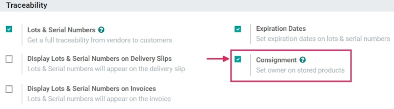

# Consignment: buy and sell stock without owning it

Most of the time, products stored in a company's warehouse are either purchased from suppliers, or
are manufactured in-house. However, suppliers will sometimes let companies store and sell products
in the company's warehouse, without having to buy those items up-front. This is called
*consignment*.

Consignment is a useful method for suppliers to launch new products, and easily deliver to their
customers. It's also a great way for the company storing the products (the consignee) to earn
something back for their efforts. Consignees can even charge a fee for the convenience of storing
products they don't actually own.

## Enable the consignment setting

To receive, store, and sell consignment stock, the feature needs to be enabled in the settings. To
do this, go to Inventory ‣ Configuration ‣ Settings, and under the
Traceability section, check the box next to Consignment, and then click
Save to finish.

## Receive (and store) consignment stock

With the feature enabled in Odoo, consignment stock can now be received into a warehouse. From the
main Inventory dashboard, click into the Receipts section. Then, click
Create.

#### NOTE
Consignment stock is not actually purchased from the vendor; it is simply received and stored.
Because of this, there are no quotations or purchase orders involved in receiving consignment
stock. So, *every* receipt of consignment stock will start by creating manual receipts.

Choose a vendor to enter in the Receive From field, and then choose the same vendor to
enter in the Assign Owner field.

#### IMPORTANT
Since the products received from the vendor will be owned by the same vendor, the
Receive From and Assign Owner fields must match.

Once the vendor-related fields are set, enter products into the Product lines, and set
the quantities to be received into the warehouse under the Done column. If the
Units of Measure feature is enabled, the  can be changed,
as well. Once all the consignment stock has been received, Validate the receipt.

## Sell and deliver consignment stock

Once consignment stock has been received into the warehouse, it can be sold the same as any other
in-stock product that has the Can Be Sold option enabled on the product form.

To create a sales order, navigate to the Sales app, and from the
Quotations overview, click Create. Next, choose a customer to enter into the
Customer field.

#### NOTE
The Customer *must* be different from the Vendor that supplied the
consignment stock received (and stored) in the warehouse.

Add the consignment product under the Product column in the order lines, set the
Quantity, and fill out any other pertinent product details on the form. Once the
quotation is complete, click Confirm.

Once the quotation has been confirmed, it becomes a sales order. From here, the products can be
delivered by clicking on the Delivery smart button, and selecting Validate
to validate the delivery.

## Traceability and reporting of consignment stock

Although consignment stock is owned by the vendor who supplied it, and not by the company storing it
in their warehouse, consignment products will *still* appear in certain inventory reports.

To find inventory reports, go to Inventory ‣ Reporting, and choose a report to
view.

#### NOTE
Since the consignee does not actually own consignment stock, these products are *not* reflected
in the Stock Valuation report, and have no impact on the consignee's inventory
valuation.

### Product moves report

Để xem tất cả thông tin về các dịch chuyển tồn kho hiện có, đi đến trang chủ Dịch chuyển sản phẩm bằng cách vào Tồn kho ‣ Báo cáo ‣ Dịch chuyển sản phẩm. Đối với sản phẩm ký gửi, thông tin trong báo cáo này giống như bất kỳ sản phẩm nào khác: có thể xem lại lịch sử dịch chuyển sản phẩm; thông tin về Số lượng đã xử lý và tài liệu Tham chiếu đều có sẵn; đồng thời các Vị trí của sản phẩm cũng được hiển thị. Tồn kho ký gửi sẽ có nguồn gốc từ Vị trí đối tác/nhà cung cấp.

### Stock on hand report

Xem trang chủ Tồn kho hiện có bằng cách đi đến Tồn kho ‣ Báo cáo ‣ Báo cáo tồn kho. Từ báo cáo này, Vị trí của tất cả tồn kho hiện có sẽ được hiển thị, cùng với số lượng theo từng vị trí. Đối với sản phẩm ký gửi, thì chủ sở hữu của các sản phẩm đó hoặc nhà cung cấp ban đầu đã cung cấp sản phẩm sẽ được điền vào cột Chủ sở hữu.
