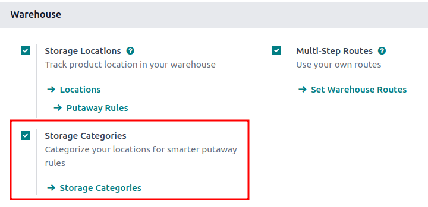

# Storage categories

A *storage category* is used with [putaway rules](putaway.md), as an extra location attribute to
automatically propose optimal storage locations for products.

Follow these steps to complete the setup:

1. [Enable the Storage Category feature](#inventory-routes-enable-storage-categories)
2. [Define a storage category](#inventory-routes-define-storage) with specific limitations
3. Assign a [category to storage locations](#inventory-routes-assign-location)
4. Add the storage category as an attribute to a [putaway rule](#inventory-routes-set-putaway-attribute)

#### SEE ALSO
[Quy tắc lưu kho](putaway.md)

#### NOTE
Assigning categories to storage locations tells Odoo these locations meet specific
requirements, such as temperature or accessibility. Odoo then evaluates these locations, based on
defined capacity, and recommends the best one on the warehouse transfer form.

## Cấu hình

To enable storage categories, go to Inventory app ‣ Configuration ‣ Settings.
Then, in the Warehouse section, ensure the Storage Locations and
Multi-Step Routes features are enabled.

Next, activate the Storage Categories feature. Finally, click Save.

## Define storage category

A storage category with specific limitations **must** be created first, before it is applied to
locations, in order to decide the optimal storage location.

To create a storage category, go to Inventory app ‣ Configuration ‣ Storage
Categories, and click Create.

On the storage category form, type a name for the category in the Storage Category
field.

Options are available to limit capacity by weight, product, and package type.

#### NOTE
Weight limits can be combined with capacity by package or product (e.g. a maximum of one hundred
products with a total weight of two hundred kilograms).

While it is possible to limit capacity by product and package type at the same location, it may
be more practical to store items in different amounts across various locations, as shown in this
example of [capacity by package](#inventory-routes-set-capacity-package).

The Allow New Product field defines when the location is considered available to store a
product:

- If location is empty: a product can be added there only if the location is empty.
- If products are the same: a product can be added there only if the same product is
  already there.
- Allow mixed products: several different products can be stored in this location at
  the same time.

### Capacity by weight

On a storage category form (Inventory app ‣ Configuration ‣ Storage
Categories), set a maximum product weight in the Max Weight field. This limit applies
to each location assigned this storage category.

### Capacity by product

In the Capacity by Product tab, click Add a Line to input items, and enter
their capacities in the Quantity field.

### Capacity by package

For companies using [packages](../../product_management/configure/package.md), it becomes
possible to ensure real-time storage capacity checks, based on package types (e.g., crates, bins,
boxes, etc.).

#### IMPORTANT
Enable the Packages feature in Inventory app ‣ Configuration ‣
Settings to show the Capacity by Package tab.

## Assign to location

Once the storage category is created, assign it to a location. Navigate to the location by going to
Inventory app ‣ Configuration ‣ Locations, and select the desired location.
Then, select the created category in the Storage Category field.

## Putaway rule

With the [storage category](#inventory-routes-define-storage) and [location](#inventory-routes-assign-location) set up, create the [putaway rule](putaway.md) by navigating
to Inventory app ‣ Configuration ‣ Putaway Rules.

Click the Create button to create the putaway rule. In the Having Category
field of the new putaway rule form, select the storage category.

## Use case: limit capacity by package

To limit the capacity of a storage location by a specific number of packages, [create a storage
category with a Capacity By Package](#inventory-routes-set-capacity-package).

Continuing the example from above, the `High Frequency Pallets` storage category is assigned to the
`PAL1` and `PAL2` locations.

Then, [putaway rules](putaway.md#inventory-routes-putaway-rule) are set, so that any pallets received in
the warehouse are directed to be stored in `PAL1` and `PAL2` locations.

Depending on the number of pallets on-hand at each of the storage locations, when one pallet of
lemonade cans is received, the following scenarios happen:

- If `PAL1` and `PAL2` are empty, the pallet is redirected to `WH/Stock/Pallets/PAL1`.
- If `PAL1` is full, the pallet is redirected to `WH/Stock/Pallets/PAL2`.
- If `PAL1` and `PAL2` are full, the pallet is redirected to `WH/Stock/Pallets`.
