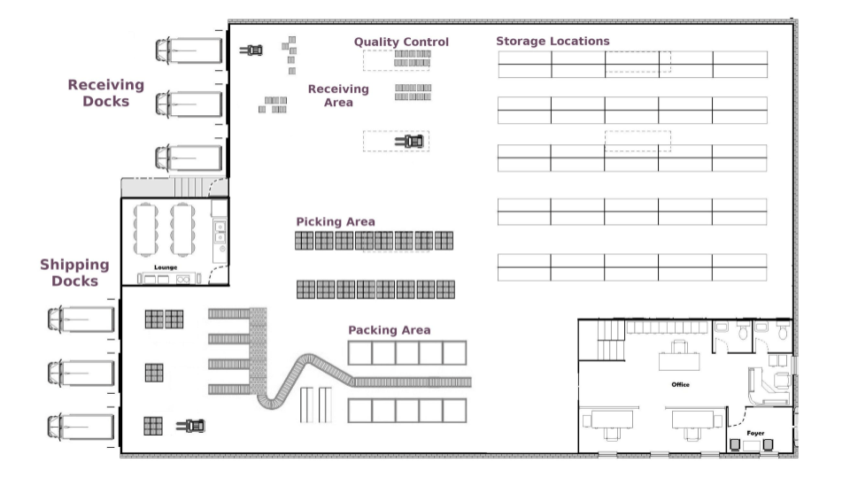
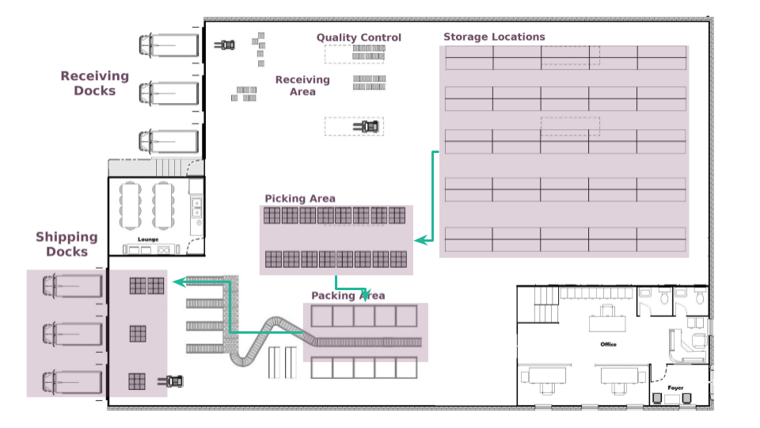
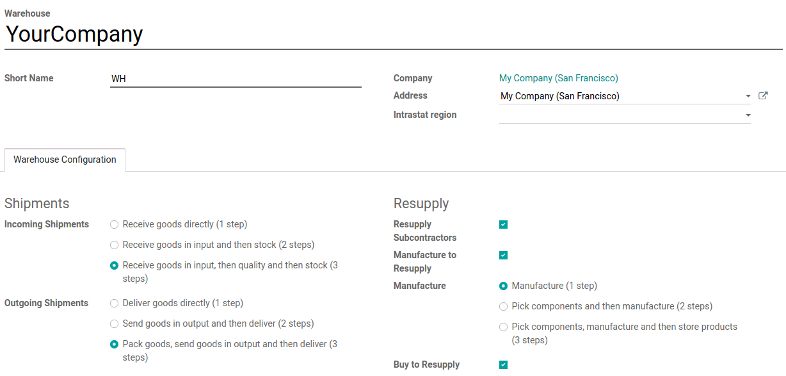
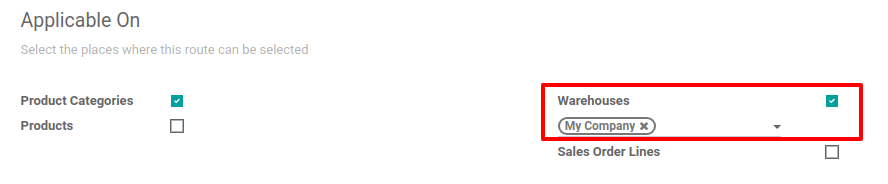
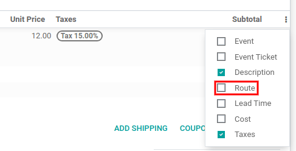
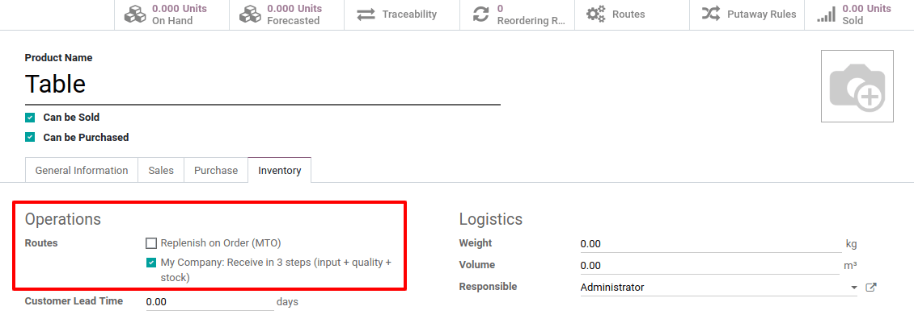
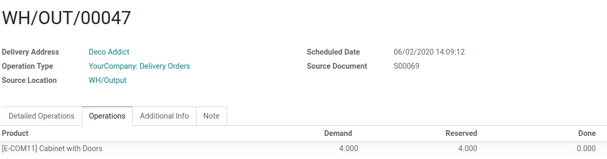

# Routes and push/pull rules

_Routes_ in Odoo control the movement of products between different locations, whether internal or\
external, using push and pull rules. Once set up, these rules help automate the logistics of product\
movement based on specific conditions.

#### SEE ALSO

* [Odoo Tutorials: Routes](https://www.youtube.com/watch?v=qkhDUezyZuc)
* [Standard routes in Odoo](../daily_operations.md)

#### NOTE

Routes are applicable on products, product categories, shipping methods, [packagings](../../product_management/configure/packaging.md#inventory-product-management-route-on-packaging), and on the sales order line.

## About routes and terminology

In a generic warehouse, there are receiving docks, a quality control area, storage locations,\
picking and packing areas, and shipping docks. All products go through all these locations. As the\
products move through the locations, each location triggers the products' specified route and\
rules.

Trong ví dụ này, xe tải của nhà cung cấp sẽ dỡ pallet chứa các sản phẩm đã đặt tại khu vực nhận hàng. Sau đó, nhân viên vận hành sẽ quét mã các sản phẩm tại khu vực này. Tùy theo tuyến và quy tắc áp dụng cho từng sản phẩm, một số sản phẩm sẽ được chuyển đến khu vực kiểm tra chất lượng (VD: các sản phẩm là thành phần dùng trong quy trình sản xuất), trong khi các sản phẩm khác sẽ được lưu trữ trực tiếp tại các vị trí tương ứng trong kho.

Dưới đây là một ví dụ về tuyến xử lý đơn hàng. Vào buổi sáng, các mặt hàng được lấy ra cho tất cả đơn hàng cần chuẩn bị trong ngày. Những mặt hàng này được lấy từ các kho lưu trữ và di chuyển đến khu vực xuất hàng, gần nơi đóng gói đơn hàng. Sau đó, các đơn hàng được đóng gói vào các thùng tương ứng, và băng chuyền đưa chúng đến điểm vận chuyển, sẵn sàng để giao cho khách hàng.

### Push rules

Push rules are used to _supply products into a storage locations_ as soon as they arrive at a\
specific receiving location.

#### NOTE

Push rules can only be triggered if there are no pull rules that have already generated the\
product transfers.

In a [one-step receipt route](receipts_delivery_one_step.md), which uses one push rule, when a\
product arrives in the warehouse, a push rule can automatically transfer it to the _Storage_\
_Location_. Different push rules can be applied to different products, allowing for customized\
storage locations.

For more information about configuring rules, skip to the [Configure rules section](use_routes.md#inventory-shipping-receiving-configure-rules).

### Pull rules

Pull rules trigger product moves on demand, such as a sales order or a [need to restock](../../warehouses_storage/replenishment/reordering_rules.md).

Các quy tắc kéo hoạt động ngược từ vị trí có nhu cầu. Ví dụ: trong tuyến [giao hàng hai bước](receipts_delivery_two_steps.md#inventory-shipping-receiving-two-step-delivery), khi hàng hóa di chuyển từ _Kho_ đến _Khu vực xuất_ trước khi giao tới _Vị trí khách hàng_, quy tắc kéo trước tiên sẽ tạo lệnh chuyển hàng từ _Khu vực xuất_ tới khách hàng. Nếu sản phẩm không có tại _Khu vực xuất_, một quy tắc kéo khác sẽ tạo lệnh chuyển hàng từ _Kho_ đến _Khu vực xuất_. Nhân viên kho sau đó xử lý các lệnh này theo thứ tự ngược lại: xuất hàng trước, rồi mới vận chuyển.

For more information about configuring rules, skip to the [Configure rules section](use_routes.md#inventory-shipping-receiving-configure-rules).

## Cấu hình

Since _Routes_ are a collection of _Push and Pull Rules_, Odoo helps you manage advanced route\
configurations such as:

* Manage product manufacturing chains.
* Manage default locations per product.
* Define routes within the stock warehouse according to business needs, such as quality control,\
  after-sales services, or supplier returns.
* Help rental management by generating automated return moves for rented products.

To configure a route for a product, first, open the Inventory application and go to\
Configuration ‣ Settings. Then, in the Warehouse section, enable the\
Multi-Step Routes feature and click Save.

#### NOTE

The Storage Locations feature is automatically activated with the\
Multi-Step Routes feature.

Once this first step is completed, the user can use pre-configured routes that come with Odoo, or\
they can create custom routes.

### Pre-configured routes

To access Odoo's pre-configured routes, go to Inventory ‣ Configuration ‣\
Warehouses. Then, open a warehouse form. In the Warehouse Configuration tab, the user\
can view the warehouse's pre-configured routes for Incoming Shipments and\
Outgoing Shipments.

Some more advanced routes, such as pick-pack-ship, are also available. The user can select the\
route that best fits their business needs. Once the Incoming Shipments and\
Outgoing Shipments routes are set, head to Inventory ‣ Configuration\
‣ Routes to see the specific routes that Odoo generated.

Trên trang Tuyến cung ứng, nhấp vào một tuyến để mở biểu mẫu tuyến cung ứng. Trong biểu mẫu này, người dùng có thể xem các địa điểm mà tuyến Áp dụng cho. Người dùng cũng có thể đặt tuyến chỉ áp dụng cho một Công ty cụ thể. Tính năng này hữu ích cho môi trường đa công ty; ví dụ: người dùng có thể có một công ty và kho hàng tại Quốc gia A và một công ty và kho hàng thứ hai tại Quốc gia B.

#### SEE ALSO

[Applicable on packagings](../../product_management/configure/packaging.md#inventory-product-management-packaging-route)

At the bottom of the route form, the user can view the specific Rules for the route.\
Each Rule has an Action, a Source Location, and a\
Destination Location.

### Custom Routes

To create a custom route, go to Inventory ‣ Configuration ‣ Routes, and click\
on Create. Next, choose the places where this route can be selected. A route can be\
applicable on a combination of places.

Each place has a different behavior, so it is important to tick only the useful ones and adapt each\
route accordingly. Then, configure the Rules of the route.

If the route is applicable on a product category, the route still needs to be manually set on the\
product category form by going to Inventory ‣ Configuration ‣ Product\
Categories. Then, select the product category and open the form. Next, click Edit and\
under the Logistics section, set the Routes.

When applying the route on a product category, all the rules configured in the route are applied to**every** product in the category. This can be helpful if the business uses the dropshipping\
process for all the products from the same category.

The same behavior applies to the warehouses. If the route can apply to Warehouses, all\
the transfers occurring inside the chosen warehouse that meet the conditions of the route's rules\
will then follow that route.

If the route is applicable on Sales Order Lines, it is more or less the opposite. The\
route must be manually chosen when creating a quotation. This is useful if some products go through\
different routes.

Remember to toggle the visibility of the Route column on the quotation/sales order.\
Then, the route can be chosen on each line of the quotation/sales order.

Finally, there are routes that can be applied to products. Those work more or less like the product\
categories: once selected, the route must be manually set on the product form.

To set a route on a product, go to Inventory ‣ Products ‣ Products and select\
the desired product. Then, go to the Inventory tab and under the Operations\
section, select the Routes.

#### IMPORTANT

Rules must be set on the route in order for the route to work.

#### Quy tắc

The rules are defined on the route form. First, go to Inventory ‣ Configuration\
‣ Routes and open the desired route form. Next, click Edit and in the\
Rules section, click on Add a line.

The available rules trigger various actions. If Odoo offers _Push_ and _Pull_ rules, others are\
also available. Each rule has an Action:

* Pull From: this rule is triggered by a need for the product in a specific location.\
  The need can come from a sales order being validated or from a manufacturing order requiring a\
  specific component. When the need appears in the destination location, Odoo generates a picking to\
  fulfill this need.
* Push To: this rule is triggered by the arrival of some products in the defined source\
  location. In the case of the user moving products to the source location, Odoo generates a picking\
  to move those products to the destination location.
* Kéo & đẩy: quy tắc này cho phép tạo ra các phiếu xuất kho trong hai tình huống được giải thích ở trên. Điều này có nghĩa là khi sản phẩm được yêu cầu tại một vị trí nhất định, một lệnh chuyển hàng được tạo từ vị trí trước đó để đáp ứng nhu cầu này. Sau đó, một nhu cầu ở vị trí trước đó sẽ được tạo ra và một quy tắc được kích hoạt để đáp ứng nhu cầu này. Khi nhu cầu thứ hai được đáp ứng, các sản phẩm được đẩy đến vị trí đích và tất cả nhu cầu đều được đáp ứng.
* Buy: when products are needed at the destination location, a request for quotation is\
  created to fulfill the need.
* Manufacture: when products are needed in the source location, a manufacturing order\
  is created to fulfill the need.

The Operation Type must also be defined on the rule. This defines which kind of picking\
is created from the rule.

If the rule's Action is set to Pull From or Pull & Push, a\
Supply Method must be set. The Supply Method defines what happens at the\
source location:

* Take From Stock: the products are taken from the available stock of the source\
  location.
* Trigger Another Rule: the system tries to find a stock rule to bring the products to\
  the source location. The available stock is ignored.
* Take From Stock, if Unavailable, Trigger Another Rule: the products are taken from\
  the available stock of the source location. If there is no stock available, the system tries to\
  find a rule to bring the products to the source location.

## Example flow

In this example, let's use a custom _Pick - Pack - Ship_ route to try a full flow with an advanced\
custom route.

First, a quick look at the route's rules and their supply methods. There are three rules, all\
Pull From rules. The Supply Methods for each rule are the following:

* Take From Stock: When products are needed in the WH/Packing Zone, _picks_\
  (internal transfers from WH/Stock to WH/Packing Zone) are created from\
  WH/Stock to fulfill the need.
* Trigger Another Rule: When products are needed in WH/Output, _packs_\
  (internal transfers from WH/Packing Zone to WH/Output) are created from\
  WH/Packing Zone to fulfill the need.
* Trigger Another Rule: When products are needed in Partner\
  Locations/Customers, _delivery orders_ are created from WH/Output to fulfill the\
  need.

This means that, when a customer orders products that have a _pick - pack - ship_ route set on it,\
a delivery order is created to fulfill the order.

#### NOTE

If the source document for multiple tranfers is the same sales order, the status is not the same.\
The status will be Waiting Another Operation if the previous transfer in the list is\
not done yet.

To prepare the delivery order, packed products are needed at the output area, so an internal\
transfer is requested from the packing zone.

Obviously, the packing zone needs products ready to be packed. So, an internal transfer is\
requested to the stock and employees can gather the required products from the warehouse.

Như đã giải thích trong phần giới thiệu của tài liệu, bước cuối cùng trong quy trình (đối với tuyến này, lệnh giao hàng) là bước đầu tiên được kích hoạt, sau đó sẽ kích hoạt các quy tắc khác cho đến khi đạt đến bước đầu tiên trong quy trình (điều chuyển hàng nội bộ từ kho hàng đến khu vực đóng gói). Khi đó, tất cả đã sẵn sàng để xử lý, giúp khách hàng nhận được các mặt hàng đã đặt.

In this example, the product is delivered to the customer when all the rules have been triggered and\
the transfers are done.

