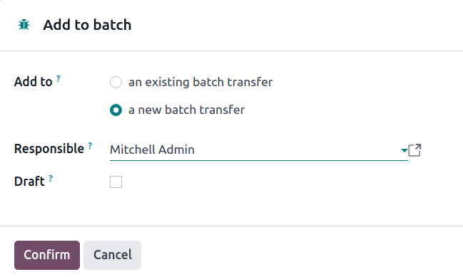
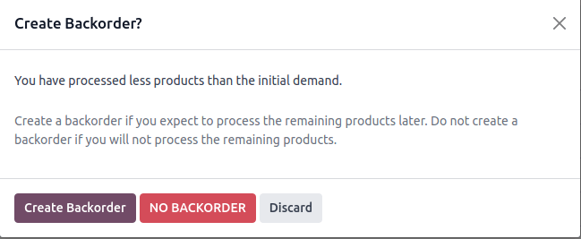

# Xuất kho theo lô

*Batch picking* enables a single picker to handle multiple orders at once, reducing the time needed
to navigate to the same location in a warehouse.

When picking in batches, orders are grouped and consolidated into a picking list. After the picking,
the batch is taken to an output location, where the products are sorted into their respective
delivery packages.

#### SEE ALSO
[Use Barcode app for pickings](#inventory-warehouses-storage-barcode-picking)

Since orders *must* be sorted at the output location after being picked, this picking method suits
businesses with a few products that are ordered often. Storing high-demand items in easily
accessible locations can increase the number of orders that are fulfilled efficiently.

## Cấu hình

To activate the batch picking option, begin by going to Inventory app ‣
Configuration ‣ Settings. Under the Operations section, check the Batch
Transfers box.

Since batch picking is a method to optimize the *pick* operation in Odoo, the Storage
Locations and Multi-Step Routes options under the Warehouse heading must
also be checked on this settings page. When finished, click Save.

Lastly, enable the warehouse picking feature, by navigating to the warehouse settings page, which is
accessible from Inventory app ‣ Configuration ‣ Warehouses.

From here, select the desired warehouse from the list. Then, from the radio options available for
Outgoing Shipments, select either the Send goods in output and then deliver
(2 steps) or Pack goods, send goods in output and then deliver (3 steps).

#### SEE ALSO
- [Delivery in two steps](../daily_operations/receipts_delivery_two_steps.md)
- [Three-step delivery](../daily_operations/delivery_three_steps.md)

## Create batch transfers

Manually create batch transfers directly from the Inventory app ‣ Operations ‣
Batch Transfers page. Click the New button to begin creating a batch transfer.

On the batch transfer form, fill the following fields out accordingly:

- Responsible: employee assigned to the picking. Leave this field blank if *any* worker
  can fulfill this picking.
- Operation Type: from the drop-down menu, select the operation type under which the
  picking is categorized.
- Scheduled Date: specifies the date by which the Responsible person should
  complete the transfer to the output location.

Next, in the Transfers list, click Add a line to open the Add:
Transfers window.

If the Operation Type field was filled, the list will filter transfer records matching
the selected Operation Type.

Click the New button to create a new transfer.

Once the transfer records are selected, click Confirm to confirm the batch picking.

### Add batch from transfers list

Another method of creating batch transfers is available using the Add to batch option in
a list. Navigate to the Inventory app ‣ Operations drop-down menu, and select any
of the Transfers to open a filtered list of transfers.

On the transfers list, select the checkbox to the left of the selected transfers to add in a batch.
Next, navigate to the Actions ⚙️ (gear) button, and click Add to batch from
the resulting drop-down menu.

Doing so opens an Add to batch pop-up window, wherein the employee
Responsible for the picking can be assigned.

Choose from the two radio options to add to an existing batch transfer or create
a new batch transfer.

To begin with a draft, select the Draft checkbox.

Conclude the process by clicking Confirm.

## Process batch transfer

Handle batch transfers in the Inventory app ‣ Operations ‣ Batch Transfers
page.

From here, select the intended transfer from the list. Then, on the batch transfer form, input the
Done quantities for each product, under the Detailed Operations tab.
Finally, select Validate to complete the picking.

Only in-stock products are visible in the Detailed Operations tab.

To view the complete product list, switch to the Operations tab. On this list, the
Demand column indicates the required quantity for the order. The Reserved
column shows the available stock to fulfill the order. Lastly, the Done column specifies
the products that have been picked, and are ready for the next step.

### Tạo đơn hàng chậm trễ

On the batch transfer form, if the Done quantity of the product is *less* than the
Reserved quantity, a pop-up window appears.

This pop-up window provides the option: Create Backorder?.

Clicking the Create Backorder button automatically creates a new batch transfer,
containing the remaining products.

Click No Backorder to finish the picking *without* creating another batch picking.

Click Discard to cancel the validation, and return to the batch transfer form.

## Process batch transfer: Barcode app

Created batch transfers are also listed in the Barcode app, accessible by selecting
the Batch Transfers button.

By default, confirmed batch pickings appear on the Batch Transfers page. On that page,
click on the desired batch transfer to open the detailed list of products for the picking.

For the chosen batch transfer, follow the instructions at the top of the page in the black
background. Begin by scanning the product's barcode to record a single product for picking. To
record multiple quantities, click the ✏️ (pencil) icon, and enter the required
quantities for the picking.

#### NOTE
Products from the same order are labeled with the same color on the left. Completed pickings are
highlighted in green.

Once all the products have been picked, click on Validate to mark the batch transfer as
Done.
