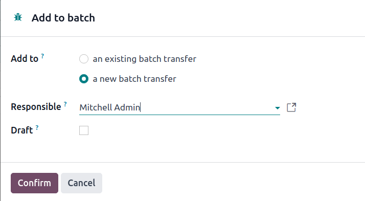

# Cluster picking

Cluster picking is an advanced order fulfillment approach derived from [batch picking](batch.md#inventory-misc-batch-picking).

In this strategy, pickers load a cart with multiple packages, each designated for a specific _sales_\
_order_ (SO). Then, the picker travels to each storage location, and places the products directly in\
the package of the associated order.

This method is most efficient for medium-sized companies, with high order volumes, and relatively\
few unique products, since the method eliminates the need for sorting products into packages for\
customers after picking.

However, cluster picking does have some disadvantages. For instance, urgent orders cannot be\
prioritized, and optimized batches must be manually created beforehand. As a result, the picking\
process can lead to bottlenecks.

## Cấu hình

To enable cluster picking, begin by navigating to Inventory app ‣ Configuration\
‣ Settings. Under the Operations heading, activate the Packages and\
Batch Transfers options.

Since batch picking is used to optimize the _pick_ operation in Odoo, the Storage\
Locations and Multi-Step Routes options, under the Warehouse heading, must\
also be checked on this settings page.

_Storage locations_ allow products to be stored in specific locations they can be picked from, whil&#x65;_&#x6D;ulti-step routes_ enable the picking operation itself.

When finished, click Save.

### Packages setup

After the Packages feature is enabled, navigate to Inventory app ‣\
Products ‣ Packages, and click the New button to create a new package.

On the new package form, the Package Reference is pre-filled with the next available`PACK` number in the system. Pack Date is automatically set to the creation date of the\
form.

Set the Package Use field to Reusable Box.

#### SEE ALSO
[Kiện hàng](../../product_management/configure/package.md)

## Create cluster batch

To see how cluster picking works in Odoo, navigate to the Sales app, and create\
that will be fulfilled together in the same batch. After confirming an , the\
Delivery smart button becomes visible. Displayed inside the icon is a number\
representing the amount of steps in the outgoing shipment process.

With the created, orders now must be grouped into batches. To do so, navigate to th&#x65;_&#x49;nventory_ dashboard and select the operation type card, Delivery Orders or\
Pick (whichever is the first operation in the delivery flow).

Doing so displays a filtered list of outgoing operations with the Ready status,\
indicating that all the products in the are in stock.

#### NOTE

Cluster pick batches can be created for outgoing shipments in one, two, or three steps.

#### SEE ALSO
- [Delivery in one step](../daily_operations/receipts_delivery_one_step.md)
- [Delivery in two steps](../daily_operations/receipts_delivery_two_steps.md)
- [Delivery in three steps](../daily_operations/delivery_three_steps.md)

* [Delivery in one step](applications/inventory_and_mrp/inventory/shipping_receiving/daily_operations/receipts_delivery_one_step.md)
* [Delivery in two steps](applications/inventory_and_mrp/inventory/shipping_receiving/daily_operations/receipts_delivery_two_steps.md)
* [Delivery in three steps](applications/inventory_and_mrp/inventory/shipping_receiving/daily_operations/delivery_three_steps.md)

Click the checkbox to the left of the corresponding outgoing operation to add them to the batch.\
With the desired pickings selected, click the ⚙️ Actions (gear) button, and select the\
Add to batch option from the resulting drop-down menu.

Doing so opens an Add to batch pop-up window, wherein the employee\
Responsible for the picking can be assigned.

Choose from the two options in the Add to field to either: add to an existing\
batch transfer, or create a new batch transfer.

To create draft batch pickings to be confirmed at a later date, select the Draft\
checkbox.

Conclude the process by clicking Confirm.

## Process batches

To process batches, navigate to Inventory app ‣ Operations ‣ Batch Transfers.\
Click on a batch to select it.

In the Detailed Operations tab, products that are to be picked are grouped by location.

Under the Source Package or Destination Package field, enter the package\
used for the picking.

#### NOTE

Use the Source Package field when the picking package is configured as _reusable_ on\
the [package form](cluster.md#inventory-misc-create-package). This means the products are temporarily\
placed in a container during picking, before getting transferred to their final shipping box.

Alternatively, use the Destination Package field when the product is directly placed\
in its _disposable_ shipping box during picking.

### In Barcode

To process cluster pickings directly from the _Barcode_ app, select the Batch Transfers\
button from the _Barcode_ dashboard. Then, select the desired batch.

On the batch transfer screen, the products in the picking are grouped by location, and each line is\
color-coded to associate products in the same picking together.

Then, follow the prompt to Scan the source location barcode for the storage location of\
the first product. Then, scan the barcode for the product and package to process the transfer.

Repeat this for all products, and click the Validate button.

#### NOTE

To find the package barcode, navigate to Inventory app ‣ Products ‣\
Packages, select the desired package, click the ⚙️ (gear) icon at the top of the\
package form, and select the Print option.

Next, select one of the three print options to generate the package barcode from the\
Package Reference field.

