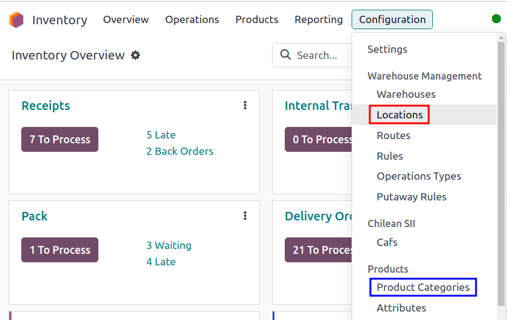
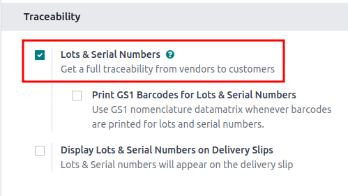
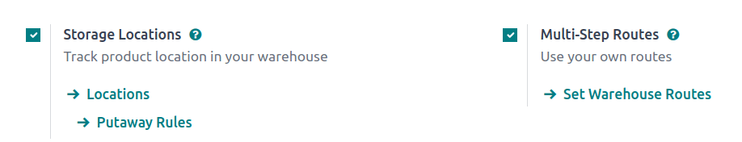
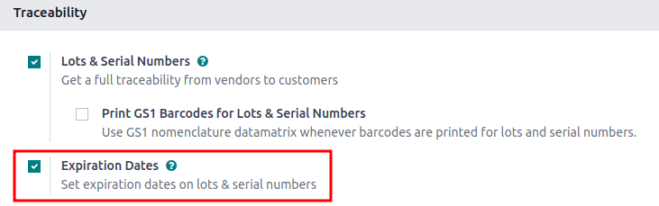
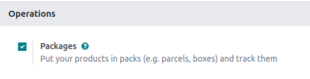

# Removal strategies

For companies with warehouses, *removal strategies* determine **which** products are taken from the
warehouse, and **when**. For example, for perishable products, prioritizing the picking of goods
with the nearest expiration date helps minimize food spoilage.

The following columns in the table below list the removal strategies available in Odoo, and detail
how pickings are determined along with the picking order. Leverage these removal strategies to have
Odoo automatically select how products are selected for orders:

|                 | [FIFO](removal_strategies/fifo.md)                                                    | [LIFO](removal_strategies/lifo.md)                                                    | [FEFO](removal_strategies/fefo.md)                                                   | [Vị trí gần nhất](removal_strategies/closest_location.md)                                                          | [Ít kiện hàng nhất](removal_strategies/least_packages.md)                                     |
|-----------------|---------------------------------------------------------------------------------------|---------------------------------------------------------------------------------------|--------------------------------------------------------------------------------------|--------------------------------------------------------------------------------------------------------------------|-----------------------------------------------------------------------------------------------|
| Dựa trên        | [Incoming date](removal_strategies/fifo.md#inventory-warehouses-storage-arrival-date) | [Incoming date](removal_strategies/fifo.md#inventory-warehouses-storage-arrival-date) | [Removal date](removal_strategies/fefo.md#inventory-warehouses-storage-removal-date) | [Location sequence](removal_strategies/closest_location.md#inventory-warehouses-storage-sequence)                  | [Package quantity](removal_strategies/least_packages.md#inventory-warehouses-storage-pkg-qty) |
| Selection order | First in                                                                              | Last in                                                                               | [First to expire](removal_strategies/fefo.md#inventory-warehouses-storage-exp-date)  | [Alphanumeric name of location](removal_strategies/closest_location.md#inventory-warehouses-storage-location-name) | Quantity closest to fulfilling demand                                                         |

For comprehensive examples for how to use each removal strategy, refer to each individual
documentation page.

## Cấu hình

Removal strategies are set on either the product category or storage location.

Configure removal strategies on the location by going to Inventory ‣ Configuration
‣ Locations, and selecting the desired location. On the location form, choose a removal strategy
from the Removal Strategy field's drop-down menu options.

#### IMPORTANT
To set a removal strategy on a location, the Storage Locations and
Multi-Step Routes settings **must** be enabled in Inventory ‣
Configuration ‣ Settings.

These features are **only** necessary when setting the removal strategy on a location.

Configure removal strategies on product categories by going to Inventory ‣
Configuration ‣ Product Categories and selecting the intended product category. Next, choose a
removal strategy from the Force Removal Strategy drop-down menu options.

#### IMPORTANT
When there are different removal strategies applied on both the location and product category for
a product, the value set on the Force Removal Strategy field set on a
Product Category form is applied as top priority.

## Required features

While some removal strategies are available by default, some additional features **must** be enabled
in Inventory ‣ Configuration ‣ Settings for the removal strategy option to
appear in the drop-down menu of the Force Removal Strategy or Removal
Strategy field.

Refer to the table below for a summary of required features. Otherwise, refer to the dedicated
sections for the removal strategy for more details on requirements and usage.

|                   | FIFO          | LIFO          | FEFO                                   | Vị trí gần nhất                      | Ít kiện hàng nhất   |
|-------------------|---------------|---------------|----------------------------------------|--------------------------------------|---------------------|
| Required features | Số lô & sê-ri | Số lô & sê-ri | Lots & Serial Numbers, Expiration Date | Storage Locations, Multi-Step Routes | Kiện hàng           |

### Lots and serial numbers

Lots and serial numbers differentiate identical products and track information like arrival or
expiration dates. To enable this feature, navigate to Inventory ‣ Configuration
‣ Settings. Under the Traceability heading, check the box beside Lots &
Serial Numbers to enable the feature.

Next, ensure the intended product is tracked by lots or serial numbers by navigating to the product
form through Inventory ‣ Products ‣ Products, and selecting the desired
product. On the product form, switch to the Inventory tab, and under the
Tracking field, select either the By Unique Serial Number or By
Lots options.

After enabling the features, assign lot or serial numbers to products using an [inventory
adjustment](../warehouses_storage/inventory_management/count_products.md) or during [product
reception](../product_management/product_tracking/lots.md#inventory-product-management-assign-lots).

### Locations and routes

**Storage locations** and **multi-step routes** are necessary features for setting **all** types of
removal strategies on a location. However, these features are specifically required for the closest
location removal strategy since it is only applied at the location level.

To activate these features, navigate to Inventory ‣ Configuration ‣ Settings.
Under the Warehouse heading, enable the Storage Location and
Multi-Step Routes features.

### Ngày hết hạn

Enable the **expiration date** feature to track expiration dates, best before dates, removal dates,
and alert dates on a lot or serial number by navigating to Inventory ‣
Configuration ‣ Settings.

Under the Traceability heading, ensure the Lots & Serial Numbers feature is
selected, and then select the check box for Expiration Dates to enable the feature.

### Kiện hàng

The *packages* feature is used to group products together and is required for the least packages
removal strategy.

Navigate to Inventory ‣ Configuration ‣ Settings and select the check box for
the Packages feature.

#### SEE ALSO
- [Kiện hàng](../product_management/configure/package.md)
- [giao hàng 2 bước](daily_operations/receipts_delivery_two_steps.md)
- [giao hàng 3 bước](daily_operations/delivery_three_steps.md)

* [FIFO removal](removal_strategies/fifo.md)
* [LIFO removal](removal_strategies/lifo.md)
* [FEFO removal](removal_strategies/fefo.md)
* [Closest location removal](removal_strategies/closest_location.md)
* [Least packages removal](removal_strategies/least_packages.md)
