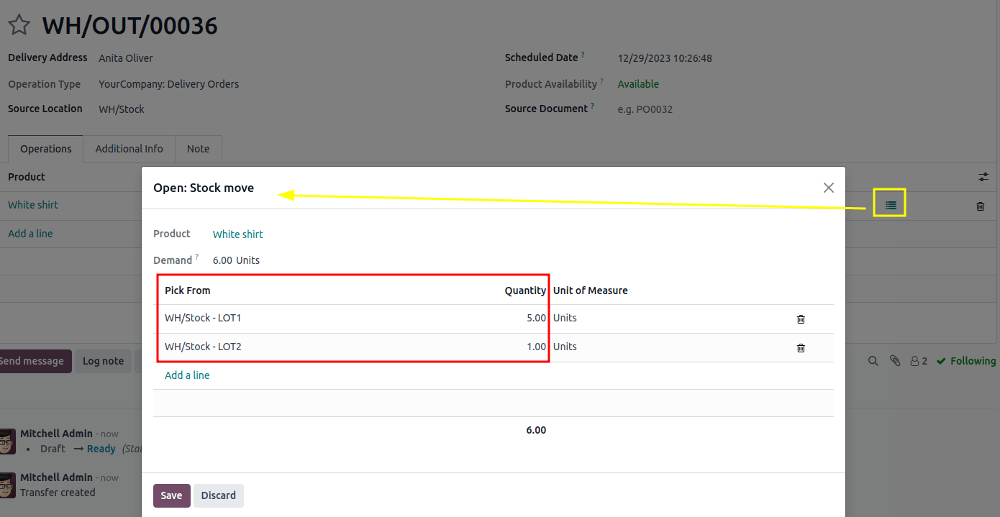

# FIFO removal

The *First In, First Out* (FIFO) removal strategy selects products with the earliest arrival dates.
This method is useful for companies selling products that have short demand cycles, like clothes,
for example. By using , companies can prevent prolonged stock
retention of specific styles.

#### SEE ALSO
[About removal strategies](../removal_strategies.md)

#### SEE ALSO
[Lot/serial number setup details](../removal_strategies.md#inventory-warehouses-storage-lots-setup)

## Arrival date

To see the product lot or serial number that arrived in inventory first, navigate to
Inventory app ‣ Products ‣ Lots/Serial Numbers.

Then, select the ▶️ (right-pointing arrow) icon on the left of a product line, in order
to reveal a list of the product's lots or serial numbers that are in stock. The Created
On field shows the lot/serial number creation date, which is, essentially, the arrival date.

## Quy trình

To understand how  rotates products out, consider the following
example, focusing on three lots of white shirts.

The shirts are from the *All/Clothes* category, where  is set as
the Force Removal Strategy.

The white shirts are tracked By Lots in the Inventory tab of the product
form.

#### SEE ALSO
- [Set up force removal strategy](../removal_strategies.md#inventory-warehouses-storage-removal-config)
- [Enable lots tracking](../removal_strategies.md#inventory-warehouses-storage-lots-setup)

The following table represents the on-hand stock and lot number details of white shirts.

|                                                            | LOT1     | LOT2     | LOT3     |
|------------------------------------------------------------|----------|----------|----------|
| On-hand stock                                              | 5        | 3        | 2        |
| [Được tạo vào](#inventory-warehouses-storage-arrival-date) | Ngày 1/3 | Ngày 1/4 | Ngày 1/5 |

To see the removal strategy in action, create a [delivery order](../daily_operations/receipts_delivery_one_step.md#inventory-delivery-one-step)
for six white shirts by navigating to the Sales app and creating a new quotation.

After clicking Confirm on the sales order, a delivery order with the oldest lot numbers
for shirts are reserved, using the  removal strategy.

To view the detailed pickings, click the ⦙≣ (bulleted list) icon, located on the
far-right of the white shirt's product line in the Operations tab of the delivery order.
Doing so opens the Open: Stock move pop-up window.

In the Open: Stock move pop-up window, the Pick from field displays where
the quantities to fulfill the Demand are picked from. Since the order demanded six
shirts, all five shirts from `LOT1`, and one shirt from `LOT2`, are selected.

