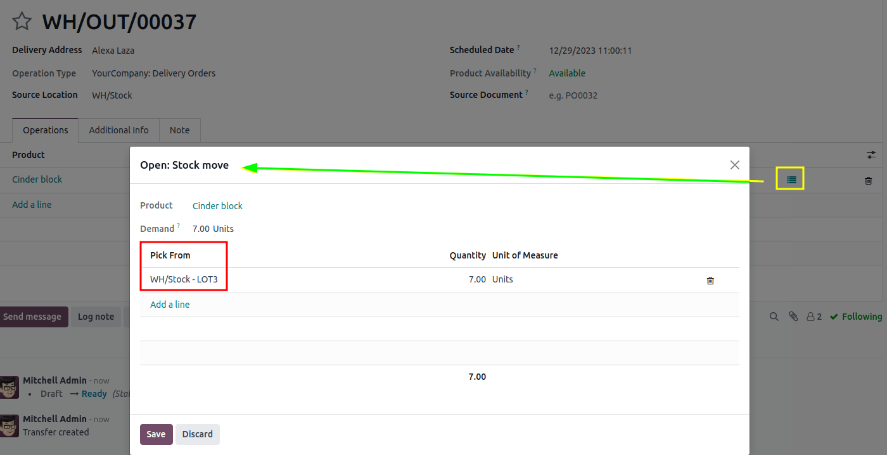

# LIFO removal

The *Last In, First Out* (LIFO) removal strategy picks the **newest** products on-hand, based on the
date they entered a warehouse's stock.

Every time an order is placed for products using the  strategy, a
transfer is created for the lot/serial number that has most recently entered the stock (the **last**
lot/serial number that entered the warehouse's inventory).

#### SEE ALSO
[About removal strategies](../removal_strategies.md)

#### WARNING
In many countries, the  removal strategy is banned, since it can
potentially result in old, expired, or obsolete products being delivered to customers.

Consider the following example, with the product, `Cinder Block`, which is tracked By
Lots in the Inventory tab of the product form. The Force Removal Strategy
for the cinder block's product category is set to Last In, First Out (LIFO).

#### SEE ALSO
- [Set up force removal strategy](../removal_strategies.md#inventory-warehouses-storage-removal-config)
- [Enable lots tracking](../removal_strategies.md#inventory-warehouses-storage-lots-setup)
- [Check arrival date](fifo.md#inventory-warehouses-storage-arrival-date)

The following table represents the cinder blocks in stock, and their various lot number details.

|                                                                   | LOT1     | LOT2     | LOT3     |
|-------------------------------------------------------------------|----------|----------|----------|
| On-hand stock                                                     | 10       | 10       | 10       |
| [Được tạo vào](fifo.md#inventory-warehouses-storage-arrival-date) | Ngày 1/6 | Ngày 3/6 | Ngày 6/6 |

To see the removal strategy in action, create a [delivery order](../daily_operations/receipts_delivery_one_step.md#inventory-delivery-one-step)
for seven cinder blocks by navigating to the Sales app and creating a new
quotation.

Confirm the sales order to create a delivery order. Doing so reserves the newest lot
numbers are using the  removal strategy.

To view the detailed pickings, click the ⦙≣ (bulleted list) icon, located on the
far-right of the cinder block's product line in the Operations tab of the delivery
order. Doing so opens the Open: Stock move pop-up window.

In the Open: Stock move pop-up window, the Pick from field displays where
the quantities to fulfill the Demand are picked from. Since the order demanded seven
cinder blocks, the newest cinder blocks from `LOT3` are selected, using the  removal strategy.

