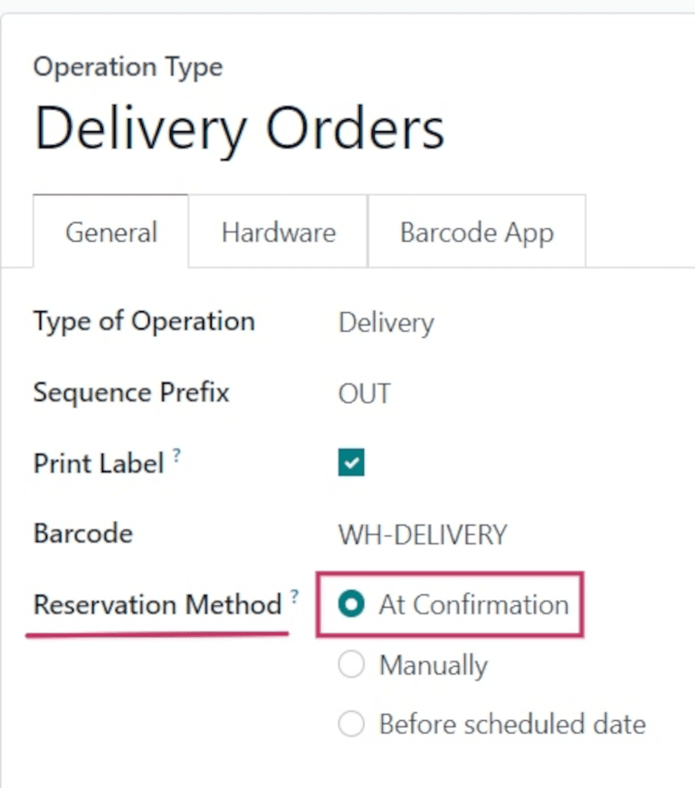
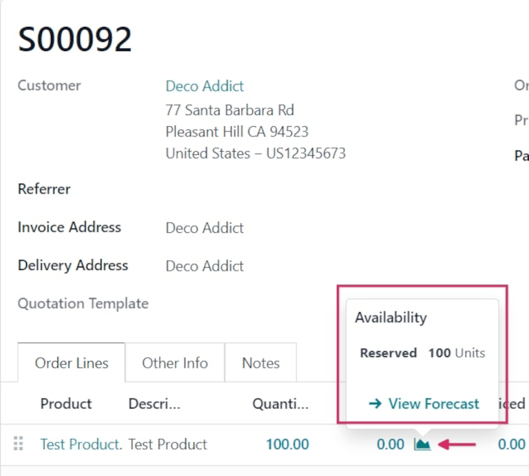
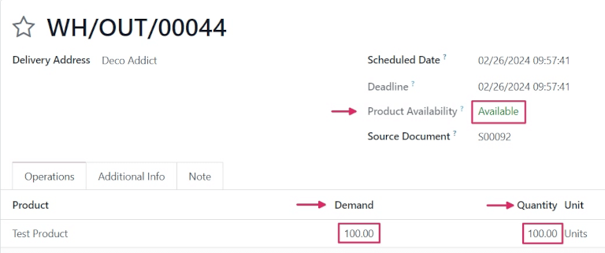

# At confirmation reservation

The *at confirmation* reservation method reserves products **only** when a sales order (SO) is
confirmed, **and** if enough stock of the products included in the  is already available.

#### SEE ALSO
[About reservation methods](./)

## Cấu hình

To set the reservation method to *at confirmation*, navigate to Inventory app ‣
Configuration ‣ Operations Types. Then, select the desired Operation Type to
configure, or create a new one by clicking New.

In the General tab on the operation type form, locate the Reservation Method
field, and select At Confirmation.

## Quy trình

To see the *at confirmation* reservation method in action, create a new  by navigating to
Sales app ‣ New.

Add a customer in the Customer field. Then, in the Order Lines tab, click
Add a product, and select a product to add to the quotation from the drop-down menu.
Finally, in the Quantity column, adjust the desired quantity of the product to sell.

Once ready, click Confirm to confirm the sales order.

Click the 📈 (area graph) icon on the product line to reveal the product's
Availability tooltip, which reveals the Reserved number of units for this
order.

#### NOTE
If there is **not** sufficient quantity of stock for the product included in the , the
📈 (area graph) icon is red, instead of green.

Instead of revealing the reserved number of units for the order, the Availability
tooltip reads Available, and reveals the available number of units (e.g., `0 Units`).

To deliver the products, click the Delivery smart button at the top of the sales order
form. To confirm that the reservation worked properly, ensure that the Product
Availability field reads `Available` (in green text), and the numbers in the Demand and
Quantity columns match (in this case, both should read `100.00`).

Once ready, click Validate.

#### SEE ALSO
- [Manual reservation](manually.md)
- [Before scheduled date reservation](before_scheduled_date.md)
